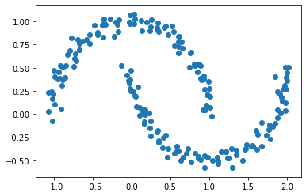
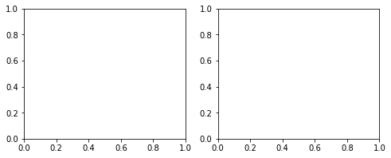
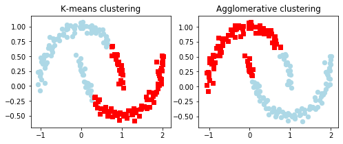
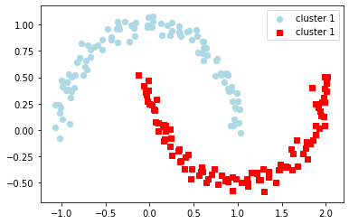

```python
from sklearn.datasets import make_moons
```


```python
X,y=make_moons(n_samples=200,noise=0.05,random_state=0)
```


```python
import matplotlib.pyplot as plt
%matplotlib inline
```


```python
plt.scatter(X[:,0],X[:,1])
```


    <matplotlib.collections.PathCollection at 0x1a1b39e17c8>





```python
from sklearn.cluster import KMeans,DBSCAN,AgglomerativeClustering
```


```python
f,(ax1,ax2)=plt.subplots(1,2,figsize=(8,3))
```





```python
km=KMeans(n_clusters=2,random_state=0)
```


```python
y_km=km.fit_predict(X)
```


```python
ax1.scatter(X[y_km==0,0],X[y_km==0,1],c='lightblue',marker='o',s=40,label='cluster 1')
ax1.scatter(X[y_km==1,0],X[y_km==1,1],c='red',marker='s',s=40,label='cluster 2')
ax1.set_title('K-means clustering')
```


    Text(0.5, 1, 'K-means clustering')


```python
ac=AgglomerativeClustering(n_clusters=2,affinity='euclidean',linkage='complete')
y_ac=ac.fit_predict(X)
ax2.scatter(X[y_ac==0,0],X[y_ac==0,1],c='lightblue',marker='o',s=40,label='cluster 1')
ax2.scatter(X[y_ac==1,0],X[y_ac==1,1],c='red',marker='s',s=40,label='cluster 2')
ax2.set_title('Agglomerative clustering')
```


    Text(0.5, 1, 'Agglomerative clustering')


```python
#f.legend()
f
```





```python

```


```python
db=DBSCAN(eps=0.2,min_samples=5,metric='euclidean')
y_db=db.fit_predict(X)
plt.scatter(X[y_db==0,0],X[y_db==0,1],c='lightblue',marker='o',s=40,label='cluster 1')
plt.scatter(X[y_db==1,0],X[y_db==1,1],c='red',marker='s',s=40,label='cluster 1')
plt.legend()
plt.show()
```





```python

```


    ---------------------------------------------------------------------------

    NameError                                 Traceback (most recent call last)

    <ipython-input-22-2f755f117ac9> in <module>
    ----> 1 x[0]
    

    NameError: name 'x' is not defined


```python
km.cluster_centers_
```


    array([[-0.2003285 ,  0.58035606],
           [ 1.20736718, -0.0825517 ]])


```python
import shapely as sh
```


```python
poly=sh.geometry.linestring.LineString([[0,0],[1,1]])
```


```python
poly.distance(sh.geometry.point.Point([1,1]))
```


    0.0


```python
point=sh.geometry.point.Point([1,1])
```


```python
point.distance(sh.geometry.point.Point([0,0]))
```


    1.4142135623730951


```python
import numpy as np
```


```python
from itertools import permutations
```


```python
list(permutations([1,2,3],2))
```


    [(1, 2), (1, 3), (2, 1), (2, 3), (3, 1), (3, 2)]


```python
import gudhi
```


```python
test=[i for i in range(100)]
```


```python
te=gudhi.point_cloud.TimeDelayEmbedding(dim=5,delay=3,skip=1)
```


```python
te(test)[19,4]
```


    31


```python
te(test)
```


    array([[ 0,  3,  6,  9, 12],
           [ 1,  4,  7, 10, 13],
           [ 2,  5,  8, 11, 14],
           [ 3,  6,  9, 12, 15],
           [ 4,  7, 10, 13, 16],
           [ 5,  8, 11, 14, 17],
           [ 6,  9, 12, 15, 18],
           [ 7, 10, 13, 16, 19],
           [ 8, 11, 14, 17, 20],
           [ 9, 12, 15, 18, 21],
           [10, 13, 16, 19, 22],
           [11, 14, 17, 20, 23],
           [12, 15, 18, 21, 24],
           [13, 16, 19, 22, 25],
           [14, 17, 20, 23, 26],
           [15, 18, 21, 24, 27],
           [16, 19, 22, 25, 28],
           [17, 20, 23, 26, 29],
           [18, 21, 24, 27, 30],
           [19, 22, 25, 28, 31],
           [20, 23, 26, 29, 32],
           [21, 24, 27, 30, 33],
           [22, 25, 28, 31, 34],
           [23, 26, 29, 32, 35],
           [24, 27, 30, 33, 36],
           [25, 28, 31, 34, 37],
           [26, 29, 32, 35, 38],
           [27, 30, 33, 36, 39],
           [28, 31, 34, 37, 40],
           [29, 32, 35, 38, 41],
           [30, 33, 36, 39, 42],
           [31, 34, 37, 40, 43],
           [32, 35, 38, 41, 44],
           [33, 36, 39, 42, 45],
           [34, 37, 40, 43, 46],
           [35, 38, 41, 44, 47],
           [36, 39, 42, 45, 48],
           [37, 40, 43, 46, 49],
           [38, 41, 44, 47, 50],
           [39, 42, 45, 48, 51],
           [40, 43, 46, 49, 52],
           [41, 44, 47, 50, 53],
           [42, 45, 48, 51, 54],
           [43, 46, 49, 52, 55],
           [44, 47, 50, 53, 56],
           [45, 48, 51, 54, 57],
           [46, 49, 52, 55, 58],
           [47, 50, 53, 56, 59],
           [48, 51, 54, 57, 60],
           [49, 52, 55, 58, 61],
           [50, 53, 56, 59, 62],
           [51, 54, 57, 60, 63],
           [52, 55, 58, 61, 64],
           [53, 56, 59, 62, 65],
           [54, 57, 60, 63, 66],
           [55, 58, 61, 64, 67],
           [56, 59, 62, 65, 68],
           [57, 60, 63, 66, 69],
           [58, 61, 64, 67, 70],
           [59, 62, 65, 68, 71],
           [60, 63, 66, 69, 72],
           [61, 64, 67, 70, 73],
           [62, 65, 68, 71, 74],
           [63, 66, 69, 72, 75],
           [64, 67, 70, 73, 76],
           [65, 68, 71, 74, 77],
           [66, 69, 72, 75, 78],
           [67, 70, 73, 76, 79],
           [68, 71, 74, 77, 80],
           [69, 72, 75, 78, 81],
           [70, 73, 76, 79, 82],
           [71, 74, 77, 80, 83],
           [72, 75, 78, 81, 84],
           [73, 76, 79, 82, 85],
           [74, 77, 80, 83, 86],
           [75, 78, 81, 84, 87],
           [76, 79, 82, 85, 88],
           [77, 80, 83, 86, 89],
           [78, 81, 84, 87, 90],
           [79, 82, 85, 88, 91],
           [80, 83, 86, 89, 92],
           [81, 84, 87, 90, 93],
           [82, 85, 88, 91, 94],
           [83, 86, 89, 92, 95],
           [84, 87, 90, 93, 96],
           [85, 88, 91, 94, 97],
           [86, 89, 92, 95, 98],
           [87, 90, 93, 96, 99]])


```python

```
