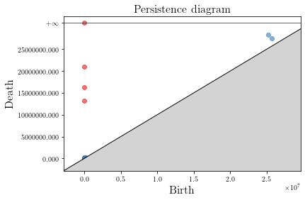
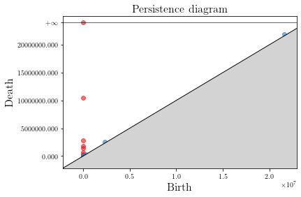
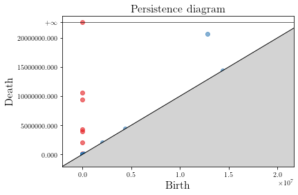
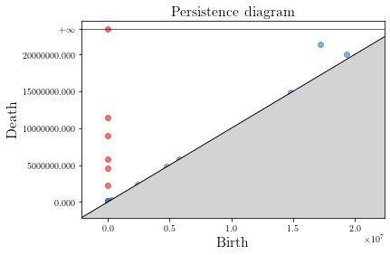
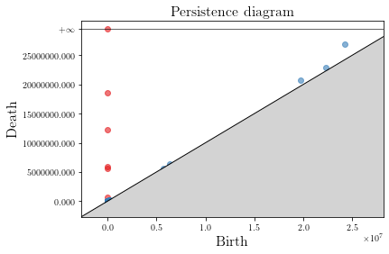

```python
import os
import gudhi
import json
import numpy as np
from functools import partial
import classifier
import sklearn.metrics as metrics
from importlib import reload
from sklearn.cluster import DBSCAN
from sklearn.model_selection import train_test_split
import region
import shapely as sh
import matplotlib.pyplot as plt
from importlib import reload

```


```python
def get_persistence_dict(file_name):
    with open(file_name,'r') as f:
        data_dict=json.load(f)
    return data_dict
```


```python
basic_work_path=os.path.join(os.getcwd(),'result','complex')
complex_list=os.listdir(basic_work_path)
file_list=[]
for complex_ in ['alpha']:
    work_path=os.path.join(basic_work_path,complex_)
    tmp=os.listdir(work_path)
    for file in tmp:
        file_list.append(os.path.join(work_path,file))
```


```python
for file in [file_list[0]]:
    work_path=os.path.join(os.getcwd(),'result','pd')
    data_dict=get_persistence_dict(file)
    for key in data_dict.keys():
        for i, data in enumerate(data_dict[key]):
            gudhi.plot_persistence_diagram(data)
            _,name=os.path.split(file)
            name,_=os.path.splitext(name)
            save_path=os.path.join(work_path,name)
            if not os.path.isdir(save_path):
                os.mkdir(save_path)
            save_name=os.path.join(save_path,key+'_'+str(i)+'.png')
            plt.savefig(save_name)
```

    D:\PROJECT\seminconductor\code\lib\site-packages\gudhi\persistence_graphical_tools.py:288: RuntimeWarning: More than 20 figures have been opened. Figures created through the pyplot interface (`matplotlib.pyplot.figure`) are retained until explicitly closed and may consume too much memory. (To control this warning, see the rcParam `figure.max_open_warning`).
      fig, axes = plt.subplots(1, 1)
    D:\PROJECT\seminconductor\code\lib\site-packages\gudhi\persistence_graphical_tools.py:288: RuntimeWarning: More than 20 figures have been opened. Figures created through the pyplot interface (`matplotlib.pyplot.figure`) are retained until explicitly closed and may consume too much memory. (To control this warning, see the rcParam `figure.max_open_warning`).
      fig, axes = plt.subplots(1, 1)
    D:\PROJECT\seminconductor\code\lib\site-packages\gudhi\persistence_graphical_tools.py:288: RuntimeWarning: More than 20 figures have been opened. Figures created through the pyplot interface (`matplotlib.pyplot.figure`) are retained until explicitly closed and may consume too much memory. (To control this warning, see the rcParam `figure.max_open_warning`).
      fig, axes = plt.subplots(1, 1)
    D:\PROJECT\seminconductor\code\lib\site-packages\gudhi\persistence_graphical_tools.py:288: RuntimeWarning: More than 20 figures have been opened. Figures created through the pyplot interface (`matplotlib.pyplot.figure`) are retained until explicitly closed and may consume too much memory. (To control this warning, see the rcParam `figure.max_open_warning`).
      fig, axes = plt.subplots(1, 1)
    D:\PROJECT\seminconductor\code\lib\site-packages\gudhi\persistence_graphical_tools.py:288: RuntimeWarning: More than 20 figures have been opened. Figures created through the pyplot interface (`matplotlib.pyplot.figure`) are retained until explicitly closed and may consume too much memory. (To control this warning, see the rcParam `figure.max_open_warning`).
      fig, axes = plt.subplots(1, 1)
    D:\PROJECT\seminconductor\code\lib\site-packages\gudhi\persistence_graphical_tools.py:288: RuntimeWarning: More than 20 figures have been opened. Figures created through the pyplot interface (`matplotlib.pyplot.figure`) are retained until explicitly closed and may consume too much memory. (To control this warning, see the rcParam `figure.max_open_warning`).
      fig, axes = plt.subplots(1, 1)
    D:\PROJECT\seminconductor\code\lib\site-packages\gudhi\persistence_graphical_tools.py:288: RuntimeWarning: More than 20 figures have been opened. Figures created through the pyplot interface (`matplotlib.pyplot.figure`) are retained until explicitly closed and may consume too much memory. (To control this warning, see the rcParam `figure.max_open_warning`).
      fig, axes = plt.subplots(1, 1)
    D:\PROJECT\seminconductor\code\lib\site-packages\gudhi\persistence_graphical_tools.py:288: RuntimeWarning: More than 20 figures have been opened. Figures created through the pyplot interface (`matplotlib.pyplot.figure`) are retained until explicitly closed and may consume too much memory. (To control this warning, see the rcParam `figure.max_open_warning`).
      fig, axes = plt.subplots(1, 1)
    D:\PROJECT\seminconductor\code\lib\site-packages\gudhi\persistence_graphical_tools.py:288: RuntimeWarning: More than 20 figures have been opened. Figures created through the pyplot interface (`matplotlib.pyplot.figure`) are retained until explicitly closed and may consume too much memory. (To control this warning, see the rcParam `figure.max_open_warning`).
      fig, axes = plt.subplots(1, 1)
    D:\PROJECT\seminconductor\code\lib\site-packages\gudhi\persistence_graphical_tools.py:288: RuntimeWarning: More than 20 figures have been opened. Figures created through the pyplot interface (`matplotlib.pyplot.figure`) are retained until explicitly closed and may consume too much memory. (To control this warning, see the rcParam `figure.max_open_warning`).
      fig, axes = plt.subplots(1, 1)
    D:\PROJECT\seminconductor\code\lib\site-packages\gudhi\persistence_graphical_tools.py:288: RuntimeWarning: More than 20 figures have been opened. Figures created through the pyplot interface (`matplotlib.pyplot.figure`) are retained until explicitly closed and may consume too much memory. (To control this warning, see the rcParam `figure.max_open_warning`).
      fig, axes = plt.subplots(1, 1)
    D:\PROJECT\seminconductor\code\lib\site-packages\gudhi\persistence_graphical_tools.py:288: RuntimeWarning: More than 20 figures have been opened. Figures created through the pyplot interface (`matplotlib.pyplot.figure`) are retained until explicitly closed and may consume too much memory. (To control this warning, see the rcParam `figure.max_open_warning`).
      fig, axes = plt.subplots(1, 1)
    D:\PROJECT\seminconductor\code\lib\site-packages\gudhi\persistence_graphical_tools.py:288: RuntimeWarning: More than 20 figures have been opened. Figures created through the pyplot interface (`matplotlib.pyplot.figure`) are retained until explicitly closed and may consume too much memory. (To control this warning, see the rcParam `figure.max_open_warning`).
      fig, axes = plt.subplots(1, 1)
    D:\PROJECT\seminconductor\code\lib\site-packages\gudhi\persistence_graphical_tools.py:288: RuntimeWarning: More than 20 figures have been opened. Figures created through the pyplot interface (`matplotlib.pyplot.figure`) are retained until explicitly closed and may consume too much memory. (To control this warning, see the rcParam `figure.max_open_warning`).
      fig, axes = plt.subplots(1, 1)
    D:\PROJECT\seminconductor\code\lib\site-packages\gudhi\persistence_graphical_tools.py:288: RuntimeWarning: More than 20 figures have been opened. Figures created through the pyplot interface (`matplotlib.pyplot.figure`) are retained until explicitly closed and may consume too much memory. (To control this warning, see the rcParam `figure.max_open_warning`).
      fig, axes = plt.subplots(1, 1)
    D:\PROJECT\seminconductor\code\lib\site-packages\gudhi\persistence_graphical_tools.py:288: RuntimeWarning: More than 20 figures have been opened. Figures created through the pyplot interface (`matplotlib.pyplot.figure`) are retained until explicitly closed and may consume too much memory. (To control this warning, see the rcParam `figure.max_open_warning`).
      fig, axes = plt.subplots(1, 1)
    D:\PROJECT\seminconductor\code\lib\site-packages\gudhi\persistence_graphical_tools.py:288: RuntimeWarning: More than 20 figures have been opened. Figures created through the pyplot interface (`matplotlib.pyplot.figure`) are retained until explicitly closed and may consume too much memory. (To control this warning, see the rcParam `figure.max_open_warning`).
      fig, axes = plt.subplots(1, 1)
    D:\PROJECT\seminconductor\code\lib\site-packages\gudhi\persistence_graphical_tools.py:288: RuntimeWarning: More than 20 figures have been opened. Figures created through the pyplot interface (`matplotlib.pyplot.figure`) are retained until explicitly closed and may consume too much memory. (To control this warning, see the rcParam `figure.max_open_warning`).
      fig, axes = plt.subplots(1, 1)
    D:\PROJECT\seminconductor\code\lib\site-packages\gudhi\persistence_graphical_tools.py:288: RuntimeWarning: More than 20 figures have been opened. Figures created through the pyplot interface (`matplotlib.pyplot.figure`) are retained until explicitly closed and may consume too much memory. (To control this warning, see the rcParam `figure.max_open_warning`).
      fig, axes = plt.subplots(1, 1)
    D:\PROJECT\seminconductor\code\lib\site-packages\gudhi\persistence_graphical_tools.py:288: RuntimeWarning: More than 20 figures have been opened. Figures created through the pyplot interface (`matplotlib.pyplot.figure`) are retained until explicitly closed and may consume too much memory. (To control this warning, see the rcParam `figure.max_open_warning`).
      fig, axes = plt.subplots(1, 1)
    D:\PROJECT\seminconductor\code\lib\site-packages\gudhi\persistence_graphical_tools.py:288: RuntimeWarning: More than 20 figures have been opened. Figures created through the pyplot interface (`matplotlib.pyplot.figure`) are retained until explicitly closed and may consume too much memory. (To control this warning, see the rcParam `figure.max_open_warning`).
      fig, axes = plt.subplots(1, 1)
    D:\PROJECT\seminconductor\code\lib\site-packages\gudhi\persistence_graphical_tools.py:288: RuntimeWarning: More than 20 figures have been opened. Figures created through the pyplot interface (`matplotlib.pyplot.figure`) are retained until explicitly closed and may consume too much memory. (To control this warning, see the rcParam `figure.max_open_warning`).
      fig, axes = plt.subplots(1, 1)
    D:\PROJECT\seminconductor\code\lib\site-packages\gudhi\persistence_graphical_tools.py:288: RuntimeWarning: More than 20 figures have been opened. Figures created through the pyplot interface (`matplotlib.pyplot.figure`) are retained until explicitly closed and may consume too much memory. (To control this warning, see the rcParam `figure.max_open_warning`).
      fig, axes = plt.subplots(1, 1)
    D:\PROJECT\seminconductor\code\lib\site-packages\gudhi\persistence_graphical_tools.py:288: RuntimeWarning: More than 20 figures have been opened. Figures created through the pyplot interface (`matplotlib.pyplot.figure`) are retained until explicitly closed and may consume too much memory. (To control this warning, see the rcParam `figure.max_open_warning`).
      fig, axes = plt.subplots(1, 1)
    D:\PROJECT\seminconductor\code\lib\site-packages\gudhi\persistence_graphical_tools.py:288: RuntimeWarning: More than 20 figures have been opened. Figures created through the pyplot interface (`matplotlib.pyplot.figure`) are retained until explicitly closed and may consume too much memory. (To control this warning, see the rcParam `figure.max_open_warning`).
      fig, axes = plt.subplots(1, 1)
    D:\PROJECT\seminconductor\code\lib\site-packages\gudhi\persistence_graphical_tools.py:288: RuntimeWarning: More than 20 figures have been opened. Figures created through the pyplot interface (`matplotlib.pyplot.figure`) are retained until explicitly closed and may consume too much memory. (To control this warning, see the rcParam `figure.max_open_warning`).
      fig, axes = plt.subplots(1, 1)
    D:\PROJECT\seminconductor\code\lib\site-packages\gudhi\persistence_graphical_tools.py:288: RuntimeWarning: More than 20 figures have been opened. Figures created through the pyplot interface (`matplotlib.pyplot.figure`) are retained until explicitly closed and may consume too much memory. (To control this warning, see the rcParam `figure.max_open_warning`).
      fig, axes = plt.subplots(1, 1)
    D:\PROJECT\seminconductor\code\lib\site-packages\gudhi\persistence_graphical_tools.py:288: RuntimeWarning: More than 20 figures have been opened. Figures created through the pyplot interface (`matplotlib.pyplot.figure`) are retained until explicitly closed and may consume too much memory. (To control this warning, see the rcParam `figure.max_open_warning`).
      fig, axes = plt.subplots(1, 1)
    D:\PROJECT\seminconductor\code\lib\site-packages\gudhi\persistence_graphical_tools.py:288: RuntimeWarning: More than 20 figures have been opened. Figures created through the pyplot interface (`matplotlib.pyplot.figure`) are retained until explicitly closed and may consume too much memory. (To control this warning, see the rcParam `figure.max_open_warning`).
      fig, axes = plt.subplots(1, 1)
    D:\PROJECT\seminconductor\code\lib\site-packages\gudhi\persistence_graphical_tools.py:288: RuntimeWarning: More than 20 figures have been opened. Figures created through the pyplot interface (`matplotlib.pyplot.figure`) are retained until explicitly closed and may consume too much memory. (To control this warning, see the rcParam `figure.max_open_warning`).
      fig, axes = plt.subplots(1, 1)
    D:\PROJECT\seminconductor\code\lib\site-packages\gudhi\persistence_graphical_tools.py:288: RuntimeWarning: More than 20 figures have been opened. Figures created through the pyplot interface (`matplotlib.pyplot.figure`) are retained until explicitly closed and may consume too much memory. (To control this warning, see the rcParam `figure.max_open_warning`).
      fig, axes = plt.subplots(1, 1)
    D:\PROJECT\seminconductor\code\lib\site-packages\gudhi\persistence_graphical_tools.py:288: RuntimeWarning: More than 20 figures have been opened. Figures created through the pyplot interface (`matplotlib.pyplot.figure`) are retained until explicitly closed and may consume too much memory. (To control this warning, see the rcParam `figure.max_open_warning`).
      fig, axes = plt.subplots(1, 1)
    D:\PROJECT\seminconductor\code\lib\site-packages\gudhi\persistence_graphical_tools.py:288: RuntimeWarning: More than 20 figures have been opened. Figures created through the pyplot interface (`matplotlib.pyplot.figure`) are retained until explicitly closed and may consume too much memory. (To control this warning, see the rcParam `figure.max_open_warning`).
      fig, axes = plt.subplots(1, 1)
    D:\PROJECT\seminconductor\code\lib\site-packages\gudhi\persistence_graphical_tools.py:288: RuntimeWarning: More than 20 figures have been opened. Figures created through the pyplot interface (`matplotlib.pyplot.figure`) are retained until explicitly closed and may consume too much memory. (To control this warning, see the rcParam `figure.max_open_warning`).
      fig, axes = plt.subplots(1, 1)
    D:\PROJECT\seminconductor\code\lib\site-packages\gudhi\persistence_graphical_tools.py:288: RuntimeWarning: More than 20 figures have been opened. Figures created through the pyplot interface (`matplotlib.pyplot.figure`) are retained until explicitly closed and may consume too much memory. (To control this warning, see the rcParam `figure.max_open_warning`).
      fig, axes = plt.subplots(1, 1)
    D:\PROJECT\seminconductor\code\lib\site-packages\gudhi\persistence_graphical_tools.py:288: RuntimeWarning: More than 20 figures have been opened. Figures created through the pyplot interface (`matplotlib.pyplot.figure`) are retained until explicitly closed and may consume too much memory. (To control this warning, see the rcParam `figure.max_open_warning`).
      fig, axes = plt.subplots(1, 1)
    D:\PROJECT\seminconductor\code\lib\site-packages\gudhi\persistence_graphical_tools.py:288: RuntimeWarning: More than 20 figures have been opened. Figures created through the pyplot interface (`matplotlib.pyplot.figure`) are retained until explicitly closed and may consume too much memory. (To control this warning, see the rcParam `figure.max_open_warning`).
      fig, axes = plt.subplots(1, 1)
    D:\PROJECT\seminconductor\code\lib\site-packages\gudhi\persistence_graphical_tools.py:288: RuntimeWarning: More than 20 figures have been opened. Figures created through the pyplot interface (`matplotlib.pyplot.figure`) are retained until explicitly closed and may consume too much memory. (To control this warning, see the rcParam `figure.max_open_warning`).
      fig, axes = plt.subplots(1, 1)
    D:\PROJECT\seminconductor\code\lib\site-packages\gudhi\persistence_graphical_tools.py:288: RuntimeWarning: More than 20 figures have been opened. Figures created through the pyplot interface (`matplotlib.pyplot.figure`) are retained until explicitly closed and may consume too much memory. (To control this warning, see the rcParam `figure.max_open_warning`).
      fig, axes = plt.subplots(1, 1)
    D:\PROJECT\seminconductor\code\lib\site-packages\gudhi\persistence_graphical_tools.py:288: RuntimeWarning: More than 20 figures have been opened. Figures created through the pyplot interface (`matplotlib.pyplot.figure`) are retained until explicitly closed and may consume too much memory. (To control this warning, see the rcParam `figure.max_open_warning`).
      fig, axes = plt.subplots(1, 1)
    D:\PROJECT\seminconductor\code\lib\site-packages\gudhi\persistence_graphical_tools.py:288: RuntimeWarning: More than 20 figures have been opened. Figures created through the pyplot interface (`matplotlib.pyplot.figure`) are retained until explicitly closed and may consume too much memory. (To control this warning, see the rcParam `figure.max_open_warning`).
      fig, axes = plt.subplots(1, 1)
    D:\PROJECT\seminconductor\code\lib\site-packages\gudhi\persistence_graphical_tools.py:288: RuntimeWarning: More than 20 figures have been opened. Figures created through the pyplot interface (`matplotlib.pyplot.figure`) are retained until explicitly closed and may consume too much memory. (To control this warning, see the rcParam `figure.max_open_warning`).
      fig, axes = plt.subplots(1, 1)
    D:\PROJECT\seminconductor\code\lib\site-packages\gudhi\persistence_graphical_tools.py:288: RuntimeWarning: More than 20 figures have been opened. Figures created through the pyplot interface (`matplotlib.pyplot.figure`) are retained until explicitly closed and may consume too much memory. (To control this warning, see the rcParam `figure.max_open_warning`).
      fig, axes = plt.subplots(1, 1)
    D:\PROJECT\seminconductor\code\lib\site-packages\gudhi\persistence_graphical_tools.py:288: RuntimeWarning: More than 20 figures have been opened. Figures created through the pyplot interface (`matplotlib.pyplot.figure`) are retained until explicitly closed and may consume too much memory. (To control this warning, see the rcParam `figure.max_open_warning`).
      fig, axes = plt.subplots(1, 1)
    D:\PROJECT\seminconductor\code\lib\site-packages\gudhi\persistence_graphical_tools.py:288: RuntimeWarning: More than 20 figures have been opened. Figures created through the pyplot interface (`matplotlib.pyplot.figure`) are retained until explicitly closed and may consume too much memory. (To control this warning, see the rcParam `figure.max_open_warning`).
      fig, axes = plt.subplots(1, 1)
    D:\PROJECT\seminconductor\code\lib\site-packages\gudhi\persistence_graphical_tools.py:288: RuntimeWarning: More than 20 figures have been opened. Figures created through the pyplot interface (`matplotlib.pyplot.figure`) are retained until explicitly closed and may consume too much memory. (To control this warning, see the rcParam `figure.max_open_warning`).
      fig, axes = plt.subplots(1, 1)
    D:\PROJECT\seminconductor\code\lib\site-packages\gudhi\persistence_graphical_tools.py:288: RuntimeWarning: More than 20 figures have been opened. Figures created through the pyplot interface (`matplotlib.pyplot.figure`) are retained until explicitly closed and may consume too much memory. (To control this warning, see the rcParam `figure.max_open_warning`).
      fig, axes = plt.subplots(1, 1)
    D:\PROJECT\seminconductor\code\lib\site-packages\gudhi\persistence_graphical_tools.py:288: RuntimeWarning: More than 20 figures have been opened. Figures created through the pyplot interface (`matplotlib.pyplot.figure`) are retained until explicitly closed and may consume too much memory. (To control this warning, see the rcParam `figure.max_open_warning`).
      fig, axes = plt.subplots(1, 1)
    D:\PROJECT\seminconductor\code\lib\site-packages\gudhi\persistence_graphical_tools.py:288: RuntimeWarning: More than 20 figures have been opened. Figures created through the pyplot interface (`matplotlib.pyplot.figure`) are retained until explicitly closed and may consume too much memory. (To control this warning, see the rcParam `figure.max_open_warning`).
      fig, axes = plt.subplots(1, 1)
    D:\PROJECT\seminconductor\code\lib\site-packages\gudhi\persistence_graphical_tools.py:288: RuntimeWarning: More than 20 figures have been opened. Figures created through the pyplot interface (`matplotlib.pyplot.figure`) are retained until explicitly closed and may consume too much memory. (To control this warning, see the rcParam `figure.max_open_warning`).
      fig, axes = plt.subplots(1, 1)
    D:\PROJECT\seminconductor\code\lib\site-packages\gudhi\persistence_graphical_tools.py:288: RuntimeWarning: More than 20 figures have been opened. Figures created through the pyplot interface (`matplotlib.pyplot.figure`) are retained until explicitly closed and may consume too much memory. (To control this warning, see the rcParam `figure.max_open_warning`).
      fig, axes = plt.subplots(1, 1)
    D:\PROJECT\seminconductor\code\lib\site-packages\gudhi\persistence_graphical_tools.py:288: RuntimeWarning: More than 20 figures have been opened. Figures created through the pyplot interface (`matplotlib.pyplot.figure`) are retained until explicitly closed and may consume too much memory. (To control this warning, see the rcParam `figure.max_open_warning`).
      fig, axes = plt.subplots(1, 1)
    D:\PROJECT\seminconductor\code\lib\site-packages\gudhi\persistence_graphical_tools.py:288: RuntimeWarning: More than 20 figures have been opened. Figures created through the pyplot interface (`matplotlib.pyplot.figure`) are retained until explicitly closed and may consume too much memory. (To control this warning, see the rcParam `figure.max_open_warning`).
      fig, axes = plt.subplots(1, 1)
    D:\PROJECT\seminconductor\code\lib\site-packages\gudhi\persistence_graphical_tools.py:288: RuntimeWarning: More than 20 figures have been opened. Figures created through the pyplot interface (`matplotlib.pyplot.figure`) are retained until explicitly closed and may consume too much memory. (To control this warning, see the rcParam `figure.max_open_warning`).
      fig, axes = plt.subplots(1, 1)
    D:\PROJECT\seminconductor\code\lib\site-packages\gudhi\persistence_graphical_tools.py:288: RuntimeWarning: More than 20 figures have been opened. Figures created through the pyplot interface (`matplotlib.pyplot.figure`) are retained until explicitly closed and may consume too much memory. (To control this warning, see the rcParam `figure.max_open_warning`).
      fig, axes = plt.subplots(1, 1)
    D:\PROJECT\seminconductor\code\lib\site-packages\gudhi\persistence_graphical_tools.py:288: RuntimeWarning: More than 20 figures have been opened. Figures created through the pyplot interface (`matplotlib.pyplot.figure`) are retained until explicitly closed and may consume too much memory. (To control this warning, see the rcParam `figure.max_open_warning`).
      fig, axes = plt.subplots(1, 1)
    D:\PROJECT\seminconductor\code\lib\site-packages\gudhi\persistence_graphical_tools.py:288: RuntimeWarning: More than 20 figures have been opened. Figures created through the pyplot interface (`matplotlib.pyplot.figure`) are retained until explicitly closed and may consume too much memory. (To control this warning, see the rcParam `figure.max_open_warning`).
      fig, axes = plt.subplots(1, 1)
    D:\PROJECT\seminconductor\code\lib\site-packages\gudhi\persistence_graphical_tools.py:288: RuntimeWarning: More than 20 figures have been opened. Figures created through the pyplot interface (`matplotlib.pyplot.figure`) are retained until explicitly closed and may consume too much memory. (To control this warning, see the rcParam `figure.max_open_warning`).
      fig, axes = plt.subplots(1, 1)
    D:\PROJECT\seminconductor\code\lib\site-packages\gudhi\persistence_graphical_tools.py:288: RuntimeWarning: More than 20 figures have been opened. Figures created through the pyplot interface (`matplotlib.pyplot.figure`) are retained until explicitly closed and may consume too much memory. (To control this warning, see the rcParam `figure.max_open_warning`).
      fig, axes = plt.subplots(1, 1)
    D:\PROJECT\seminconductor\code\lib\site-packages\gudhi\persistence_graphical_tools.py:288: RuntimeWarning: More than 20 figures have been opened. Figures created through the pyplot interface (`matplotlib.pyplot.figure`) are retained until explicitly closed and may consume too much memory. (To control this warning, see the rcParam `figure.max_open_warning`).
      fig, axes = plt.subplots(1, 1)
    D:\PROJECT\seminconductor\code\lib\site-packages\gudhi\persistence_graphical_tools.py:288: RuntimeWarning: More than 20 figures have been opened. Figures created through the pyplot interface (`matplotlib.pyplot.figure`) are retained until explicitly closed and may consume too much memory. (To control this warning, see the rcParam `figure.max_open_warning`).
      fig, axes = plt.subplots(1, 1)
    D:\PROJECT\seminconductor\code\lib\site-packages\gudhi\persistence_graphical_tools.py:288: RuntimeWarning: More than 20 figures have been opened. Figures created through the pyplot interface (`matplotlib.pyplot.figure`) are retained until explicitly closed and may consume too much memory. (To control this warning, see the rcParam `figure.max_open_warning`).
      fig, axes = plt.subplots(1, 1)
    D:\PROJECT\seminconductor\code\lib\site-packages\gudhi\persistence_graphical_tools.py:288: RuntimeWarning: More than 20 figures have been opened. Figures created through the pyplot interface (`matplotlib.pyplot.figure`) are retained until explicitly closed and may consume too much memory. (To control this warning, see the rcParam `figure.max_open_warning`).
      fig, axes = plt.subplots(1, 1)
    D:\PROJECT\seminconductor\code\lib\site-packages\gudhi\persistence_graphical_tools.py:288: RuntimeWarning: More than 20 figures have been opened. Figures created through the pyplot interface (`matplotlib.pyplot.figure`) are retained until explicitly closed and may consume too much memory. (To control this warning, see the rcParam `figure.max_open_warning`).
      fig, axes = plt.subplots(1, 1)
    D:\PROJECT\seminconductor\code\lib\site-packages\gudhi\persistence_graphical_tools.py:288: RuntimeWarning: More than 20 figures have been opened. Figures created through the pyplot interface (`matplotlib.pyplot.figure`) are retained until explicitly closed and may consume too much memory. (To control this warning, see the rcParam `figure.max_open_warning`).
      fig, axes = plt.subplots(1, 1)
    D:\PROJECT\seminconductor\code\lib\site-packages\gudhi\persistence_graphical_tools.py:288: RuntimeWarning: More than 20 figures have been opened. Figures created through the pyplot interface (`matplotlib.pyplot.figure`) are retained until explicitly closed and may consume too much memory. (To control this warning, see the rcParam `figure.max_open_warning`).
      fig, axes = plt.subplots(1, 1)
    D:\PROJECT\seminconductor\code\lib\site-packages\gudhi\persistence_graphical_tools.py:288: RuntimeWarning: More than 20 figures have been opened. Figures created through the pyplot interface (`matplotlib.pyplot.figure`) are retained until explicitly closed and may consume too much memory. (To control this warning, see the rcParam `figure.max_open_warning`).
      fig, axes = plt.subplots(1, 1)
    D:\PROJECT\seminconductor\code\lib\site-packages\gudhi\persistence_graphical_tools.py:288: RuntimeWarning: More than 20 figures have been opened. Figures created through the pyplot interface (`matplotlib.pyplot.figure`) are retained until explicitly closed and may consume too much memory. (To control this warning, see the rcParam `figure.max_open_warning`).
      fig, axes = plt.subplots(1, 1)
    D:\PROJECT\seminconductor\code\lib\site-packages\gudhi\persistence_graphical_tools.py:288: RuntimeWarning: More than 20 figures have been opened. Figures created through the pyplot interface (`matplotlib.pyplot.figure`) are retained until explicitly closed and may consume too much memory. (To control this warning, see the rcParam `figure.max_open_warning`).
      fig, axes = plt.subplots(1, 1)
    D:\PROJECT\seminconductor\code\lib\site-packages\gudhi\persistence_graphical_tools.py:288: RuntimeWarning: More than 20 figures have been opened. Figures created through the pyplot interface (`matplotlib.pyplot.figure`) are retained until explicitly closed and may consume too much memory. (To control this warning, see the rcParam `figure.max_open_warning`).
      fig, axes = plt.subplots(1, 1)
    D:\PROJECT\seminconductor\code\lib\site-packages\gudhi\persistence_graphical_tools.py:288: RuntimeWarning: More than 20 figures have been opened. Figures created through the pyplot interface (`matplotlib.pyplot.figure`) are retained until explicitly closed and may consume too much memory. (To control this warning, see the rcParam `figure.max_open_warning`).
      fig, axes = plt.subplots(1, 1)
    D:\PROJECT\seminconductor\code\lib\site-packages\gudhi\persistence_graphical_tools.py:288: RuntimeWarning: More than 20 figures have been opened. Figures created through the pyplot interface (`matplotlib.pyplot.figure`) are retained until explicitly closed and may consume too much memory. (To control this warning, see the rcParam `figure.max_open_warning`).
      fig, axes = plt.subplots(1, 1)
    D:\PROJECT\seminconductor\code\lib\site-packages\gudhi\persistence_graphical_tools.py:288: RuntimeWarning: More than 20 figures have been opened. Figures created through the pyplot interface (`matplotlib.pyplot.figure`) are retained until explicitly closed and may consume too much memory. (To control this warning, see the rcParam `figure.max_open_warning`).
      fig, axes = plt.subplots(1, 1)
    D:\PROJECT\seminconductor\code\lib\site-packages\gudhi\persistence_graphical_tools.py:288: RuntimeWarning: More than 20 figures have been opened. Figures created through the pyplot interface (`matplotlib.pyplot.figure`) are retained until explicitly closed and may consume too much memory. (To control this warning, see the rcParam `figure.max_open_warning`).
      fig, axes = plt.subplots(1, 1)
    D:\PROJECT\seminconductor\code\lib\site-packages\gudhi\persistence_graphical_tools.py:288: RuntimeWarning: More than 20 figures have been opened. Figures created through the pyplot interface (`matplotlib.pyplot.figure`) are retained until explicitly closed and may consume too much memory. (To control this warning, see the rcParam `figure.max_open_warning`).
      fig, axes = plt.subplots(1, 1)
    D:\PROJECT\seminconductor\code\lib\site-packages\gudhi\persistence_graphical_tools.py:288: RuntimeWarning: More than 20 figures have been opened. Figures created through the pyplot interface (`matplotlib.pyplot.figure`) are retained until explicitly closed and may consume too much memory. (To control this warning, see the rcParam `figure.max_open_warning`).
      fig, axes = plt.subplots(1, 1)
    D:\PROJECT\seminconductor\code\lib\site-packages\gudhi\persistence_graphical_tools.py:288: RuntimeWarning: More than 20 figures have been opened. Figures created through the pyplot interface (`matplotlib.pyplot.figure`) are retained until explicitly closed and may consume too much memory. (To control this warning, see the rcParam `figure.max_open_warning`).
      fig, axes = plt.subplots(1, 1)
    D:\PROJECT\seminconductor\code\lib\site-packages\gudhi\persistence_graphical_tools.py:288: RuntimeWarning: More than 20 figures have been opened. Figures created through the pyplot interface (`matplotlib.pyplot.figure`) are retained until explicitly closed and may consume too much memory. (To control this warning, see the rcParam `figure.max_open_warning`).
      fig, axes = plt.subplots(1, 1)
    D:\PROJECT\seminconductor\code\lib\site-packages\gudhi\persistence_graphical_tools.py:288: RuntimeWarning: More than 20 figures have been opened. Figures created through the pyplot interface (`matplotlib.pyplot.figure`) are retained until explicitly closed and may consume too much memory. (To control this warning, see the rcParam `figure.max_open_warning`).
      fig, axes = plt.subplots(1, 1)
    D:\PROJECT\seminconductor\code\lib\site-packages\gudhi\persistence_graphical_tools.py:288: RuntimeWarning: More than 20 figures have been opened. Figures created through the pyplot interface (`matplotlib.pyplot.figure`) are retained until explicitly closed and may consume too much memory. (To control this warning, see the rcParam `figure.max_open_warning`).
      fig, axes = plt.subplots(1, 1)
    D:\PROJECT\seminconductor\code\lib\site-packages\gudhi\persistence_graphical_tools.py:348: UserWarning: Attempting to set identical left == right == 0.0 results in singular transformations; automatically expanding.
      axes.axis([axis_start, axis_end, axis_start, infinity + delta/2])
    D:\PROJECT\seminconductor\code\lib\site-packages\gudhi\persistence_graphical_tools.py:348: UserWarning: Attempting to set identical bottom == top == 0.0 results in singular transformations; automatically expanding.
      axes.axis([axis_start, axis_end, axis_start, infinity + delta/2])
    D:\PROJECT\seminconductor\code\lib\site-packages\gudhi\persistence_graphical_tools.py:288: RuntimeWarning: More than 20 figures have been opened. Figures created through the pyplot interface (`matplotlib.pyplot.figure`) are retained until explicitly closed and may consume too much memory. (To control this warning, see the rcParam `figure.max_open_warning`).
      fig, axes = plt.subplots(1, 1)
    D:\PROJECT\seminconductor\code\lib\site-packages\gudhi\persistence_graphical_tools.py:288: RuntimeWarning: More than 20 figures have been opened. Figures created through the pyplot interface (`matplotlib.pyplot.figure`) are retained until explicitly closed and may consume too much memory. (To control this warning, see the rcParam `figure.max_open_warning`).
      fig, axes = plt.subplots(1, 1)
    D:\PROJECT\seminconductor\code\lib\site-packages\gudhi\persistence_graphical_tools.py:288: RuntimeWarning: More than 20 figures have been opened. Figures created through the pyplot interface (`matplotlib.pyplot.figure`) are retained until explicitly closed and may consume too much memory. (To control this warning, see the rcParam `figure.max_open_warning`).
      fig, axes = plt.subplots(1, 1)
    D:\PROJECT\seminconductor\code\lib\site-packages\gudhi\persistence_graphical_tools.py:288: RuntimeWarning: More than 20 figures have been opened. Figures created through the pyplot interface (`matplotlib.pyplot.figure`) are retained until explicitly closed and may consume too much memory. (To control this warning, see the rcParam `figure.max_open_warning`).
      fig, axes = plt.subplots(1, 1)
    D:\PROJECT\seminconductor\code\lib\site-packages\gudhi\persistence_graphical_tools.py:288: RuntimeWarning: More than 20 figures have been opened. Figures created through the pyplot interface (`matplotlib.pyplot.figure`) are retained until explicitly closed and may consume too much memory. (To control this warning, see the rcParam `figure.max_open_warning`).
      fig, axes = plt.subplots(1, 1)
    D:\PROJECT\seminconductor\code\lib\site-packages\gudhi\persistence_graphical_tools.py:288: RuntimeWarning: More than 20 figures have been opened. Figures created through the pyplot interface (`matplotlib.pyplot.figure`) are retained until explicitly closed and may consume too much memory. (To control this warning, see the rcParam `figure.max_open_warning`).
      fig, axes = plt.subplots(1, 1)
    D:\PROJECT\seminconductor\code\lib\site-packages\gudhi\persistence_graphical_tools.py:288: RuntimeWarning: More than 20 figures have been opened. Figures created through the pyplot interface (`matplotlib.pyplot.figure`) are retained until explicitly closed and may consume too much memory. (To control this warning, see the rcParam `figure.max_open_warning`).
      fig, axes = plt.subplots(1, 1)
    D:\PROJECT\seminconductor\code\lib\site-packages\gudhi\persistence_graphical_tools.py:288: RuntimeWarning: More than 20 figures have been opened. Figures created through the pyplot interface (`matplotlib.pyplot.figure`) are retained until explicitly closed and may consume too much memory. (To control this warning, see the rcParam `figure.max_open_warning`).
      fig, axes = plt.subplots(1, 1)
    D:\PROJECT\seminconductor\code\lib\site-packages\gudhi\persistence_graphical_tools.py:288: RuntimeWarning: More than 20 figures have been opened. Figures created through the pyplot interface (`matplotlib.pyplot.figure`) are retained until explicitly closed and may consume too much memory. (To control this warning, see the rcParam `figure.max_open_warning`).
      fig, axes = plt.subplots(1, 1)
    D:\PROJECT\seminconductor\code\lib\site-packages\gudhi\persistence_graphical_tools.py:288: RuntimeWarning: More than 20 figures have been opened. Figures created through the pyplot interface (`matplotlib.pyplot.figure`) are retained until explicitly closed and may consume too much memory. (To control this warning, see the rcParam `figure.max_open_warning`).
      fig, axes = plt.subplots(1, 1)
    D:\PROJECT\seminconductor\code\lib\site-packages\gudhi\persistence_graphical_tools.py:288: RuntimeWarning: More than 20 figures have been opened. Figures created through the pyplot interface (`matplotlib.pyplot.figure`) are retained until explicitly closed and may consume too much memory. (To control this warning, see the rcParam `figure.max_open_warning`).
      fig, axes = plt.subplots(1, 1)
    D:\PROJECT\seminconductor\code\lib\site-packages\gudhi\persistence_graphical_tools.py:288: RuntimeWarning: More than 20 figures have been opened. Figures created through the pyplot interface (`matplotlib.pyplot.figure`) are retained until explicitly closed and may consume too much memory. (To control this warning, see the rcParam `figure.max_open_warning`).
      fig, axes = plt.subplots(1, 1)
    D:\PROJECT\seminconductor\code\lib\site-packages\gudhi\persistence_graphical_tools.py:288: RuntimeWarning: More than 20 figures have been opened. Figures created through the pyplot interface (`matplotlib.pyplot.figure`) are retained until explicitly closed and may consume too much memory. (To control this warning, see the rcParam `figure.max_open_warning`).
      fig, axes = plt.subplots(1, 1)
    D:\PROJECT\seminconductor\code\lib\site-packages\gudhi\persistence_graphical_tools.py:288: RuntimeWarning: More than 20 figures have been opened. Figures created through the pyplot interface (`matplotlib.pyplot.figure`) are retained until explicitly closed and may consume too much memory. (To control this warning, see the rcParam `figure.max_open_warning`).
      fig, axes = plt.subplots(1, 1)
    D:\PROJECT\seminconductor\code\lib\site-packages\gudhi\persistence_graphical_tools.py:288: RuntimeWarning: More than 20 figures have been opened. Figures created through the pyplot interface (`matplotlib.pyplot.figure`) are retained until explicitly closed and may consume too much memory. (To control this warning, see the rcParam `figure.max_open_warning`).
      fig, axes = plt.subplots(1, 1)
    D:\PROJECT\seminconductor\code\lib\site-packages\gudhi\persistence_graphical_tools.py:288: RuntimeWarning: More than 20 figures have been opened. Figures created through the pyplot interface (`matplotlib.pyplot.figure`) are retained until explicitly closed and may consume too much memory. (To control this warning, see the rcParam `figure.max_open_warning`).
      fig, axes = plt.subplots(1, 1)
    D:\PROJECT\seminconductor\code\lib\site-packages\gudhi\persistence_graphical_tools.py:288: RuntimeWarning: More than 20 figures have been opened. Figures created through the pyplot interface (`matplotlib.pyplot.figure`) are retained until explicitly closed and may consume too much memory. (To control this warning, see the rcParam `figure.max_open_warning`).
      fig, axes = plt.subplots(1, 1)
    D:\PROJECT\seminconductor\code\lib\site-packages\gudhi\persistence_graphical_tools.py:288: RuntimeWarning: More than 20 figures have been opened. Figures created through the pyplot interface (`matplotlib.pyplot.figure`) are retained until explicitly closed and may consume too much memory. (To control this warning, see the rcParam `figure.max_open_warning`).
      fig, axes = plt.subplots(1, 1)
    D:\PROJECT\seminconductor\code\lib\site-packages\gudhi\persistence_graphical_tools.py:288: RuntimeWarning: More than 20 figures have been opened. Figures created through the pyplot interface (`matplotlib.pyplot.figure`) are retained until explicitly closed and may consume too much memory. (To control this warning, see the rcParam `figure.max_open_warning`).
      fig, axes = plt.subplots(1, 1)
    D:\PROJECT\seminconductor\code\lib\site-packages\gudhi\persistence_graphical_tools.py:288: RuntimeWarning: More than 20 figures have been opened. Figures created through the pyplot interface (`matplotlib.pyplot.figure`) are retained until explicitly closed and may consume too much memory. (To control this warning, see the rcParam `figure.max_open_warning`).
      fig, axes = plt.subplots(1, 1)
    D:\PROJECT\seminconductor\code\lib\site-packages\gudhi\persistence_graphical_tools.py:288: RuntimeWarning: More than 20 figures have been opened. Figures created through the pyplot interface (`matplotlib.pyplot.figure`) are retained until explicitly closed and may consume too much memory. (To control this warning, see the rcParam `figure.max_open_warning`).
      fig, axes = plt.subplots(1, 1)
    D:\PROJECT\seminconductor\code\lib\site-packages\gudhi\persistence_graphical_tools.py:288: RuntimeWarning: More than 20 figures have been opened. Figures created through the pyplot interface (`matplotlib.pyplot.figure`) are retained until explicitly closed and may consume too much memory. (To control this warning, see the rcParam `figure.max_open_warning`).
      fig, axes = plt.subplots(1, 1)
    D:\PROJECT\seminconductor\code\lib\site-packages\gudhi\persistence_graphical_tools.py:288: RuntimeWarning: More than 20 figures have been opened. Figures created through the pyplot interface (`matplotlib.pyplot.figure`) are retained until explicitly closed and may consume too much memory. (To control this warning, see the rcParam `figure.max_open_warning`).
      fig, axes = plt.subplots(1, 1)
    D:\PROJECT\seminconductor\code\lib\site-packages\gudhi\persistence_graphical_tools.py:288: RuntimeWarning: More than 20 figures have been opened. Figures created through the pyplot interface (`matplotlib.pyplot.figure`) are retained until explicitly closed and may consume too much memory. (To control this warning, see the rcParam `figure.max_open_warning`).
      fig, axes = plt.subplots(1, 1)
    D:\PROJECT\seminconductor\code\lib\site-packages\gudhi\persistence_graphical_tools.py:288: RuntimeWarning: More than 20 figures have been opened. Figures created through the pyplot interface (`matplotlib.pyplot.figure`) are retained until explicitly closed and may consume too much memory. (To control this warning, see the rcParam `figure.max_open_warning`).
      fig, axes = plt.subplots(1, 1)
    D:\PROJECT\seminconductor\code\lib\site-packages\gudhi\persistence_graphical_tools.py:288: RuntimeWarning: More than 20 figures have been opened. Figures created through the pyplot interface (`matplotlib.pyplot.figure`) are retained until explicitly closed and may consume too much memory. (To control this warning, see the rcParam `figure.max_open_warning`).
      fig, axes = plt.subplots(1, 1)
    D:\PROJECT\seminconductor\code\lib\site-packages\gudhi\persistence_graphical_tools.py:288: RuntimeWarning: More than 20 figures have been opened. Figures created through the pyplot interface (`matplotlib.pyplot.figure`) are retained until explicitly closed and may consume too much memory. (To control this warning, see the rcParam `figure.max_open_warning`).
      fig, axes = plt.subplots(1, 1)
    D:\PROJECT\seminconductor\code\lib\site-packages\gudhi\persistence_graphical_tools.py:288: RuntimeWarning: More than 20 figures have been opened. Figures created through the pyplot interface (`matplotlib.pyplot.figure`) are retained until explicitly closed and may consume too much memory. (To control this warning, see the rcParam `figure.max_open_warning`).
      fig, axes = plt.subplots(1, 1)
    D:\PROJECT\seminconductor\code\lib\site-packages\gudhi\persistence_graphical_tools.py:288: RuntimeWarning: More than 20 figures have been opened. Figures created through the pyplot interface (`matplotlib.pyplot.figure`) are retained until explicitly closed and may consume too much memory. (To control this warning, see the rcParam `figure.max_open_warning`).
      fig, axes = plt.subplots(1, 1)
    D:\PROJECT\seminconductor\code\lib\site-packages\gudhi\persistence_graphical_tools.py:288: RuntimeWarning: More than 20 figures have been opened. Figures created through the pyplot interface (`matplotlib.pyplot.figure`) are retained until explicitly closed and may consume too much memory. (To control this warning, see the rcParam `figure.max_open_warning`).
      fig, axes = plt.subplots(1, 1)
    D:\PROJECT\seminconductor\code\lib\site-packages\gudhi\persistence_graphical_tools.py:288: RuntimeWarning: More than 20 figures have been opened. Figures created through the pyplot interface (`matplotlib.pyplot.figure`) are retained until explicitly closed and may consume too much memory. (To control this warning, see the rcParam `figure.max_open_warning`).
      fig, axes = plt.subplots(1, 1)
    D:\PROJECT\seminconductor\code\lib\site-packages\gudhi\persistence_graphical_tools.py:288: RuntimeWarning: More than 20 figures have been opened. Figures created through the pyplot interface (`matplotlib.pyplot.figure`) are retained until explicitly closed and may consume too much memory. (To control this warning, see the rcParam `figure.max_open_warning`).
      fig, axes = plt.subplots(1, 1)
    D:\PROJECT\seminconductor\code\lib\site-packages\gudhi\persistence_graphical_tools.py:288: RuntimeWarning: More than 20 figures have been opened. Figures created through the pyplot interface (`matplotlib.pyplot.figure`) are retained until explicitly closed and may consume too much memory. (To control this warning, see the rcParam `figure.max_open_warning`).
      fig, axes = plt.subplots(1, 1)
    D:\PROJECT\seminconductor\code\lib\site-packages\gudhi\persistence_graphical_tools.py:288: RuntimeWarning: More than 20 figures have been opened. Figures created through the pyplot interface (`matplotlib.pyplot.figure`) are retained until explicitly closed and may consume too much memory. (To control this warning, see the rcParam `figure.max_open_warning`).
      fig, axes = plt.subplots(1, 1)
    D:\PROJECT\seminconductor\code\lib\site-packages\gudhi\persistence_graphical_tools.py:288: RuntimeWarning: More than 20 figures have been opened. Figures created through the pyplot interface (`matplotlib.pyplot.figure`) are retained until explicitly closed and may consume too much memory. (To control this warning, see the rcParam `figure.max_open_warning`).
      fig, axes = plt.subplots(1, 1)
    D:\PROJECT\seminconductor\code\lib\site-packages\gudhi\persistence_graphical_tools.py:288: RuntimeWarning: More than 20 figures have been opened. Figures created through the pyplot interface (`matplotlib.pyplot.figure`) are retained until explicitly closed and may consume too much memory. (To control this warning, see the rcParam `figure.max_open_warning`).
      fig, axes = plt.subplots(1, 1)
    D:\PROJECT\seminconductor\code\lib\site-packages\gudhi\persistence_graphical_tools.py:288: RuntimeWarning: More than 20 figures have been opened. Figures created through the pyplot interface (`matplotlib.pyplot.figure`) are retained until explicitly closed and may consume too much memory. (To control this warning, see the rcParam `figure.max_open_warning`).
      fig, axes = plt.subplots(1, 1)
    D:\PROJECT\seminconductor\code\lib\site-packages\gudhi\persistence_graphical_tools.py:288: RuntimeWarning: More than 20 figures have been opened. Figures created through the pyplot interface (`matplotlib.pyplot.figure`) are retained until explicitly closed and may consume too much memory. (To control this warning, see the rcParam `figure.max_open_warning`).
      fig, axes = plt.subplots(1, 1)
    D:\PROJECT\seminconductor\code\lib\site-packages\gudhi\persistence_graphical_tools.py:288: RuntimeWarning: More than 20 figures have been opened. Figures created through the pyplot interface (`matplotlib.pyplot.figure`) are retained until explicitly closed and may consume too much memory. (To control this warning, see the rcParam `figure.max_open_warning`).
      fig, axes = plt.subplots(1, 1)
    D:\PROJECT\seminconductor\code\lib\site-packages\gudhi\persistence_graphical_tools.py:288: RuntimeWarning: More than 20 figures have been opened. Figures created through the pyplot interface (`matplotlib.pyplot.figure`) are retained until explicitly closed and may consume too much memory. (To control this warning, see the rcParam `figure.max_open_warning`).
      fig, axes = plt.subplots(1, 1)
    D:\PROJECT\seminconductor\code\lib\site-packages\gudhi\persistence_graphical_tools.py:288: RuntimeWarning: More than 20 figures have been opened. Figures created through the pyplot interface (`matplotlib.pyplot.figure`) are retained until explicitly closed and may consume too much memory. (To control this warning, see the rcParam `figure.max_open_warning`).
      fig, axes = plt.subplots(1, 1)
    D:\PROJECT\seminconductor\code\lib\site-packages\gudhi\persistence_graphical_tools.py:288: RuntimeWarning: More than 20 figures have been opened. Figures created through the pyplot interface (`matplotlib.pyplot.figure`) are retained until explicitly closed and may consume too much memory. (To control this warning, see the rcParam `figure.max_open_warning`).
      fig, axes = plt.subplots(1, 1)
    D:\PROJECT\seminconductor\code\lib\site-packages\gudhi\persistence_graphical_tools.py:288: RuntimeWarning: More than 20 figures have been opened. Figures created through the pyplot interface (`matplotlib.pyplot.figure`) are retained until explicitly closed and may consume too much memory. (To control this warning, see the rcParam `figure.max_open_warning`).
      fig, axes = plt.subplots(1, 1)
    D:\PROJECT\seminconductor\code\lib\site-packages\gudhi\persistence_graphical_tools.py:288: RuntimeWarning: More than 20 figures have been opened. Figures created through the pyplot interface (`matplotlib.pyplot.figure`) are retained until explicitly closed and may consume too much memory. (To control this warning, see the rcParam `figure.max_open_warning`).
      fig, axes = plt.subplots(1, 1)
    D:\PROJECT\seminconductor\code\lib\site-packages\gudhi\persistence_graphical_tools.py:288: RuntimeWarning: More than 20 figures have been opened. Figures created through the pyplot interface (`matplotlib.pyplot.figure`) are retained until explicitly closed and may consume too much memory. (To control this warning, see the rcParam `figure.max_open_warning`).
      fig, axes = plt.subplots(1, 1)
    D:\PROJECT\seminconductor\code\lib\site-packages\gudhi\persistence_graphical_tools.py:288: RuntimeWarning: More than 20 figures have been opened. Figures created through the pyplot interface (`matplotlib.pyplot.figure`) are retained until explicitly closed and may consume too much memory. (To control this warning, see the rcParam `figure.max_open_warning`).
      fig, axes = plt.subplots(1, 1)
    D:\PROJECT\seminconductor\code\lib\site-packages\gudhi\persistence_graphical_tools.py:288: RuntimeWarning: More than 20 figures have been opened. Figures created through the pyplot interface (`matplotlib.pyplot.figure`) are retained until explicitly closed and may consume too much memory. (To control this warning, see the rcParam `figure.max_open_warning`).
      fig, axes = plt.subplots(1, 1)
    D:\PROJECT\seminconductor\code\lib\site-packages\gudhi\persistence_graphical_tools.py:288: RuntimeWarning: More than 20 figures have been opened. Figures created through the pyplot interface (`matplotlib.pyplot.figure`) are retained until explicitly closed and may consume too much memory. (To control this warning, see the rcParam `figure.max_open_warning`).
      fig, axes = plt.subplots(1, 1)
    D:\PROJECT\seminconductor\code\lib\site-packages\gudhi\persistence_graphical_tools.py:288: RuntimeWarning: More than 20 figures have been opened. Figures created through the pyplot interface (`matplotlib.pyplot.figure`) are retained until explicitly closed and may consume too much memory. (To control this warning, see the rcParam `figure.max_open_warning`).
      fig, axes = plt.subplots(1, 1)
    D:\PROJECT\seminconductor\code\lib\site-packages\gudhi\persistence_graphical_tools.py:288: RuntimeWarning: More than 20 figures have been opened. Figures created through the pyplot interface (`matplotlib.pyplot.figure`) are retained until explicitly closed and may consume too much memory. (To control this warning, see the rcParam `figure.max_open_warning`).
      fig, axes = plt.subplots(1, 1)
    D:\PROJECT\seminconductor\code\lib\site-packages\gudhi\persistence_graphical_tools.py:288: RuntimeWarning: More than 20 figures have been opened. Figures created through the pyplot interface (`matplotlib.pyplot.figure`) are retained until explicitly closed and may consume too much memory. (To control this warning, see the rcParam `figure.max_open_warning`).
      fig, axes = plt.subplots(1, 1)
    D:\PROJECT\seminconductor\code\lib\site-packages\gudhi\persistence_graphical_tools.py:288: RuntimeWarning: More than 20 figures have been opened. Figures created through the pyplot interface (`matplotlib.pyplot.figure`) are retained until explicitly closed and may consume too much memory. (To control this warning, see the rcParam `figure.max_open_warning`).
      fig, axes = plt.subplots(1, 1)
    D:\PROJECT\seminconductor\code\lib\site-packages\gudhi\persistence_graphical_tools.py:288: RuntimeWarning: More than 20 figures have been opened. Figures created through the pyplot interface (`matplotlib.pyplot.figure`) are retained until explicitly closed and may consume too much memory. (To control this warning, see the rcParam `figure.max_open_warning`).
      fig, axes = plt.subplots(1, 1)
    D:\PROJECT\seminconductor\code\lib\site-packages\gudhi\persistence_graphical_tools.py:288: RuntimeWarning: More than 20 figures have been opened. Figures created through the pyplot interface (`matplotlib.pyplot.figure`) are retained until explicitly closed and may consume too much memory. (To control this warning, see the rcParam `figure.max_open_warning`).
      fig, axes = plt.subplots(1, 1)
    D:\PROJECT\seminconductor\code\lib\site-packages\gudhi\persistence_graphical_tools.py:288: RuntimeWarning: More than 20 figures have been opened. Figures created through the pyplot interface (`matplotlib.pyplot.figure`) are retained until explicitly closed and may consume too much memory. (To control this warning, see the rcParam `figure.max_open_warning`).
      fig, axes = plt.subplots(1, 1)
    D:\PROJECT\seminconductor\code\lib\site-packages\gudhi\persistence_graphical_tools.py:288: RuntimeWarning: More than 20 figures have been opened. Figures created through the pyplot interface (`matplotlib.pyplot.figure`) are retained until explicitly closed and may consume too much memory. (To control this warning, see the rcParam `figure.max_open_warning`).
      fig, axes = plt.subplots(1, 1)
    D:\PROJECT\seminconductor\code\lib\site-packages\gudhi\persistence_graphical_tools.py:288: RuntimeWarning: More than 20 figures have been opened. Figures created through the pyplot interface (`matplotlib.pyplot.figure`) are retained until explicitly closed and may consume too much memory. (To control this warning, see the rcParam `figure.max_open_warning`).
      fig, axes = plt.subplots(1, 1)
    D:\PROJECT\seminconductor\code\lib\site-packages\gudhi\persistence_graphical_tools.py:288: RuntimeWarning: More than 20 figures have been opened. Figures created through the pyplot interface (`matplotlib.pyplot.figure`) are retained until explicitly closed and may consume too much memory. (To control this warning, see the rcParam `figure.max_open_warning`).
      fig, axes = plt.subplots(1, 1)
    D:\PROJECT\seminconductor\code\lib\site-packages\gudhi\persistence_graphical_tools.py:288: RuntimeWarning: More than 20 figures have been opened. Figures created through the pyplot interface (`matplotlib.pyplot.figure`) are retained until explicitly closed and may consume too much memory. (To control this warning, see the rcParam `figure.max_open_warning`).
      fig, axes = plt.subplots(1, 1)
    D:\PROJECT\seminconductor\code\lib\site-packages\gudhi\persistence_graphical_tools.py:288: RuntimeWarning: More than 20 figures have been opened. Figures created through the pyplot interface (`matplotlib.pyplot.figure`) are retained until explicitly closed and may consume too much memory. (To control this warning, see the rcParam `figure.max_open_warning`).
      fig, axes = plt.subplots(1, 1)
    D:\PROJECT\seminconductor\code\lib\site-packages\gudhi\persistence_graphical_tools.py:288: RuntimeWarning: More than 20 figures have been opened. Figures created through the pyplot interface (`matplotlib.pyplot.figure`) are retained until explicitly closed and may consume too much memory. (To control this warning, see the rcParam `figure.max_open_warning`).
      fig, axes = plt.subplots(1, 1)
    D:\PROJECT\seminconductor\code\lib\site-packages\gudhi\persistence_graphical_tools.py:288: RuntimeWarning: More than 20 figures have been opened. Figures created through the pyplot interface (`matplotlib.pyplot.figure`) are retained until explicitly closed and may consume too much memory. (To control this warning, see the rcParam `figure.max_open_warning`).
      fig, axes = plt.subplots(1, 1)
    D:\PROJECT\seminconductor\code\lib\site-packages\gudhi\persistence_graphical_tools.py:288: RuntimeWarning: More than 20 figures have been opened. Figures created through the pyplot interface (`matplotlib.pyplot.figure`) are retained until explicitly closed and may consume too much memory. (To control this warning, see the rcParam `figure.max_open_warning`).
      fig, axes = plt.subplots(1, 1)
    D:\PROJECT\seminconductor\code\lib\site-packages\gudhi\persistence_graphical_tools.py:288: RuntimeWarning: More than 20 figures have been opened. Figures created through the pyplot interface (`matplotlib.pyplot.figure`) are retained until explicitly closed and may consume too much memory. (To control this warning, see the rcParam `figure.max_open_warning`).
      fig, axes = plt.subplots(1, 1)
    D:\PROJECT\seminconductor\code\lib\site-packages\gudhi\persistence_graphical_tools.py:288: RuntimeWarning: More than 20 figures have been opened. Figures created through the pyplot interface (`matplotlib.pyplot.figure`) are retained until explicitly closed and may consume too much memory. (To control this warning, see the rcParam `figure.max_open_warning`).
      fig, axes = plt.subplots(1, 1)
    D:\PROJECT\seminconductor\code\lib\site-packages\gudhi\persistence_graphical_tools.py:288: RuntimeWarning: More than 20 figures have been opened. Figures created through the pyplot interface (`matplotlib.pyplot.figure`) are retained until explicitly closed and may consume too much memory. (To control this warning, see the rcParam `figure.max_open_warning`).
      fig, axes = plt.subplots(1, 1)
    D:\PROJECT\seminconductor\code\lib\site-packages\gudhi\persistence_graphical_tools.py:288: RuntimeWarning: More than 20 figures have been opened. Figures created through the pyplot interface (`matplotlib.pyplot.figure`) are retained until explicitly closed and may consume too much memory. (To control this warning, see the rcParam `figure.max_open_warning`).
      fig, axes = plt.subplots(1, 1)
    D:\PROJECT\seminconductor\code\lib\site-packages\gudhi\persistence_graphical_tools.py:288: RuntimeWarning: More than 20 figures have been opened. Figures created through the pyplot interface (`matplotlib.pyplot.figure`) are retained until explicitly closed and may consume too much memory. (To control this warning, see the rcParam `figure.max_open_warning`).
      fig, axes = plt.subplots(1, 1)
    D:\PROJECT\seminconductor\code\lib\site-packages\gudhi\persistence_graphical_tools.py:288: RuntimeWarning: More than 20 figures have been opened. Figures created through the pyplot interface (`matplotlib.pyplot.figure`) are retained until explicitly closed and may consume too much memory. (To control this warning, see the rcParam `figure.max_open_warning`).
      fig, axes = plt.subplots(1, 1)
    D:\PROJECT\seminconductor\code\lib\site-packages\gudhi\persistence_graphical_tools.py:288: RuntimeWarning: More than 20 figures have been opened. Figures created through the pyplot interface (`matplotlib.pyplot.figure`) are retained until explicitly closed and may consume too much memory. (To control this warning, see the rcParam `figure.max_open_warning`).
      fig, axes = plt.subplots(1, 1)
    D:\PROJECT\seminconductor\code\lib\site-packages\gudhi\persistence_graphical_tools.py:288: RuntimeWarning: More than 20 figures have been opened. Figures created through the pyplot interface (`matplotlib.pyplot.figure`) are retained until explicitly closed and may consume too much memory. (To control this warning, see the rcParam `figure.max_open_warning`).
      fig, axes = plt.subplots(1, 1)
    D:\PROJECT\seminconductor\code\lib\site-packages\gudhi\persistence_graphical_tools.py:288: RuntimeWarning: More than 20 figures have been opened. Figures created through the pyplot interface (`matplotlib.pyplot.figure`) are retained until explicitly closed and may consume too much memory. (To control this warning, see the rcParam `figure.max_open_warning`).
      fig, axes = plt.subplots(1, 1)
    D:\PROJECT\seminconductor\code\lib\site-packages\gudhi\persistence_graphical_tools.py:288: RuntimeWarning: More than 20 figures have been opened. Figures created through the pyplot interface (`matplotlib.pyplot.figure`) are retained until explicitly closed and may consume too much memory. (To control this warning, see the rcParam `figure.max_open_warning`).
      fig, axes = plt.subplots(1, 1)
    D:\PROJECT\seminconductor\code\lib\site-packages\gudhi\persistence_graphical_tools.py:288: RuntimeWarning: More than 20 figures have been opened. Figures created through the pyplot interface (`matplotlib.pyplot.figure`) are retained until explicitly closed and may consume too much memory. (To control this warning, see the rcParam `figure.max_open_warning`).
      fig, axes = plt.subplots(1, 1)
    D:\PROJECT\seminconductor\code\lib\site-packages\gudhi\persistence_graphical_tools.py:288: RuntimeWarning: More than 20 figures have been opened. Figures created through the pyplot interface (`matplotlib.pyplot.figure`) are retained until explicitly closed and may consume too much memory. (To control this warning, see the rcParam `figure.max_open_warning`).
      fig, axes = plt.subplots(1, 1)
    D:\PROJECT\seminconductor\code\lib\site-packages\gudhi\persistence_graphical_tools.py:288: RuntimeWarning: More than 20 figures have been opened. Figures created through the pyplot interface (`matplotlib.pyplot.figure`) are retained until explicitly closed and may consume too much memory. (To control this warning, see the rcParam `figure.max_open_warning`).
      fig, axes = plt.subplots(1, 1)
    D:\PROJECT\seminconductor\code\lib\site-packages\gudhi\persistence_graphical_tools.py:288: RuntimeWarning: More than 20 figures have been opened. Figures created through the pyplot interface (`matplotlib.pyplot.figure`) are retained until explicitly closed and may consume too much memory. (To control this warning, see the rcParam `figure.max_open_warning`).
      fig, axes = plt.subplots(1, 1)
    D:\PROJECT\seminconductor\code\lib\site-packages\gudhi\persistence_graphical_tools.py:288: RuntimeWarning: More than 20 figures have been opened. Figures created through the pyplot interface (`matplotlib.pyplot.figure`) are retained until explicitly closed and may consume too much memory. (To control this warning, see the rcParam `figure.max_open_warning`).
      fig, axes = plt.subplots(1, 1)
    D:\PROJECT\seminconductor\code\lib\site-packages\gudhi\persistence_graphical_tools.py:288: RuntimeWarning: More than 20 figures have been opened. Figures created through the pyplot interface (`matplotlib.pyplot.figure`) are retained until explicitly closed and may consume too much memory. (To control this warning, see the rcParam `figure.max_open_warning`).
      fig, axes = plt.subplots(1, 1)
    D:\PROJECT\seminconductor\code\lib\site-packages\gudhi\persistence_graphical_tools.py:288: RuntimeWarning: More than 20 figures have been opened. Figures created through the pyplot interface (`matplotlib.pyplot.figure`) are retained until explicitly closed and may consume too much memory. (To control this warning, see the rcParam `figure.max_open_warning`).
      fig, axes = plt.subplots(1, 1)
    D:\PROJECT\seminconductor\code\lib\site-packages\gudhi\persistence_graphical_tools.py:288: RuntimeWarning: More than 20 figures have been opened. Figures created through the pyplot interface (`matplotlib.pyplot.figure`) are retained until explicitly closed and may consume too much memory. (To control this warning, see the rcParam `figure.max_open_warning`).
      fig, axes = plt.subplots(1, 1)
    D:\PROJECT\seminconductor\code\lib\site-packages\gudhi\persistence_graphical_tools.py:288: RuntimeWarning: More than 20 figures have been opened. Figures created through the pyplot interface (`matplotlib.pyplot.figure`) are retained until explicitly closed and may consume too much memory. (To control this warning, see the rcParam `figure.max_open_warning`).
      fig, axes = plt.subplots(1, 1)
    D:\PROJECT\seminconductor\code\lib\site-packages\gudhi\persistence_graphical_tools.py:288: RuntimeWarning: More than 20 figures have been opened. Figures created through the pyplot interface (`matplotlib.pyplot.figure`) are retained until explicitly closed and may consume too much memory. (To control this warning, see the rcParam `figure.max_open_warning`).
      fig, axes = plt.subplots(1, 1)
    D:\PROJECT\seminconductor\code\lib\site-packages\gudhi\persistence_graphical_tools.py:288: RuntimeWarning: More than 20 figures have been opened. Figures created through the pyplot interface (`matplotlib.pyplot.figure`) are retained until explicitly closed and may consume too much memory. (To control this warning, see the rcParam `figure.max_open_warning`).
      fig, axes = plt.subplots(1, 1)
    D:\PROJECT\seminconductor\code\lib\site-packages\gudhi\persistence_graphical_tools.py:288: RuntimeWarning: More than 20 figures have been opened. Figures created through the pyplot interface (`matplotlib.pyplot.figure`) are retained until explicitly closed and may consume too much memory. (To control this warning, see the rcParam `figure.max_open_warning`).
      fig, axes = plt.subplots(1, 1)
    D:\PROJECT\seminconductor\code\lib\site-packages\gudhi\persistence_graphical_tools.py:288: RuntimeWarning: More than 20 figures have been opened. Figures created through the pyplot interface (`matplotlib.pyplot.figure`) are retained until explicitly closed and may consume too much memory. (To control this warning, see the rcParam `figure.max_open_warning`).
      fig, axes = plt.subplots(1, 1)
    D:\PROJECT\seminconductor\code\lib\site-packages\gudhi\persistence_graphical_tools.py:288: RuntimeWarning: More than 20 figures have been opened. Figures created through the pyplot interface (`matplotlib.pyplot.figure`) are retained until explicitly closed and may consume too much memory. (To control this warning, see the rcParam `figure.max_open_warning`).
      fig, axes = plt.subplots(1, 1)
    D:\PROJECT\seminconductor\code\lib\site-packages\gudhi\persistence_graphical_tools.py:288: RuntimeWarning: More than 20 figures have been opened. Figures created through the pyplot interface (`matplotlib.pyplot.figure`) are retained until explicitly closed and may consume too much memory. (To control this warning, see the rcParam `figure.max_open_warning`).
      fig, axes = plt.subplots(1, 1)
    D:\PROJECT\seminconductor\code\lib\site-packages\gudhi\persistence_graphical_tools.py:288: RuntimeWarning: More than 20 figures have been opened. Figures created through the pyplot interface (`matplotlib.pyplot.figure`) are retained until explicitly closed and may consume too much memory. (To control this warning, see the rcParam `figure.max_open_warning`).
      fig, axes = plt.subplots(1, 1)
    D:\PROJECT\seminconductor\code\lib\site-packages\gudhi\persistence_graphical_tools.py:288: RuntimeWarning: More than 20 figures have been opened. Figures created through the pyplot interface (`matplotlib.pyplot.figure`) are retained until explicitly closed and may consume too much memory. (To control this warning, see the rcParam `figure.max_open_warning`).
      fig, axes = plt.subplots(1, 1)
    D:\PROJECT\seminconductor\code\lib\site-packages\gudhi\persistence_graphical_tools.py:288: RuntimeWarning: More than 20 figures have been opened. Figures created through the pyplot interface (`matplotlib.pyplot.figure`) are retained until explicitly closed and may consume too much memory. (To control this warning, see the rcParam `figure.max_open_warning`).
      fig, axes = plt.subplots(1, 1)
    D:\PROJECT\seminconductor\code\lib\site-packages\gudhi\persistence_graphical_tools.py:288: RuntimeWarning: More than 20 figures have been opened. Figures created through the pyplot interface (`matplotlib.pyplot.figure`) are retained until explicitly closed and may consume too much memory. (To control this warning, see the rcParam `figure.max_open_warning`).
      fig, axes = plt.subplots(1, 1)
    D:\PROJECT\seminconductor\code\lib\site-packages\gudhi\persistence_graphical_tools.py:288: RuntimeWarning: More than 20 figures have been opened. Figures created through the pyplot interface (`matplotlib.pyplot.figure`) are retained until explicitly closed and may consume too much memory. (To control this warning, see the rcParam `figure.max_open_warning`).
      fig, axes = plt.subplots(1, 1)
    D:\PROJECT\seminconductor\code\lib\site-packages\gudhi\persistence_graphical_tools.py:288: RuntimeWarning: More than 20 figures have been opened. Figures created through the pyplot interface (`matplotlib.pyplot.figure`) are retained until explicitly closed and may consume too much memory. (To control this warning, see the rcParam `figure.max_open_warning`).
      fig, axes = plt.subplots(1, 1)
    D:\PROJECT\seminconductor\code\lib\site-packages\gudhi\persistence_graphical_tools.py:288: RuntimeWarning: More than 20 figures have been opened. Figures created through the pyplot interface (`matplotlib.pyplot.figure`) are retained until explicitly closed and may consume too much memory. (To control this warning, see the rcParam `figure.max_open_warning`).
      fig, axes = plt.subplots(1, 1)
    D:\PROJECT\seminconductor\code\lib\site-packages\gudhi\persistence_graphical_tools.py:288: RuntimeWarning: More than 20 figures have been opened. Figures created through the pyplot interface (`matplotlib.pyplot.figure`) are retained until explicitly closed and may consume too much memory. (To control this warning, see the rcParam `figure.max_open_warning`).
      fig, axes = plt.subplots(1, 1)
    D:\PROJECT\seminconductor\code\lib\site-packages\gudhi\persistence_graphical_tools.py:288: RuntimeWarning: More than 20 figures have been opened. Figures created through the pyplot interface (`matplotlib.pyplot.figure`) are retained until explicitly closed and may consume too much memory. (To control this warning, see the rcParam `figure.max_open_warning`).
      fig, axes = plt.subplots(1, 1)
    D:\PROJECT\seminconductor\code\lib\site-packages\gudhi\persistence_graphical_tools.py:288: RuntimeWarning: More than 20 figures have been opened. Figures created through the pyplot interface (`matplotlib.pyplot.figure`) are retained until explicitly closed and may consume too much memory. (To control this warning, see the rcParam `figure.max_open_warning`).
      fig, axes = plt.subplots(1, 1)
    D:\PROJECT\seminconductor\code\lib\site-packages\gudhi\persistence_graphical_tools.py:288: RuntimeWarning: More than 20 figures have been opened. Figures created through the pyplot interface (`matplotlib.pyplot.figure`) are retained until explicitly closed and may consume too much memory. (To control this warning, see the rcParam `figure.max_open_warning`).
      fig, axes = plt.subplots(1, 1)
    D:\PROJECT\seminconductor\code\lib\site-packages\gudhi\persistence_graphical_tools.py:288: RuntimeWarning: More than 20 figures have been opened. Figures created through the pyplot interface (`matplotlib.pyplot.figure`) are retained until explicitly closed and may consume too much memory. (To control this warning, see the rcParam `figure.max_open_warning`).
      fig, axes = plt.subplots(1, 1)
    D:\PROJECT\seminconductor\code\lib\site-packages\gudhi\persistence_graphical_tools.py:288: RuntimeWarning: More than 20 figures have been opened. Figures created through the pyplot interface (`matplotlib.pyplot.figure`) are retained until explicitly closed and may consume too much memory. (To control this warning, see the rcParam `figure.max_open_warning`).
      fig, axes = plt.subplots(1, 1)
    D:\PROJECT\seminconductor\code\lib\site-packages\gudhi\persistence_graphical_tools.py:288: RuntimeWarning: More than 20 figures have been opened. Figures created through the pyplot interface (`matplotlib.pyplot.figure`) are retained until explicitly closed and may consume too much memory. (To control this warning, see the rcParam `figure.max_open_warning`).
      fig, axes = plt.subplots(1, 1)
    D:\PROJECT\seminconductor\code\lib\site-packages\gudhi\persistence_graphical_tools.py:288: RuntimeWarning: More than 20 figures have been opened. Figures created through the pyplot interface (`matplotlib.pyplot.figure`) are retained until explicitly closed and may consume too much memory. (To control this warning, see the rcParam `figure.max_open_warning`).
      fig, axes = plt.subplots(1, 1)
    D:\PROJECT\seminconductor\code\lib\site-packages\gudhi\persistence_graphical_tools.py:288: RuntimeWarning: More than 20 figures have been opened. Figures created through the pyplot interface (`matplotlib.pyplot.figure`) are retained until explicitly closed and may consume too much memory. (To control this warning, see the rcParam `figure.max_open_warning`).
      fig, axes = plt.subplots(1, 1)
    D:\PROJECT\seminconductor\code\lib\site-packages\gudhi\persistence_graphical_tools.py:288: RuntimeWarning: More than 20 figures have been opened. Figures created through the pyplot interface (`matplotlib.pyplot.figure`) are retained until explicitly closed and may consume too much memory. (To control this warning, see the rcParam `figure.max_open_warning`).
      fig, axes = plt.subplots(1, 1)
    D:\PROJECT\seminconductor\code\lib\site-packages\gudhi\persistence_graphical_tools.py:288: RuntimeWarning: More than 20 figures have been opened. Figures created through the pyplot interface (`matplotlib.pyplot.figure`) are retained until explicitly closed and may consume too much memory. (To control this warning, see the rcParam `figure.max_open_warning`).
      fig, axes = plt.subplots(1, 1)
    D:\PROJECT\seminconductor\code\lib\site-packages\gudhi\persistence_graphical_tools.py:288: RuntimeWarning: More than 20 figures have been opened. Figures created through the pyplot interface (`matplotlib.pyplot.figure`) are retained until explicitly closed and may consume too much memory. (To control this warning, see the rcParam `figure.max_open_warning`).
      fig, axes = plt.subplots(1, 1)
    D:\PROJECT\seminconductor\code\lib\site-packages\gudhi\persistence_graphical_tools.py:288: RuntimeWarning: More than 20 figures have been opened. Figures created through the pyplot interface (`matplotlib.pyplot.figure`) are retained until explicitly closed and may consume too much memory. (To control this warning, see the rcParam `figure.max_open_warning`).
      fig, axes = plt.subplots(1, 1)
    D:\PROJECT\seminconductor\code\lib\site-packages\gudhi\persistence_graphical_tools.py:288: RuntimeWarning: More than 20 figures have been opened. Figures created through the pyplot interface (`matplotlib.pyplot.figure`) are retained until explicitly closed and may consume too much memory. (To control this warning, see the rcParam `figure.max_open_warning`).
      fig, axes = plt.subplots(1, 1)
    D:\PROJECT\seminconductor\code\lib\site-packages\gudhi\persistence_graphical_tools.py:288: RuntimeWarning: More than 20 figures have been opened. Figures created through the pyplot interface (`matplotlib.pyplot.figure`) are retained until explicitly closed and may consume too much memory. (To control this warning, see the rcParam `figure.max_open_warning`).
      fig, axes = plt.subplots(1, 1)
    D:\PROJECT\seminconductor\code\lib\site-packages\gudhi\persistence_graphical_tools.py:288: RuntimeWarning: More than 20 figures have been opened. Figures created through the pyplot interface (`matplotlib.pyplot.figure`) are retained until explicitly closed and may consume too much memory. (To control this warning, see the rcParam `figure.max_open_warning`).
      fig, axes = plt.subplots(1, 1)
    D:\PROJECT\seminconductor\code\lib\site-packages\gudhi\persistence_graphical_tools.py:288: RuntimeWarning: More than 20 figures have been opened. Figures created through the pyplot interface (`matplotlib.pyplot.figure`) are retained until explicitly closed and may consume too much memory. (To control this warning, see the rcParam `figure.max_open_warning`).
      fig, axes = plt.subplots(1, 1)
    D:\PROJECT\seminconductor\code\lib\site-packages\gudhi\persistence_graphical_tools.py:288: RuntimeWarning: More than 20 figures have been opened. Figures created through the pyplot interface (`matplotlib.pyplot.figure`) are retained until explicitly closed and may consume too much memory. (To control this warning, see the rcParam `figure.max_open_warning`).
      fig, axes = plt.subplots(1, 1)
    D:\PROJECT\seminconductor\code\lib\site-packages\gudhi\persistence_graphical_tools.py:288: RuntimeWarning: More than 20 figures have been opened. Figures created through the pyplot interface (`matplotlib.pyplot.figure`) are retained until explicitly closed and may consume too much memory. (To control this warning, see the rcParam `figure.max_open_warning`).
      fig, axes = plt.subplots(1, 1)
    D:\PROJECT\seminconductor\code\lib\site-packages\gudhi\persistence_graphical_tools.py:288: RuntimeWarning: More than 20 figures have been opened. Figures created through the pyplot interface (`matplotlib.pyplot.figure`) are retained until explicitly closed and may consume too much memory. (To control this warning, see the rcParam `figure.max_open_warning`).
      fig, axes = plt.subplots(1, 1)
    D:\PROJECT\seminconductor\code\lib\site-packages\gudhi\persistence_graphical_tools.py:288: RuntimeWarning: More than 20 figures have been opened. Figures created through the pyplot interface (`matplotlib.pyplot.figure`) are retained until explicitly closed and may consume too much memory. (To control this warning, see the rcParam `figure.max_open_warning`).
      fig, axes = plt.subplots(1, 1)
    D:\PROJECT\seminconductor\code\lib\site-packages\gudhi\persistence_graphical_tools.py:288: RuntimeWarning: More than 20 figures have been opened. Figures created through the pyplot interface (`matplotlib.pyplot.figure`) are retained until explicitly closed and may consume too much memory. (To control this warning, see the rcParam `figure.max_open_warning`).
      fig, axes = plt.subplots(1, 1)
    D:\PROJECT\seminconductor\code\lib\site-packages\gudhi\persistence_graphical_tools.py:288: RuntimeWarning: More than 20 figures have been opened. Figures created through the pyplot interface (`matplotlib.pyplot.figure`) are retained until explicitly closed and may consume too much memory. (To control this warning, see the rcParam `figure.max_open_warning`).
      fig, axes = plt.subplots(1, 1)
    D:\PROJECT\seminconductor\code\lib\site-packages\gudhi\persistence_graphical_tools.py:288: RuntimeWarning: More than 20 figures have been opened. Figures created through the pyplot interface (`matplotlib.pyplot.figure`) are retained until explicitly closed and may consume too much memory. (To control this warning, see the rcParam `figure.max_open_warning`).
      fig, axes = plt.subplots(1, 1)
    D:\PROJECT\seminconductor\code\lib\site-packages\gudhi\persistence_graphical_tools.py:288: RuntimeWarning: More than 20 figures have been opened. Figures created through the pyplot interface (`matplotlib.pyplot.figure`) are retained until explicitly closed and may consume too much memory. (To control this warning, see the rcParam `figure.max_open_warning`).
      fig, axes = plt.subplots(1, 1)
    D:\PROJECT\seminconductor\code\lib\site-packages\gudhi\persistence_graphical_tools.py:288: RuntimeWarning: More than 20 figures have been opened. Figures created through the pyplot interface (`matplotlib.pyplot.figure`) are retained until explicitly closed and may consume too much memory. (To control this warning, see the rcParam `figure.max_open_warning`).
      fig, axes = plt.subplots(1, 1)
    D:\PROJECT\seminconductor\code\lib\site-packages\gudhi\persistence_graphical_tools.py:288: RuntimeWarning: More than 20 figures have been opened. Figures created through the pyplot interface (`matplotlib.pyplot.figure`) are retained until explicitly closed and may consume too much memory. (To control this warning, see the rcParam `figure.max_open_warning`).
      fig, axes = plt.subplots(1, 1)
    D:\PROJECT\seminconductor\code\lib\site-packages\gudhi\persistence_graphical_tools.py:288: RuntimeWarning: More than 20 figures have been opened. Figures created through the pyplot interface (`matplotlib.pyplot.figure`) are retained until explicitly closed and may consume too much memory. (To control this warning, see the rcParam `figure.max_open_warning`).
      fig, axes = plt.subplots(1, 1)
    D:\PROJECT\seminconductor\code\lib\site-packages\gudhi\persistence_graphical_tools.py:288: RuntimeWarning: More than 20 figures have been opened. Figures created through the pyplot interface (`matplotlib.pyplot.figure`) are retained until explicitly closed and may consume too much memory. (To control this warning, see the rcParam `figure.max_open_warning`).
      fig, axes = plt.subplots(1, 1)
    D:\PROJECT\seminconductor\code\lib\site-packages\gudhi\persistence_graphical_tools.py:288: RuntimeWarning: More than 20 figures have been opened. Figures created through the pyplot interface (`matplotlib.pyplot.figure`) are retained until explicitly closed and may consume too much memory. (To control this warning, see the rcParam `figure.max_open_warning`).
      fig, axes = plt.subplots(1, 1)
    D:\PROJECT\seminconductor\code\lib\site-packages\gudhi\persistence_graphical_tools.py:288: RuntimeWarning: More than 20 figures have been opened. Figures created through the pyplot interface (`matplotlib.pyplot.figure`) are retained until explicitly closed and may consume too much memory. (To control this warning, see the rcParam `figure.max_open_warning`).
      fig, axes = plt.subplots(1, 1)
    D:\PROJECT\seminconductor\code\lib\site-packages\gudhi\persistence_graphical_tools.py:288: RuntimeWarning: More than 20 figures have been opened. Figures created through the pyplot interface (`matplotlib.pyplot.figure`) are retained until explicitly closed and may consume too much memory. (To control this warning, see the rcParam `figure.max_open_warning`).
      fig, axes = plt.subplots(1, 1)
    D:\PROJECT\seminconductor\code\lib\site-packages\gudhi\persistence_graphical_tools.py:288: RuntimeWarning: More than 20 figures have been opened. Figures created through the pyplot interface (`matplotlib.pyplot.figure`) are retained until explicitly closed and may consume too much memory. (To control this warning, see the rcParam `figure.max_open_warning`).
      fig, axes = plt.subplots(1, 1)
    D:\PROJECT\seminconductor\code\lib\site-packages\gudhi\persistence_graphical_tools.py:288: RuntimeWarning: More than 20 figures have been opened. Figures created through the pyplot interface (`matplotlib.pyplot.figure`) are retained until explicitly closed and may consume too much memory. (To control this warning, see the rcParam `figure.max_open_warning`).
      fig, axes = plt.subplots(1, 1)
    D:\PROJECT\seminconductor\code\lib\site-packages\gudhi\persistence_graphical_tools.py:288: RuntimeWarning: More than 20 figures have been opened. Figures created through the pyplot interface (`matplotlib.pyplot.figure`) are retained until explicitly closed and may consume too much memory. (To control this warning, see the rcParam `figure.max_open_warning`).
      fig, axes = plt.subplots(1, 1)
    D:\PROJECT\seminconductor\code\lib\site-packages\gudhi\persistence_graphical_tools.py:288: RuntimeWarning: More than 20 figures have been opened. Figures created through the pyplot interface (`matplotlib.pyplot.figure`) are retained until explicitly closed and may consume too much memory. (To control this warning, see the rcParam `figure.max_open_warning`).
      fig, axes = plt.subplots(1, 1)
    D:\PROJECT\seminconductor\code\lib\site-packages\gudhi\persistence_graphical_tools.py:288: RuntimeWarning: More than 20 figures have been opened. Figures created through the pyplot interface (`matplotlib.pyplot.figure`) are retained until explicitly closed and may consume too much memory. (To control this warning, see the rcParam `figure.max_open_warning`).
      fig, axes = plt.subplots(1, 1)
    D:\PROJECT\seminconductor\code\lib\site-packages\gudhi\persistence_graphical_tools.py:288: RuntimeWarning: More than 20 figures have been opened. Figures created through the pyplot interface (`matplotlib.pyplot.figure`) are retained until explicitly closed and may consume too much memory. (To control this warning, see the rcParam `figure.max_open_warning`).
      fig, axes = plt.subplots(1, 1)
    D:\PROJECT\seminconductor\code\lib\site-packages\gudhi\persistence_graphical_tools.py:288: RuntimeWarning: More than 20 figures have been opened. Figures created through the pyplot interface (`matplotlib.pyplot.figure`) are retained until explicitly closed and may consume too much memory. (To control this warning, see the rcParam `figure.max_open_warning`).
      fig, axes = plt.subplots(1, 1)
    D:\PROJECT\seminconductor\code\lib\site-packages\gudhi\persistence_graphical_tools.py:288: RuntimeWarning: More than 20 figures have been opened. Figures created through the pyplot interface (`matplotlib.pyplot.figure`) are retained until explicitly closed and may consume too much memory. (To control this warning, see the rcParam `figure.max_open_warning`).
      fig, axes = plt.subplots(1, 1)
    D:\PROJECT\seminconductor\code\lib\site-packages\gudhi\persistence_graphical_tools.py:288: RuntimeWarning: More than 20 figures have been opened. Figures created through the pyplot interface (`matplotlib.pyplot.figure`) are retained until explicitly closed and may consume too much memory. (To control this warning, see the rcParam `figure.max_open_warning`).
      fig, axes = plt.subplots(1, 1)
    D:\PROJECT\seminconductor\code\lib\site-packages\gudhi\persistence_graphical_tools.py:288: RuntimeWarning: More than 20 figures have been opened. Figures created through the pyplot interface (`matplotlib.pyplot.figure`) are retained until explicitly closed and may consume too much memory. (To control this warning, see the rcParam `figure.max_open_warning`).
      fig, axes = plt.subplots(1, 1)
    D:\PROJECT\seminconductor\code\lib\site-packages\gudhi\persistence_graphical_tools.py:288: RuntimeWarning: More than 20 figures have been opened. Figures created through the pyplot interface (`matplotlib.pyplot.figure`) are retained until explicitly closed and may consume too much memory. (To control this warning, see the rcParam `figure.max_open_warning`).
      fig, axes = plt.subplots(1, 1)
    D:\PROJECT\seminconductor\code\lib\site-packages\gudhi\persistence_graphical_tools.py:288: RuntimeWarning: More than 20 figures have been opened. Figures created through the pyplot interface (`matplotlib.pyplot.figure`) are retained until explicitly closed and may consume too much memory. (To control this warning, see the rcParam `figure.max_open_warning`).
      fig, axes = plt.subplots(1, 1)
    D:\PROJECT\seminconductor\code\lib\site-packages\gudhi\persistence_graphical_tools.py:288: RuntimeWarning: More than 20 figures have been opened. Figures created through the pyplot interface (`matplotlib.pyplot.figure`) are retained until explicitly closed and may consume too much memory. (To control this warning, see the rcParam `figure.max_open_warning`).
      fig, axes = plt.subplots(1, 1)
    D:\PROJECT\seminconductor\code\lib\site-packages\gudhi\persistence_graphical_tools.py:288: RuntimeWarning: More than 20 figures have been opened. Figures created through the pyplot interface (`matplotlib.pyplot.figure`) are retained until explicitly closed and may consume too much memory. (To control this warning, see the rcParam `figure.max_open_warning`).
      fig, axes = plt.subplots(1, 1)
    D:\PROJECT\seminconductor\code\lib\site-packages\gudhi\persistence_graphical_tools.py:288: RuntimeWarning: More than 20 figures have been opened. Figures created through the pyplot interface (`matplotlib.pyplot.figure`) are retained until explicitly closed and may consume too much memory. (To control this warning, see the rcParam `figure.max_open_warning`).
      fig, axes = plt.subplots(1, 1)
    D:\PROJECT\seminconductor\code\lib\site-packages\gudhi\persistence_graphical_tools.py:288: RuntimeWarning: More than 20 figures have been opened. Figures created through the pyplot interface (`matplotlib.pyplot.figure`) are retained until explicitly closed and may consume too much memory. (To control this warning, see the rcParam `figure.max_open_warning`).
      fig, axes = plt.subplots(1, 1)
    D:\PROJECT\seminconductor\code\lib\site-packages\gudhi\persistence_graphical_tools.py:288: RuntimeWarning: More than 20 figures have been opened. Figures created through the pyplot interface (`matplotlib.pyplot.figure`) are retained until explicitly closed and may consume too much memory. (To control this warning, see the rcParam `figure.max_open_warning`).
      fig, axes = plt.subplots(1, 1)
    D:\PROJECT\seminconductor\code\lib\site-packages\gudhi\persistence_graphical_tools.py:288: RuntimeWarning: More than 20 figures have been opened. Figures created through the pyplot interface (`matplotlib.pyplot.figure`) are retained until explicitly closed and may consume too much memory. (To control this warning, see the rcParam `figure.max_open_warning`).
      fig, axes = plt.subplots(1, 1)
    D:\PROJECT\seminconductor\code\lib\site-packages\gudhi\persistence_graphical_tools.py:288: RuntimeWarning: More than 20 figures have been opened. Figures created through the pyplot interface (`matplotlib.pyplot.figure`) are retained until explicitly closed and may consume too much memory. (To control this warning, see the rcParam `figure.max_open_warning`).
      fig, axes = plt.subplots(1, 1)
    D:\PROJECT\seminconductor\code\lib\site-packages\gudhi\persistence_graphical_tools.py:288: RuntimeWarning: More than 20 figures have been opened. Figures created through the pyplot interface (`matplotlib.pyplot.figure`) are retained until explicitly closed and may consume too much memory. (To control this warning, see the rcParam `figure.max_open_warning`).
      fig, axes = plt.subplots(1, 1)
    D:\PROJECT\seminconductor\code\lib\site-packages\gudhi\persistence_graphical_tools.py:288: RuntimeWarning: More than 20 figures have been opened. Figures created through the pyplot interface (`matplotlib.pyplot.figure`) are retained until explicitly closed and may consume too much memory. (To control this warning, see the rcParam `figure.max_open_warning`).
      fig, axes = plt.subplots(1, 1)
    D:\PROJECT\seminconductor\code\lib\site-packages\gudhi\persistence_graphical_tools.py:288: RuntimeWarning: More than 20 figures have been opened. Figures created through the pyplot interface (`matplotlib.pyplot.figure`) are retained until explicitly closed and may consume too much memory. (To control this warning, see the rcParam `figure.max_open_warning`).
      fig, axes = plt.subplots(1, 1)
    D:\PROJECT\seminconductor\code\lib\site-packages\gudhi\persistence_graphical_tools.py:288: RuntimeWarning: More than 20 figures have been opened. Figures created through the pyplot interface (`matplotlib.pyplot.figure`) are retained until explicitly closed and may consume too much memory. (To control this warning, see the rcParam `figure.max_open_warning`).
      fig, axes = plt.subplots(1, 1)
    D:\PROJECT\seminconductor\code\lib\site-packages\gudhi\persistence_graphical_tools.py:288: RuntimeWarning: More than 20 figures have been opened. Figures created through the pyplot interface (`matplotlib.pyplot.figure`) are retained until explicitly closed and may consume too much memory. (To control this warning, see the rcParam `figure.max_open_warning`).
      fig, axes = plt.subplots(1, 1)
    D:\PROJECT\seminconductor\code\lib\site-packages\gudhi\persistence_graphical_tools.py:288: RuntimeWarning: More than 20 figures have been opened. Figures created through the pyplot interface (`matplotlib.pyplot.figure`) are retained until explicitly closed and may consume too much memory. (To control this warning, see the rcParam `figure.max_open_warning`).
      fig, axes = plt.subplots(1, 1)
    D:\PROJECT\seminconductor\code\lib\site-packages\gudhi\persistence_graphical_tools.py:288: RuntimeWarning: More than 20 figures have been opened. Figures created through the pyplot interface (`matplotlib.pyplot.figure`) are retained until explicitly closed and may consume too much memory. (To control this warning, see the rcParam `figure.max_open_warning`).
      fig, axes = plt.subplots(1, 1)
    D:\PROJECT\seminconductor\code\lib\site-packages\gudhi\persistence_graphical_tools.py:288: RuntimeWarning: More than 20 figures have been opened. Figures created through the pyplot interface (`matplotlib.pyplot.figure`) are retained until explicitly closed and may consume too much memory. (To control this warning, see the rcParam `figure.max_open_warning`).
      fig, axes = plt.subplots(1, 1)
    D:\PROJECT\seminconductor\code\lib\site-packages\gudhi\persistence_graphical_tools.py:288: RuntimeWarning: More than 20 figures have been opened. Figures created through the pyplot interface (`matplotlib.pyplot.figure`) are retained until explicitly closed and may consume too much memory. (To control this warning, see the rcParam `figure.max_open_warning`).
      fig, axes = plt.subplots(1, 1)
    D:\PROJECT\seminconductor\code\lib\site-packages\gudhi\persistence_graphical_tools.py:288: RuntimeWarning: More than 20 figures have been opened. Figures created through the pyplot interface (`matplotlib.pyplot.figure`) are retained until explicitly closed and may consume too much memory. (To control this warning, see the rcParam `figure.max_open_warning`).
      fig, axes = plt.subplots(1, 1)
    D:\PROJECT\seminconductor\code\lib\site-packages\gudhi\persistence_graphical_tools.py:288: RuntimeWarning: More than 20 figures have been opened. Figures created through the pyplot interface (`matplotlib.pyplot.figure`) are retained until explicitly closed and may consume too much memory. (To control this warning, see the rcParam `figure.max_open_warning`).
      fig, axes = plt.subplots(1, 1)
    D:\PROJECT\seminconductor\code\lib\site-packages\gudhi\persistence_graphical_tools.py:288: RuntimeWarning: More than 20 figures have been opened. Figures created through the pyplot interface (`matplotlib.pyplot.figure`) are retained until explicitly closed and may consume too much memory. (To control this warning, see the rcParam `figure.max_open_warning`).
      fig, axes = plt.subplots(1, 1)
    D:\PROJECT\seminconductor\code\lib\site-packages\gudhi\persistence_graphical_tools.py:288: RuntimeWarning: More than 20 figures have been opened. Figures created through the pyplot interface (`matplotlib.pyplot.figure`) are retained until explicitly closed and may consume too much memory. (To control this warning, see the rcParam `figure.max_open_warning`).
      fig, axes = plt.subplots(1, 1)
    D:\PROJECT\seminconductor\code\lib\site-packages\gudhi\persistence_graphical_tools.py:288: RuntimeWarning: More than 20 figures have been opened. Figures created through the pyplot interface (`matplotlib.pyplot.figure`) are retained until explicitly closed and may consume too much memory. (To control this warning, see the rcParam `figure.max_open_warning`).
      fig, axes = plt.subplots(1, 1)
    D:\PROJECT\seminconductor\code\lib\site-packages\gudhi\persistence_graphical_tools.py:288: RuntimeWarning: More than 20 figures have been opened. Figures created through the pyplot interface (`matplotlib.pyplot.figure`) are retained until explicitly closed and may consume too much memory. (To control this warning, see the rcParam `figure.max_open_warning`).
      fig, axes = plt.subplots(1, 1)
    D:\PROJECT\seminconductor\code\lib\site-packages\gudhi\persistence_graphical_tools.py:288: RuntimeWarning: More than 20 figures have been opened. Figures created through the pyplot interface (`matplotlib.pyplot.figure`) are retained until explicitly closed and may consume too much memory. (To control this warning, see the rcParam `figure.max_open_warning`).
      fig, axes = plt.subplots(1, 1)
    D:\PROJECT\seminconductor\code\lib\site-packages\gudhi\persistence_graphical_tools.py:288: RuntimeWarning: More than 20 figures have been opened. Figures created through the pyplot interface (`matplotlib.pyplot.figure`) are retained until explicitly closed and may consume too much memory. (To control this warning, see the rcParam `figure.max_open_warning`).
      fig, axes = plt.subplots(1, 1)
    D:\PROJECT\seminconductor\code\lib\site-packages\gudhi\persistence_graphical_tools.py:288: RuntimeWarning: More than 20 figures have been opened. Figures created through the pyplot interface (`matplotlib.pyplot.figure`) are retained until explicitly closed and may consume too much memory. (To control this warning, see the rcParam `figure.max_open_warning`).
      fig, axes = plt.subplots(1, 1)
    D:\PROJECT\seminconductor\code\lib\site-packages\gudhi\persistence_graphical_tools.py:288: RuntimeWarning: More than 20 figures have been opened. Figures created through the pyplot interface (`matplotlib.pyplot.figure`) are retained until explicitly closed and may consume too much memory. (To control this warning, see the rcParam `figure.max_open_warning`).
      fig, axes = plt.subplots(1, 1)
    D:\PROJECT\seminconductor\code\lib\site-packages\gudhi\persistence_graphical_tools.py:288: RuntimeWarning: More than 20 figures have been opened. Figures created through the pyplot interface (`matplotlib.pyplot.figure`) are retained until explicitly closed and may consume too much memory. (To control this warning, see the rcParam `figure.max_open_warning`).
      fig, axes = plt.subplots(1, 1)
    D:\PROJECT\seminconductor\code\lib\site-packages\gudhi\persistence_graphical_tools.py:288: RuntimeWarning: More than 20 figures have been opened. Figures created through the pyplot interface (`matplotlib.pyplot.figure`) are retained until explicitly closed and may consume too much memory. (To control this warning, see the rcParam `figure.max_open_warning`).
      fig, axes = plt.subplots(1, 1)
    D:\PROJECT\seminconductor\code\lib\site-packages\gudhi\persistence_graphical_tools.py:288: RuntimeWarning: More than 20 figures have been opened. Figures created through the pyplot interface (`matplotlib.pyplot.figure`) are retained until explicitly closed and may consume too much memory. (To control this warning, see the rcParam `figure.max_open_warning`).
      fig, axes = plt.subplots(1, 1)
    D:\PROJECT\seminconductor\code\lib\site-packages\gudhi\persistence_graphical_tools.py:288: RuntimeWarning: More than 20 figures have been opened. Figures created through the pyplot interface (`matplotlib.pyplot.figure`) are retained until explicitly closed and may consume too much memory. (To control this warning, see the rcParam `figure.max_open_warning`).
      fig, axes = plt.subplots(1, 1)
    D:\PROJECT\seminconductor\code\lib\site-packages\gudhi\persistence_graphical_tools.py:288: RuntimeWarning: More than 20 figures have been opened. Figures created through the pyplot interface (`matplotlib.pyplot.figure`) are retained until explicitly closed and may consume too much memory. (To control this warning, see the rcParam `figure.max_open_warning`).
      fig, axes = plt.subplots(1, 1)
    D:\PROJECT\seminconductor\code\lib\site-packages\gudhi\persistence_graphical_tools.py:288: RuntimeWarning: More than 20 figures have been opened. Figures created through the pyplot interface (`matplotlib.pyplot.figure`) are retained until explicitly closed and may consume too much memory. (To control this warning, see the rcParam `figure.max_open_warning`).
      fig, axes = plt.subplots(1, 1)
    D:\PROJECT\seminconductor\code\lib\site-packages\gudhi\persistence_graphical_tools.py:288: RuntimeWarning: More than 20 figures have been opened. Figures created through the pyplot interface (`matplotlib.pyplot.figure`) are retained until explicitly closed and may consume too much memory. (To control this warning, see the rcParam `figure.max_open_warning`).
      fig, axes = plt.subplots(1, 1)
    D:\PROJECT\seminconductor\code\lib\site-packages\gudhi\persistence_graphical_tools.py:288: RuntimeWarning: More than 20 figures have been opened. Figures created through the pyplot interface (`matplotlib.pyplot.figure`) are retained until explicitly closed and may consume too much memory. (To control this warning, see the rcParam `figure.max_open_warning`).
      fig, axes = plt.subplots(1, 1)
    D:\PROJECT\seminconductor\code\lib\site-packages\gudhi\persistence_graphical_tools.py:288: RuntimeWarning: More than 20 figures have been opened. Figures created through the pyplot interface (`matplotlib.pyplot.figure`) are retained until explicitly closed and may consume too much memory. (To control this warning, see the rcParam `figure.max_open_warning`).
      fig, axes = plt.subplots(1, 1)
    D:\PROJECT\seminconductor\code\lib\site-packages\gudhi\persistence_graphical_tools.py:288: RuntimeWarning: More than 20 figures have been opened. Figures created through the pyplot interface (`matplotlib.pyplot.figure`) are retained until explicitly closed and may consume too much memory. (To control this warning, see the rcParam `figure.max_open_warning`).
      fig, axes = plt.subplots(1, 1)
    D:\PROJECT\seminconductor\code\lib\site-packages\gudhi\persistence_graphical_tools.py:288: RuntimeWarning: More than 20 figures have been opened. Figures created through the pyplot interface (`matplotlib.pyplot.figure`) are retained until explicitly closed and may consume too much memory. (To control this warning, see the rcParam `figure.max_open_warning`).
      fig, axes = plt.subplots(1, 1)
    D:\PROJECT\seminconductor\code\lib\site-packages\gudhi\persistence_graphical_tools.py:288: RuntimeWarning: More than 20 figures have been opened. Figures created through the pyplot interface (`matplotlib.pyplot.figure`) are retained until explicitly closed and may consume too much memory. (To control this warning, see the rcParam `figure.max_open_warning`).
      fig, axes = plt.subplots(1, 1)
    D:\PROJECT\seminconductor\code\lib\site-packages\gudhi\persistence_graphical_tools.py:288: RuntimeWarning: More than 20 figures have been opened. Figures created through the pyplot interface (`matplotlib.pyplot.figure`) are retained until explicitly closed and may consume too much memory. (To control this warning, see the rcParam `figure.max_open_warning`).
      fig, axes = plt.subplots(1, 1)
    D:\PROJECT\seminconductor\code\lib\site-packages\gudhi\persistence_graphical_tools.py:288: RuntimeWarning: More than 20 figures have been opened. Figures created through the pyplot interface (`matplotlib.pyplot.figure`) are retained until explicitly closed and may consume too much memory. (To control this warning, see the rcParam `figure.max_open_warning`).
      fig, axes = plt.subplots(1, 1)
    D:\PROJECT\seminconductor\code\lib\site-packages\gudhi\persistence_graphical_tools.py:288: RuntimeWarning: More than 20 figures have been opened. Figures created through the pyplot interface (`matplotlib.pyplot.figure`) are retained until explicitly closed and may consume too much memory. (To control this warning, see the rcParam `figure.max_open_warning`).
      fig, axes = plt.subplots(1, 1)
    D:\PROJECT\seminconductor\code\lib\site-packages\gudhi\persistence_graphical_tools.py:288: RuntimeWarning: More than 20 figures have been opened. Figures created through the pyplot interface (`matplotlib.pyplot.figure`) are retained until explicitly closed and may consume too much memory. (To control this warning, see the rcParam `figure.max_open_warning`).
      fig, axes = plt.subplots(1, 1)
    D:\PROJECT\seminconductor\code\lib\site-packages\gudhi\persistence_graphical_tools.py:288: RuntimeWarning: More than 20 figures have been opened. Figures created through the pyplot interface (`matplotlib.pyplot.figure`) are retained until explicitly closed and may consume too much memory. (To control this warning, see the rcParam `figure.max_open_warning`).
      fig, axes = plt.subplots(1, 1)
    D:\PROJECT\seminconductor\code\lib\site-packages\gudhi\persistence_graphical_tools.py:288: RuntimeWarning: More than 20 figures have been opened. Figures created through the pyplot interface (`matplotlib.pyplot.figure`) are retained until explicitly closed and may consume too much memory. (To control this warning, see the rcParam `figure.max_open_warning`).
      fig, axes = plt.subplots(1, 1)
    D:\PROJECT\seminconductor\code\lib\site-packages\gudhi\persistence_graphical_tools.py:288: RuntimeWarning: More than 20 figures have been opened. Figures created through the pyplot interface (`matplotlib.pyplot.figure`) are retained until explicitly closed and may consume too much memory. (To control this warning, see the rcParam `figure.max_open_warning`).
      fig, axes = plt.subplots(1, 1)
    D:\PROJECT\seminconductor\code\lib\site-packages\gudhi\persistence_graphical_tools.py:288: RuntimeWarning: More than 20 figures have been opened. Figures created through the pyplot interface (`matplotlib.pyplot.figure`) are retained until explicitly closed and may consume too much memory. (To control this warning, see the rcParam `figure.max_open_warning`).
      fig, axes = plt.subplots(1, 1)
    D:\PROJECT\seminconductor\code\lib\site-packages\gudhi\persistence_graphical_tools.py:288: RuntimeWarning: More than 20 figures have been opened. Figures created through the pyplot interface (`matplotlib.pyplot.figure`) are retained until explicitly closed and may consume too much memory. (To control this warning, see the rcParam `figure.max_open_warning`).
      fig, axes = plt.subplots(1, 1)
    D:\PROJECT\seminconductor\code\lib\site-packages\gudhi\persistence_graphical_tools.py:288: RuntimeWarning: More than 20 figures have been opened. Figures created through the pyplot interface (`matplotlib.pyplot.figure`) are retained until explicitly closed and may consume too much memory. (To control this warning, see the rcParam `figure.max_open_warning`).
      fig, axes = plt.subplots(1, 1)
    D:\PROJECT\seminconductor\code\lib\site-packages\gudhi\persistence_graphical_tools.py:288: RuntimeWarning: More than 20 figures have been opened. Figures created through the pyplot interface (`matplotlib.pyplot.figure`) are retained until explicitly closed and may consume too much memory. (To control this warning, see the rcParam `figure.max_open_warning`).
      fig, axes = plt.subplots(1, 1)
    D:\PROJECT\seminconductor\code\lib\site-packages\gudhi\persistence_graphical_tools.py:288: RuntimeWarning: More than 20 figures have been opened. Figures created through the pyplot interface (`matplotlib.pyplot.figure`) are retained until explicitly closed and may consume too much memory. (To control this warning, see the rcParam `figure.max_open_warning`).
      fig, axes = plt.subplots(1, 1)
    D:\PROJECT\seminconductor\code\lib\site-packages\gudhi\persistence_graphical_tools.py:288: RuntimeWarning: More than 20 figures have been opened. Figures created through the pyplot interface (`matplotlib.pyplot.figure`) are retained until explicitly closed and may consume too much memory. (To control this warning, see the rcParam `figure.max_open_warning`).
      fig, axes = plt.subplots(1, 1)
    D:\PROJECT\seminconductor\code\lib\site-packages\gudhi\persistence_graphical_tools.py:288: RuntimeWarning: More than 20 figures have been opened. Figures created through the pyplot interface (`matplotlib.pyplot.figure`) are retained until explicitly closed and may consume too much memory. (To control this warning, see the rcParam `figure.max_open_warning`).
      fig, axes = plt.subplots(1, 1)
    D:\PROJECT\seminconductor\code\lib\site-packages\gudhi\persistence_graphical_tools.py:288: RuntimeWarning: More than 20 figures have been opened. Figures created through the pyplot interface (`matplotlib.pyplot.figure`) are retained until explicitly closed and may consume too much memory. (To control this warning, see the rcParam `figure.max_open_warning`).
      fig, axes = plt.subplots(1, 1)
    D:\PROJECT\seminconductor\code\lib\site-packages\gudhi\persistence_graphical_tools.py:288: RuntimeWarning: More than 20 figures have been opened. Figures created through the pyplot interface (`matplotlib.pyplot.figure`) are retained until explicitly closed and may consume too much memory. (To control this warning, see the rcParam `figure.max_open_warning`).
      fig, axes = plt.subplots(1, 1)
    D:\PROJECT\seminconductor\code\lib\site-packages\gudhi\persistence_graphical_tools.py:288: RuntimeWarning: More than 20 figures have been opened. Figures created through the pyplot interface (`matplotlib.pyplot.figure`) are retained until explicitly closed and may consume too much memory. (To control this warning, see the rcParam `figure.max_open_warning`).
      fig, axes = plt.subplots(1, 1)
    D:\PROJECT\seminconductor\code\lib\site-packages\gudhi\persistence_graphical_tools.py:288: RuntimeWarning: More than 20 figures have been opened. Figures created through the pyplot interface (`matplotlib.pyplot.figure`) are retained until explicitly closed and may consume too much memory. (To control this warning, see the rcParam `figure.max_open_warning`).
      fig, axes = plt.subplots(1, 1)
    D:\PROJECT\seminconductor\code\lib\site-packages\gudhi\persistence_graphical_tools.py:288: RuntimeWarning: More than 20 figures have been opened. Figures created through the pyplot interface (`matplotlib.pyplot.figure`) are retained until explicitly closed and may consume too much memory. (To control this warning, see the rcParam `figure.max_open_warning`).
      fig, axes = plt.subplots(1, 1)
    D:\PROJECT\seminconductor\code\lib\site-packages\gudhi\persistence_graphical_tools.py:288: RuntimeWarning: More than 20 figures have been opened. Figures created through the pyplot interface (`matplotlib.pyplot.figure`) are retained until explicitly closed and may consume too much memory. (To control this warning, see the rcParam `figure.max_open_warning`).
      fig, axes = plt.subplots(1, 1)
    D:\PROJECT\seminconductor\code\lib\site-packages\gudhi\persistence_graphical_tools.py:288: RuntimeWarning: More than 20 figures have been opened. Figures created through the pyplot interface (`matplotlib.pyplot.figure`) are retained until explicitly closed and may consume too much memory. (To control this warning, see the rcParam `figure.max_open_warning`).
      fig, axes = plt.subplots(1, 1)
    D:\PROJECT\seminconductor\code\lib\site-packages\gudhi\persistence_graphical_tools.py:288: RuntimeWarning: More than 20 figures have been opened. Figures created through the pyplot interface (`matplotlib.pyplot.figure`) are retained until explicitly closed and may consume too much memory. (To control this warning, see the rcParam `figure.max_open_warning`).
      fig, axes = plt.subplots(1, 1)
    D:\PROJECT\seminconductor\code\lib\site-packages\gudhi\persistence_graphical_tools.py:288: RuntimeWarning: More than 20 figures have been opened. Figures created through the pyplot interface (`matplotlib.pyplot.figure`) are retained until explicitly closed and may consume too much memory. (To control this warning, see the rcParam `figure.max_open_warning`).
      fig, axes = plt.subplots(1, 1)
    D:\PROJECT\seminconductor\code\lib\site-packages\gudhi\persistence_graphical_tools.py:288: RuntimeWarning: More than 20 figures have been opened. Figures created through the pyplot interface (`matplotlib.pyplot.figure`) are retained until explicitly closed and may consume too much memory. (To control this warning, see the rcParam `figure.max_open_warning`).
      fig, axes = plt.subplots(1, 1)
    D:\PROJECT\seminconductor\code\lib\site-packages\gudhi\persistence_graphical_tools.py:288: RuntimeWarning: More than 20 figures have been opened. Figures created through the pyplot interface (`matplotlib.pyplot.figure`) are retained until explicitly closed and may consume too much memory. (To control this warning, see the rcParam `figure.max_open_warning`).
      fig, axes = plt.subplots(1, 1)
    D:\PROJECT\seminconductor\code\lib\site-packages\gudhi\persistence_graphical_tools.py:288: RuntimeWarning: More than 20 figures have been opened. Figures created through the pyplot interface (`matplotlib.pyplot.figure`) are retained until explicitly closed and may consume too much memory. (To control this warning, see the rcParam `figure.max_open_warning`).
      fig, axes = plt.subplots(1, 1)
    D:\PROJECT\seminconductor\code\lib\site-packages\gudhi\persistence_graphical_tools.py:288: RuntimeWarning: More than 20 figures have been opened. Figures created through the pyplot interface (`matplotlib.pyplot.figure`) are retained until explicitly closed and may consume too much memory. (To control this warning, see the rcParam `figure.max_open_warning`).
      fig, axes = plt.subplots(1, 1)
    D:\PROJECT\seminconductor\code\lib\site-packages\gudhi\persistence_graphical_tools.py:288: RuntimeWarning: More than 20 figures have been opened. Figures created through the pyplot interface (`matplotlib.pyplot.figure`) are retained until explicitly closed and may consume too much memory. (To control this warning, see the rcParam `figure.max_open_warning`).
      fig, axes = plt.subplots(1, 1)
    D:\PROJECT\seminconductor\code\lib\site-packages\gudhi\persistence_graphical_tools.py:288: RuntimeWarning: More than 20 figures have been opened. Figures created through the pyplot interface (`matplotlib.pyplot.figure`) are retained until explicitly closed and may consume too much memory. (To control this warning, see the rcParam `figure.max_open_warning`).
      fig, axes = plt.subplots(1, 1)
    D:\PROJECT\seminconductor\code\lib\site-packages\gudhi\persistence_graphical_tools.py:288: RuntimeWarning: More than 20 figures have been opened. Figures created through the pyplot interface (`matplotlib.pyplot.figure`) are retained until explicitly closed and may consume too much memory. (To control this warning, see the rcParam `figure.max_open_warning`).
      fig, axes = plt.subplots(1, 1)
    D:\PROJECT\seminconductor\code\lib\site-packages\gudhi\persistence_graphical_tools.py:288: RuntimeWarning: More than 20 figures have been opened. Figures created through the pyplot interface (`matplotlib.pyplot.figure`) are retained until explicitly closed and may consume too much memory. (To control this warning, see the rcParam `figure.max_open_warning`).
      fig, axes = plt.subplots(1, 1)
    D:\PROJECT\seminconductor\code\lib\site-packages\gudhi\persistence_graphical_tools.py:288: RuntimeWarning: More than 20 figures have been opened. Figures created through the pyplot interface (`matplotlib.pyplot.figure`) are retained until explicitly closed and may consume too much memory. (To control this warning, see the rcParam `figure.max_open_warning`).
      fig, axes = plt.subplots(1, 1)
    D:\PROJECT\seminconductor\code\lib\site-packages\gudhi\persistence_graphical_tools.py:288: RuntimeWarning: More than 20 figures have been opened. Figures created through the pyplot interface (`matplotlib.pyplot.figure`) are retained until explicitly closed and may consume too much memory. (To control this warning, see the rcParam `figure.max_open_warning`).
      fig, axes = plt.subplots(1, 1)
    D:\PROJECT\seminconductor\code\lib\site-packages\gudhi\persistence_graphical_tools.py:288: RuntimeWarning: More than 20 figures have been opened. Figures created through the pyplot interface (`matplotlib.pyplot.figure`) are retained until explicitly closed and may consume too much memory. (To control this warning, see the rcParam `figure.max_open_warning`).
      fig, axes = plt.subplots(1, 1)
    D:\PROJECT\seminconductor\code\lib\site-packages\gudhi\persistence_graphical_tools.py:288: RuntimeWarning: More than 20 figures have been opened. Figures created through the pyplot interface (`matplotlib.pyplot.figure`) are retained until explicitly closed and may consume too much memory. (To control this warning, see the rcParam `figure.max_open_warning`).
      fig, axes = plt.subplots(1, 1)
    D:\PROJECT\seminconductor\code\lib\site-packages\gudhi\persistence_graphical_tools.py:288: RuntimeWarning: More than 20 figures have been opened. Figures created through the pyplot interface (`matplotlib.pyplot.figure`) are retained until explicitly closed and may consume too much memory. (To control this warning, see the rcParam `figure.max_open_warning`).
      fig, axes = plt.subplots(1, 1)
    D:\PROJECT\seminconductor\code\lib\site-packages\gudhi\persistence_graphical_tools.py:288: RuntimeWarning: More than 20 figures have been opened. Figures created through the pyplot interface (`matplotlib.pyplot.figure`) are retained until explicitly closed and may consume too much memory. (To control this warning, see the rcParam `figure.max_open_warning`).
      fig, axes = plt.subplots(1, 1)
    D:\PROJECT\seminconductor\code\lib\site-packages\gudhi\persistence_graphical_tools.py:288: RuntimeWarning: More than 20 figures have been opened. Figures created through the pyplot interface (`matplotlib.pyplot.figure`) are retained until explicitly closed and may consume too much memory. (To control this warning, see the rcParam `figure.max_open_warning`).
      fig, axes = plt.subplots(1, 1)
    D:\PROJECT\seminconductor\code\lib\site-packages\gudhi\persistence_graphical_tools.py:288: RuntimeWarning: More than 20 figures have been opened. Figures created through the pyplot interface (`matplotlib.pyplot.figure`) are retained until explicitly closed and may consume too much memory. (To control this warning, see the rcParam `figure.max_open_warning`).
      fig, axes = plt.subplots(1, 1)
    D:\PROJECT\seminconductor\code\lib\site-packages\gudhi\persistence_graphical_tools.py:288: RuntimeWarning: More than 20 figures have been opened. Figures created through the pyplot interface (`matplotlib.pyplot.figure`) are retained until explicitly closed and may consume too much memory. (To control this warning, see the rcParam `figure.max_open_warning`).
      fig, axes = plt.subplots(1, 1)
    D:\PROJECT\seminconductor\code\lib\site-packages\gudhi\persistence_graphical_tools.py:288: RuntimeWarning: More than 20 figures have been opened. Figures created through the pyplot interface (`matplotlib.pyplot.figure`) are retained until explicitly closed and may consume too much memory. (To control this warning, see the rcParam `figure.max_open_warning`).
      fig, axes = plt.subplots(1, 1)
    D:\PROJECT\seminconductor\code\lib\site-packages\gudhi\persistence_graphical_tools.py:288: RuntimeWarning: More than 20 figures have been opened. Figures created through the pyplot interface (`matplotlib.pyplot.figure`) are retained until explicitly closed and may consume too much memory. (To control this warning, see the rcParam `figure.max_open_warning`).
      fig, axes = plt.subplots(1, 1)
    D:\PROJECT\seminconductor\code\lib\site-packages\gudhi\persistence_graphical_tools.py:288: RuntimeWarning: More than 20 figures have been opened. Figures created through the pyplot interface (`matplotlib.pyplot.figure`) are retained until explicitly closed and may consume too much memory. (To control this warning, see the rcParam `figure.max_open_warning`).
      fig, axes = plt.subplots(1, 1)
    D:\PROJECT\seminconductor\code\lib\site-packages\gudhi\persistence_graphical_tools.py:288: RuntimeWarning: More than 20 figures have been opened. Figures created through the pyplot interface (`matplotlib.pyplot.figure`) are retained until explicitly closed and may consume too much memory. (To control this warning, see the rcParam `figure.max_open_warning`).
      fig, axes = plt.subplots(1, 1)
    D:\PROJECT\seminconductor\code\lib\site-packages\gudhi\persistence_graphical_tools.py:288: RuntimeWarning: More than 20 figures have been opened. Figures created through the pyplot interface (`matplotlib.pyplot.figure`) are retained until explicitly closed and may consume too much memory. (To control this warning, see the rcParam `figure.max_open_warning`).
      fig, axes = plt.subplots(1, 1)
    D:\PROJECT\seminconductor\code\lib\site-packages\gudhi\persistence_graphical_tools.py:288: RuntimeWarning: More than 20 figures have been opened. Figures created through the pyplot interface (`matplotlib.pyplot.figure`) are retained until explicitly closed and may consume too much memory. (To control this warning, see the rcParam `figure.max_open_warning`).
      fig, axes = plt.subplots(1, 1)
    D:\PROJECT\seminconductor\code\lib\site-packages\gudhi\persistence_graphical_tools.py:288: RuntimeWarning: More than 20 figures have been opened. Figures created through the pyplot interface (`matplotlib.pyplot.figure`) are retained until explicitly closed and may consume too much memory. (To control this warning, see the rcParam `figure.max_open_warning`).
      fig, axes = plt.subplots(1, 1)
    D:\PROJECT\seminconductor\code\lib\site-packages\gudhi\persistence_graphical_tools.py:288: RuntimeWarning: More than 20 figures have been opened. Figures created through the pyplot interface (`matplotlib.pyplot.figure`) are retained until explicitly closed and may consume too much memory. (To control this warning, see the rcParam `figure.max_open_warning`).
      fig, axes = plt.subplots(1, 1)
    D:\PROJECT\seminconductor\code\lib\site-packages\gudhi\persistence_graphical_tools.py:288: RuntimeWarning: More than 20 figures have been opened. Figures created through the pyplot interface (`matplotlib.pyplot.figure`) are retained until explicitly closed and may consume too much memory. (To control this warning, see the rcParam `figure.max_open_warning`).
      fig, axes = plt.subplots(1, 1)
    D:\PROJECT\seminconductor\code\lib\site-packages\gudhi\persistence_graphical_tools.py:348: UserWarning: Attempting to set identical left == right == 0.0 results in singular transformations; automatically expanding.
      axes.axis([axis_start, axis_end, axis_start, infinity + delta/2])
    D:\PROJECT\seminconductor\code\lib\site-packages\gudhi\persistence_graphical_tools.py:348: UserWarning: Attempting to set identical bottom == top == 0.0 results in singular transformations; automatically expanding.
      axes.axis([axis_start, axis_end, axis_start, infinity + delta/2])
    D:\PROJECT\seminconductor\code\lib\site-packages\gudhi\persistence_graphical_tools.py:288: RuntimeWarning: More than 20 figures have been opened. Figures created through the pyplot interface (`matplotlib.pyplot.figure`) are retained until explicitly closed and may consume too much memory. (To control this warning, see the rcParam `figure.max_open_warning`).
      fig, axes = plt.subplots(1, 1)
    D:\PROJECT\seminconductor\code\lib\site-packages\gudhi\persistence_graphical_tools.py:288: RuntimeWarning: More than 20 figures have been opened. Figures created through the pyplot interface (`matplotlib.pyplot.figure`) are retained until explicitly closed and may consume too much memory. (To control this warning, see the rcParam `figure.max_open_warning`).
      fig, axes = plt.subplots(1, 1)
    D:\PROJECT\seminconductor\code\lib\site-packages\gudhi\persistence_graphical_tools.py:288: RuntimeWarning: More than 20 figures have been opened. Figures created through the pyplot interface (`matplotlib.pyplot.figure`) are retained until explicitly closed and may consume too much memory. (To control this warning, see the rcParam `figure.max_open_warning`).
      fig, axes = plt.subplots(1, 1)
    D:\PROJECT\seminconductor\code\lib\site-packages\gudhi\persistence_graphical_tools.py:288: RuntimeWarning: More than 20 figures have been opened. Figures created through the pyplot interface (`matplotlib.pyplot.figure`) are retained until explicitly closed and may consume too much memory. (To control this warning, see the rcParam `figure.max_open_warning`).
      fig, axes = plt.subplots(1, 1)
    D:\PROJECT\seminconductor\code\lib\site-packages\gudhi\persistence_graphical_tools.py:288: RuntimeWarning: More than 20 figures have been opened. Figures created through the pyplot interface (`matplotlib.pyplot.figure`) are retained until explicitly closed and may consume too much memory. (To control this warning, see the rcParam `figure.max_open_warning`).
      fig, axes = plt.subplots(1, 1)
    D:\PROJECT\seminconductor\code\lib\site-packages\gudhi\persistence_graphical_tools.py:288: RuntimeWarning: More than 20 figures have been opened. Figures created through the pyplot interface (`matplotlib.pyplot.figure`) are retained until explicitly closed and may consume too much memory. (To control this warning, see the rcParam `figure.max_open_warning`).
      fig, axes = plt.subplots(1, 1)
    D:\PROJECT\seminconductor\code\lib\site-packages\gudhi\persistence_graphical_tools.py:288: RuntimeWarning: More than 20 figures have been opened. Figures created through the pyplot interface (`matplotlib.pyplot.figure`) are retained until explicitly closed and may consume too much memory. (To control this warning, see the rcParam `figure.max_open_warning`).
      fig, axes = plt.subplots(1, 1)
    D:\PROJECT\seminconductor\code\lib\site-packages\gudhi\persistence_graphical_tools.py:288: RuntimeWarning: More than 20 figures have been opened. Figures created through the pyplot interface (`matplotlib.pyplot.figure`) are retained until explicitly closed and may consume too much memory. (To control this warning, see the rcParam `figure.max_open_warning`).
      fig, axes = plt.subplots(1, 1)
    D:\PROJECT\seminconductor\code\lib\site-packages\gudhi\persistence_graphical_tools.py:288: RuntimeWarning: More than 20 figures have been opened. Figures created through the pyplot interface (`matplotlib.pyplot.figure`) are retained until explicitly closed and may consume too much memory. (To control this warning, see the rcParam `figure.max_open_warning`).
      fig, axes = plt.subplots(1, 1)
    D:\PROJECT\seminconductor\code\lib\site-packages\gudhi\persistence_graphical_tools.py:288: RuntimeWarning: More than 20 figures have been opened. Figures created through the pyplot interface (`matplotlib.pyplot.figure`) are retained until explicitly closed and may consume too much memory. (To control this warning, see the rcParam `figure.max_open_warning`).
      fig, axes = plt.subplots(1, 1)
    D:\PROJECT\seminconductor\code\lib\site-packages\gudhi\persistence_graphical_tools.py:288: RuntimeWarning: More than 20 figures have been opened. Figures created through the pyplot interface (`matplotlib.pyplot.figure`) are retained until explicitly closed and may consume too much memory. (To control this warning, see the rcParam `figure.max_open_warning`).
      fig, axes = plt.subplots(1, 1)
    D:\PROJECT\seminconductor\code\lib\site-packages\gudhi\persistence_graphical_tools.py:288: RuntimeWarning: More than 20 figures have been opened. Figures created through the pyplot interface (`matplotlib.pyplot.figure`) are retained until explicitly closed and may consume too much memory. (To control this warning, see the rcParam `figure.max_open_warning`).
      fig, axes = plt.subplots(1, 1)
    D:\PROJECT\seminconductor\code\lib\site-packages\gudhi\persistence_graphical_tools.py:288: RuntimeWarning: More than 20 figures have been opened. Figures created through the pyplot interface (`matplotlib.pyplot.figure`) are retained until explicitly closed and may consume too much memory. (To control this warning, see the rcParam `figure.max_open_warning`).
      fig, axes = plt.subplots(1, 1)
    D:\PROJECT\seminconductor\code\lib\site-packages\gudhi\persistence_graphical_tools.py:348: UserWarning: Attempting to set identical left == right == 0.0 results in singular transformations; automatically expanding.
      axes.axis([axis_start, axis_end, axis_start, infinity + delta/2])
    D:\PROJECT\seminconductor\code\lib\site-packages\gudhi\persistence_graphical_tools.py:348: UserWarning: Attempting to set identical bottom == top == 0.0 results in singular transformations; automatically expanding.
      axes.axis([axis_start, axis_end, axis_start, infinity + delta/2])
    D:\PROJECT\seminconductor\code\lib\site-packages\gudhi\persistence_graphical_tools.py:288: RuntimeWarning: More than 20 figures have been opened. Figures created through the pyplot interface (`matplotlib.pyplot.figure`) are retained until explicitly closed and may consume too much memory. (To control this warning, see the rcParam `figure.max_open_warning`).
      fig, axes = plt.subplots(1, 1)
    D:\PROJECT\seminconductor\code\lib\site-packages\gudhi\persistence_graphical_tools.py:288: RuntimeWarning: More than 20 figures have been opened. Figures created through the pyplot interface (`matplotlib.pyplot.figure`) are retained until explicitly closed and may consume too much memory. (To control this warning, see the rcParam `figure.max_open_warning`).
      fig, axes = plt.subplots(1, 1)
    D:\PROJECT\seminconductor\code\lib\site-packages\gudhi\persistence_graphical_tools.py:288: RuntimeWarning: More than 20 figures have been opened. Figures created through the pyplot interface (`matplotlib.pyplot.figure`) are retained until explicitly closed and may consume too much memory. (To control this warning, see the rcParam `figure.max_open_warning`).
      fig, axes = plt.subplots(1, 1)
    D:\PROJECT\seminconductor\code\lib\site-packages\gudhi\persistence_graphical_tools.py:288: RuntimeWarning: More than 20 figures have been opened. Figures created through the pyplot interface (`matplotlib.pyplot.figure`) are retained until explicitly closed and may consume too much memory. (To control this warning, see the rcParam `figure.max_open_warning`).
      fig, axes = plt.subplots(1, 1)
    D:\PROJECT\seminconductor\code\lib\site-packages\gudhi\persistence_graphical_tools.py:288: RuntimeWarning: More than 20 figures have been opened. Figures created through the pyplot interface (`matplotlib.pyplot.figure`) are retained until explicitly closed and may consume too much memory. (To control this warning, see the rcParam `figure.max_open_warning`).
      fig, axes = plt.subplots(1, 1)
    D:\PROJECT\seminconductor\code\lib\site-packages\gudhi\persistence_graphical_tools.py:288: RuntimeWarning: More than 20 figures have been opened. Figures created through the pyplot interface (`matplotlib.pyplot.figure`) are retained until explicitly closed and may consume too much memory. (To control this warning, see the rcParam `figure.max_open_warning`).
      fig, axes = plt.subplots(1, 1)
    D:\PROJECT\seminconductor\code\lib\site-packages\gudhi\persistence_graphical_tools.py:288: RuntimeWarning: More than 20 figures have been opened. Figures created through the pyplot interface (`matplotlib.pyplot.figure`) are retained until explicitly closed and may consume too much memory. (To control this warning, see the rcParam `figure.max_open_warning`).
      fig, axes = plt.subplots(1, 1)
    D:\PROJECT\seminconductor\code\lib\site-packages\gudhi\persistence_graphical_tools.py:288: RuntimeWarning: More than 20 figures have been opened. Figures created through the pyplot interface (`matplotlib.pyplot.figure`) are retained until explicitly closed and may consume too much memory. (To control this warning, see the rcParam `figure.max_open_warning`).
      fig, axes = plt.subplots(1, 1)
    D:\PROJECT\seminconductor\code\lib\site-packages\gudhi\persistence_graphical_tools.py:288: RuntimeWarning: More than 20 figures have been opened. Figures created through the pyplot interface (`matplotlib.pyplot.figure`) are retained until explicitly closed and may consume too much memory. (To control this warning, see the rcParam `figure.max_open_warning`).
      fig, axes = plt.subplots(1, 1)
    D:\PROJECT\seminconductor\code\lib\site-packages\gudhi\persistence_graphical_tools.py:288: RuntimeWarning: More than 20 figures have been opened. Figures created through the pyplot interface (`matplotlib.pyplot.figure`) are retained until explicitly closed and may consume too much memory. (To control this warning, see the rcParam `figure.max_open_warning`).
      fig, axes = plt.subplots(1, 1)
    D:\PROJECT\seminconductor\code\lib\site-packages\gudhi\persistence_graphical_tools.py:288: RuntimeWarning: More than 20 figures have been opened. Figures created through the pyplot interface (`matplotlib.pyplot.figure`) are retained until explicitly closed and may consume too much memory. (To control this warning, see the rcParam `figure.max_open_warning`).
      fig, axes = plt.subplots(1, 1)
    D:\PROJECT\seminconductor\code\lib\site-packages\gudhi\persistence_graphical_tools.py:288: RuntimeWarning: More than 20 figures have been opened. Figures created through the pyplot interface (`matplotlib.pyplot.figure`) are retained until explicitly closed and may consume too much memory. (To control this warning, see the rcParam `figure.max_open_warning`).
      fig, axes = plt.subplots(1, 1)
    D:\PROJECT\seminconductor\code\lib\site-packages\gudhi\persistence_graphical_tools.py:288: RuntimeWarning: More than 20 figures have been opened. Figures created through the pyplot interface (`matplotlib.pyplot.figure`) are retained until explicitly closed and may consume too much memory. (To control this warning, see the rcParam `figure.max_open_warning`).
      fig, axes = plt.subplots(1, 1)
    D:\PROJECT\seminconductor\code\lib\site-packages\gudhi\persistence_graphical_tools.py:288: RuntimeWarning: More than 20 figures have been opened. Figures created through the pyplot interface (`matplotlib.pyplot.figure`) are retained until explicitly closed and may consume too much memory. (To control this warning, see the rcParam `figure.max_open_warning`).
      fig, axes = plt.subplots(1, 1)
    D:\PROJECT\seminconductor\code\lib\site-packages\gudhi\persistence_graphical_tools.py:288: RuntimeWarning: More than 20 figures have been opened. Figures created through the pyplot interface (`matplotlib.pyplot.figure`) are retained until explicitly closed and may consume too much memory. (To control this warning, see the rcParam `figure.max_open_warning`).
      fig, axes = plt.subplots(1, 1)
    D:\PROJECT\seminconductor\code\lib\site-packages\gudhi\persistence_graphical_tools.py:348: UserWarning: Attempting to set identical left == right == 0.0 results in singular transformations; automatically expanding.
      axes.axis([axis_start, axis_end, axis_start, infinity + delta/2])
    D:\PROJECT\seminconductor\code\lib\site-packages\gudhi\persistence_graphical_tools.py:348: UserWarning: Attempting to set identical bottom == top == 0.0 results in singular transformations; automatically expanding.
      axes.axis([axis_start, axis_end, axis_start, infinity + delta/2])
    D:\PROJECT\seminconductor\code\lib\site-packages\gudhi\persistence_graphical_tools.py:288: RuntimeWarning: More than 20 figures have been opened. Figures created through the pyplot interface (`matplotlib.pyplot.figure`) are retained until explicitly closed and may consume too much memory. (To control this warning, see the rcParam `figure.max_open_warning`).
      fig, axes = plt.subplots(1, 1)
    D:\PROJECT\seminconductor\code\lib\site-packages\gudhi\persistence_graphical_tools.py:288: RuntimeWarning: More than 20 figures have been opened. Figures created through the pyplot interface (`matplotlib.pyplot.figure`) are retained until explicitly closed and may consume too much memory. (To control this warning, see the rcParam `figure.max_open_warning`).
      fig, axes = plt.subplots(1, 1)
    D:\PROJECT\seminconductor\code\lib\site-packages\gudhi\persistence_graphical_tools.py:288: RuntimeWarning: More than 20 figures have been opened. Figures created through the pyplot interface (`matplotlib.pyplot.figure`) are retained until explicitly closed and may consume too much memory. (To control this warning, see the rcParam `figure.max_open_warning`).
      fig, axes = plt.subplots(1, 1)
    D:\PROJECT\seminconductor\code\lib\site-packages\gudhi\persistence_graphical_tools.py:288: RuntimeWarning: More than 20 figures have been opened. Figures created through the pyplot interface (`matplotlib.pyplot.figure`) are retained until explicitly closed and may consume too much memory. (To control this warning, see the rcParam `figure.max_open_warning`).
      fig, axes = plt.subplots(1, 1)
    D:\PROJECT\seminconductor\code\lib\site-packages\gudhi\persistence_graphical_tools.py:288: RuntimeWarning: More than 20 figures have been opened. Figures created through the pyplot interface (`matplotlib.pyplot.figure`) are retained until explicitly closed and may consume too much memory. (To control this warning, see the rcParam `figure.max_open_warning`).
      fig, axes = plt.subplots(1, 1)
    D:\PROJECT\seminconductor\code\lib\site-packages\gudhi\persistence_graphical_tools.py:288: RuntimeWarning: More than 20 figures have been opened. Figures created through the pyplot interface (`matplotlib.pyplot.figure`) are retained until explicitly closed and may consume too much memory. (To control this warning, see the rcParam `figure.max_open_warning`).
      fig, axes = plt.subplots(1, 1)
    D:\PROJECT\seminconductor\code\lib\site-packages\gudhi\persistence_graphical_tools.py:288: RuntimeWarning: More than 20 figures have been opened. Figures created through the pyplot interface (`matplotlib.pyplot.figure`) are retained until explicitly closed and may consume too much memory. (To control this warning, see the rcParam `figure.max_open_warning`).
      fig, axes = plt.subplots(1, 1)
    D:\PROJECT\seminconductor\code\lib\site-packages\gudhi\persistence_graphical_tools.py:288: RuntimeWarning: More than 20 figures have been opened. Figures created through the pyplot interface (`matplotlib.pyplot.figure`) are retained until explicitly closed and may consume too much memory. (To control this warning, see the rcParam `figure.max_open_warning`).
      fig, axes = plt.subplots(1, 1)
    D:\PROJECT\seminconductor\code\lib\site-packages\gudhi\persistence_graphical_tools.py:288: RuntimeWarning: More than 20 figures have been opened. Figures created through the pyplot interface (`matplotlib.pyplot.figure`) are retained until explicitly closed and may consume too much memory. (To control this warning, see the rcParam `figure.max_open_warning`).
      fig, axes = plt.subplots(1, 1)
    D:\PROJECT\seminconductor\code\lib\site-packages\gudhi\persistence_graphical_tools.py:288: RuntimeWarning: More than 20 figures have been opened. Figures created through the pyplot interface (`matplotlib.pyplot.figure`) are retained until explicitly closed and may consume too much memory. (To control this warning, see the rcParam `figure.max_open_warning`).
      fig, axes = plt.subplots(1, 1)
    D:\PROJECT\seminconductor\code\lib\site-packages\gudhi\persistence_graphical_tools.py:288: RuntimeWarning: More than 20 figures have been opened. Figures created through the pyplot interface (`matplotlib.pyplot.figure`) are retained until explicitly closed and may consume too much memory. (To control this warning, see the rcParam `figure.max_open_warning`).
      fig, axes = plt.subplots(1, 1)
    D:\PROJECT\seminconductor\code\lib\site-packages\gudhi\persistence_graphical_tools.py:288: RuntimeWarning: More than 20 figures have been opened. Figures created through the pyplot interface (`matplotlib.pyplot.figure`) are retained until explicitly closed and may consume too much memory. (To control this warning, see the rcParam `figure.max_open_warning`).
      fig, axes = plt.subplots(1, 1)
    D:\PROJECT\seminconductor\code\lib\site-packages\gudhi\persistence_graphical_tools.py:288: RuntimeWarning: More than 20 figures have been opened. Figures created through the pyplot interface (`matplotlib.pyplot.figure`) are retained until explicitly closed and may consume too much memory. (To control this warning, see the rcParam `figure.max_open_warning`).
      fig, axes = plt.subplots(1, 1)
    D:\PROJECT\seminconductor\code\lib\site-packages\gudhi\persistence_graphical_tools.py:288: RuntimeWarning: More than 20 figures have been opened. Figures created through the pyplot interface (`matplotlib.pyplot.figure`) are retained until explicitly closed and may consume too much memory. (To control this warning, see the rcParam `figure.max_open_warning`).
      fig, axes = plt.subplots(1, 1)
    D:\PROJECT\seminconductor\code\lib\site-packages\gudhi\persistence_graphical_tools.py:288: RuntimeWarning: More than 20 figures have been opened. Figures created through the pyplot interface (`matplotlib.pyplot.figure`) are retained until explicitly closed and may consume too much memory. (To control this warning, see the rcParam `figure.max_open_warning`).
      fig, axes = plt.subplots(1, 1)
    D:\PROJECT\seminconductor\code\lib\site-packages\gudhi\persistence_graphical_tools.py:288: RuntimeWarning: More than 20 figures have been opened. Figures created through the pyplot interface (`matplotlib.pyplot.figure`) are retained until explicitly closed and may consume too much memory. (To control this warning, see the rcParam `figure.max_open_warning`).
      fig, axes = plt.subplots(1, 1)
    D:\PROJECT\seminconductor\code\lib\site-packages\gudhi\persistence_graphical_tools.py:288: RuntimeWarning: More than 20 figures have been opened. Figures created through the pyplot interface (`matplotlib.pyplot.figure`) are retained until explicitly closed and may consume too much memory. (To control this warning, see the rcParam `figure.max_open_warning`).
      fig, axes = plt.subplots(1, 1)
    

















```python
os.getcwd()
```


    'D:\\PROJECT\\seminconductor\\code\\data2'


```python

```
