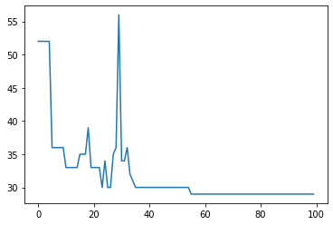
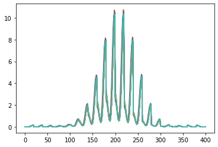
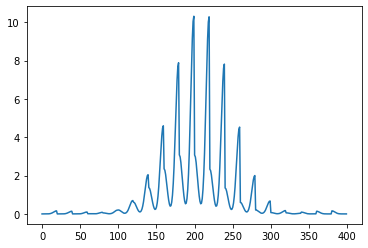
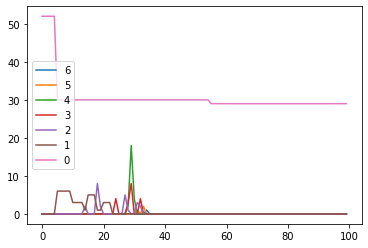

```python
import os
import gudhi
import json
import numpy as np
from functools import partial
import classifier
import sklearn.metrics as metrics
from importlib import reload
from sklearn.cluster import DBSCAN
from sklearn.model_selection import train_test_split
import region
import shapely as sh
from importlib import reload

```


```python
def get_persistence_dict(file_name):
    with open(file_name,'r') as f:
        data_dict=json.load(f)
    return data_dict
```


```python
reload(classifier)
reload(region)
```


    <module 'region' from 'D:\\PROJECT\\seminconductor\\code\\data2\\region.py'>


```python
basic_work_path=os.path.join(os.getcwd(),'result','complex')
complex_list=os.listdir(basic_work_path)
file_list=[]
for complex_ in complex_list:
    work_path=os.path.join(basic_work_path,complex_)
    tmp=os.listdir(work_path)
    for file in tmp:
        file_list.append(os.path.join(work_path,file))
data_dict=get_persistence_dict(file_list[47])
```


```python
basic_work_path=os.path.join(os.getcwd(),'result','complex')
complex_list=os.listdir(basic_work_path)
file_list=[]
for complex_ in complex_list:
    work_path=os.path.join(basic_work_path,complex_)
    tmp=os.listdir(work_path)
    for file in tmp:
        file_list.append(os.path.join(work_path,file))
"""
basic_save_path=os.path.join(os.getcwd(),'result','result')
for file in file_list:
    _,name=os.path.split(file)
    f=open(os.path.join(basic_save_path,name),'w')
    data_dict=get_persistence_dict(file)
    train_dict={}
    test_dict={}
    train_label_dict={}
    test_label_dict={}
    train_dict['good'],test_dict['good'],train_label_dict['good'],test_label_dict['good']=train_test_split(data_dict['good'],[0 for _ in range(len(data_dict['good']))],test_size=0.25)
    test_dict['bad']=data_dict['bad']
    test_label_dict['bad']=[1 for _ in range(len(data_dict['bad']))]
    
    cl=classifier.Classifier()
    cl._make_region(train_dict['good'])
    
    test_list=[data for key in test_dict.keys() for data in test_dict[key]]
    test_label_list=[0 for _ in range(len(test_dict['good']))]+[1 for _ in range(len(test_dict['bad']))]
    predict_label_list=[]
    for test in test_list:
        predict_label_list.append(cl.predict(test))    
    result=(metrics.classification_report(test_label_list,predict_label_list)
    f.write(result)
    f.close()
"""
```


```python
file=file_list[5]
```


```python
    #_,name=os.path.split(file)
    
    #data_dict=get_persistence_dict(file)
    train_dict={}
    test_dict={}
    train_label_dict={}
    test_label_dict={}
    train_dict['good'],test_dict['good'],train_label_dict['good'],test_label_dict['good']=train_test_split(data_dict['good'],[0 for _ in range(len(data_dict['good']))],test_size=0.25)
    test_dict['bad']=data_dict['bad']
    test_label_dict['bad']=[1 for _ in range(len(data_dict['bad']))]
```


```python
reload(classifier)
reload(region)    
cl=classifier.Classifier()
cl._make_region(train_dict['good'])
```


```python
    test_list=[data for key in test_dict.keys() for data in test_dict[key]]
    test_label_list=[0 for _ in range(len(test_dict['good']))]+[1 for _ in range(len(test_dict['bad']))]
```


```python
#predict_label_list=cl.predict(test_dict['good'])
#'''
predict_label_list=[]
for test in test_list:
    predict_label_list.append(cl.predict(test))
#'''
```

    result:  0
    result:  0
    result:  0
    result:  0
    result:  0
    result:  0
    result:  0
    result:  0
    result:  0
    result:  0
    result:  0
    result:  0
    result:  0
    result:  0
    result:  0
    result:  0
    result:  0
    result:  0
    result:  0
    result:  0
    result:  0
    result:  0
    result:  0
    result:  0
    result:  0
    result:  0
    result:  0
    result:  0
    result:  0
    result:  0
    result:  0
    result:  0
    result:  0
    result:  0
    result:  0
    result:  0
    result:  0
    result:  0
    result:  0
    result:  0
    result:  0
    result:  0
    result:  0
    result:  0
    result:  0
    result:  0
    result:  0
    result:  0
    result:  0
    result:  0
    result:  0
    result:  0
    result:  False
    result:  0
    result:  0
    result:  0
    result:  0
    result:  0
    result:  0
    result:  0
    result:  0
    result:  0
    result:  0
    result:  0
    result:  0
    result:  0
    result:  0
    result:  0
    result:  0
    result:  0
    result:  0
    result:  0
    result:  0
    result:  0
    result:  0
    result:  0
    result:  0
    result:  0
    result:  0
    result:  0
    result:  0
    result:  0
    result:  0
    result:  0
    result:  0
    result:  0
    result:  0
    result:  0
    result:  0
    result:  0
    result:  0
    result:  0
    result:  0
    result:  0
    


    ---------------------------------------------------------------------------

    TypeError                                 Traceback (most recent call last)

    <ipython-input-96-0325d05319f8> in <module>
          3 predict_label_list=[]
          4 for test in test_list:
    ----> 5     predict_label_list.append(cl.predict(test))
          6 #'''
    

    D:\PROJECT\seminconductor\code\data2\classifier.py in predict(self, data_set)
         71         for key in data_dict_by_betti.keys():
         72             persistence_result.append(self.region_dict[key].predict(data_dict_by_betti[key]))
    ---> 73         result=reduce(lambda x,y : x*y, persistence_result)
         74         print('result: ', result)
         75 
    

    TypeError: reduce() of empty sequence with no initial value


```python
result=metrics.classification_report(test_label_list,predict_label_list)
print(result)
```

                  precision    recall  f1-score   support
    
               0       0.00      0.00      0.00        82
               1       0.34      0.96      0.51        45
    
        accuracy                           0.34       127
       macro avg       0.17      0.48      0.25       127
    weighted avg       0.12      0.34      0.18       127
    
    


```python
test
```


    [[0, [0.0, inf]]]


```python
for region_key in cl.region_dict.keys():
    for convex_key in cl.region_dict[region_key].region_dict.keys():
        print('region key: ',region_key,'convex_key: ',convex_key,type(cl.region_dict[region_key].region_dict[convex_key].polygon),convex_key,type(cl.region_dict[region_key].region_dict[convex_key].polygon)==sh.geometry.polygon.Polygon)
```

    region key:  4 convex_key:  0 <class 'shapely.geometry.polygon.Polygon'> 0 True
    region key:  3 convex_key:  0 <class 'shapely.geometry.polygon.Polygon'> 0 True
    region key:  3 convex_key:  1 <class 'shapely.geometry.linestring.LineString'> 1 False
    region key:  3 convex_key:  2 <class 'shapely.geometry.linestring.LineString'> 2 False
    region key:  2 convex_key:  0 <class 'shapely.geometry.polygon.Polygon'> 0 True
    region key:  1 convex_key:  0 <class 'shapely.geometry.polygon.Polygon'> 0 True
    region key:  0 convex_key:  0 <class 'shapely.geometry.point.Point'> 0 False
    region key:  0 convex_key:  1 <class 'shapely.geometry.point.Point'> 1 False
    region key:  0 convex_key:  2 <class 'shapely.geometry.point.Point'> 2 False
    region key:  0 convex_key:  3 <class 'shapely.geometry.linestring.LineString'> 3 False
    region key:  0 convex_key:  4 <class 'shapely.geometry.linestring.LineString'> 4 False
    region key:  0 convex_key:  5 <class 'shapely.geometry.linestring.LineString'> 5 False
    region key:  0 convex_key:  6 <class 'shapely.geometry.point.Point'> 6 False
    region key:  0 convex_key:  7 <class 'shapely.geometry.point.Point'> 7 False
    region key:  0 convex_key:  8 <class 'shapely.geometry.linestring.LineString'> 8 False
    region key:  0 convex_key:  9 <class 'shapely.geometry.point.Point'> 9 False
    region key:  0 convex_key:  10 <class 'shapely.geometry.linestring.LineString'> 10 False
    region key:  0 convex_key:  11 <class 'shapely.geometry.point.Point'> 11 False
    region key:  0 convex_key:  12 <class 'shapely.geometry.linestring.LineString'> 12 False
    region key:  0 convex_key:  13 <class 'shapely.geometry.point.Point'> 13 False
    region key:  0 convex_key:  14 <class 'shapely.geometry.point.Point'> 14 False
    region key:  0 convex_key:  15 <class 'shapely.geometry.linestring.LineString'> 15 False
    region key:  0 convex_key:  16 <class 'shapely.geometry.linestring.LineString'> 16 False
    region key:  0 convex_key:  17 <class 'shapely.geometry.linestring.LineString'> 17 False
    region key:  0 convex_key:  18 <class 'shapely.geometry.point.Point'> 18 False
    region key:  0 convex_key:  19 <class 'shapely.geometry.point.Point'> 19 False
    region key:  0 convex_key:  20 <class 'shapely.geometry.linestring.LineString'> 20 False
    region key:  0 convex_key:  21 <class 'shapely.geometry.linestring.LineString'> 21 False
    region key:  0 convex_key:  22 <class 'shapely.geometry.point.Point'> 22 False
    region key:  0 convex_key:  23 <class 'shapely.geometry.point.Point'> 23 False
    region key:  0 convex_key:  24 <class 'shapely.geometry.point.Point'> 24 False
    region key:  0 convex_key:  25 <class 'shapely.geometry.point.Point'> 25 False
    region key:  0 convex_key:  26 <class 'shapely.geometry.point.Point'> 26 False
    region key:  0 convex_key:  27 <class 'shapely.geometry.point.Point'> 27 False
    region key:  0 convex_key:  28 <class 'shapely.geometry.point.Point'> 28 False
    region key:  0 convex_key:  29 <class 'shapely.geometry.point.Point'> 29 False
    region key:  0 convex_key:  30 <class 'shapely.geometry.linestring.LineString'> 30 False
    region key:  0 convex_key:  31 <class 'shapely.geometry.linestring.LineString'> 31 False
    region key:  0 convex_key:  32 <class 'shapely.geometry.point.Point'> 32 False
    region key:  0 convex_key:  33 <class 'shapely.geometry.point.Point'> 33 False
    region key:  0 convex_key:  34 <class 'shapely.geometry.point.Point'> 34 False
    region key:  0 convex_key:  35 <class 'shapely.geometry.point.Point'> 35 False
    region key:  0 convex_key:  36 <class 'shapely.geometry.linestring.LineString'> 36 False
    region key:  0 convex_key:  37 <class 'shapely.geometry.linestring.LineString'> 37 False
    region key:  0 convex_key:  38 <class 'shapely.geometry.point.Point'> 38 False
    region key:  0 convex_key:  39 <class 'shapely.geometry.point.Point'> 39 False
    region key:  0 convex_key:  40 <class 'shapely.geometry.linestring.LineString'> 40 False
    region key:  0 convex_key:  41 <class 'shapely.geometry.point.Point'> 41 False
    region key:  0 convex_key:  42 <class 'shapely.geometry.point.Point'> 42 False
    region key:  0 convex_key:  43 <class 'shapely.geometry.point.Point'> 43 False
    region key:  0 convex_key:  44 <class 'shapely.geometry.point.Point'> 44 False
    region key:  0 convex_key:  45 <class 'shapely.geometry.point.Point'> 45 False
    region key:  0 convex_key:  46 <class 'shapely.geometry.point.Point'> 46 False
    region key:  0 convex_key:  47 <class 'shapely.geometry.linestring.LineString'> 47 False
    region key:  0 convex_key:  48 <class 'shapely.geometry.point.Point'> 48 False
    region key:  0 convex_key:  49 <class 'shapely.geometry.point.Point'> 49 False
    region key:  0 convex_key:  50 <class 'shapely.geometry.point.Point'> 50 False
    region key:  0 convex_key:  51 <class 'shapely.geometry.point.Point'> 51 False
    


```python
print('predict: ',cl.predict(test_list[0]))
for i, cor in enumerate(test_list[0]):
    betti, cord=cor
    for key in cl.region_dict[betti].region_dict.keys():
        if type(cl.region_dict[betti].region_dict[key].polygon)==sh.geometry.polygon.Polygon:
            x,y=cl.region_dict[betti].region_dict[key].polygon.exterior.coords.xy
            x=np.array(x)
            y=np.array(y)
            x_min=x.min()
            x_max=x.max()
            y_min=y.min()
            y_max=y.max()
            print('Polygon: ',i,betti,key,cord,x_min,x_max,y_min,y_max,cl.region_dict[betti].region_dict[key].predict(cord,0.5))
        if type(cl.region_dict[betti].region_dict[key].polygon)==sh.geometry.linestring.LineString:
            x,y=cl.region_dict[betti].region_dict[key].polygon.coords.xy
            x=np.array(x)
            y=np.array(y)            
            cord_=[]
            for j in range(len(x)):
                cord_.append([x[j],y[j]])
            print('Line: ',i,betti,key,cord,cord_[0],cord_[1],cl.region_dict[betti].region_dict[key].predict(cord,0.5))
        if type(cl.region_dict[betti].region_dict[key].polygon)==sh.geometry.point.Point:
            cord_=list(zip(cl.region_dict[betti].region_dict[key].polygon.coords.xy))
            print('point: ',i,betti,key,cord,cord_,cl.region_dict[betti].region_dict[key].predict(cord,0.5))           
                
        
```

    result:  0
    predict:  True
    Polygon:  0 4 0 [1.2000000000000002, 1.25] 1.0454545454545454 1.2307692307692308 1.25 1.2500000000000004 True
    Polygon:  1 3 0 [1.1500000000000001, 1.1999999999999997] 0.75 1.2115384615384617 0.8 1.2307692307692308 True
    Polygon:  1 3 1 [1.1500000000000001, 1.1999999999999997] 3.0 3.166666666666667 3.0000000000000004 3.1666666666666674 False
    Polygon:  1 3 2 [1.1500000000000001, 1.1999999999999997] 1.75 1.9166666666666667 1.7500000000000004 1.916666666666667 False
    Polygon:  2 3 0 [1.1500000000000001, 1.166666666666667] 0.75 1.2115384615384617 0.8 1.2307692307692308 True
    Polygon:  2 3 1 [1.1500000000000001, 1.166666666666667] 3.0 3.166666666666667 3.0000000000000004 3.1666666666666674 False
    Polygon:  2 3 2 [1.1500000000000001, 1.166666666666667] 1.75 1.9166666666666667 1.7500000000000004 1.916666666666667 False
    Polygon:  3 3 0 [1.1500000000000001, 1.166666666666667] 0.75 1.2115384615384617 0.8 1.2307692307692308 True
    Polygon:  3 3 1 [1.1500000000000001, 1.166666666666667] 3.0 3.166666666666667 3.0000000000000004 3.1666666666666674 False
    Polygon:  3 3 2 [1.1500000000000001, 1.166666666666667] 1.75 1.9166666666666667 1.7500000000000004 1.916666666666667 False
    Polygon:  4 3 0 [1.15, 1.1666666666666667] 0.75 1.2115384615384617 0.8 1.2307692307692308 True
    Polygon:  4 3 1 [1.15, 1.1666666666666667] 3.0 3.166666666666667 3.0000000000000004 3.1666666666666674 False
    Polygon:  4 3 2 [1.15, 1.1666666666666667] 1.75 1.9166666666666667 1.7500000000000004 1.916666666666667 False
    Polygon:  5 3 0 [1.1500000000000004, 1.166666666666667] 0.75 1.2115384615384617 0.8 1.2307692307692308 True
    Polygon:  5 3 1 [1.1500000000000004, 1.166666666666667] 3.0 3.166666666666667 3.0000000000000004 3.1666666666666674 False
    Polygon:  5 3 2 [1.1500000000000004, 1.166666666666667] 1.75 1.9166666666666667 1.7500000000000004 1.916666666666667 False
    Polygon:  6 3 0 [1.1500000000000001, 1.1666666666666667] 0.75 1.2115384615384617 0.8 1.2307692307692308 True
    Polygon:  6 3 1 [1.1500000000000001, 1.1666666666666667] 3.0 3.166666666666667 3.0000000000000004 3.1666666666666674 False
    Polygon:  6 3 2 [1.1500000000000001, 1.1666666666666667] 1.75 1.9166666666666667 1.7500000000000004 1.916666666666667 False
    Polygon:  7 3 0 [1.1500000000000001, 1.1666666666666665] 0.75 1.2115384615384617 0.8 1.2307692307692308 True
    Polygon:  7 3 1 [1.1500000000000001, 1.1666666666666665] 3.0 3.166666666666667 3.0000000000000004 3.1666666666666674 False
    Polygon:  7 3 2 [1.1500000000000001, 1.1666666666666665] 1.75 1.9166666666666667 1.7500000000000004 1.916666666666667 False
    Polygon:  8 3 0 [1.1500000000000001, 1.1666666666666665] 0.75 1.2115384615384617 0.8 1.2307692307692308 True
    Polygon:  8 3 1 [1.1500000000000001, 1.1666666666666665] 3.0 3.166666666666667 3.0000000000000004 3.1666666666666674 False
    Polygon:  8 3 2 [1.1500000000000001, 1.1666666666666665] 1.75 1.9166666666666667 1.7500000000000004 1.916666666666667 False
    Polygon:  9 3 0 [1.1500000000000001, 1.1666666666666665] 0.75 1.2115384615384617 0.8 1.2307692307692308 True
    Polygon:  9 3 1 [1.1500000000000001, 1.1666666666666665] 3.0 3.166666666666667 3.0000000000000004 3.1666666666666674 False
    Polygon:  9 3 2 [1.1500000000000001, 1.1666666666666665] 1.75 1.9166666666666667 1.7500000000000004 1.916666666666667 False
    Polygon:  10 3 0 [1.1500000000000004, 1.1666666666666667] 0.75 1.2115384615384617 0.8 1.2307692307692308 True
    Polygon:  10 3 1 [1.1500000000000004, 1.1666666666666667] 3.0 3.166666666666667 3.0000000000000004 3.1666666666666674 False
    Polygon:  10 3 2 [1.1500000000000004, 1.1666666666666667] 1.75 1.9166666666666667 1.7500000000000004 1.916666666666667 False
    Polygon:  11 3 0 [1.1500000000000004, 1.1666666666666665] 0.75 1.2115384615384617 0.8 1.2307692307692308 True
    Polygon:  11 3 1 [1.1500000000000004, 1.1666666666666665] 3.0 3.166666666666667 3.0000000000000004 3.1666666666666674 False
    Polygon:  11 3 2 [1.1500000000000004, 1.1666666666666665] 1.75 1.9166666666666667 1.7500000000000004 1.916666666666667 False
    Polygon:  12 3 0 [1.1666666666666665, 1.166666666666667] 0.75 1.2115384615384617 0.8 1.2307692307692308 True
    Polygon:  12 3 1 [1.1666666666666665, 1.166666666666667] 3.0 3.166666666666667 3.0000000000000004 3.1666666666666674 False
    Polygon:  12 3 2 [1.1666666666666665, 1.166666666666667] 1.75 1.9166666666666667 1.7500000000000004 1.916666666666667 False
    Polygon:  13 3 0 [1.1666666666666665, 1.1666666666666667] 0.75 1.2115384615384617 0.8 1.2307692307692308 True
    Polygon:  13 3 1 [1.1666666666666665, 1.1666666666666667] 3.0 3.166666666666667 3.0000000000000004 3.1666666666666674 False
    Polygon:  13 3 2 [1.1666666666666665, 1.1666666666666667] 1.75 1.9166666666666667 1.7500000000000004 1.916666666666667 False
    Polygon:  14 3 0 [1.0, 1.0000000000000002] 0.75 1.2115384615384617 0.8 1.2307692307692308 True
    Polygon:  14 3 1 [1.0, 1.0000000000000002] 3.0 3.166666666666667 3.0000000000000004 3.1666666666666674 False
    Polygon:  14 3 2 [1.0, 1.0000000000000002] 1.75 1.9166666666666667 1.7500000000000004 1.916666666666667 False
    Polygon:  15 3 0 [1.1666666666666665, 1.1666666666666667] 0.75 1.2115384615384617 0.8 1.2307692307692308 True
    Polygon:  15 3 1 [1.1666666666666665, 1.1666666666666667] 3.0 3.166666666666667 3.0000000000000004 3.1666666666666674 False
    Polygon:  15 3 2 [1.1666666666666665, 1.1666666666666667] 1.75 1.9166666666666667 1.7500000000000004 1.916666666666667 False
    Polygon:  16 3 0 [1.1666666666666665, 1.1666666666666667] 0.75 1.2115384615384617 0.8 1.2307692307692308 True
    Polygon:  16 3 1 [1.1666666666666665, 1.1666666666666667] 3.0 3.166666666666667 3.0000000000000004 3.1666666666666674 False
    Polygon:  16 3 2 [1.1666666666666665, 1.1666666666666667] 1.75 1.9166666666666667 1.7500000000000004 1.916666666666667 False
    Polygon:  17 2 0 [1.125, 1.1500000000000001] 0.6666666666666665 1.1666666666666665 0.75 1.2000000000000002 True
    Polygon:  18 2 0 [1.125, 1.1500000000000001] 0.6666666666666665 1.1666666666666665 0.75 1.2000000000000002 True
    Polygon:  19 2 0 [1.125, 1.15] 0.6666666666666665 1.1666666666666665 0.75 1.2000000000000002 True
    Polygon:  20 2 0 [1.125, 1.15] 0.6666666666666665 1.1666666666666665 0.75 1.2000000000000002 True
    Polygon:  21 2 0 [1.125, 1.15] 0.6666666666666665 1.1666666666666665 0.75 1.2000000000000002 True
    Polygon:  22 2 0 [1.125, 1.15] 0.6666666666666665 1.1666666666666665 0.75 1.2000000000000002 True
    Polygon:  23 2 0 [1.125, 1.15] 0.6666666666666665 1.1666666666666665 0.75 1.2000000000000002 True
    Polygon:  24 2 0 [1.125, 1.15] 0.6666666666666665 1.1666666666666665 0.75 1.2000000000000002 True
    Polygon:  25 2 0 [1.125, 1.15] 0.6666666666666665 1.1666666666666665 0.75 1.2000000000000002 True
    Polygon:  26 2 0 [1.1428571428571428, 1.1500000000000001] 0.6666666666666665 1.1666666666666665 0.75 1.2000000000000002 True
    Polygon:  27 2 0 [1.1428571428571428, 1.15] 0.6666666666666665 1.1666666666666665 0.75 1.2000000000000002 True
    Polygon:  28 2 0 [1.1428571428571428, 1.15] 0.6666666666666665 1.1666666666666665 0.75 1.2000000000000002 True
    Polygon:  29 2 0 [1.1428571428571428, 1.15] 0.6666666666666665 1.1666666666666665 0.75 1.2000000000000002 True
    Polygon:  30 2 0 [1.1428571428571428, 1.15] 0.6666666666666665 1.1666666666666665 0.75 1.2000000000000002 True
    Polygon:  31 2 0 [1.1428571428571428, 1.15] 0.6666666666666665 1.1666666666666665 0.75 1.2000000000000002 True
    Polygon:  32 2 0 [1.1428571428571428, 1.15] 0.6666666666666665 1.1666666666666665 0.75 1.2000000000000002 True
    Polygon:  33 2 0 [1.1428571428571428, 1.15] 0.6666666666666665 1.1666666666666665 0.75 1.2000000000000002 True
    Polygon:  34 2 0 [1.1428571428571428, 1.15] 0.6666666666666665 1.1666666666666665 0.75 1.2000000000000002 True
    Polygon:  35 2 0 [1.142857142857143, 1.15] 0.6666666666666665 1.1666666666666665 0.75 1.2000000000000002 True
    Polygon:  36 2 0 [0.75, 0.7500000000000001] 0.6666666666666665 1.1666666666666665 0.75 1.2000000000000002 True
    Polygon:  37 1 0 [66576448.75, 72869183.93970641] 0.25 1.0 0.5 1.125 False
    Polygon:  38 1 0 [27671443.5, 28879867.882560924] 0.25 1.0 0.5 1.125 False
    Polygon:  39 1 0 [40759149.25, 41629503.4893313] 0.25 1.0 0.5 1.125 False
    Polygon:  40 1 0 [54937185.25, 55491705.83280003] 0.25 1.0 0.5 1.125 False
    Polygon:  41 1 0 [69969881.5, 70482371.35598415] 0.25 1.0 0.5 1.125 False
    Polygon:  42 1 0 [66804473.0, 66900166.71567936] 0.25 1.0 0.5 1.125 False
    Polygon:  43 1 0 [0.25, 1.125] 0.25 1.0 0.5 1.125 True
    point:  44 0 0 [0.0, inf] [(array('d', [0.0]),), (array('d', [1.7976931348623157e+278]),)] False
    point:  44 0 1 [0.0, inf] [(array('d', [0.0]),), (array('d', [164.25]),)] False
    Line:  44 0 2 [0.0, inf] [0.0, 20.25] [0.0, 21.0] False
    Line:  44 0 3 [0.0, inf] [0.0, 4.0] [0.0, 5.25] False
    Line:  44 0 4 [0.0, inf] [0.0, 0.25] [0.0, 1.25] False
    Line:  44 0 5 [0.0, inf] [0.0, 67.5] [0.0, 67.75] False
    Line:  44 0 6 [0.0, inf] [0.0, 11.25] [0.0, 11.75] False
    Line:  44 0 7 [0.0, inf] [0.0, 2.25] [0.0, 3.25] False
    Line:  44 0 8 [0.0, inf] [0.0, 8.5] [0.0, 8.75] False
    point:  44 0 9 [0.0, inf] [(array('d', [0.0]),), (array('d', [137.5]),)] False
    point:  44 0 10 [0.0, inf] [(array('d', [0.0]),), (array('d', [16.5]),)] False
    Line:  44 0 11 [0.0, inf] [0.0, 252.0] [0.0, 252.5] False
    Line:  44 0 12 [0.0, inf] [0.0, 26.75] [0.0, 27.5] False
    Line:  44 0 13 [0.0, inf] [0.0, 6.5] [0.0, 7.5] False
    point:  44 0 14 [0.0, inf] [(array('d', [0.0]),), (array('d', [414.25]),)] False
    Line:  44 0 15 [0.0, inf] [0.0, 38.75] [0.0, 39.0] False
    point:  44 0 16 [0.0, inf] [(array('d', [0.0]),), (array('d', [83.75]),)] False
    point:  44 0 17 [0.0, inf] [(array('d', [0.0]),), (array('d', [75.5]),)] False
    point:  44 0 18 [0.0, inf] [(array('d', [0.0]),), (array('d', [60.5]),)] False
    point:  44 0 19 [0.0, inf] [(array('d', [0.0]),), (array('d', [32.25]),)] False
    point:  44 0 20 [0.0, inf] [(array('d', [0.0]),), (array('d', [242.5]),)] False
    point:  44 0 21 [0.0, inf] [(array('d', [0.0]),), (array('d', [134.25]),)] False
    point:  44 0 22 [0.0, inf] [(array('d', [0.0]),), (array('d', [13.25]),)] False
    Line:  44 0 23 [0.0, inf] [0.0, 534.5] [0.0, 535.0] False
    point:  44 0 24 [0.0, inf] [(array('d', [0.0]),), (array('d', [348.5]),)] False
    point:  44 0 25 [0.0, inf] [(array('d', [0.0]),), (array('d', [57.75]),)] False
    point:  44 0 26 [0.0, inf] [(array('d', [0.0]),), (array('d', [125.0]),)] False
    point:  44 0 27 [0.0, inf] [(array('d', [0.0]),), (array('d', [14.75]),)] False
    point:  44 0 28 [0.0, inf] [(array('d', [0.0]),), (array('d', [194.25]),)] False
    point:  44 0 29 [0.0, inf] [(array('d', [0.0]),), (array('d', [25.25]),)] False
    Line:  44 0 30 [0.0, inf] [0.0, 864.0] [0.0, 864.5] False
    point:  44 0 31 [0.0, inf] [(array('d', [0.0]),), (array('d', [288.0]),)] False
    Line:  44 0 32 [0.0, inf] [0.0, 114.25] [0.0, 114.75] False
    point:  44 0 33 [0.0, inf] [(array('d', [0.0]),), (array('d', [144.0]),)] False
    point:  44 0 34 [0.0, inf] [(array('d', [0.0]),), (array('d', [258.5]),)] False
    point:  44 0 35 [0.0, inf] [(array('d', [0.0]),), (array('d', [33.5]),)] False
    Line:  44 0 36 [0.0, inf] [0.0, 36.0] [0.0, 36.25] False
    point:  44 0 37 [0.0, inf] [(array('d', [0.0]),), (array('d', [17.25]),)] False
    point:  44 0 38 [0.0, inf] [(array('d', [0.0]),), (array('d', [51.0]),)] False
    point:  44 0 39 [0.0, inf] [(array('d', [0.0]),), (array('d', [148.75]),)] False
    Line:  44 0 40 [0.0, inf] [0.0, 10.0] [0.0, 10.25] False
    point:  44 0 41 [0.0, inf] [(array('d', [0.0]),), (array('d', [223.5]),)] False
    point:  44 0 42 [0.0, inf] [(array('d', [0.0]),), (array('d', [216.0]),)] False
    point:  44 0 43 [0.0, inf] [(array('d', [0.0]),), (array('d', [108.0]),)] False
    point:  44 0 44 [0.0, inf] [(array('d', [0.0]),), (array('d', [65.0]),)] False
    point:  44 0 45 [0.0, inf] [(array('d', [0.0]),), (array('d', [72.0]),)] False
    point:  44 0 46 [0.0, inf] [(array('d', [0.0]),), (array('d', [524.75]),)] False
    Line:  44 0 47 [0.0, inf] [0.0, 1007.75] [0.0, 1008.5] False
    point:  45 0 0 [0.0, 19868411.25] [(array('d', [0.0]),), (array('d', [1.7976931348623157e+278]),)] False
    point:  45 0 1 [0.0, 19868411.25] [(array('d', [0.0]),), (array('d', [164.25]),)] False
    Line:  45 0 2 [0.0, 19868411.25] [0.0, 20.25] [0.0, 21.0] False
    Line:  45 0 3 [0.0, 19868411.25] [0.0, 4.0] [0.0, 5.25] False
    Line:  45 0 4 [0.0, 19868411.25] [0.0, 0.25] [0.0, 1.25] False
    Line:  45 0 5 [0.0, 19868411.25] [0.0, 67.5] [0.0, 67.75] False
    Line:  45 0 6 [0.0, 19868411.25] [0.0, 11.25] [0.0, 11.75] False
    Line:  45 0 7 [0.0, 19868411.25] [0.0, 2.25] [0.0, 3.25] False
    Line:  45 0 8 [0.0, 19868411.25] [0.0, 8.5] [0.0, 8.75] False
    point:  45 0 9 [0.0, 19868411.25] [(array('d', [0.0]),), (array('d', [137.5]),)] False
    point:  45 0 10 [0.0, 19868411.25] [(array('d', [0.0]),), (array('d', [16.5]),)] False
    Line:  45 0 11 [0.0, 19868411.25] [0.0, 252.0] [0.0, 252.5] False
    Line:  45 0 12 [0.0, 19868411.25] [0.0, 26.75] [0.0, 27.5] False
    Line:  45 0 13 [0.0, 19868411.25] [0.0, 6.5] [0.0, 7.5] False
    point:  45 0 14 [0.0, 19868411.25] [(array('d', [0.0]),), (array('d', [414.25]),)] False
    Line:  45 0 15 [0.0, 19868411.25] [0.0, 38.75] [0.0, 39.0] False
    point:  45 0 16 [0.0, 19868411.25] [(array('d', [0.0]),), (array('d', [83.75]),)] False
    point:  45 0 17 [0.0, 19868411.25] [(array('d', [0.0]),), (array('d', [75.5]),)] False
    point:  45 0 18 [0.0, 19868411.25] [(array('d', [0.0]),), (array('d', [60.5]),)] False
    point:  45 0 19 [0.0, 19868411.25] [(array('d', [0.0]),), (array('d', [32.25]),)] False
    point:  45 0 20 [0.0, 19868411.25] [(array('d', [0.0]),), (array('d', [242.5]),)] False
    point:  45 0 21 [0.0, 19868411.25] [(array('d', [0.0]),), (array('d', [134.25]),)] False
    point:  45 0 22 [0.0, 19868411.25] [(array('d', [0.0]),), (array('d', [13.25]),)] False
    Line:  45 0 23 [0.0, 19868411.25] [0.0, 534.5] [0.0, 535.0] False
    point:  45 0 24 [0.0, 19868411.25] [(array('d', [0.0]),), (array('d', [348.5]),)] False
    point:  45 0 25 [0.0, 19868411.25] [(array('d', [0.0]),), (array('d', [57.75]),)] False
    point:  45 0 26 [0.0, 19868411.25] [(array('d', [0.0]),), (array('d', [125.0]),)] False
    point:  45 0 27 [0.0, 19868411.25] [(array('d', [0.0]),), (array('d', [14.75]),)] False
    point:  45 0 28 [0.0, 19868411.25] [(array('d', [0.0]),), (array('d', [194.25]),)] False
    point:  45 0 29 [0.0, 19868411.25] [(array('d', [0.0]),), (array('d', [25.25]),)] False
    Line:  45 0 30 [0.0, 19868411.25] [0.0, 864.0] [0.0, 864.5] False
    point:  45 0 31 [0.0, 19868411.25] [(array('d', [0.0]),), (array('d', [288.0]),)] False
    Line:  45 0 32 [0.0, 19868411.25] [0.0, 114.25] [0.0, 114.75] False
    point:  45 0 33 [0.0, 19868411.25] [(array('d', [0.0]),), (array('d', [144.0]),)] False
    point:  45 0 34 [0.0, 19868411.25] [(array('d', [0.0]),), (array('d', [258.5]),)] False
    point:  45 0 35 [0.0, 19868411.25] [(array('d', [0.0]),), (array('d', [33.5]),)] False
    Line:  45 0 36 [0.0, 19868411.25] [0.0, 36.0] [0.0, 36.25] False
    point:  45 0 37 [0.0, 19868411.25] [(array('d', [0.0]),), (array('d', [17.25]),)] False
    point:  45 0 38 [0.0, 19868411.25] [(array('d', [0.0]),), (array('d', [51.0]),)] False
    point:  45 0 39 [0.0, 19868411.25] [(array('d', [0.0]),), (array('d', [148.75]),)] False
    Line:  45 0 40 [0.0, 19868411.25] [0.0, 10.0] [0.0, 10.25] False
    point:  45 0 41 [0.0, 19868411.25] [(array('d', [0.0]),), (array('d', [223.5]),)] False
    point:  45 0 42 [0.0, 19868411.25] [(array('d', [0.0]),), (array('d', [216.0]),)] False
    point:  45 0 43 [0.0, 19868411.25] [(array('d', [0.0]),), (array('d', [108.0]),)] False
    point:  45 0 44 [0.0, 19868411.25] [(array('d', [0.0]),), (array('d', [65.0]),)] False
    point:  45 0 45 [0.0, 19868411.25] [(array('d', [0.0]),), (array('d', [72.0]),)] False
    point:  45 0 46 [0.0, 19868411.25] [(array('d', [0.0]),), (array('d', [524.75]),)] False
    Line:  45 0 47 [0.0, 19868411.25] [0.0, 1007.75] [0.0, 1008.5] False
    point:  46 0 0 [0.0, 19868411.25] [(array('d', [0.0]),), (array('d', [1.7976931348623157e+278]),)] False
    point:  46 0 1 [0.0, 19868411.25] [(array('d', [0.0]),), (array('d', [164.25]),)] False
    Line:  46 0 2 [0.0, 19868411.25] [0.0, 20.25] [0.0, 21.0] False
    Line:  46 0 3 [0.0, 19868411.25] [0.0, 4.0] [0.0, 5.25] False
    Line:  46 0 4 [0.0, 19868411.25] [0.0, 0.25] [0.0, 1.25] False
    Line:  46 0 5 [0.0, 19868411.25] [0.0, 67.5] [0.0, 67.75] False
    Line:  46 0 6 [0.0, 19868411.25] [0.0, 11.25] [0.0, 11.75] False
    Line:  46 0 7 [0.0, 19868411.25] [0.0, 2.25] [0.0, 3.25] False
    Line:  46 0 8 [0.0, 19868411.25] [0.0, 8.5] [0.0, 8.75] False
    point:  46 0 9 [0.0, 19868411.25] [(array('d', [0.0]),), (array('d', [137.5]),)] False
    point:  46 0 10 [0.0, 19868411.25] [(array('d', [0.0]),), (array('d', [16.5]),)] False
    Line:  46 0 11 [0.0, 19868411.25] [0.0, 252.0] [0.0, 252.5] False
    Line:  46 0 12 [0.0, 19868411.25] [0.0, 26.75] [0.0, 27.5] False
    Line:  46 0 13 [0.0, 19868411.25] [0.0, 6.5] [0.0, 7.5] False
    point:  46 0 14 [0.0, 19868411.25] [(array('d', [0.0]),), (array('d', [414.25]),)] False
    Line:  46 0 15 [0.0, 19868411.25] [0.0, 38.75] [0.0, 39.0] False
    point:  46 0 16 [0.0, 19868411.25] [(array('d', [0.0]),), (array('d', [83.75]),)] False
    point:  46 0 17 [0.0, 19868411.25] [(array('d', [0.0]),), (array('d', [75.5]),)] False
    point:  46 0 18 [0.0, 19868411.25] [(array('d', [0.0]),), (array('d', [60.5]),)] False
    point:  46 0 19 [0.0, 19868411.25] [(array('d', [0.0]),), (array('d', [32.25]),)] False
    point:  46 0 20 [0.0, 19868411.25] [(array('d', [0.0]),), (array('d', [242.5]),)] False
    point:  46 0 21 [0.0, 19868411.25] [(array('d', [0.0]),), (array('d', [134.25]),)] False
    point:  46 0 22 [0.0, 19868411.25] [(array('d', [0.0]),), (array('d', [13.25]),)] False
    Line:  46 0 23 [0.0, 19868411.25] [0.0, 534.5] [0.0, 535.0] False
    point:  46 0 24 [0.0, 19868411.25] [(array('d', [0.0]),), (array('d', [348.5]),)] False
    point:  46 0 25 [0.0, 19868411.25] [(array('d', [0.0]),), (array('d', [57.75]),)] False
    point:  46 0 26 [0.0, 19868411.25] [(array('d', [0.0]),), (array('d', [125.0]),)] False
    point:  46 0 27 [0.0, 19868411.25] [(array('d', [0.0]),), (array('d', [14.75]),)] False
    point:  46 0 28 [0.0, 19868411.25] [(array('d', [0.0]),), (array('d', [194.25]),)] False
    point:  46 0 29 [0.0, 19868411.25] [(array('d', [0.0]),), (array('d', [25.25]),)] False
    Line:  46 0 30 [0.0, 19868411.25] [0.0, 864.0] [0.0, 864.5] False
    point:  46 0 31 [0.0, 19868411.25] [(array('d', [0.0]),), (array('d', [288.0]),)] False
    Line:  46 0 32 [0.0, 19868411.25] [0.0, 114.25] [0.0, 114.75] False
    point:  46 0 33 [0.0, 19868411.25] [(array('d', [0.0]),), (array('d', [144.0]),)] False
    point:  46 0 34 [0.0, 19868411.25] [(array('d', [0.0]),), (array('d', [258.5]),)] False
    point:  46 0 35 [0.0, 19868411.25] [(array('d', [0.0]),), (array('d', [33.5]),)] False
    Line:  46 0 36 [0.0, 19868411.25] [0.0, 36.0] [0.0, 36.25] False
    point:  46 0 37 [0.0, 19868411.25] [(array('d', [0.0]),), (array('d', [17.25]),)] False
    point:  46 0 38 [0.0, 19868411.25] [(array('d', [0.0]),), (array('d', [51.0]),)] False
    point:  46 0 39 [0.0, 19868411.25] [(array('d', [0.0]),), (array('d', [148.75]),)] False
    Line:  46 0 40 [0.0, 19868411.25] [0.0, 10.0] [0.0, 10.25] False
    point:  46 0 41 [0.0, 19868411.25] [(array('d', [0.0]),), (array('d', [223.5]),)] False
    point:  46 0 42 [0.0, 19868411.25] [(array('d', [0.0]),), (array('d', [216.0]),)] False
    point:  46 0 43 [0.0, 19868411.25] [(array('d', [0.0]),), (array('d', [108.0]),)] False
    point:  46 0 44 [0.0, 19868411.25] [(array('d', [0.0]),), (array('d', [65.0]),)] False
    point:  46 0 45 [0.0, 19868411.25] [(array('d', [0.0]),), (array('d', [72.0]),)] False
    point:  46 0 46 [0.0, 19868411.25] [(array('d', [0.0]),), (array('d', [524.75]),)] False
    Line:  46 0 47 [0.0, 19868411.25] [0.0, 1007.75] [0.0, 1008.5] False
    point:  47 0 0 [0.0, 19867310.5] [(array('d', [0.0]),), (array('d', [1.7976931348623157e+278]),)] False
    point:  47 0 1 [0.0, 19867310.5] [(array('d', [0.0]),), (array('d', [164.25]),)] False
    Line:  47 0 2 [0.0, 19867310.5] [0.0, 20.25] [0.0, 21.0] False
    Line:  47 0 3 [0.0, 19867310.5] [0.0, 4.0] [0.0, 5.25] False
    Line:  47 0 4 [0.0, 19867310.5] [0.0, 0.25] [0.0, 1.25] False
    Line:  47 0 5 [0.0, 19867310.5] [0.0, 67.5] [0.0, 67.75] False
    Line:  47 0 6 [0.0, 19867310.5] [0.0, 11.25] [0.0, 11.75] False
    Line:  47 0 7 [0.0, 19867310.5] [0.0, 2.25] [0.0, 3.25] False
    Line:  47 0 8 [0.0, 19867310.5] [0.0, 8.5] [0.0, 8.75] False
    point:  47 0 9 [0.0, 19867310.5] [(array('d', [0.0]),), (array('d', [137.5]),)] False
    point:  47 0 10 [0.0, 19867310.5] [(array('d', [0.0]),), (array('d', [16.5]),)] False
    Line:  47 0 11 [0.0, 19867310.5] [0.0, 252.0] [0.0, 252.5] False
    Line:  47 0 12 [0.0, 19867310.5] [0.0, 26.75] [0.0, 27.5] False
    Line:  47 0 13 [0.0, 19867310.5] [0.0, 6.5] [0.0, 7.5] False
    point:  47 0 14 [0.0, 19867310.5] [(array('d', [0.0]),), (array('d', [414.25]),)] False
    Line:  47 0 15 [0.0, 19867310.5] [0.0, 38.75] [0.0, 39.0] False
    point:  47 0 16 [0.0, 19867310.5] [(array('d', [0.0]),), (array('d', [83.75]),)] False
    point:  47 0 17 [0.0, 19867310.5] [(array('d', [0.0]),), (array('d', [75.5]),)] False
    point:  47 0 18 [0.0, 19867310.5] [(array('d', [0.0]),), (array('d', [60.5]),)] False
    point:  47 0 19 [0.0, 19867310.5] [(array('d', [0.0]),), (array('d', [32.25]),)] False
    point:  47 0 20 [0.0, 19867310.5] [(array('d', [0.0]),), (array('d', [242.5]),)] False
    point:  47 0 21 [0.0, 19867310.5] [(array('d', [0.0]),), (array('d', [134.25]),)] False
    point:  47 0 22 [0.0, 19867310.5] [(array('d', [0.0]),), (array('d', [13.25]),)] False
    Line:  47 0 23 [0.0, 19867310.5] [0.0, 534.5] [0.0, 535.0] False
    point:  47 0 24 [0.0, 19867310.5] [(array('d', [0.0]),), (array('d', [348.5]),)] False
    point:  47 0 25 [0.0, 19867310.5] [(array('d', [0.0]),), (array('d', [57.75]),)] False
    point:  47 0 26 [0.0, 19867310.5] [(array('d', [0.0]),), (array('d', [125.0]),)] False
    point:  47 0 27 [0.0, 19867310.5] [(array('d', [0.0]),), (array('d', [14.75]),)] False
    point:  47 0 28 [0.0, 19867310.5] [(array('d', [0.0]),), (array('d', [194.25]),)] False
    point:  47 0 29 [0.0, 19867310.5] [(array('d', [0.0]),), (array('d', [25.25]),)] False
    Line:  47 0 30 [0.0, 19867310.5] [0.0, 864.0] [0.0, 864.5] False
    point:  47 0 31 [0.0, 19867310.5] [(array('d', [0.0]),), (array('d', [288.0]),)] False
    Line:  47 0 32 [0.0, 19867310.5] [0.0, 114.25] [0.0, 114.75] False
    point:  47 0 33 [0.0, 19867310.5] [(array('d', [0.0]),), (array('d', [144.0]),)] False
    point:  47 0 34 [0.0, 19867310.5] [(array('d', [0.0]),), (array('d', [258.5]),)] False
    point:  47 0 35 [0.0, 19867310.5] [(array('d', [0.0]),), (array('d', [33.5]),)] False
    Line:  47 0 36 [0.0, 19867310.5] [0.0, 36.0] [0.0, 36.25] False
    point:  47 0 37 [0.0, 19867310.5] [(array('d', [0.0]),), (array('d', [17.25]),)] False
    point:  47 0 38 [0.0, 19867310.5] [(array('d', [0.0]),), (array('d', [51.0]),)] False
    point:  47 0 39 [0.0, 19867310.5] [(array('d', [0.0]),), (array('d', [148.75]),)] False
    Line:  47 0 40 [0.0, 19867310.5] [0.0, 10.0] [0.0, 10.25] False
    point:  47 0 41 [0.0, 19867310.5] [(array('d', [0.0]),), (array('d', [223.5]),)] False
    point:  47 0 42 [0.0, 19867310.5] [(array('d', [0.0]),), (array('d', [216.0]),)] False
    point:  47 0 43 [0.0, 19867310.5] [(array('d', [0.0]),), (array('d', [108.0]),)] False
    point:  47 0 44 [0.0, 19867310.5] [(array('d', [0.0]),), (array('d', [65.0]),)] False
    point:  47 0 45 [0.0, 19867310.5] [(array('d', [0.0]),), (array('d', [72.0]),)] False
    point:  47 0 46 [0.0, 19867310.5] [(array('d', [0.0]),), (array('d', [524.75]),)] False
    Line:  47 0 47 [0.0, 19867310.5] [0.0, 1007.75] [0.0, 1008.5] False
    point:  48 0 0 [0.0, 19866285.5] [(array('d', [0.0]),), (array('d', [1.7976931348623157e+278]),)] False
    point:  48 0 1 [0.0, 19866285.5] [(array('d', [0.0]),), (array('d', [164.25]),)] False
    Line:  48 0 2 [0.0, 19866285.5] [0.0, 20.25] [0.0, 21.0] False
    Line:  48 0 3 [0.0, 19866285.5] [0.0, 4.0] [0.0, 5.25] False
    Line:  48 0 4 [0.0, 19866285.5] [0.0, 0.25] [0.0, 1.25] False
    Line:  48 0 5 [0.0, 19866285.5] [0.0, 67.5] [0.0, 67.75] False
    Line:  48 0 6 [0.0, 19866285.5] [0.0, 11.25] [0.0, 11.75] False
    Line:  48 0 7 [0.0, 19866285.5] [0.0, 2.25] [0.0, 3.25] False
    Line:  48 0 8 [0.0, 19866285.5] [0.0, 8.5] [0.0, 8.75] False
    point:  48 0 9 [0.0, 19866285.5] [(array('d', [0.0]),), (array('d', [137.5]),)] False
    point:  48 0 10 [0.0, 19866285.5] [(array('d', [0.0]),), (array('d', [16.5]),)] False
    Line:  48 0 11 [0.0, 19866285.5] [0.0, 252.0] [0.0, 252.5] False
    Line:  48 0 12 [0.0, 19866285.5] [0.0, 26.75] [0.0, 27.5] False
    Line:  48 0 13 [0.0, 19866285.5] [0.0, 6.5] [0.0, 7.5] False
    point:  48 0 14 [0.0, 19866285.5] [(array('d', [0.0]),), (array('d', [414.25]),)] False
    Line:  48 0 15 [0.0, 19866285.5] [0.0, 38.75] [0.0, 39.0] False
    point:  48 0 16 [0.0, 19866285.5] [(array('d', [0.0]),), (array('d', [83.75]),)] False
    point:  48 0 17 [0.0, 19866285.5] [(array('d', [0.0]),), (array('d', [75.5]),)] False
    point:  48 0 18 [0.0, 19866285.5] [(array('d', [0.0]),), (array('d', [60.5]),)] False
    point:  48 0 19 [0.0, 19866285.5] [(array('d', [0.0]),), (array('d', [32.25]),)] False
    point:  48 0 20 [0.0, 19866285.5] [(array('d', [0.0]),), (array('d', [242.5]),)] False
    point:  48 0 21 [0.0, 19866285.5] [(array('d', [0.0]),), (array('d', [134.25]),)] False
    point:  48 0 22 [0.0, 19866285.5] [(array('d', [0.0]),), (array('d', [13.25]),)] False
    Line:  48 0 23 [0.0, 19866285.5] [0.0, 534.5] [0.0, 535.0] False
    point:  48 0 24 [0.0, 19866285.5] [(array('d', [0.0]),), (array('d', [348.5]),)] False
    point:  48 0 25 [0.0, 19866285.5] [(array('d', [0.0]),), (array('d', [57.75]),)] False
    point:  48 0 26 [0.0, 19866285.5] [(array('d', [0.0]),), (array('d', [125.0]),)] False
    point:  48 0 27 [0.0, 19866285.5] [(array('d', [0.0]),), (array('d', [14.75]),)] False
    point:  48 0 28 [0.0, 19866285.5] [(array('d', [0.0]),), (array('d', [194.25]),)] False
    point:  48 0 29 [0.0, 19866285.5] [(array('d', [0.0]),), (array('d', [25.25]),)] False
    Line:  48 0 30 [0.0, 19866285.5] [0.0, 864.0] [0.0, 864.5] False
    point:  48 0 31 [0.0, 19866285.5] [(array('d', [0.0]),), (array('d', [288.0]),)] False
    Line:  48 0 32 [0.0, 19866285.5] [0.0, 114.25] [0.0, 114.75] False
    point:  48 0 33 [0.0, 19866285.5] [(array('d', [0.0]),), (array('d', [144.0]),)] False
    point:  48 0 34 [0.0, 19866285.5] [(array('d', [0.0]),), (array('d', [258.5]),)] False
    point:  48 0 35 [0.0, 19866285.5] [(array('d', [0.0]),), (array('d', [33.5]),)] False
    Line:  48 0 36 [0.0, 19866285.5] [0.0, 36.0] [0.0, 36.25] False
    point:  48 0 37 [0.0, 19866285.5] [(array('d', [0.0]),), (array('d', [17.25]),)] False
    point:  48 0 38 [0.0, 19866285.5] [(array('d', [0.0]),), (array('d', [51.0]),)] False
    point:  48 0 39 [0.0, 19866285.5] [(array('d', [0.0]),), (array('d', [148.75]),)] False
    Line:  48 0 40 [0.0, 19866285.5] [0.0, 10.0] [0.0, 10.25] False
    point:  48 0 41 [0.0, 19866285.5] [(array('d', [0.0]),), (array('d', [223.5]),)] False
    point:  48 0 42 [0.0, 19866285.5] [(array('d', [0.0]),), (array('d', [216.0]),)] False
    point:  48 0 43 [0.0, 19866285.5] [(array('d', [0.0]),), (array('d', [108.0]),)] False
    point:  48 0 44 [0.0, 19866285.5] [(array('d', [0.0]),), (array('d', [65.0]),)] False
    point:  48 0 45 [0.0, 19866285.5] [(array('d', [0.0]),), (array('d', [72.0]),)] False
    point:  48 0 46 [0.0, 19866285.5] [(array('d', [0.0]),), (array('d', [524.75]),)] False
    Line:  48 0 47 [0.0, 19866285.5] [0.0, 1007.75] [0.0, 1008.5] False
    point:  49 0 0 [0.0, 15614758.0] [(array('d', [0.0]),), (array('d', [1.7976931348623157e+278]),)] False
    point:  49 0 1 [0.0, 15614758.0] [(array('d', [0.0]),), (array('d', [164.25]),)] False
    Line:  49 0 2 [0.0, 15614758.0] [0.0, 20.25] [0.0, 21.0] False
    Line:  49 0 3 [0.0, 15614758.0] [0.0, 4.0] [0.0, 5.25] False
    Line:  49 0 4 [0.0, 15614758.0] [0.0, 0.25] [0.0, 1.25] False
    Line:  49 0 5 [0.0, 15614758.0] [0.0, 67.5] [0.0, 67.75] False
    Line:  49 0 6 [0.0, 15614758.0] [0.0, 11.25] [0.0, 11.75] False
    Line:  49 0 7 [0.0, 15614758.0] [0.0, 2.25] [0.0, 3.25] False
    Line:  49 0 8 [0.0, 15614758.0] [0.0, 8.5] [0.0, 8.75] False
    point:  49 0 9 [0.0, 15614758.0] [(array('d', [0.0]),), (array('d', [137.5]),)] False
    point:  49 0 10 [0.0, 15614758.0] [(array('d', [0.0]),), (array('d', [16.5]),)] False
    Line:  49 0 11 [0.0, 15614758.0] [0.0, 252.0] [0.0, 252.5] False
    Line:  49 0 12 [0.0, 15614758.0] [0.0, 26.75] [0.0, 27.5] False
    Line:  49 0 13 [0.0, 15614758.0] [0.0, 6.5] [0.0, 7.5] False
    point:  49 0 14 [0.0, 15614758.0] [(array('d', [0.0]),), (array('d', [414.25]),)] False
    Line:  49 0 15 [0.0, 15614758.0] [0.0, 38.75] [0.0, 39.0] False
    point:  49 0 16 [0.0, 15614758.0] [(array('d', [0.0]),), (array('d', [83.75]),)] False
    point:  49 0 17 [0.0, 15614758.0] [(array('d', [0.0]),), (array('d', [75.5]),)] False
    point:  49 0 18 [0.0, 15614758.0] [(array('d', [0.0]),), (array('d', [60.5]),)] False
    point:  49 0 19 [0.0, 15614758.0] [(array('d', [0.0]),), (array('d', [32.25]),)] False
    point:  49 0 20 [0.0, 15614758.0] [(array('d', [0.0]),), (array('d', [242.5]),)] False
    point:  49 0 21 [0.0, 15614758.0] [(array('d', [0.0]),), (array('d', [134.25]),)] False
    point:  49 0 22 [0.0, 15614758.0] [(array('d', [0.0]),), (array('d', [13.25]),)] False
    Line:  49 0 23 [0.0, 15614758.0] [0.0, 534.5] [0.0, 535.0] False
    point:  49 0 24 [0.0, 15614758.0] [(array('d', [0.0]),), (array('d', [348.5]),)] False
    point:  49 0 25 [0.0, 15614758.0] [(array('d', [0.0]),), (array('d', [57.75]),)] False
    point:  49 0 26 [0.0, 15614758.0] [(array('d', [0.0]),), (array('d', [125.0]),)] False
    point:  49 0 27 [0.0, 15614758.0] [(array('d', [0.0]),), (array('d', [14.75]),)] False
    point:  49 0 28 [0.0, 15614758.0] [(array('d', [0.0]),), (array('d', [194.25]),)] False
    point:  49 0 29 [0.0, 15614758.0] [(array('d', [0.0]),), (array('d', [25.25]),)] False
    Line:  49 0 30 [0.0, 15614758.0] [0.0, 864.0] [0.0, 864.5] False
    point:  49 0 31 [0.0, 15614758.0] [(array('d', [0.0]),), (array('d', [288.0]),)] False
    Line:  49 0 32 [0.0, 15614758.0] [0.0, 114.25] [0.0, 114.75] False
    point:  49 0 33 [0.0, 15614758.0] [(array('d', [0.0]),), (array('d', [144.0]),)] False
    point:  49 0 34 [0.0, 15614758.0] [(array('d', [0.0]),), (array('d', [258.5]),)] False
    point:  49 0 35 [0.0, 15614758.0] [(array('d', [0.0]),), (array('d', [33.5]),)] False
    Line:  49 0 36 [0.0, 15614758.0] [0.0, 36.0] [0.0, 36.25] False
    point:  49 0 37 [0.0, 15614758.0] [(array('d', [0.0]),), (array('d', [17.25]),)] False
    point:  49 0 38 [0.0, 15614758.0] [(array('d', [0.0]),), (array('d', [51.0]),)] False
    point:  49 0 39 [0.0, 15614758.0] [(array('d', [0.0]),), (array('d', [148.75]),)] False
    Line:  49 0 40 [0.0, 15614758.0] [0.0, 10.0] [0.0, 10.25] False
    point:  49 0 41 [0.0, 15614758.0] [(array('d', [0.0]),), (array('d', [223.5]),)] False
    point:  49 0 42 [0.0, 15614758.0] [(array('d', [0.0]),), (array('d', [216.0]),)] False
    point:  49 0 43 [0.0, 15614758.0] [(array('d', [0.0]),), (array('d', [108.0]),)] False
    point:  49 0 44 [0.0, 15614758.0] [(array('d', [0.0]),), (array('d', [65.0]),)] False
    point:  49 0 45 [0.0, 15614758.0] [(array('d', [0.0]),), (array('d', [72.0]),)] False
    point:  49 0 46 [0.0, 15614758.0] [(array('d', [0.0]),), (array('d', [524.75]),)] False
    Line:  49 0 47 [0.0, 15614758.0] [0.0, 1007.75] [0.0, 1008.5] False
    point:  50 0 0 [0.0, 14824199.75] [(array('d', [0.0]),), (array('d', [1.7976931348623157e+278]),)] False
    point:  50 0 1 [0.0, 14824199.75] [(array('d', [0.0]),), (array('d', [164.25]),)] False
    Line:  50 0 2 [0.0, 14824199.75] [0.0, 20.25] [0.0, 21.0] False
    Line:  50 0 3 [0.0, 14824199.75] [0.0, 4.0] [0.0, 5.25] False
    Line:  50 0 4 [0.0, 14824199.75] [0.0, 0.25] [0.0, 1.25] False
    Line:  50 0 5 [0.0, 14824199.75] [0.0, 67.5] [0.0, 67.75] False
    Line:  50 0 6 [0.0, 14824199.75] [0.0, 11.25] [0.0, 11.75] False
    Line:  50 0 7 [0.0, 14824199.75] [0.0, 2.25] [0.0, 3.25] False
    Line:  50 0 8 [0.0, 14824199.75] [0.0, 8.5] [0.0, 8.75] False
    point:  50 0 9 [0.0, 14824199.75] [(array('d', [0.0]),), (array('d', [137.5]),)] False
    point:  50 0 10 [0.0, 14824199.75] [(array('d', [0.0]),), (array('d', [16.5]),)] False
    Line:  50 0 11 [0.0, 14824199.75] [0.0, 252.0] [0.0, 252.5] False
    Line:  50 0 12 [0.0, 14824199.75] [0.0, 26.75] [0.0, 27.5] False
    Line:  50 0 13 [0.0, 14824199.75] [0.0, 6.5] [0.0, 7.5] False
    point:  50 0 14 [0.0, 14824199.75] [(array('d', [0.0]),), (array('d', [414.25]),)] False
    Line:  50 0 15 [0.0, 14824199.75] [0.0, 38.75] [0.0, 39.0] False
    point:  50 0 16 [0.0, 14824199.75] [(array('d', [0.0]),), (array('d', [83.75]),)] False
    point:  50 0 17 [0.0, 14824199.75] [(array('d', [0.0]),), (array('d', [75.5]),)] False
    point:  50 0 18 [0.0, 14824199.75] [(array('d', [0.0]),), (array('d', [60.5]),)] False
    point:  50 0 19 [0.0, 14824199.75] [(array('d', [0.0]),), (array('d', [32.25]),)] False
    point:  50 0 20 [0.0, 14824199.75] [(array('d', [0.0]),), (array('d', [242.5]),)] False
    point:  50 0 21 [0.0, 14824199.75] [(array('d', [0.0]),), (array('d', [134.25]),)] False
    point:  50 0 22 [0.0, 14824199.75] [(array('d', [0.0]),), (array('d', [13.25]),)] False
    Line:  50 0 23 [0.0, 14824199.75] [0.0, 534.5] [0.0, 535.0] False
    point:  50 0 24 [0.0, 14824199.75] [(array('d', [0.0]),), (array('d', [348.5]),)] False
    point:  50 0 25 [0.0, 14824199.75] [(array('d', [0.0]),), (array('d', [57.75]),)] False
    point:  50 0 26 [0.0, 14824199.75] [(array('d', [0.0]),), (array('d', [125.0]),)] False
    point:  50 0 27 [0.0, 14824199.75] [(array('d', [0.0]),), (array('d', [14.75]),)] False
    point:  50 0 28 [0.0, 14824199.75] [(array('d', [0.0]),), (array('d', [194.25]),)] False
    point:  50 0 29 [0.0, 14824199.75] [(array('d', [0.0]),), (array('d', [25.25]),)] False
    Line:  50 0 30 [0.0, 14824199.75] [0.0, 864.0] [0.0, 864.5] False
    point:  50 0 31 [0.0, 14824199.75] [(array('d', [0.0]),), (array('d', [288.0]),)] False
    Line:  50 0 32 [0.0, 14824199.75] [0.0, 114.25] [0.0, 114.75] False
    point:  50 0 33 [0.0, 14824199.75] [(array('d', [0.0]),), (array('d', [144.0]),)] False
    point:  50 0 34 [0.0, 14824199.75] [(array('d', [0.0]),), (array('d', [258.5]),)] False
    point:  50 0 35 [0.0, 14824199.75] [(array('d', [0.0]),), (array('d', [33.5]),)] False
    Line:  50 0 36 [0.0, 14824199.75] [0.0, 36.0] [0.0, 36.25] False
    point:  50 0 37 [0.0, 14824199.75] [(array('d', [0.0]),), (array('d', [17.25]),)] False
    point:  50 0 38 [0.0, 14824199.75] [(array('d', [0.0]),), (array('d', [51.0]),)] False
    point:  50 0 39 [0.0, 14824199.75] [(array('d', [0.0]),), (array('d', [148.75]),)] False
    Line:  50 0 40 [0.0, 14824199.75] [0.0, 10.0] [0.0, 10.25] False
    point:  50 0 41 [0.0, 14824199.75] [(array('d', [0.0]),), (array('d', [223.5]),)] False
    point:  50 0 42 [0.0, 14824199.75] [(array('d', [0.0]),), (array('d', [216.0]),)] False
    point:  50 0 43 [0.0, 14824199.75] [(array('d', [0.0]),), (array('d', [108.0]),)] False
    point:  50 0 44 [0.0, 14824199.75] [(array('d', [0.0]),), (array('d', [65.0]),)] False
    point:  50 0 45 [0.0, 14824199.75] [(array('d', [0.0]),), (array('d', [72.0]),)] False
    point:  50 0 46 [0.0, 14824199.75] [(array('d', [0.0]),), (array('d', [524.75]),)] False
    Line:  50 0 47 [0.0, 14824199.75] [0.0, 1007.75] [0.0, 1008.5] False
    point:  51 0 0 [0.0, 769391.75] [(array('d', [0.0]),), (array('d', [1.7976931348623157e+278]),)] False
    point:  51 0 1 [0.0, 769391.75] [(array('d', [0.0]),), (array('d', [164.25]),)] False
    Line:  51 0 2 [0.0, 769391.75] [0.0, 20.25] [0.0, 21.0] False
    Line:  51 0 3 [0.0, 769391.75] [0.0, 4.0] [0.0, 5.25] False
    Line:  51 0 4 [0.0, 769391.75] [0.0, 0.25] [0.0, 1.25] False
    Line:  51 0 5 [0.0, 769391.75] [0.0, 67.5] [0.0, 67.75] False
    Line:  51 0 6 [0.0, 769391.75] [0.0, 11.25] [0.0, 11.75] False
    Line:  51 0 7 [0.0, 769391.75] [0.0, 2.25] [0.0, 3.25] False
    Line:  51 0 8 [0.0, 769391.75] [0.0, 8.5] [0.0, 8.75] False
    point:  51 0 9 [0.0, 769391.75] [(array('d', [0.0]),), (array('d', [137.5]),)] False
    point:  51 0 10 [0.0, 769391.75] [(array('d', [0.0]),), (array('d', [16.5]),)] False
    Line:  51 0 11 [0.0, 769391.75] [0.0, 252.0] [0.0, 252.5] False
    Line:  51 0 12 [0.0, 769391.75] [0.0, 26.75] [0.0, 27.5] False
    Line:  51 0 13 [0.0, 769391.75] [0.0, 6.5] [0.0, 7.5] False
    point:  51 0 14 [0.0, 769391.75] [(array('d', [0.0]),), (array('d', [414.25]),)] False
    Line:  51 0 15 [0.0, 769391.75] [0.0, 38.75] [0.0, 39.0] False
    point:  51 0 16 [0.0, 769391.75] [(array('d', [0.0]),), (array('d', [83.75]),)] False
    point:  51 0 17 [0.0, 769391.75] [(array('d', [0.0]),), (array('d', [75.5]),)] False
    point:  51 0 18 [0.0, 769391.75] [(array('d', [0.0]),), (array('d', [60.5]),)] False
    point:  51 0 19 [0.0, 769391.75] [(array('d', [0.0]),), (array('d', [32.25]),)] False
    point:  51 0 20 [0.0, 769391.75] [(array('d', [0.0]),), (array('d', [242.5]),)] False
    point:  51 0 21 [0.0, 769391.75] [(array('d', [0.0]),), (array('d', [134.25]),)] False
    point:  51 0 22 [0.0, 769391.75] [(array('d', [0.0]),), (array('d', [13.25]),)] False
    Line:  51 0 23 [0.0, 769391.75] [0.0, 534.5] [0.0, 535.0] False
    point:  51 0 24 [0.0, 769391.75] [(array('d', [0.0]),), (array('d', [348.5]),)] False
    point:  51 0 25 [0.0, 769391.75] [(array('d', [0.0]),), (array('d', [57.75]),)] False
    point:  51 0 26 [0.0, 769391.75] [(array('d', [0.0]),), (array('d', [125.0]),)] False
    point:  51 0 27 [0.0, 769391.75] [(array('d', [0.0]),), (array('d', [14.75]),)] False
    point:  51 0 28 [0.0, 769391.75] [(array('d', [0.0]),), (array('d', [194.25]),)] False
    point:  51 0 29 [0.0, 769391.75] [(array('d', [0.0]),), (array('d', [25.25]),)] False
    Line:  51 0 30 [0.0, 769391.75] [0.0, 864.0] [0.0, 864.5] False
    point:  51 0 31 [0.0, 769391.75] [(array('d', [0.0]),), (array('d', [288.0]),)] False
    Line:  51 0 32 [0.0, 769391.75] [0.0, 114.25] [0.0, 114.75] False
    point:  51 0 33 [0.0, 769391.75] [(array('d', [0.0]),), (array('d', [144.0]),)] False
    point:  51 0 34 [0.0, 769391.75] [(array('d', [0.0]),), (array('d', [258.5]),)] False
    point:  51 0 35 [0.0, 769391.75] [(array('d', [0.0]),), (array('d', [33.5]),)] False
    Line:  51 0 36 [0.0, 769391.75] [0.0, 36.0] [0.0, 36.25] False
    point:  51 0 37 [0.0, 769391.75] [(array('d', [0.0]),), (array('d', [17.25]),)] False
    point:  51 0 38 [0.0, 769391.75] [(array('d', [0.0]),), (array('d', [51.0]),)] False
    point:  51 0 39 [0.0, 769391.75] [(array('d', [0.0]),), (array('d', [148.75]),)] False
    Line:  51 0 40 [0.0, 769391.75] [0.0, 10.0] [0.0, 10.25] False
    point:  51 0 41 [0.0, 769391.75] [(array('d', [0.0]),), (array('d', [223.5]),)] False
    point:  51 0 42 [0.0, 769391.75] [(array('d', [0.0]),), (array('d', [216.0]),)] False
    point:  51 0 43 [0.0, 769391.75] [(array('d', [0.0]),), (array('d', [108.0]),)] False
    point:  51 0 44 [0.0, 769391.75] [(array('d', [0.0]),), (array('d', [65.0]),)] False
    point:  51 0 45 [0.0, 769391.75] [(array('d', [0.0]),), (array('d', [72.0]),)] False
    point:  51 0 46 [0.0, 769391.75] [(array('d', [0.0]),), (array('d', [524.75]),)] False
    Line:  51 0 47 [0.0, 769391.75] [0.0, 1007.75] [0.0, 1008.5] False
    point:  52 0 0 [0.0, 265766.25] [(array('d', [0.0]),), (array('d', [1.7976931348623157e+278]),)] False
    point:  52 0 1 [0.0, 265766.25] [(array('d', [0.0]),), (array('d', [164.25]),)] False
    Line:  52 0 2 [0.0, 265766.25] [0.0, 20.25] [0.0, 21.0] False
    Line:  52 0 3 [0.0, 265766.25] [0.0, 4.0] [0.0, 5.25] False
    Line:  52 0 4 [0.0, 265766.25] [0.0, 0.25] [0.0, 1.25] False
    Line:  52 0 5 [0.0, 265766.25] [0.0, 67.5] [0.0, 67.75] False
    Line:  52 0 6 [0.0, 265766.25] [0.0, 11.25] [0.0, 11.75] False
    Line:  52 0 7 [0.0, 265766.25] [0.0, 2.25] [0.0, 3.25] False
    Line:  52 0 8 [0.0, 265766.25] [0.0, 8.5] [0.0, 8.75] False
    point:  52 0 9 [0.0, 265766.25] [(array('d', [0.0]),), (array('d', [137.5]),)] False
    point:  52 0 10 [0.0, 265766.25] [(array('d', [0.0]),), (array('d', [16.5]),)] False
    Line:  52 0 11 [0.0, 265766.25] [0.0, 252.0] [0.0, 252.5] False
    Line:  52 0 12 [0.0, 265766.25] [0.0, 26.75] [0.0, 27.5] False
    Line:  52 0 13 [0.0, 265766.25] [0.0, 6.5] [0.0, 7.5] False
    point:  52 0 14 [0.0, 265766.25] [(array('d', [0.0]),), (array('d', [414.25]),)] False
    Line:  52 0 15 [0.0, 265766.25] [0.0, 38.75] [0.0, 39.0] False
    point:  52 0 16 [0.0, 265766.25] [(array('d', [0.0]),), (array('d', [83.75]),)] False
    point:  52 0 17 [0.0, 265766.25] [(array('d', [0.0]),), (array('d', [75.5]),)] False
    point:  52 0 18 [0.0, 265766.25] [(array('d', [0.0]),), (array('d', [60.5]),)] False
    point:  52 0 19 [0.0, 265766.25] [(array('d', [0.0]),), (array('d', [32.25]),)] False
    point:  52 0 20 [0.0, 265766.25] [(array('d', [0.0]),), (array('d', [242.5]),)] False
    point:  52 0 21 [0.0, 265766.25] [(array('d', [0.0]),), (array('d', [134.25]),)] False
    point:  52 0 22 [0.0, 265766.25] [(array('d', [0.0]),), (array('d', [13.25]),)] False
    Line:  52 0 23 [0.0, 265766.25] [0.0, 534.5] [0.0, 535.0] False
    point:  52 0 24 [0.0, 265766.25] [(array('d', [0.0]),), (array('d', [348.5]),)] False
    point:  52 0 25 [0.0, 265766.25] [(array('d', [0.0]),), (array('d', [57.75]),)] False
    point:  52 0 26 [0.0, 265766.25] [(array('d', [0.0]),), (array('d', [125.0]),)] False
    point:  52 0 27 [0.0, 265766.25] [(array('d', [0.0]),), (array('d', [14.75]),)] False
    point:  52 0 28 [0.0, 265766.25] [(array('d', [0.0]),), (array('d', [194.25]),)] False
    point:  52 0 29 [0.0, 265766.25] [(array('d', [0.0]),), (array('d', [25.25]),)] False
    Line:  52 0 30 [0.0, 265766.25] [0.0, 864.0] [0.0, 864.5] False
    point:  52 0 31 [0.0, 265766.25] [(array('d', [0.0]),), (array('d', [288.0]),)] False
    Line:  52 0 32 [0.0, 265766.25] [0.0, 114.25] [0.0, 114.75] False
    point:  52 0 33 [0.0, 265766.25] [(array('d', [0.0]),), (array('d', [144.0]),)] False
    point:  52 0 34 [0.0, 265766.25] [(array('d', [0.0]),), (array('d', [258.5]),)] False
    point:  52 0 35 [0.0, 265766.25] [(array('d', [0.0]),), (array('d', [33.5]),)] False
    Line:  52 0 36 [0.0, 265766.25] [0.0, 36.0] [0.0, 36.25] False
    point:  52 0 37 [0.0, 265766.25] [(array('d', [0.0]),), (array('d', [17.25]),)] False
    point:  52 0 38 [0.0, 265766.25] [(array('d', [0.0]),), (array('d', [51.0]),)] False
    point:  52 0 39 [0.0, 265766.25] [(array('d', [0.0]),), (array('d', [148.75]),)] False
    Line:  52 0 40 [0.0, 265766.25] [0.0, 10.0] [0.0, 10.25] False
    point:  52 0 41 [0.0, 265766.25] [(array('d', [0.0]),), (array('d', [223.5]),)] False
    point:  52 0 42 [0.0, 265766.25] [(array('d', [0.0]),), (array('d', [216.0]),)] False
    point:  52 0 43 [0.0, 265766.25] [(array('d', [0.0]),), (array('d', [108.0]),)] False
    point:  52 0 44 [0.0, 265766.25] [(array('d', [0.0]),), (array('d', [65.0]),)] False
    point:  52 0 45 [0.0, 265766.25] [(array('d', [0.0]),), (array('d', [72.0]),)] False
    point:  52 0 46 [0.0, 265766.25] [(array('d', [0.0]),), (array('d', [524.75]),)] False
    Line:  52 0 47 [0.0, 265766.25] [0.0, 1007.75] [0.0, 1008.5] False
    point:  53 0 0 [0.0, 46235.5] [(array('d', [0.0]),), (array('d', [1.7976931348623157e+278]),)] False
    point:  53 0 1 [0.0, 46235.5] [(array('d', [0.0]),), (array('d', [164.25]),)] False
    Line:  53 0 2 [0.0, 46235.5] [0.0, 20.25] [0.0, 21.0] False
    Line:  53 0 3 [0.0, 46235.5] [0.0, 4.0] [0.0, 5.25] False
    Line:  53 0 4 [0.0, 46235.5] [0.0, 0.25] [0.0, 1.25] False
    Line:  53 0 5 [0.0, 46235.5] [0.0, 67.5] [0.0, 67.75] False
    Line:  53 0 6 [0.0, 46235.5] [0.0, 11.25] [0.0, 11.75] False
    Line:  53 0 7 [0.0, 46235.5] [0.0, 2.25] [0.0, 3.25] False
    Line:  53 0 8 [0.0, 46235.5] [0.0, 8.5] [0.0, 8.75] False
    point:  53 0 9 [0.0, 46235.5] [(array('d', [0.0]),), (array('d', [137.5]),)] False
    point:  53 0 10 [0.0, 46235.5] [(array('d', [0.0]),), (array('d', [16.5]),)] False
    Line:  53 0 11 [0.0, 46235.5] [0.0, 252.0] [0.0, 252.5] False
    Line:  53 0 12 [0.0, 46235.5] [0.0, 26.75] [0.0, 27.5] False
    Line:  53 0 13 [0.0, 46235.5] [0.0, 6.5] [0.0, 7.5] False
    point:  53 0 14 [0.0, 46235.5] [(array('d', [0.0]),), (array('d', [414.25]),)] False
    Line:  53 0 15 [0.0, 46235.5] [0.0, 38.75] [0.0, 39.0] False
    point:  53 0 16 [0.0, 46235.5] [(array('d', [0.0]),), (array('d', [83.75]),)] False
    point:  53 0 17 [0.0, 46235.5] [(array('d', [0.0]),), (array('d', [75.5]),)] False
    point:  53 0 18 [0.0, 46235.5] [(array('d', [0.0]),), (array('d', [60.5]),)] False
    point:  53 0 19 [0.0, 46235.5] [(array('d', [0.0]),), (array('d', [32.25]),)] False
    point:  53 0 20 [0.0, 46235.5] [(array('d', [0.0]),), (array('d', [242.5]),)] False
    point:  53 0 21 [0.0, 46235.5] [(array('d', [0.0]),), (array('d', [134.25]),)] False
    point:  53 0 22 [0.0, 46235.5] [(array('d', [0.0]),), (array('d', [13.25]),)] False
    Line:  53 0 23 [0.0, 46235.5] [0.0, 534.5] [0.0, 535.0] False
    point:  53 0 24 [0.0, 46235.5] [(array('d', [0.0]),), (array('d', [348.5]),)] False
    point:  53 0 25 [0.0, 46235.5] [(array('d', [0.0]),), (array('d', [57.75]),)] False
    point:  53 0 26 [0.0, 46235.5] [(array('d', [0.0]),), (array('d', [125.0]),)] False
    point:  53 0 27 [0.0, 46235.5] [(array('d', [0.0]),), (array('d', [14.75]),)] False
    point:  53 0 28 [0.0, 46235.5] [(array('d', [0.0]),), (array('d', [194.25]),)] False
    point:  53 0 29 [0.0, 46235.5] [(array('d', [0.0]),), (array('d', [25.25]),)] False
    Line:  53 0 30 [0.0, 46235.5] [0.0, 864.0] [0.0, 864.5] False
    point:  53 0 31 [0.0, 46235.5] [(array('d', [0.0]),), (array('d', [288.0]),)] False
    Line:  53 0 32 [0.0, 46235.5] [0.0, 114.25] [0.0, 114.75] False
    point:  53 0 33 [0.0, 46235.5] [(array('d', [0.0]),), (array('d', [144.0]),)] False
    point:  53 0 34 [0.0, 46235.5] [(array('d', [0.0]),), (array('d', [258.5]),)] False
    point:  53 0 35 [0.0, 46235.5] [(array('d', [0.0]),), (array('d', [33.5]),)] False
    Line:  53 0 36 [0.0, 46235.5] [0.0, 36.0] [0.0, 36.25] False
    point:  53 0 37 [0.0, 46235.5] [(array('d', [0.0]),), (array('d', [17.25]),)] False
    point:  53 0 38 [0.0, 46235.5] [(array('d', [0.0]),), (array('d', [51.0]),)] False
    point:  53 0 39 [0.0, 46235.5] [(array('d', [0.0]),), (array('d', [148.75]),)] False
    Line:  53 0 40 [0.0, 46235.5] [0.0, 10.0] [0.0, 10.25] False
    point:  53 0 41 [0.0, 46235.5] [(array('d', [0.0]),), (array('d', [223.5]),)] False
    point:  53 0 42 [0.0, 46235.5] [(array('d', [0.0]),), (array('d', [216.0]),)] False
    point:  53 0 43 [0.0, 46235.5] [(array('d', [0.0]),), (array('d', [108.0]),)] False
    point:  53 0 44 [0.0, 46235.5] [(array('d', [0.0]),), (array('d', [65.0]),)] False
    point:  53 0 45 [0.0, 46235.5] [(array('d', [0.0]),), (array('d', [72.0]),)] False
    point:  53 0 46 [0.0, 46235.5] [(array('d', [0.0]),), (array('d', [524.75]),)] False
    Line:  53 0 47 [0.0, 46235.5] [0.0, 1007.75] [0.0, 1008.5] False
    point:  54 0 0 [0.0, 44939.5] [(array('d', [0.0]),), (array('d', [1.7976931348623157e+278]),)] False
    point:  54 0 1 [0.0, 44939.5] [(array('d', [0.0]),), (array('d', [164.25]),)] False
    Line:  54 0 2 [0.0, 44939.5] [0.0, 20.25] [0.0, 21.0] False
    Line:  54 0 3 [0.0, 44939.5] [0.0, 4.0] [0.0, 5.25] False
    Line:  54 0 4 [0.0, 44939.5] [0.0, 0.25] [0.0, 1.25] False
    Line:  54 0 5 [0.0, 44939.5] [0.0, 67.5] [0.0, 67.75] False
    Line:  54 0 6 [0.0, 44939.5] [0.0, 11.25] [0.0, 11.75] False
    Line:  54 0 7 [0.0, 44939.5] [0.0, 2.25] [0.0, 3.25] False
    Line:  54 0 8 [0.0, 44939.5] [0.0, 8.5] [0.0, 8.75] False
    point:  54 0 9 [0.0, 44939.5] [(array('d', [0.0]),), (array('d', [137.5]),)] False
    point:  54 0 10 [0.0, 44939.5] [(array('d', [0.0]),), (array('d', [16.5]),)] False
    Line:  54 0 11 [0.0, 44939.5] [0.0, 252.0] [0.0, 252.5] False
    Line:  54 0 12 [0.0, 44939.5] [0.0, 26.75] [0.0, 27.5] False
    Line:  54 0 13 [0.0, 44939.5] [0.0, 6.5] [0.0, 7.5] False
    point:  54 0 14 [0.0, 44939.5] [(array('d', [0.0]),), (array('d', [414.25]),)] False
    Line:  54 0 15 [0.0, 44939.5] [0.0, 38.75] [0.0, 39.0] False
    point:  54 0 16 [0.0, 44939.5] [(array('d', [0.0]),), (array('d', [83.75]),)] False
    point:  54 0 17 [0.0, 44939.5] [(array('d', [0.0]),), (array('d', [75.5]),)] False
    point:  54 0 18 [0.0, 44939.5] [(array('d', [0.0]),), (array('d', [60.5]),)] False
    point:  54 0 19 [0.0, 44939.5] [(array('d', [0.0]),), (array('d', [32.25]),)] False
    point:  54 0 20 [0.0, 44939.5] [(array('d', [0.0]),), (array('d', [242.5]),)] False
    point:  54 0 21 [0.0, 44939.5] [(array('d', [0.0]),), (array('d', [134.25]),)] False
    point:  54 0 22 [0.0, 44939.5] [(array('d', [0.0]),), (array('d', [13.25]),)] False
    Line:  54 0 23 [0.0, 44939.5] [0.0, 534.5] [0.0, 535.0] False
    point:  54 0 24 [0.0, 44939.5] [(array('d', [0.0]),), (array('d', [348.5]),)] False
    point:  54 0 25 [0.0, 44939.5] [(array('d', [0.0]),), (array('d', [57.75]),)] False
    point:  54 0 26 [0.0, 44939.5] [(array('d', [0.0]),), (array('d', [125.0]),)] False
    point:  54 0 27 [0.0, 44939.5] [(array('d', [0.0]),), (array('d', [14.75]),)] False
    point:  54 0 28 [0.0, 44939.5] [(array('d', [0.0]),), (array('d', [194.25]),)] False
    point:  54 0 29 [0.0, 44939.5] [(array('d', [0.0]),), (array('d', [25.25]),)] False
    Line:  54 0 30 [0.0, 44939.5] [0.0, 864.0] [0.0, 864.5] False
    point:  54 0 31 [0.0, 44939.5] [(array('d', [0.0]),), (array('d', [288.0]),)] False
    Line:  54 0 32 [0.0, 44939.5] [0.0, 114.25] [0.0, 114.75] False
    point:  54 0 33 [0.0, 44939.5] [(array('d', [0.0]),), (array('d', [144.0]),)] False
    point:  54 0 34 [0.0, 44939.5] [(array('d', [0.0]),), (array('d', [258.5]),)] False
    point:  54 0 35 [0.0, 44939.5] [(array('d', [0.0]),), (array('d', [33.5]),)] False
    Line:  54 0 36 [0.0, 44939.5] [0.0, 36.0] [0.0, 36.25] False
    point:  54 0 37 [0.0, 44939.5] [(array('d', [0.0]),), (array('d', [17.25]),)] False
    point:  54 0 38 [0.0, 44939.5] [(array('d', [0.0]),), (array('d', [51.0]),)] False
    point:  54 0 39 [0.0, 44939.5] [(array('d', [0.0]),), (array('d', [148.75]),)] False
    Line:  54 0 40 [0.0, 44939.5] [0.0, 10.0] [0.0, 10.25] False
    point:  54 0 41 [0.0, 44939.5] [(array('d', [0.0]),), (array('d', [223.5]),)] False
    point:  54 0 42 [0.0, 44939.5] [(array('d', [0.0]),), (array('d', [216.0]),)] False
    point:  54 0 43 [0.0, 44939.5] [(array('d', [0.0]),), (array('d', [108.0]),)] False
    point:  54 0 44 [0.0, 44939.5] [(array('d', [0.0]),), (array('d', [65.0]),)] False
    point:  54 0 45 [0.0, 44939.5] [(array('d', [0.0]),), (array('d', [72.0]),)] False
    point:  54 0 46 [0.0, 44939.5] [(array('d', [0.0]),), (array('d', [524.75]),)] False
    Line:  54 0 47 [0.0, 44939.5] [0.0, 1007.75] [0.0, 1008.5] False
    point:  55 0 0 [0.0, 44100.75] [(array('d', [0.0]),), (array('d', [1.7976931348623157e+278]),)] False
    point:  55 0 1 [0.0, 44100.75] [(array('d', [0.0]),), (array('d', [164.25]),)] False
    Line:  55 0 2 [0.0, 44100.75] [0.0, 20.25] [0.0, 21.0] False
    Line:  55 0 3 [0.0, 44100.75] [0.0, 4.0] [0.0, 5.25] False
    Line:  55 0 4 [0.0, 44100.75] [0.0, 0.25] [0.0, 1.25] False
    Line:  55 0 5 [0.0, 44100.75] [0.0, 67.5] [0.0, 67.75] False
    Line:  55 0 6 [0.0, 44100.75] [0.0, 11.25] [0.0, 11.75] False
    Line:  55 0 7 [0.0, 44100.75] [0.0, 2.25] [0.0, 3.25] False
    Line:  55 0 8 [0.0, 44100.75] [0.0, 8.5] [0.0, 8.75] False
    point:  55 0 9 [0.0, 44100.75] [(array('d', [0.0]),), (array('d', [137.5]),)] False
    point:  55 0 10 [0.0, 44100.75] [(array('d', [0.0]),), (array('d', [16.5]),)] False
    Line:  55 0 11 [0.0, 44100.75] [0.0, 252.0] [0.0, 252.5] False
    Line:  55 0 12 [0.0, 44100.75] [0.0, 26.75] [0.0, 27.5] False
    Line:  55 0 13 [0.0, 44100.75] [0.0, 6.5] [0.0, 7.5] False
    point:  55 0 14 [0.0, 44100.75] [(array('d', [0.0]),), (array('d', [414.25]),)] False
    Line:  55 0 15 [0.0, 44100.75] [0.0, 38.75] [0.0, 39.0] False
    point:  55 0 16 [0.0, 44100.75] [(array('d', [0.0]),), (array('d', [83.75]),)] False
    point:  55 0 17 [0.0, 44100.75] [(array('d', [0.0]),), (array('d', [75.5]),)] False
    point:  55 0 18 [0.0, 44100.75] [(array('d', [0.0]),), (array('d', [60.5]),)] False
    point:  55 0 19 [0.0, 44100.75] [(array('d', [0.0]),), (array('d', [32.25]),)] False
    point:  55 0 20 [0.0, 44100.75] [(array('d', [0.0]),), (array('d', [242.5]),)] False
    point:  55 0 21 [0.0, 44100.75] [(array('d', [0.0]),), (array('d', [134.25]),)] False
    point:  55 0 22 [0.0, 44100.75] [(array('d', [0.0]),), (array('d', [13.25]),)] False
    Line:  55 0 23 [0.0, 44100.75] [0.0, 534.5] [0.0, 535.0] False
    point:  55 0 24 [0.0, 44100.75] [(array('d', [0.0]),), (array('d', [348.5]),)] False
    point:  55 0 25 [0.0, 44100.75] [(array('d', [0.0]),), (array('d', [57.75]),)] False
    point:  55 0 26 [0.0, 44100.75] [(array('d', [0.0]),), (array('d', [125.0]),)] False
    point:  55 0 27 [0.0, 44100.75] [(array('d', [0.0]),), (array('d', [14.75]),)] False
    point:  55 0 28 [0.0, 44100.75] [(array('d', [0.0]),), (array('d', [194.25]),)] False
    point:  55 0 29 [0.0, 44100.75] [(array('d', [0.0]),), (array('d', [25.25]),)] False
    Line:  55 0 30 [0.0, 44100.75] [0.0, 864.0] [0.0, 864.5] False
    point:  55 0 31 [0.0, 44100.75] [(array('d', [0.0]),), (array('d', [288.0]),)] False
    Line:  55 0 32 [0.0, 44100.75] [0.0, 114.25] [0.0, 114.75] False
    point:  55 0 33 [0.0, 44100.75] [(array('d', [0.0]),), (array('d', [144.0]),)] False
    point:  55 0 34 [0.0, 44100.75] [(array('d', [0.0]),), (array('d', [258.5]),)] False
    point:  55 0 35 [0.0, 44100.75] [(array('d', [0.0]),), (array('d', [33.5]),)] False
    Line:  55 0 36 [0.0, 44100.75] [0.0, 36.0] [0.0, 36.25] False
    point:  55 0 37 [0.0, 44100.75] [(array('d', [0.0]),), (array('d', [17.25]),)] False
    point:  55 0 38 [0.0, 44100.75] [(array('d', [0.0]),), (array('d', [51.0]),)] False
    point:  55 0 39 [0.0, 44100.75] [(array('d', [0.0]),), (array('d', [148.75]),)] False
    Line:  55 0 40 [0.0, 44100.75] [0.0, 10.0] [0.0, 10.25] False
    point:  55 0 41 [0.0, 44100.75] [(array('d', [0.0]),), (array('d', [223.5]),)] False
    point:  55 0 42 [0.0, 44100.75] [(array('d', [0.0]),), (array('d', [216.0]),)] False
    point:  55 0 43 [0.0, 44100.75] [(array('d', [0.0]),), (array('d', [108.0]),)] False
    point:  55 0 44 [0.0, 44100.75] [(array('d', [0.0]),), (array('d', [65.0]),)] False
    point:  55 0 45 [0.0, 44100.75] [(array('d', [0.0]),), (array('d', [72.0]),)] False
    point:  55 0 46 [0.0, 44100.75] [(array('d', [0.0]),), (array('d', [524.75]),)] False
    Line:  55 0 47 [0.0, 44100.75] [0.0, 1007.75] [0.0, 1008.5] False
    point:  56 0 0 [0.0, 43935.75] [(array('d', [0.0]),), (array('d', [1.7976931348623157e+278]),)] False
    point:  56 0 1 [0.0, 43935.75] [(array('d', [0.0]),), (array('d', [164.25]),)] False
    Line:  56 0 2 [0.0, 43935.75] [0.0, 20.25] [0.0, 21.0] False
    Line:  56 0 3 [0.0, 43935.75] [0.0, 4.0] [0.0, 5.25] False
    Line:  56 0 4 [0.0, 43935.75] [0.0, 0.25] [0.0, 1.25] False
    Line:  56 0 5 [0.0, 43935.75] [0.0, 67.5] [0.0, 67.75] False
    Line:  56 0 6 [0.0, 43935.75] [0.0, 11.25] [0.0, 11.75] False
    Line:  56 0 7 [0.0, 43935.75] [0.0, 2.25] [0.0, 3.25] False
    Line:  56 0 8 [0.0, 43935.75] [0.0, 8.5] [0.0, 8.75] False
    point:  56 0 9 [0.0, 43935.75] [(array('d', [0.0]),), (array('d', [137.5]),)] False
    point:  56 0 10 [0.0, 43935.75] [(array('d', [0.0]),), (array('d', [16.5]),)] False
    Line:  56 0 11 [0.0, 43935.75] [0.0, 252.0] [0.0, 252.5] False
    Line:  56 0 12 [0.0, 43935.75] [0.0, 26.75] [0.0, 27.5] False
    Line:  56 0 13 [0.0, 43935.75] [0.0, 6.5] [0.0, 7.5] False
    point:  56 0 14 [0.0, 43935.75] [(array('d', [0.0]),), (array('d', [414.25]),)] False
    Line:  56 0 15 [0.0, 43935.75] [0.0, 38.75] [0.0, 39.0] False
    point:  56 0 16 [0.0, 43935.75] [(array('d', [0.0]),), (array('d', [83.75]),)] False
    point:  56 0 17 [0.0, 43935.75] [(array('d', [0.0]),), (array('d', [75.5]),)] False
    point:  56 0 18 [0.0, 43935.75] [(array('d', [0.0]),), (array('d', [60.5]),)] False
    point:  56 0 19 [0.0, 43935.75] [(array('d', [0.0]),), (array('d', [32.25]),)] False
    point:  56 0 20 [0.0, 43935.75] [(array('d', [0.0]),), (array('d', [242.5]),)] False
    point:  56 0 21 [0.0, 43935.75] [(array('d', [0.0]),), (array('d', [134.25]),)] False
    point:  56 0 22 [0.0, 43935.75] [(array('d', [0.0]),), (array('d', [13.25]),)] False
    Line:  56 0 23 [0.0, 43935.75] [0.0, 534.5] [0.0, 535.0] False
    point:  56 0 24 [0.0, 43935.75] [(array('d', [0.0]),), (array('d', [348.5]),)] False
    point:  56 0 25 [0.0, 43935.75] [(array('d', [0.0]),), (array('d', [57.75]),)] False
    point:  56 0 26 [0.0, 43935.75] [(array('d', [0.0]),), (array('d', [125.0]),)] False
    point:  56 0 27 [0.0, 43935.75] [(array('d', [0.0]),), (array('d', [14.75]),)] False
    point:  56 0 28 [0.0, 43935.75] [(array('d', [0.0]),), (array('d', [194.25]),)] False
    point:  56 0 29 [0.0, 43935.75] [(array('d', [0.0]),), (array('d', [25.25]),)] False
    Line:  56 0 30 [0.0, 43935.75] [0.0, 864.0] [0.0, 864.5] False
    point:  56 0 31 [0.0, 43935.75] [(array('d', [0.0]),), (array('d', [288.0]),)] False
    Line:  56 0 32 [0.0, 43935.75] [0.0, 114.25] [0.0, 114.75] False
    point:  56 0 33 [0.0, 43935.75] [(array('d', [0.0]),), (array('d', [144.0]),)] False
    point:  56 0 34 [0.0, 43935.75] [(array('d', [0.0]),), (array('d', [258.5]),)] False
    point:  56 0 35 [0.0, 43935.75] [(array('d', [0.0]),), (array('d', [33.5]),)] False
    Line:  56 0 36 [0.0, 43935.75] [0.0, 36.0] [0.0, 36.25] False
    point:  56 0 37 [0.0, 43935.75] [(array('d', [0.0]),), (array('d', [17.25]),)] False
    point:  56 0 38 [0.0, 43935.75] [(array('d', [0.0]),), (array('d', [51.0]),)] False
    point:  56 0 39 [0.0, 43935.75] [(array('d', [0.0]),), (array('d', [148.75]),)] False
    Line:  56 0 40 [0.0, 43935.75] [0.0, 10.0] [0.0, 10.25] False
    point:  56 0 41 [0.0, 43935.75] [(array('d', [0.0]),), (array('d', [223.5]),)] False
    point:  56 0 42 [0.0, 43935.75] [(array('d', [0.0]),), (array('d', [216.0]),)] False
    point:  56 0 43 [0.0, 43935.75] [(array('d', [0.0]),), (array('d', [108.0]),)] False
    point:  56 0 44 [0.0, 43935.75] [(array('d', [0.0]),), (array('d', [65.0]),)] False
    point:  56 0 45 [0.0, 43935.75] [(array('d', [0.0]),), (array('d', [72.0]),)] False
    point:  56 0 46 [0.0, 43935.75] [(array('d', [0.0]),), (array('d', [524.75]),)] False
    Line:  56 0 47 [0.0, 43935.75] [0.0, 1007.75] [0.0, 1008.5] False
    point:  57 0 0 [0.0, 41022.75] [(array('d', [0.0]),), (array('d', [1.7976931348623157e+278]),)] False
    point:  57 0 1 [0.0, 41022.75] [(array('d', [0.0]),), (array('d', [164.25]),)] False
    Line:  57 0 2 [0.0, 41022.75] [0.0, 20.25] [0.0, 21.0] False
    Line:  57 0 3 [0.0, 41022.75] [0.0, 4.0] [0.0, 5.25] False
    Line:  57 0 4 [0.0, 41022.75] [0.0, 0.25] [0.0, 1.25] False
    Line:  57 0 5 [0.0, 41022.75] [0.0, 67.5] [0.0, 67.75] False
    Line:  57 0 6 [0.0, 41022.75] [0.0, 11.25] [0.0, 11.75] False
    Line:  57 0 7 [0.0, 41022.75] [0.0, 2.25] [0.0, 3.25] False
    Line:  57 0 8 [0.0, 41022.75] [0.0, 8.5] [0.0, 8.75] False
    point:  57 0 9 [0.0, 41022.75] [(array('d', [0.0]),), (array('d', [137.5]),)] False
    point:  57 0 10 [0.0, 41022.75] [(array('d', [0.0]),), (array('d', [16.5]),)] False
    Line:  57 0 11 [0.0, 41022.75] [0.0, 252.0] [0.0, 252.5] False
    Line:  57 0 12 [0.0, 41022.75] [0.0, 26.75] [0.0, 27.5] False
    Line:  57 0 13 [0.0, 41022.75] [0.0, 6.5] [0.0, 7.5] False
    point:  57 0 14 [0.0, 41022.75] [(array('d', [0.0]),), (array('d', [414.25]),)] False
    Line:  57 0 15 [0.0, 41022.75] [0.0, 38.75] [0.0, 39.0] False
    point:  57 0 16 [0.0, 41022.75] [(array('d', [0.0]),), (array('d', [83.75]),)] False
    point:  57 0 17 [0.0, 41022.75] [(array('d', [0.0]),), (array('d', [75.5]),)] False
    point:  57 0 18 [0.0, 41022.75] [(array('d', [0.0]),), (array('d', [60.5]),)] False
    point:  57 0 19 [0.0, 41022.75] [(array('d', [0.0]),), (array('d', [32.25]),)] False
    point:  57 0 20 [0.0, 41022.75] [(array('d', [0.0]),), (array('d', [242.5]),)] False
    point:  57 0 21 [0.0, 41022.75] [(array('d', [0.0]),), (array('d', [134.25]),)] False
    point:  57 0 22 [0.0, 41022.75] [(array('d', [0.0]),), (array('d', [13.25]),)] False
    Line:  57 0 23 [0.0, 41022.75] [0.0, 534.5] [0.0, 535.0] False
    point:  57 0 24 [0.0, 41022.75] [(array('d', [0.0]),), (array('d', [348.5]),)] False
    point:  57 0 25 [0.0, 41022.75] [(array('d', [0.0]),), (array('d', [57.75]),)] False
    point:  57 0 26 [0.0, 41022.75] [(array('d', [0.0]),), (array('d', [125.0]),)] False
    point:  57 0 27 [0.0, 41022.75] [(array('d', [0.0]),), (array('d', [14.75]),)] False
    point:  57 0 28 [0.0, 41022.75] [(array('d', [0.0]),), (array('d', [194.25]),)] False
    point:  57 0 29 [0.0, 41022.75] [(array('d', [0.0]),), (array('d', [25.25]),)] False
    Line:  57 0 30 [0.0, 41022.75] [0.0, 864.0] [0.0, 864.5] False
    point:  57 0 31 [0.0, 41022.75] [(array('d', [0.0]),), (array('d', [288.0]),)] False
    Line:  57 0 32 [0.0, 41022.75] [0.0, 114.25] [0.0, 114.75] False
    point:  57 0 33 [0.0, 41022.75] [(array('d', [0.0]),), (array('d', [144.0]),)] False
    point:  57 0 34 [0.0, 41022.75] [(array('d', [0.0]),), (array('d', [258.5]),)] False
    point:  57 0 35 [0.0, 41022.75] [(array('d', [0.0]),), (array('d', [33.5]),)] False
    Line:  57 0 36 [0.0, 41022.75] [0.0, 36.0] [0.0, 36.25] False
    point:  57 0 37 [0.0, 41022.75] [(array('d', [0.0]),), (array('d', [17.25]),)] False
    point:  57 0 38 [0.0, 41022.75] [(array('d', [0.0]),), (array('d', [51.0]),)] False
    point:  57 0 39 [0.0, 41022.75] [(array('d', [0.0]),), (array('d', [148.75]),)] False
    Line:  57 0 40 [0.0, 41022.75] [0.0, 10.0] [0.0, 10.25] False
    point:  57 0 41 [0.0, 41022.75] [(array('d', [0.0]),), (array('d', [223.5]),)] False
    point:  57 0 42 [0.0, 41022.75] [(array('d', [0.0]),), (array('d', [216.0]),)] False
    point:  57 0 43 [0.0, 41022.75] [(array('d', [0.0]),), (array('d', [108.0]),)] False
    point:  57 0 44 [0.0, 41022.75] [(array('d', [0.0]),), (array('d', [65.0]),)] False
    point:  57 0 45 [0.0, 41022.75] [(array('d', [0.0]),), (array('d', [72.0]),)] False
    point:  57 0 46 [0.0, 41022.75] [(array('d', [0.0]),), (array('d', [524.75]),)] False
    Line:  57 0 47 [0.0, 41022.75] [0.0, 1007.75] [0.0, 1008.5] False
    point:  58 0 0 [0.0, 39284.25] [(array('d', [0.0]),), (array('d', [1.7976931348623157e+278]),)] False
    point:  58 0 1 [0.0, 39284.25] [(array('d', [0.0]),), (array('d', [164.25]),)] False
    Line:  58 0 2 [0.0, 39284.25] [0.0, 20.25] [0.0, 21.0] False
    Line:  58 0 3 [0.0, 39284.25] [0.0, 4.0] [0.0, 5.25] False
    Line:  58 0 4 [0.0, 39284.25] [0.0, 0.25] [0.0, 1.25] False
    Line:  58 0 5 [0.0, 39284.25] [0.0, 67.5] [0.0, 67.75] False
    Line:  58 0 6 [0.0, 39284.25] [0.0, 11.25] [0.0, 11.75] False
    Line:  58 0 7 [0.0, 39284.25] [0.0, 2.25] [0.0, 3.25] False
    Line:  58 0 8 [0.0, 39284.25] [0.0, 8.5] [0.0, 8.75] False
    point:  58 0 9 [0.0, 39284.25] [(array('d', [0.0]),), (array('d', [137.5]),)] False
    point:  58 0 10 [0.0, 39284.25] [(array('d', [0.0]),), (array('d', [16.5]),)] False
    Line:  58 0 11 [0.0, 39284.25] [0.0, 252.0] [0.0, 252.5] False
    Line:  58 0 12 [0.0, 39284.25] [0.0, 26.75] [0.0, 27.5] False
    Line:  58 0 13 [0.0, 39284.25] [0.0, 6.5] [0.0, 7.5] False
    point:  58 0 14 [0.0, 39284.25] [(array('d', [0.0]),), (array('d', [414.25]),)] False
    Line:  58 0 15 [0.0, 39284.25] [0.0, 38.75] [0.0, 39.0] False
    point:  58 0 16 [0.0, 39284.25] [(array('d', [0.0]),), (array('d', [83.75]),)] False
    point:  58 0 17 [0.0, 39284.25] [(array('d', [0.0]),), (array('d', [75.5]),)] False
    point:  58 0 18 [0.0, 39284.25] [(array('d', [0.0]),), (array('d', [60.5]),)] False
    point:  58 0 19 [0.0, 39284.25] [(array('d', [0.0]),), (array('d', [32.25]),)] False
    point:  58 0 20 [0.0, 39284.25] [(array('d', [0.0]),), (array('d', [242.5]),)] False
    point:  58 0 21 [0.0, 39284.25] [(array('d', [0.0]),), (array('d', [134.25]),)] False
    point:  58 0 22 [0.0, 39284.25] [(array('d', [0.0]),), (array('d', [13.25]),)] False
    Line:  58 0 23 [0.0, 39284.25] [0.0, 534.5] [0.0, 535.0] False
    point:  58 0 24 [0.0, 39284.25] [(array('d', [0.0]),), (array('d', [348.5]),)] False
    point:  58 0 25 [0.0, 39284.25] [(array('d', [0.0]),), (array('d', [57.75]),)] False
    point:  58 0 26 [0.0, 39284.25] [(array('d', [0.0]),), (array('d', [125.0]),)] False
    point:  58 0 27 [0.0, 39284.25] [(array('d', [0.0]),), (array('d', [14.75]),)] False
    point:  58 0 28 [0.0, 39284.25] [(array('d', [0.0]),), (array('d', [194.25]),)] False
    point:  58 0 29 [0.0, 39284.25] [(array('d', [0.0]),), (array('d', [25.25]),)] False
    Line:  58 0 30 [0.0, 39284.25] [0.0, 864.0] [0.0, 864.5] False
    point:  58 0 31 [0.0, 39284.25] [(array('d', [0.0]),), (array('d', [288.0]),)] False
    Line:  58 0 32 [0.0, 39284.25] [0.0, 114.25] [0.0, 114.75] False
    point:  58 0 33 [0.0, 39284.25] [(array('d', [0.0]),), (array('d', [144.0]),)] False
    point:  58 0 34 [0.0, 39284.25] [(array('d', [0.0]),), (array('d', [258.5]),)] False
    point:  58 0 35 [0.0, 39284.25] [(array('d', [0.0]),), (array('d', [33.5]),)] False
    Line:  58 0 36 [0.0, 39284.25] [0.0, 36.0] [0.0, 36.25] False
    point:  58 0 37 [0.0, 39284.25] [(array('d', [0.0]),), (array('d', [17.25]),)] False
    point:  58 0 38 [0.0, 39284.25] [(array('d', [0.0]),), (array('d', [51.0]),)] False
    point:  58 0 39 [0.0, 39284.25] [(array('d', [0.0]),), (array('d', [148.75]),)] False
    Line:  58 0 40 [0.0, 39284.25] [0.0, 10.0] [0.0, 10.25] False
    point:  58 0 41 [0.0, 39284.25] [(array('d', [0.0]),), (array('d', [223.5]),)] False
    point:  58 0 42 [0.0, 39284.25] [(array('d', [0.0]),), (array('d', [216.0]),)] False
    point:  58 0 43 [0.0, 39284.25] [(array('d', [0.0]),), (array('d', [108.0]),)] False
    point:  58 0 44 [0.0, 39284.25] [(array('d', [0.0]),), (array('d', [65.0]),)] False
    point:  58 0 45 [0.0, 39284.25] [(array('d', [0.0]),), (array('d', [72.0]),)] False
    point:  58 0 46 [0.0, 39284.25] [(array('d', [0.0]),), (array('d', [524.75]),)] False
    Line:  58 0 47 [0.0, 39284.25] [0.0, 1007.75] [0.0, 1008.5] False
    point:  59 0 0 [0.0, 38186.25] [(array('d', [0.0]),), (array('d', [1.7976931348623157e+278]),)] False
    point:  59 0 1 [0.0, 38186.25] [(array('d', [0.0]),), (array('d', [164.25]),)] False
    Line:  59 0 2 [0.0, 38186.25] [0.0, 20.25] [0.0, 21.0] False
    Line:  59 0 3 [0.0, 38186.25] [0.0, 4.0] [0.0, 5.25] False
    Line:  59 0 4 [0.0, 38186.25] [0.0, 0.25] [0.0, 1.25] False
    Line:  59 0 5 [0.0, 38186.25] [0.0, 67.5] [0.0, 67.75] False
    Line:  59 0 6 [0.0, 38186.25] [0.0, 11.25] [0.0, 11.75] False
    Line:  59 0 7 [0.0, 38186.25] [0.0, 2.25] [0.0, 3.25] False
    Line:  59 0 8 [0.0, 38186.25] [0.0, 8.5] [0.0, 8.75] False
    point:  59 0 9 [0.0, 38186.25] [(array('d', [0.0]),), (array('d', [137.5]),)] False
    point:  59 0 10 [0.0, 38186.25] [(array('d', [0.0]),), (array('d', [16.5]),)] False
    Line:  59 0 11 [0.0, 38186.25] [0.0, 252.0] [0.0, 252.5] False
    Line:  59 0 12 [0.0, 38186.25] [0.0, 26.75] [0.0, 27.5] False
    Line:  59 0 13 [0.0, 38186.25] [0.0, 6.5] [0.0, 7.5] False
    point:  59 0 14 [0.0, 38186.25] [(array('d', [0.0]),), (array('d', [414.25]),)] False
    Line:  59 0 15 [0.0, 38186.25] [0.0, 38.75] [0.0, 39.0] False
    point:  59 0 16 [0.0, 38186.25] [(array('d', [0.0]),), (array('d', [83.75]),)] False
    point:  59 0 17 [0.0, 38186.25] [(array('d', [0.0]),), (array('d', [75.5]),)] False
    point:  59 0 18 [0.0, 38186.25] [(array('d', [0.0]),), (array('d', [60.5]),)] False
    point:  59 0 19 [0.0, 38186.25] [(array('d', [0.0]),), (array('d', [32.25]),)] False
    point:  59 0 20 [0.0, 38186.25] [(array('d', [0.0]),), (array('d', [242.5]),)] False
    point:  59 0 21 [0.0, 38186.25] [(array('d', [0.0]),), (array('d', [134.25]),)] False
    point:  59 0 22 [0.0, 38186.25] [(array('d', [0.0]),), (array('d', [13.25]),)] False
    Line:  59 0 23 [0.0, 38186.25] [0.0, 534.5] [0.0, 535.0] False
    point:  59 0 24 [0.0, 38186.25] [(array('d', [0.0]),), (array('d', [348.5]),)] False
    point:  59 0 25 [0.0, 38186.25] [(array('d', [0.0]),), (array('d', [57.75]),)] False
    point:  59 0 26 [0.0, 38186.25] [(array('d', [0.0]),), (array('d', [125.0]),)] False
    point:  59 0 27 [0.0, 38186.25] [(array('d', [0.0]),), (array('d', [14.75]),)] False
    point:  59 0 28 [0.0, 38186.25] [(array('d', [0.0]),), (array('d', [194.25]),)] False
    point:  59 0 29 [0.0, 38186.25] [(array('d', [0.0]),), (array('d', [25.25]),)] False
    Line:  59 0 30 [0.0, 38186.25] [0.0, 864.0] [0.0, 864.5] False
    point:  59 0 31 [0.0, 38186.25] [(array('d', [0.0]),), (array('d', [288.0]),)] False
    Line:  59 0 32 [0.0, 38186.25] [0.0, 114.25] [0.0, 114.75] False
    point:  59 0 33 [0.0, 38186.25] [(array('d', [0.0]),), (array('d', [144.0]),)] False
    point:  59 0 34 [0.0, 38186.25] [(array('d', [0.0]),), (array('d', [258.5]),)] False
    point:  59 0 35 [0.0, 38186.25] [(array('d', [0.0]),), (array('d', [33.5]),)] False
    Line:  59 0 36 [0.0, 38186.25] [0.0, 36.0] [0.0, 36.25] False
    point:  59 0 37 [0.0, 38186.25] [(array('d', [0.0]),), (array('d', [17.25]),)] False
    point:  59 0 38 [0.0, 38186.25] [(array('d', [0.0]),), (array('d', [51.0]),)] False
    point:  59 0 39 [0.0, 38186.25] [(array('d', [0.0]),), (array('d', [148.75]),)] False
    Line:  59 0 40 [0.0, 38186.25] [0.0, 10.0] [0.0, 10.25] False
    point:  59 0 41 [0.0, 38186.25] [(array('d', [0.0]),), (array('d', [223.5]),)] False
    point:  59 0 42 [0.0, 38186.25] [(array('d', [0.0]),), (array('d', [216.0]),)] False
    point:  59 0 43 [0.0, 38186.25] [(array('d', [0.0]),), (array('d', [108.0]),)] False
    point:  59 0 44 [0.0, 38186.25] [(array('d', [0.0]),), (array('d', [65.0]),)] False
    point:  59 0 45 [0.0, 38186.25] [(array('d', [0.0]),), (array('d', [72.0]),)] False
    point:  59 0 46 [0.0, 38186.25] [(array('d', [0.0]),), (array('d', [524.75]),)] False
    Line:  59 0 47 [0.0, 38186.25] [0.0, 1007.75] [0.0, 1008.5] False
    point:  60 0 0 [0.0, 36154.5] [(array('d', [0.0]),), (array('d', [1.7976931348623157e+278]),)] False
    point:  60 0 1 [0.0, 36154.5] [(array('d', [0.0]),), (array('d', [164.25]),)] False
    Line:  60 0 2 [0.0, 36154.5] [0.0, 20.25] [0.0, 21.0] False
    Line:  60 0 3 [0.0, 36154.5] [0.0, 4.0] [0.0, 5.25] False
    Line:  60 0 4 [0.0, 36154.5] [0.0, 0.25] [0.0, 1.25] False
    Line:  60 0 5 [0.0, 36154.5] [0.0, 67.5] [0.0, 67.75] False
    Line:  60 0 6 [0.0, 36154.5] [0.0, 11.25] [0.0, 11.75] False
    Line:  60 0 7 [0.0, 36154.5] [0.0, 2.25] [0.0, 3.25] False
    Line:  60 0 8 [0.0, 36154.5] [0.0, 8.5] [0.0, 8.75] False
    point:  60 0 9 [0.0, 36154.5] [(array('d', [0.0]),), (array('d', [137.5]),)] False
    point:  60 0 10 [0.0, 36154.5] [(array('d', [0.0]),), (array('d', [16.5]),)] False
    Line:  60 0 11 [0.0, 36154.5] [0.0, 252.0] [0.0, 252.5] False
    Line:  60 0 12 [0.0, 36154.5] [0.0, 26.75] [0.0, 27.5] False
    Line:  60 0 13 [0.0, 36154.5] [0.0, 6.5] [0.0, 7.5] False
    point:  60 0 14 [0.0, 36154.5] [(array('d', [0.0]),), (array('d', [414.25]),)] False
    Line:  60 0 15 [0.0, 36154.5] [0.0, 38.75] [0.0, 39.0] False
    point:  60 0 16 [0.0, 36154.5] [(array('d', [0.0]),), (array('d', [83.75]),)] False
    point:  60 0 17 [0.0, 36154.5] [(array('d', [0.0]),), (array('d', [75.5]),)] False
    point:  60 0 18 [0.0, 36154.5] [(array('d', [0.0]),), (array('d', [60.5]),)] False
    point:  60 0 19 [0.0, 36154.5] [(array('d', [0.0]),), (array('d', [32.25]),)] False
    point:  60 0 20 [0.0, 36154.5] [(array('d', [0.0]),), (array('d', [242.5]),)] False
    point:  60 0 21 [0.0, 36154.5] [(array('d', [0.0]),), (array('d', [134.25]),)] False
    point:  60 0 22 [0.0, 36154.5] [(array('d', [0.0]),), (array('d', [13.25]),)] False
    Line:  60 0 23 [0.0, 36154.5] [0.0, 534.5] [0.0, 535.0] False
    point:  60 0 24 [0.0, 36154.5] [(array('d', [0.0]),), (array('d', [348.5]),)] False
    point:  60 0 25 [0.0, 36154.5] [(array('d', [0.0]),), (array('d', [57.75]),)] False
    point:  60 0 26 [0.0, 36154.5] [(array('d', [0.0]),), (array('d', [125.0]),)] False
    point:  60 0 27 [0.0, 36154.5] [(array('d', [0.0]),), (array('d', [14.75]),)] False
    point:  60 0 28 [0.0, 36154.5] [(array('d', [0.0]),), (array('d', [194.25]),)] False
    point:  60 0 29 [0.0, 36154.5] [(array('d', [0.0]),), (array('d', [25.25]),)] False
    Line:  60 0 30 [0.0, 36154.5] [0.0, 864.0] [0.0, 864.5] False
    point:  60 0 31 [0.0, 36154.5] [(array('d', [0.0]),), (array('d', [288.0]),)] False
    Line:  60 0 32 [0.0, 36154.5] [0.0, 114.25] [0.0, 114.75] False
    point:  60 0 33 [0.0, 36154.5] [(array('d', [0.0]),), (array('d', [144.0]),)] False
    point:  60 0 34 [0.0, 36154.5] [(array('d', [0.0]),), (array('d', [258.5]),)] False
    point:  60 0 35 [0.0, 36154.5] [(array('d', [0.0]),), (array('d', [33.5]),)] False
    Line:  60 0 36 [0.0, 36154.5] [0.0, 36.0] [0.0, 36.25] False
    point:  60 0 37 [0.0, 36154.5] [(array('d', [0.0]),), (array('d', [17.25]),)] False
    point:  60 0 38 [0.0, 36154.5] [(array('d', [0.0]),), (array('d', [51.0]),)] False
    point:  60 0 39 [0.0, 36154.5] [(array('d', [0.0]),), (array('d', [148.75]),)] False
    Line:  60 0 40 [0.0, 36154.5] [0.0, 10.0] [0.0, 10.25] False
    point:  60 0 41 [0.0, 36154.5] [(array('d', [0.0]),), (array('d', [223.5]),)] False
    point:  60 0 42 [0.0, 36154.5] [(array('d', [0.0]),), (array('d', [216.0]),)] False
    point:  60 0 43 [0.0, 36154.5] [(array('d', [0.0]),), (array('d', [108.0]),)] False
    point:  60 0 44 [0.0, 36154.5] [(array('d', [0.0]),), (array('d', [65.0]),)] False
    point:  60 0 45 [0.0, 36154.5] [(array('d', [0.0]),), (array('d', [72.0]),)] False
    point:  60 0 46 [0.0, 36154.5] [(array('d', [0.0]),), (array('d', [524.75]),)] False
    Line:  60 0 47 [0.0, 36154.5] [0.0, 1007.75] [0.0, 1008.5] False
    point:  61 0 0 [0.0, 30991.5] [(array('d', [0.0]),), (array('d', [1.7976931348623157e+278]),)] False
    point:  61 0 1 [0.0, 30991.5] [(array('d', [0.0]),), (array('d', [164.25]),)] False
    Line:  61 0 2 [0.0, 30991.5] [0.0, 20.25] [0.0, 21.0] False
    Line:  61 0 3 [0.0, 30991.5] [0.0, 4.0] [0.0, 5.25] False
    Line:  61 0 4 [0.0, 30991.5] [0.0, 0.25] [0.0, 1.25] False
    Line:  61 0 5 [0.0, 30991.5] [0.0, 67.5] [0.0, 67.75] False
    Line:  61 0 6 [0.0, 30991.5] [0.0, 11.25] [0.0, 11.75] False
    Line:  61 0 7 [0.0, 30991.5] [0.0, 2.25] [0.0, 3.25] False
    Line:  61 0 8 [0.0, 30991.5] [0.0, 8.5] [0.0, 8.75] False
    point:  61 0 9 [0.0, 30991.5] [(array('d', [0.0]),), (array('d', [137.5]),)] False
    point:  61 0 10 [0.0, 30991.5] [(array('d', [0.0]),), (array('d', [16.5]),)] False
    Line:  61 0 11 [0.0, 30991.5] [0.0, 252.0] [0.0, 252.5] False
    Line:  61 0 12 [0.0, 30991.5] [0.0, 26.75] [0.0, 27.5] False
    Line:  61 0 13 [0.0, 30991.5] [0.0, 6.5] [0.0, 7.5] False
    point:  61 0 14 [0.0, 30991.5] [(array('d', [0.0]),), (array('d', [414.25]),)] False
    Line:  61 0 15 [0.0, 30991.5] [0.0, 38.75] [0.0, 39.0] False
    point:  61 0 16 [0.0, 30991.5] [(array('d', [0.0]),), (array('d', [83.75]),)] False
    point:  61 0 17 [0.0, 30991.5] [(array('d', [0.0]),), (array('d', [75.5]),)] False
    point:  61 0 18 [0.0, 30991.5] [(array('d', [0.0]),), (array('d', [60.5]),)] False
    point:  61 0 19 [0.0, 30991.5] [(array('d', [0.0]),), (array('d', [32.25]),)] False
    point:  61 0 20 [0.0, 30991.5] [(array('d', [0.0]),), (array('d', [242.5]),)] False
    point:  61 0 21 [0.0, 30991.5] [(array('d', [0.0]),), (array('d', [134.25]),)] False
    point:  61 0 22 [0.0, 30991.5] [(array('d', [0.0]),), (array('d', [13.25]),)] False
    Line:  61 0 23 [0.0, 30991.5] [0.0, 534.5] [0.0, 535.0] False
    point:  61 0 24 [0.0, 30991.5] [(array('d', [0.0]),), (array('d', [348.5]),)] False
    point:  61 0 25 [0.0, 30991.5] [(array('d', [0.0]),), (array('d', [57.75]),)] False
    point:  61 0 26 [0.0, 30991.5] [(array('d', [0.0]),), (array('d', [125.0]),)] False
    point:  61 0 27 [0.0, 30991.5] [(array('d', [0.0]),), (array('d', [14.75]),)] False
    point:  61 0 28 [0.0, 30991.5] [(array('d', [0.0]),), (array('d', [194.25]),)] False
    point:  61 0 29 [0.0, 30991.5] [(array('d', [0.0]),), (array('d', [25.25]),)] False
    Line:  61 0 30 [0.0, 30991.5] [0.0, 864.0] [0.0, 864.5] False
    point:  61 0 31 [0.0, 30991.5] [(array('d', [0.0]),), (array('d', [288.0]),)] False
    Line:  61 0 32 [0.0, 30991.5] [0.0, 114.25] [0.0, 114.75] False
    point:  61 0 33 [0.0, 30991.5] [(array('d', [0.0]),), (array('d', [144.0]),)] False
    point:  61 0 34 [0.0, 30991.5] [(array('d', [0.0]),), (array('d', [258.5]),)] False
    point:  61 0 35 [0.0, 30991.5] [(array('d', [0.0]),), (array('d', [33.5]),)] False
    Line:  61 0 36 [0.0, 30991.5] [0.0, 36.0] [0.0, 36.25] False
    point:  61 0 37 [0.0, 30991.5] [(array('d', [0.0]),), (array('d', [17.25]),)] False
    point:  61 0 38 [0.0, 30991.5] [(array('d', [0.0]),), (array('d', [51.0]),)] False
    point:  61 0 39 [0.0, 30991.5] [(array('d', [0.0]),), (array('d', [148.75]),)] False
    Line:  61 0 40 [0.0, 30991.5] [0.0, 10.0] [0.0, 10.25] False
    point:  61 0 41 [0.0, 30991.5] [(array('d', [0.0]),), (array('d', [223.5]),)] False
    point:  61 0 42 [0.0, 30991.5] [(array('d', [0.0]),), (array('d', [216.0]),)] False
    point:  61 0 43 [0.0, 30991.5] [(array('d', [0.0]),), (array('d', [108.0]),)] False
    point:  61 0 44 [0.0, 30991.5] [(array('d', [0.0]),), (array('d', [65.0]),)] False
    point:  61 0 45 [0.0, 30991.5] [(array('d', [0.0]),), (array('d', [72.0]),)] False
    point:  61 0 46 [0.0, 30991.5] [(array('d', [0.0]),), (array('d', [524.75]),)] False
    Line:  61 0 47 [0.0, 30991.5] [0.0, 1007.75] [0.0, 1008.5] False
    point:  62 0 0 [0.0, 30180.75] [(array('d', [0.0]),), (array('d', [1.7976931348623157e+278]),)] False
    point:  62 0 1 [0.0, 30180.75] [(array('d', [0.0]),), (array('d', [164.25]),)] False
    Line:  62 0 2 [0.0, 30180.75] [0.0, 20.25] [0.0, 21.0] False
    Line:  62 0 3 [0.0, 30180.75] [0.0, 4.0] [0.0, 5.25] False
    Line:  62 0 4 [0.0, 30180.75] [0.0, 0.25] [0.0, 1.25] False
    Line:  62 0 5 [0.0, 30180.75] [0.0, 67.5] [0.0, 67.75] False
    Line:  62 0 6 [0.0, 30180.75] [0.0, 11.25] [0.0, 11.75] False
    Line:  62 0 7 [0.0, 30180.75] [0.0, 2.25] [0.0, 3.25] False
    Line:  62 0 8 [0.0, 30180.75] [0.0, 8.5] [0.0, 8.75] False
    point:  62 0 9 [0.0, 30180.75] [(array('d', [0.0]),), (array('d', [137.5]),)] False
    point:  62 0 10 [0.0, 30180.75] [(array('d', [0.0]),), (array('d', [16.5]),)] False
    Line:  62 0 11 [0.0, 30180.75] [0.0, 252.0] [0.0, 252.5] False
    Line:  62 0 12 [0.0, 30180.75] [0.0, 26.75] [0.0, 27.5] False
    Line:  62 0 13 [0.0, 30180.75] [0.0, 6.5] [0.0, 7.5] False
    point:  62 0 14 [0.0, 30180.75] [(array('d', [0.0]),), (array('d', [414.25]),)] False
    Line:  62 0 15 [0.0, 30180.75] [0.0, 38.75] [0.0, 39.0] False
    point:  62 0 16 [0.0, 30180.75] [(array('d', [0.0]),), (array('d', [83.75]),)] False
    point:  62 0 17 [0.0, 30180.75] [(array('d', [0.0]),), (array('d', [75.5]),)] False
    point:  62 0 18 [0.0, 30180.75] [(array('d', [0.0]),), (array('d', [60.5]),)] False
    point:  62 0 19 [0.0, 30180.75] [(array('d', [0.0]),), (array('d', [32.25]),)] False
    point:  62 0 20 [0.0, 30180.75] [(array('d', [0.0]),), (array('d', [242.5]),)] False
    point:  62 0 21 [0.0, 30180.75] [(array('d', [0.0]),), (array('d', [134.25]),)] False
    point:  62 0 22 [0.0, 30180.75] [(array('d', [0.0]),), (array('d', [13.25]),)] False
    Line:  62 0 23 [0.0, 30180.75] [0.0, 534.5] [0.0, 535.0] False
    point:  62 0 24 [0.0, 30180.75] [(array('d', [0.0]),), (array('d', [348.5]),)] False
    point:  62 0 25 [0.0, 30180.75] [(array('d', [0.0]),), (array('d', [57.75]),)] False
    point:  62 0 26 [0.0, 30180.75] [(array('d', [0.0]),), (array('d', [125.0]),)] False
    point:  62 0 27 [0.0, 30180.75] [(array('d', [0.0]),), (array('d', [14.75]),)] False
    point:  62 0 28 [0.0, 30180.75] [(array('d', [0.0]),), (array('d', [194.25]),)] False
    point:  62 0 29 [0.0, 30180.75] [(array('d', [0.0]),), (array('d', [25.25]),)] False
    Line:  62 0 30 [0.0, 30180.75] [0.0, 864.0] [0.0, 864.5] False
    point:  62 0 31 [0.0, 30180.75] [(array('d', [0.0]),), (array('d', [288.0]),)] False
    Line:  62 0 32 [0.0, 30180.75] [0.0, 114.25] [0.0, 114.75] False
    point:  62 0 33 [0.0, 30180.75] [(array('d', [0.0]),), (array('d', [144.0]),)] False
    point:  62 0 34 [0.0, 30180.75] [(array('d', [0.0]),), (array('d', [258.5]),)] False
    point:  62 0 35 [0.0, 30180.75] [(array('d', [0.0]),), (array('d', [33.5]),)] False
    Line:  62 0 36 [0.0, 30180.75] [0.0, 36.0] [0.0, 36.25] False
    point:  62 0 37 [0.0, 30180.75] [(array('d', [0.0]),), (array('d', [17.25]),)] False
    point:  62 0 38 [0.0, 30180.75] [(array('d', [0.0]),), (array('d', [51.0]),)] False
    point:  62 0 39 [0.0, 30180.75] [(array('d', [0.0]),), (array('d', [148.75]),)] False
    Line:  62 0 40 [0.0, 30180.75] [0.0, 10.0] [0.0, 10.25] False
    point:  62 0 41 [0.0, 30180.75] [(array('d', [0.0]),), (array('d', [223.5]),)] False
    point:  62 0 42 [0.0, 30180.75] [(array('d', [0.0]),), (array('d', [216.0]),)] False
    point:  62 0 43 [0.0, 30180.75] [(array('d', [0.0]),), (array('d', [108.0]),)] False
    point:  62 0 44 [0.0, 30180.75] [(array('d', [0.0]),), (array('d', [65.0]),)] False
    point:  62 0 45 [0.0, 30180.75] [(array('d', [0.0]),), (array('d', [72.0]),)] False
    point:  62 0 46 [0.0, 30180.75] [(array('d', [0.0]),), (array('d', [524.75]),)] False
    Line:  62 0 47 [0.0, 30180.75] [0.0, 1007.75] [0.0, 1008.5] False
    point:  63 0 0 [0.0, 26151.5] [(array('d', [0.0]),), (array('d', [1.7976931348623157e+278]),)] False
    point:  63 0 1 [0.0, 26151.5] [(array('d', [0.0]),), (array('d', [164.25]),)] False
    Line:  63 0 2 [0.0, 26151.5] [0.0, 20.25] [0.0, 21.0] False
    Line:  63 0 3 [0.0, 26151.5] [0.0, 4.0] [0.0, 5.25] False
    Line:  63 0 4 [0.0, 26151.5] [0.0, 0.25] [0.0, 1.25] False
    Line:  63 0 5 [0.0, 26151.5] [0.0, 67.5] [0.0, 67.75] False
    Line:  63 0 6 [0.0, 26151.5] [0.0, 11.25] [0.0, 11.75] False
    Line:  63 0 7 [0.0, 26151.5] [0.0, 2.25] [0.0, 3.25] False
    Line:  63 0 8 [0.0, 26151.5] [0.0, 8.5] [0.0, 8.75] False
    point:  63 0 9 [0.0, 26151.5] [(array('d', [0.0]),), (array('d', [137.5]),)] False
    point:  63 0 10 [0.0, 26151.5] [(array('d', [0.0]),), (array('d', [16.5]),)] False
    Line:  63 0 11 [0.0, 26151.5] [0.0, 252.0] [0.0, 252.5] False
    Line:  63 0 12 [0.0, 26151.5] [0.0, 26.75] [0.0, 27.5] False
    Line:  63 0 13 [0.0, 26151.5] [0.0, 6.5] [0.0, 7.5] False
    point:  63 0 14 [0.0, 26151.5] [(array('d', [0.0]),), (array('d', [414.25]),)] False
    Line:  63 0 15 [0.0, 26151.5] [0.0, 38.75] [0.0, 39.0] False
    point:  63 0 16 [0.0, 26151.5] [(array('d', [0.0]),), (array('d', [83.75]),)] False
    point:  63 0 17 [0.0, 26151.5] [(array('d', [0.0]),), (array('d', [75.5]),)] False
    point:  63 0 18 [0.0, 26151.5] [(array('d', [0.0]),), (array('d', [60.5]),)] False
    point:  63 0 19 [0.0, 26151.5] [(array('d', [0.0]),), (array('d', [32.25]),)] False
    point:  63 0 20 [0.0, 26151.5] [(array('d', [0.0]),), (array('d', [242.5]),)] False
    point:  63 0 21 [0.0, 26151.5] [(array('d', [0.0]),), (array('d', [134.25]),)] False
    point:  63 0 22 [0.0, 26151.5] [(array('d', [0.0]),), (array('d', [13.25]),)] False
    Line:  63 0 23 [0.0, 26151.5] [0.0, 534.5] [0.0, 535.0] False
    point:  63 0 24 [0.0, 26151.5] [(array('d', [0.0]),), (array('d', [348.5]),)] False
    point:  63 0 25 [0.0, 26151.5] [(array('d', [0.0]),), (array('d', [57.75]),)] False
    point:  63 0 26 [0.0, 26151.5] [(array('d', [0.0]),), (array('d', [125.0]),)] False
    point:  63 0 27 [0.0, 26151.5] [(array('d', [0.0]),), (array('d', [14.75]),)] False
    point:  63 0 28 [0.0, 26151.5] [(array('d', [0.0]),), (array('d', [194.25]),)] False
    point:  63 0 29 [0.0, 26151.5] [(array('d', [0.0]),), (array('d', [25.25]),)] False
    Line:  63 0 30 [0.0, 26151.5] [0.0, 864.0] [0.0, 864.5] False
    point:  63 0 31 [0.0, 26151.5] [(array('d', [0.0]),), (array('d', [288.0]),)] False
    Line:  63 0 32 [0.0, 26151.5] [0.0, 114.25] [0.0, 114.75] False
    point:  63 0 33 [0.0, 26151.5] [(array('d', [0.0]),), (array('d', [144.0]),)] False
    point:  63 0 34 [0.0, 26151.5] [(array('d', [0.0]),), (array('d', [258.5]),)] False
    point:  63 0 35 [0.0, 26151.5] [(array('d', [0.0]),), (array('d', [33.5]),)] False
    Line:  63 0 36 [0.0, 26151.5] [0.0, 36.0] [0.0, 36.25] False
    point:  63 0 37 [0.0, 26151.5] [(array('d', [0.0]),), (array('d', [17.25]),)] False
    point:  63 0 38 [0.0, 26151.5] [(array('d', [0.0]),), (array('d', [51.0]),)] False
    point:  63 0 39 [0.0, 26151.5] [(array('d', [0.0]),), (array('d', [148.75]),)] False
    Line:  63 0 40 [0.0, 26151.5] [0.0, 10.0] [0.0, 10.25] False
    point:  63 0 41 [0.0, 26151.5] [(array('d', [0.0]),), (array('d', [223.5]),)] False
    point:  63 0 42 [0.0, 26151.5] [(array('d', [0.0]),), (array('d', [216.0]),)] False
    point:  63 0 43 [0.0, 26151.5] [(array('d', [0.0]),), (array('d', [108.0]),)] False
    point:  63 0 44 [0.0, 26151.5] [(array('d', [0.0]),), (array('d', [65.0]),)] False
    point:  63 0 45 [0.0, 26151.5] [(array('d', [0.0]),), (array('d', [72.0]),)] False
    point:  63 0 46 [0.0, 26151.5] [(array('d', [0.0]),), (array('d', [524.75]),)] False
    Line:  63 0 47 [0.0, 26151.5] [0.0, 1007.75] [0.0, 1008.5] False
    point:  64 0 0 [0.0, 24399.75] [(array('d', [0.0]),), (array('d', [1.7976931348623157e+278]),)] False
    point:  64 0 1 [0.0, 24399.75] [(array('d', [0.0]),), (array('d', [164.25]),)] False
    Line:  64 0 2 [0.0, 24399.75] [0.0, 20.25] [0.0, 21.0] False
    Line:  64 0 3 [0.0, 24399.75] [0.0, 4.0] [0.0, 5.25] False
    Line:  64 0 4 [0.0, 24399.75] [0.0, 0.25] [0.0, 1.25] False
    Line:  64 0 5 [0.0, 24399.75] [0.0, 67.5] [0.0, 67.75] False
    Line:  64 0 6 [0.0, 24399.75] [0.0, 11.25] [0.0, 11.75] False
    Line:  64 0 7 [0.0, 24399.75] [0.0, 2.25] [0.0, 3.25] False
    Line:  64 0 8 [0.0, 24399.75] [0.0, 8.5] [0.0, 8.75] False
    point:  64 0 9 [0.0, 24399.75] [(array('d', [0.0]),), (array('d', [137.5]),)] False
    point:  64 0 10 [0.0, 24399.75] [(array('d', [0.0]),), (array('d', [16.5]),)] False
    Line:  64 0 11 [0.0, 24399.75] [0.0, 252.0] [0.0, 252.5] False
    Line:  64 0 12 [0.0, 24399.75] [0.0, 26.75] [0.0, 27.5] False
    Line:  64 0 13 [0.0, 24399.75] [0.0, 6.5] [0.0, 7.5] False
    point:  64 0 14 [0.0, 24399.75] [(array('d', [0.0]),), (array('d', [414.25]),)] False
    Line:  64 0 15 [0.0, 24399.75] [0.0, 38.75] [0.0, 39.0] False
    point:  64 0 16 [0.0, 24399.75] [(array('d', [0.0]),), (array('d', [83.75]),)] False
    point:  64 0 17 [0.0, 24399.75] [(array('d', [0.0]),), (array('d', [75.5]),)] False
    point:  64 0 18 [0.0, 24399.75] [(array('d', [0.0]),), (array('d', [60.5]),)] False
    point:  64 0 19 [0.0, 24399.75] [(array('d', [0.0]),), (array('d', [32.25]),)] False
    point:  64 0 20 [0.0, 24399.75] [(array('d', [0.0]),), (array('d', [242.5]),)] False
    point:  64 0 21 [0.0, 24399.75] [(array('d', [0.0]),), (array('d', [134.25]),)] False
    point:  64 0 22 [0.0, 24399.75] [(array('d', [0.0]),), (array('d', [13.25]),)] False
    Line:  64 0 23 [0.0, 24399.75] [0.0, 534.5] [0.0, 535.0] False
    point:  64 0 24 [0.0, 24399.75] [(array('d', [0.0]),), (array('d', [348.5]),)] False
    point:  64 0 25 [0.0, 24399.75] [(array('d', [0.0]),), (array('d', [57.75]),)] False
    point:  64 0 26 [0.0, 24399.75] [(array('d', [0.0]),), (array('d', [125.0]),)] False
    point:  64 0 27 [0.0, 24399.75] [(array('d', [0.0]),), (array('d', [14.75]),)] False
    point:  64 0 28 [0.0, 24399.75] [(array('d', [0.0]),), (array('d', [194.25]),)] False
    point:  64 0 29 [0.0, 24399.75] [(array('d', [0.0]),), (array('d', [25.25]),)] False
    Line:  64 0 30 [0.0, 24399.75] [0.0, 864.0] [0.0, 864.5] False
    point:  64 0 31 [0.0, 24399.75] [(array('d', [0.0]),), (array('d', [288.0]),)] False
    Line:  64 0 32 [0.0, 24399.75] [0.0, 114.25] [0.0, 114.75] False
    point:  64 0 33 [0.0, 24399.75] [(array('d', [0.0]),), (array('d', [144.0]),)] False
    point:  64 0 34 [0.0, 24399.75] [(array('d', [0.0]),), (array('d', [258.5]),)] False
    point:  64 0 35 [0.0, 24399.75] [(array('d', [0.0]),), (array('d', [33.5]),)] False
    Line:  64 0 36 [0.0, 24399.75] [0.0, 36.0] [0.0, 36.25] False
    point:  64 0 37 [0.0, 24399.75] [(array('d', [0.0]),), (array('d', [17.25]),)] False
    point:  64 0 38 [0.0, 24399.75] [(array('d', [0.0]),), (array('d', [51.0]),)] False
    point:  64 0 39 [0.0, 24399.75] [(array('d', [0.0]),), (array('d', [148.75]),)] False
    Line:  64 0 40 [0.0, 24399.75] [0.0, 10.0] [0.0, 10.25] False
    point:  64 0 41 [0.0, 24399.75] [(array('d', [0.0]),), (array('d', [223.5]),)] False
    point:  64 0 42 [0.0, 24399.75] [(array('d', [0.0]),), (array('d', [216.0]),)] False
    point:  64 0 43 [0.0, 24399.75] [(array('d', [0.0]),), (array('d', [108.0]),)] False
    point:  64 0 44 [0.0, 24399.75] [(array('d', [0.0]),), (array('d', [65.0]),)] False
    point:  64 0 45 [0.0, 24399.75] [(array('d', [0.0]),), (array('d', [72.0]),)] False
    point:  64 0 46 [0.0, 24399.75] [(array('d', [0.0]),), (array('d', [524.75]),)] False
    Line:  64 0 47 [0.0, 24399.75] [0.0, 1007.75] [0.0, 1008.5] False
    point:  65 0 0 [0.0, 20255.25] [(array('d', [0.0]),), (array('d', [1.7976931348623157e+278]),)] False
    point:  65 0 1 [0.0, 20255.25] [(array('d', [0.0]),), (array('d', [164.25]),)] False
    Line:  65 0 2 [0.0, 20255.25] [0.0, 20.25] [0.0, 21.0] False
    Line:  65 0 3 [0.0, 20255.25] [0.0, 4.0] [0.0, 5.25] False
    Line:  65 0 4 [0.0, 20255.25] [0.0, 0.25] [0.0, 1.25] False
    Line:  65 0 5 [0.0, 20255.25] [0.0, 67.5] [0.0, 67.75] False
    Line:  65 0 6 [0.0, 20255.25] [0.0, 11.25] [0.0, 11.75] False
    Line:  65 0 7 [0.0, 20255.25] [0.0, 2.25] [0.0, 3.25] False
    Line:  65 0 8 [0.0, 20255.25] [0.0, 8.5] [0.0, 8.75] False
    point:  65 0 9 [0.0, 20255.25] [(array('d', [0.0]),), (array('d', [137.5]),)] False
    point:  65 0 10 [0.0, 20255.25] [(array('d', [0.0]),), (array('d', [16.5]),)] False
    Line:  65 0 11 [0.0, 20255.25] [0.0, 252.0] [0.0, 252.5] False
    Line:  65 0 12 [0.0, 20255.25] [0.0, 26.75] [0.0, 27.5] False
    Line:  65 0 13 [0.0, 20255.25] [0.0, 6.5] [0.0, 7.5] False
    point:  65 0 14 [0.0, 20255.25] [(array('d', [0.0]),), (array('d', [414.25]),)] False
    Line:  65 0 15 [0.0, 20255.25] [0.0, 38.75] [0.0, 39.0] False
    point:  65 0 16 [0.0, 20255.25] [(array('d', [0.0]),), (array('d', [83.75]),)] False
    point:  65 0 17 [0.0, 20255.25] [(array('d', [0.0]),), (array('d', [75.5]),)] False
    point:  65 0 18 [0.0, 20255.25] [(array('d', [0.0]),), (array('d', [60.5]),)] False
    point:  65 0 19 [0.0, 20255.25] [(array('d', [0.0]),), (array('d', [32.25]),)] False
    point:  65 0 20 [0.0, 20255.25] [(array('d', [0.0]),), (array('d', [242.5]),)] False
    point:  65 0 21 [0.0, 20255.25] [(array('d', [0.0]),), (array('d', [134.25]),)] False
    point:  65 0 22 [0.0, 20255.25] [(array('d', [0.0]),), (array('d', [13.25]),)] False
    Line:  65 0 23 [0.0, 20255.25] [0.0, 534.5] [0.0, 535.0] False
    point:  65 0 24 [0.0, 20255.25] [(array('d', [0.0]),), (array('d', [348.5]),)] False
    point:  65 0 25 [0.0, 20255.25] [(array('d', [0.0]),), (array('d', [57.75]),)] False
    point:  65 0 26 [0.0, 20255.25] [(array('d', [0.0]),), (array('d', [125.0]),)] False
    point:  65 0 27 [0.0, 20255.25] [(array('d', [0.0]),), (array('d', [14.75]),)] False
    point:  65 0 28 [0.0, 20255.25] [(array('d', [0.0]),), (array('d', [194.25]),)] False
    point:  65 0 29 [0.0, 20255.25] [(array('d', [0.0]),), (array('d', [25.25]),)] False
    Line:  65 0 30 [0.0, 20255.25] [0.0, 864.0] [0.0, 864.5] False
    point:  65 0 31 [0.0, 20255.25] [(array('d', [0.0]),), (array('d', [288.0]),)] False
    Line:  65 0 32 [0.0, 20255.25] [0.0, 114.25] [0.0, 114.75] False
    point:  65 0 33 [0.0, 20255.25] [(array('d', [0.0]),), (array('d', [144.0]),)] False
    point:  65 0 34 [0.0, 20255.25] [(array('d', [0.0]),), (array('d', [258.5]),)] False
    point:  65 0 35 [0.0, 20255.25] [(array('d', [0.0]),), (array('d', [33.5]),)] False
    Line:  65 0 36 [0.0, 20255.25] [0.0, 36.0] [0.0, 36.25] False
    point:  65 0 37 [0.0, 20255.25] [(array('d', [0.0]),), (array('d', [17.25]),)] False
    point:  65 0 38 [0.0, 20255.25] [(array('d', [0.0]),), (array('d', [51.0]),)] False
    point:  65 0 39 [0.0, 20255.25] [(array('d', [0.0]),), (array('d', [148.75]),)] False
    Line:  65 0 40 [0.0, 20255.25] [0.0, 10.0] [0.0, 10.25] False
    point:  65 0 41 [0.0, 20255.25] [(array('d', [0.0]),), (array('d', [223.5]),)] False
    point:  65 0 42 [0.0, 20255.25] [(array('d', [0.0]),), (array('d', [216.0]),)] False
    point:  65 0 43 [0.0, 20255.25] [(array('d', [0.0]),), (array('d', [108.0]),)] False
    point:  65 0 44 [0.0, 20255.25] [(array('d', [0.0]),), (array('d', [65.0]),)] False
    point:  65 0 45 [0.0, 20255.25] [(array('d', [0.0]),), (array('d', [72.0]),)] False
    point:  65 0 46 [0.0, 20255.25] [(array('d', [0.0]),), (array('d', [524.75]),)] False
    Line:  65 0 47 [0.0, 20255.25] [0.0, 1007.75] [0.0, 1008.5] False
    point:  66 0 0 [0.0, 19408.25] [(array('d', [0.0]),), (array('d', [1.7976931348623157e+278]),)] False
    point:  66 0 1 [0.0, 19408.25] [(array('d', [0.0]),), (array('d', [164.25]),)] False
    Line:  66 0 2 [0.0, 19408.25] [0.0, 20.25] [0.0, 21.0] False
    Line:  66 0 3 [0.0, 19408.25] [0.0, 4.0] [0.0, 5.25] False
    Line:  66 0 4 [0.0, 19408.25] [0.0, 0.25] [0.0, 1.25] False
    Line:  66 0 5 [0.0, 19408.25] [0.0, 67.5] [0.0, 67.75] False
    Line:  66 0 6 [0.0, 19408.25] [0.0, 11.25] [0.0, 11.75] False
    Line:  66 0 7 [0.0, 19408.25] [0.0, 2.25] [0.0, 3.25] False
    Line:  66 0 8 [0.0, 19408.25] [0.0, 8.5] [0.0, 8.75] False
    point:  66 0 9 [0.0, 19408.25] [(array('d', [0.0]),), (array('d', [137.5]),)] False
    point:  66 0 10 [0.0, 19408.25] [(array('d', [0.0]),), (array('d', [16.5]),)] False
    Line:  66 0 11 [0.0, 19408.25] [0.0, 252.0] [0.0, 252.5] False
    Line:  66 0 12 [0.0, 19408.25] [0.0, 26.75] [0.0, 27.5] False
    Line:  66 0 13 [0.0, 19408.25] [0.0, 6.5] [0.0, 7.5] False
    point:  66 0 14 [0.0, 19408.25] [(array('d', [0.0]),), (array('d', [414.25]),)] False
    Line:  66 0 15 [0.0, 19408.25] [0.0, 38.75] [0.0, 39.0] False
    point:  66 0 16 [0.0, 19408.25] [(array('d', [0.0]),), (array('d', [83.75]),)] False
    point:  66 0 17 [0.0, 19408.25] [(array('d', [0.0]),), (array('d', [75.5]),)] False
    point:  66 0 18 [0.0, 19408.25] [(array('d', [0.0]),), (array('d', [60.5]),)] False
    point:  66 0 19 [0.0, 19408.25] [(array('d', [0.0]),), (array('d', [32.25]),)] False
    point:  66 0 20 [0.0, 19408.25] [(array('d', [0.0]),), (array('d', [242.5]),)] False
    point:  66 0 21 [0.0, 19408.25] [(array('d', [0.0]),), (array('d', [134.25]),)] False
    point:  66 0 22 [0.0, 19408.25] [(array('d', [0.0]),), (array('d', [13.25]),)] False
    Line:  66 0 23 [0.0, 19408.25] [0.0, 534.5] [0.0, 535.0] False
    point:  66 0 24 [0.0, 19408.25] [(array('d', [0.0]),), (array('d', [348.5]),)] False
    point:  66 0 25 [0.0, 19408.25] [(array('d', [0.0]),), (array('d', [57.75]),)] False
    point:  66 0 26 [0.0, 19408.25] [(array('d', [0.0]),), (array('d', [125.0]),)] False
    point:  66 0 27 [0.0, 19408.25] [(array('d', [0.0]),), (array('d', [14.75]),)] False
    point:  66 0 28 [0.0, 19408.25] [(array('d', [0.0]),), (array('d', [194.25]),)] False
    point:  66 0 29 [0.0, 19408.25] [(array('d', [0.0]),), (array('d', [25.25]),)] False
    Line:  66 0 30 [0.0, 19408.25] [0.0, 864.0] [0.0, 864.5] False
    point:  66 0 31 [0.0, 19408.25] [(array('d', [0.0]),), (array('d', [288.0]),)] False
    Line:  66 0 32 [0.0, 19408.25] [0.0, 114.25] [0.0, 114.75] False
    point:  66 0 33 [0.0, 19408.25] [(array('d', [0.0]),), (array('d', [144.0]),)] False
    point:  66 0 34 [0.0, 19408.25] [(array('d', [0.0]),), (array('d', [258.5]),)] False
    point:  66 0 35 [0.0, 19408.25] [(array('d', [0.0]),), (array('d', [33.5]),)] False
    Line:  66 0 36 [0.0, 19408.25] [0.0, 36.0] [0.0, 36.25] False
    point:  66 0 37 [0.0, 19408.25] [(array('d', [0.0]),), (array('d', [17.25]),)] False
    point:  66 0 38 [0.0, 19408.25] [(array('d', [0.0]),), (array('d', [51.0]),)] False
    point:  66 0 39 [0.0, 19408.25] [(array('d', [0.0]),), (array('d', [148.75]),)] False
    Line:  66 0 40 [0.0, 19408.25] [0.0, 10.0] [0.0, 10.25] False
    point:  66 0 41 [0.0, 19408.25] [(array('d', [0.0]),), (array('d', [223.5]),)] False
    point:  66 0 42 [0.0, 19408.25] [(array('d', [0.0]),), (array('d', [216.0]),)] False
    point:  66 0 43 [0.0, 19408.25] [(array('d', [0.0]),), (array('d', [108.0]),)] False
    point:  66 0 44 [0.0, 19408.25] [(array('d', [0.0]),), (array('d', [65.0]),)] False
    point:  66 0 45 [0.0, 19408.25] [(array('d', [0.0]),), (array('d', [72.0]),)] False
    point:  66 0 46 [0.0, 19408.25] [(array('d', [0.0]),), (array('d', [524.75]),)] False
    Line:  66 0 47 [0.0, 19408.25] [0.0, 1007.75] [0.0, 1008.5] False
    point:  67 0 0 [0.0, 18274.75] [(array('d', [0.0]),), (array('d', [1.7976931348623157e+278]),)] False
    point:  67 0 1 [0.0, 18274.75] [(array('d', [0.0]),), (array('d', [164.25]),)] False
    Line:  67 0 2 [0.0, 18274.75] [0.0, 20.25] [0.0, 21.0] False
    Line:  67 0 3 [0.0, 18274.75] [0.0, 4.0] [0.0, 5.25] False
    Line:  67 0 4 [0.0, 18274.75] [0.0, 0.25] [0.0, 1.25] False
    Line:  67 0 5 [0.0, 18274.75] [0.0, 67.5] [0.0, 67.75] False
    Line:  67 0 6 [0.0, 18274.75] [0.0, 11.25] [0.0, 11.75] False
    Line:  67 0 7 [0.0, 18274.75] [0.0, 2.25] [0.0, 3.25] False
    Line:  67 0 8 [0.0, 18274.75] [0.0, 8.5] [0.0, 8.75] False
    point:  67 0 9 [0.0, 18274.75] [(array('d', [0.0]),), (array('d', [137.5]),)] False
    point:  67 0 10 [0.0, 18274.75] [(array('d', [0.0]),), (array('d', [16.5]),)] False
    Line:  67 0 11 [0.0, 18274.75] [0.0, 252.0] [0.0, 252.5] False
    Line:  67 0 12 [0.0, 18274.75] [0.0, 26.75] [0.0, 27.5] False
    Line:  67 0 13 [0.0, 18274.75] [0.0, 6.5] [0.0, 7.5] False
    point:  67 0 14 [0.0, 18274.75] [(array('d', [0.0]),), (array('d', [414.25]),)] False
    Line:  67 0 15 [0.0, 18274.75] [0.0, 38.75] [0.0, 39.0] False
    point:  67 0 16 [0.0, 18274.75] [(array('d', [0.0]),), (array('d', [83.75]),)] False
    point:  67 0 17 [0.0, 18274.75] [(array('d', [0.0]),), (array('d', [75.5]),)] False
    point:  67 0 18 [0.0, 18274.75] [(array('d', [0.0]),), (array('d', [60.5]),)] False
    point:  67 0 19 [0.0, 18274.75] [(array('d', [0.0]),), (array('d', [32.25]),)] False
    point:  67 0 20 [0.0, 18274.75] [(array('d', [0.0]),), (array('d', [242.5]),)] False
    point:  67 0 21 [0.0, 18274.75] [(array('d', [0.0]),), (array('d', [134.25]),)] False
    point:  67 0 22 [0.0, 18274.75] [(array('d', [0.0]),), (array('d', [13.25]),)] False
    Line:  67 0 23 [0.0, 18274.75] [0.0, 534.5] [0.0, 535.0] False
    point:  67 0 24 [0.0, 18274.75] [(array('d', [0.0]),), (array('d', [348.5]),)] False
    point:  67 0 25 [0.0, 18274.75] [(array('d', [0.0]),), (array('d', [57.75]),)] False
    point:  67 0 26 [0.0, 18274.75] [(array('d', [0.0]),), (array('d', [125.0]),)] False
    point:  67 0 27 [0.0, 18274.75] [(array('d', [0.0]),), (array('d', [14.75]),)] False
    point:  67 0 28 [0.0, 18274.75] [(array('d', [0.0]),), (array('d', [194.25]),)] False
    point:  67 0 29 [0.0, 18274.75] [(array('d', [0.0]),), (array('d', [25.25]),)] False
    Line:  67 0 30 [0.0, 18274.75] [0.0, 864.0] [0.0, 864.5] False
    point:  67 0 31 [0.0, 18274.75] [(array('d', [0.0]),), (array('d', [288.0]),)] False
    Line:  67 0 32 [0.0, 18274.75] [0.0, 114.25] [0.0, 114.75] False
    point:  67 0 33 [0.0, 18274.75] [(array('d', [0.0]),), (array('d', [144.0]),)] False
    point:  67 0 34 [0.0, 18274.75] [(array('d', [0.0]),), (array('d', [258.5]),)] False
    point:  67 0 35 [0.0, 18274.75] [(array('d', [0.0]),), (array('d', [33.5]),)] False
    Line:  67 0 36 [0.0, 18274.75] [0.0, 36.0] [0.0, 36.25] False
    point:  67 0 37 [0.0, 18274.75] [(array('d', [0.0]),), (array('d', [17.25]),)] False
    point:  67 0 38 [0.0, 18274.75] [(array('d', [0.0]),), (array('d', [51.0]),)] False
    point:  67 0 39 [0.0, 18274.75] [(array('d', [0.0]),), (array('d', [148.75]),)] False
    Line:  67 0 40 [0.0, 18274.75] [0.0, 10.0] [0.0, 10.25] False
    point:  67 0 41 [0.0, 18274.75] [(array('d', [0.0]),), (array('d', [223.5]),)] False
    point:  67 0 42 [0.0, 18274.75] [(array('d', [0.0]),), (array('d', [216.0]),)] False
    point:  67 0 43 [0.0, 18274.75] [(array('d', [0.0]),), (array('d', [108.0]),)] False
    point:  67 0 44 [0.0, 18274.75] [(array('d', [0.0]),), (array('d', [65.0]),)] False
    point:  67 0 45 [0.0, 18274.75] [(array('d', [0.0]),), (array('d', [72.0]),)] False
    point:  67 0 46 [0.0, 18274.75] [(array('d', [0.0]),), (array('d', [524.75]),)] False
    Line:  67 0 47 [0.0, 18274.75] [0.0, 1007.75] [0.0, 1008.5] False
    point:  68 0 0 [0.0, 12843.5] [(array('d', [0.0]),), (array('d', [1.7976931348623157e+278]),)] False
    point:  68 0 1 [0.0, 12843.5] [(array('d', [0.0]),), (array('d', [164.25]),)] False
    Line:  68 0 2 [0.0, 12843.5] [0.0, 20.25] [0.0, 21.0] False
    Line:  68 0 3 [0.0, 12843.5] [0.0, 4.0] [0.0, 5.25] False
    Line:  68 0 4 [0.0, 12843.5] [0.0, 0.25] [0.0, 1.25] False
    Line:  68 0 5 [0.0, 12843.5] [0.0, 67.5] [0.0, 67.75] False
    Line:  68 0 6 [0.0, 12843.5] [0.0, 11.25] [0.0, 11.75] False
    Line:  68 0 7 [0.0, 12843.5] [0.0, 2.25] [0.0, 3.25] False
    Line:  68 0 8 [0.0, 12843.5] [0.0, 8.5] [0.0, 8.75] False
    point:  68 0 9 [0.0, 12843.5] [(array('d', [0.0]),), (array('d', [137.5]),)] False
    point:  68 0 10 [0.0, 12843.5] [(array('d', [0.0]),), (array('d', [16.5]),)] False
    Line:  68 0 11 [0.0, 12843.5] [0.0, 252.0] [0.0, 252.5] False
    Line:  68 0 12 [0.0, 12843.5] [0.0, 26.75] [0.0, 27.5] False
    Line:  68 0 13 [0.0, 12843.5] [0.0, 6.5] [0.0, 7.5] False
    point:  68 0 14 [0.0, 12843.5] [(array('d', [0.0]),), (array('d', [414.25]),)] False
    Line:  68 0 15 [0.0, 12843.5] [0.0, 38.75] [0.0, 39.0] False
    point:  68 0 16 [0.0, 12843.5] [(array('d', [0.0]),), (array('d', [83.75]),)] False
    point:  68 0 17 [0.0, 12843.5] [(array('d', [0.0]),), (array('d', [75.5]),)] False
    point:  68 0 18 [0.0, 12843.5] [(array('d', [0.0]),), (array('d', [60.5]),)] False
    point:  68 0 19 [0.0, 12843.5] [(array('d', [0.0]),), (array('d', [32.25]),)] False
    point:  68 0 20 [0.0, 12843.5] [(array('d', [0.0]),), (array('d', [242.5]),)] False
    point:  68 0 21 [0.0, 12843.5] [(array('d', [0.0]),), (array('d', [134.25]),)] False
    point:  68 0 22 [0.0, 12843.5] [(array('d', [0.0]),), (array('d', [13.25]),)] False
    Line:  68 0 23 [0.0, 12843.5] [0.0, 534.5] [0.0, 535.0] False
    point:  68 0 24 [0.0, 12843.5] [(array('d', [0.0]),), (array('d', [348.5]),)] False
    point:  68 0 25 [0.0, 12843.5] [(array('d', [0.0]),), (array('d', [57.75]),)] False
    point:  68 0 26 [0.0, 12843.5] [(array('d', [0.0]),), (array('d', [125.0]),)] False
    point:  68 0 27 [0.0, 12843.5] [(array('d', [0.0]),), (array('d', [14.75]),)] False
    point:  68 0 28 [0.0, 12843.5] [(array('d', [0.0]),), (array('d', [194.25]),)] False
    point:  68 0 29 [0.0, 12843.5] [(array('d', [0.0]),), (array('d', [25.25]),)] False
    Line:  68 0 30 [0.0, 12843.5] [0.0, 864.0] [0.0, 864.5] False
    point:  68 0 31 [0.0, 12843.5] [(array('d', [0.0]),), (array('d', [288.0]),)] False
    Line:  68 0 32 [0.0, 12843.5] [0.0, 114.25] [0.0, 114.75] False
    point:  68 0 33 [0.0, 12843.5] [(array('d', [0.0]),), (array('d', [144.0]),)] False
    point:  68 0 34 [0.0, 12843.5] [(array('d', [0.0]),), (array('d', [258.5]),)] False
    point:  68 0 35 [0.0, 12843.5] [(array('d', [0.0]),), (array('d', [33.5]),)] False
    Line:  68 0 36 [0.0, 12843.5] [0.0, 36.0] [0.0, 36.25] False
    point:  68 0 37 [0.0, 12843.5] [(array('d', [0.0]),), (array('d', [17.25]),)] False
    point:  68 0 38 [0.0, 12843.5] [(array('d', [0.0]),), (array('d', [51.0]),)] False
    point:  68 0 39 [0.0, 12843.5] [(array('d', [0.0]),), (array('d', [148.75]),)] False
    Line:  68 0 40 [0.0, 12843.5] [0.0, 10.0] [0.0, 10.25] False
    point:  68 0 41 [0.0, 12843.5] [(array('d', [0.0]),), (array('d', [223.5]),)] False
    point:  68 0 42 [0.0, 12843.5] [(array('d', [0.0]),), (array('d', [216.0]),)] False
    point:  68 0 43 [0.0, 12843.5] [(array('d', [0.0]),), (array('d', [108.0]),)] False
    point:  68 0 44 [0.0, 12843.5] [(array('d', [0.0]),), (array('d', [65.0]),)] False
    point:  68 0 45 [0.0, 12843.5] [(array('d', [0.0]),), (array('d', [72.0]),)] False
    point:  68 0 46 [0.0, 12843.5] [(array('d', [0.0]),), (array('d', [524.75]),)] False
    Line:  68 0 47 [0.0, 12843.5] [0.0, 1007.75] [0.0, 1008.5] False
    point:  69 0 0 [0.0, 12535.25] [(array('d', [0.0]),), (array('d', [1.7976931348623157e+278]),)] False
    point:  69 0 1 [0.0, 12535.25] [(array('d', [0.0]),), (array('d', [164.25]),)] False
    Line:  69 0 2 [0.0, 12535.25] [0.0, 20.25] [0.0, 21.0] False
    Line:  69 0 3 [0.0, 12535.25] [0.0, 4.0] [0.0, 5.25] False
    Line:  69 0 4 [0.0, 12535.25] [0.0, 0.25] [0.0, 1.25] False
    Line:  69 0 5 [0.0, 12535.25] [0.0, 67.5] [0.0, 67.75] False
    Line:  69 0 6 [0.0, 12535.25] [0.0, 11.25] [0.0, 11.75] False
    Line:  69 0 7 [0.0, 12535.25] [0.0, 2.25] [0.0, 3.25] False
    Line:  69 0 8 [0.0, 12535.25] [0.0, 8.5] [0.0, 8.75] False
    point:  69 0 9 [0.0, 12535.25] [(array('d', [0.0]),), (array('d', [137.5]),)] False
    point:  69 0 10 [0.0, 12535.25] [(array('d', [0.0]),), (array('d', [16.5]),)] False
    Line:  69 0 11 [0.0, 12535.25] [0.0, 252.0] [0.0, 252.5] False
    Line:  69 0 12 [0.0, 12535.25] [0.0, 26.75] [0.0, 27.5] False
    Line:  69 0 13 [0.0, 12535.25] [0.0, 6.5] [0.0, 7.5] False
    point:  69 0 14 [0.0, 12535.25] [(array('d', [0.0]),), (array('d', [414.25]),)] False
    Line:  69 0 15 [0.0, 12535.25] [0.0, 38.75] [0.0, 39.0] False
    point:  69 0 16 [0.0, 12535.25] [(array('d', [0.0]),), (array('d', [83.75]),)] False
    point:  69 0 17 [0.0, 12535.25] [(array('d', [0.0]),), (array('d', [75.5]),)] False
    point:  69 0 18 [0.0, 12535.25] [(array('d', [0.0]),), (array('d', [60.5]),)] False
    point:  69 0 19 [0.0, 12535.25] [(array('d', [0.0]),), (array('d', [32.25]),)] False
    point:  69 0 20 [0.0, 12535.25] [(array('d', [0.0]),), (array('d', [242.5]),)] False
    point:  69 0 21 [0.0, 12535.25] [(array('d', [0.0]),), (array('d', [134.25]),)] False
    point:  69 0 22 [0.0, 12535.25] [(array('d', [0.0]),), (array('d', [13.25]),)] False
    Line:  69 0 23 [0.0, 12535.25] [0.0, 534.5] [0.0, 535.0] False
    point:  69 0 24 [0.0, 12535.25] [(array('d', [0.0]),), (array('d', [348.5]),)] False
    point:  69 0 25 [0.0, 12535.25] [(array('d', [0.0]),), (array('d', [57.75]),)] False
    point:  69 0 26 [0.0, 12535.25] [(array('d', [0.0]),), (array('d', [125.0]),)] False
    point:  69 0 27 [0.0, 12535.25] [(array('d', [0.0]),), (array('d', [14.75]),)] False
    point:  69 0 28 [0.0, 12535.25] [(array('d', [0.0]),), (array('d', [194.25]),)] False
    point:  69 0 29 [0.0, 12535.25] [(array('d', [0.0]),), (array('d', [25.25]),)] False
    Line:  69 0 30 [0.0, 12535.25] [0.0, 864.0] [0.0, 864.5] False
    point:  69 0 31 [0.0, 12535.25] [(array('d', [0.0]),), (array('d', [288.0]),)] False
    Line:  69 0 32 [0.0, 12535.25] [0.0, 114.25] [0.0, 114.75] False
    point:  69 0 33 [0.0, 12535.25] [(array('d', [0.0]),), (array('d', [144.0]),)] False
    point:  69 0 34 [0.0, 12535.25] [(array('d', [0.0]),), (array('d', [258.5]),)] False
    point:  69 0 35 [0.0, 12535.25] [(array('d', [0.0]),), (array('d', [33.5]),)] False
    Line:  69 0 36 [0.0, 12535.25] [0.0, 36.0] [0.0, 36.25] False
    point:  69 0 37 [0.0, 12535.25] [(array('d', [0.0]),), (array('d', [17.25]),)] False
    point:  69 0 38 [0.0, 12535.25] [(array('d', [0.0]),), (array('d', [51.0]),)] False
    point:  69 0 39 [0.0, 12535.25] [(array('d', [0.0]),), (array('d', [148.75]),)] False
    Line:  69 0 40 [0.0, 12535.25] [0.0, 10.0] [0.0, 10.25] False
    point:  69 0 41 [0.0, 12535.25] [(array('d', [0.0]),), (array('d', [223.5]),)] False
    point:  69 0 42 [0.0, 12535.25] [(array('d', [0.0]),), (array('d', [216.0]),)] False
    point:  69 0 43 [0.0, 12535.25] [(array('d', [0.0]),), (array('d', [108.0]),)] False
    point:  69 0 44 [0.0, 12535.25] [(array('d', [0.0]),), (array('d', [65.0]),)] False
    point:  69 0 45 [0.0, 12535.25] [(array('d', [0.0]),), (array('d', [72.0]),)] False
    point:  69 0 46 [0.0, 12535.25] [(array('d', [0.0]),), (array('d', [524.75]),)] False
    Line:  69 0 47 [0.0, 12535.25] [0.0, 1007.75] [0.0, 1008.5] False
    point:  70 0 0 [0.0, 9672.25] [(array('d', [0.0]),), (array('d', [1.7976931348623157e+278]),)] False
    point:  70 0 1 [0.0, 9672.25] [(array('d', [0.0]),), (array('d', [164.25]),)] False
    Line:  70 0 2 [0.0, 9672.25] [0.0, 20.25] [0.0, 21.0] False
    Line:  70 0 3 [0.0, 9672.25] [0.0, 4.0] [0.0, 5.25] False
    Line:  70 0 4 [0.0, 9672.25] [0.0, 0.25] [0.0, 1.25] False
    Line:  70 0 5 [0.0, 9672.25] [0.0, 67.5] [0.0, 67.75] False
    Line:  70 0 6 [0.0, 9672.25] [0.0, 11.25] [0.0, 11.75] False
    Line:  70 0 7 [0.0, 9672.25] [0.0, 2.25] [0.0, 3.25] False
    Line:  70 0 8 [0.0, 9672.25] [0.0, 8.5] [0.0, 8.75] False
    point:  70 0 9 [0.0, 9672.25] [(array('d', [0.0]),), (array('d', [137.5]),)] False
    point:  70 0 10 [0.0, 9672.25] [(array('d', [0.0]),), (array('d', [16.5]),)] False
    Line:  70 0 11 [0.0, 9672.25] [0.0, 252.0] [0.0, 252.5] False
    Line:  70 0 12 [0.0, 9672.25] [0.0, 26.75] [0.0, 27.5] False
    Line:  70 0 13 [0.0, 9672.25] [0.0, 6.5] [0.0, 7.5] False
    point:  70 0 14 [0.0, 9672.25] [(array('d', [0.0]),), (array('d', [414.25]),)] False
    Line:  70 0 15 [0.0, 9672.25] [0.0, 38.75] [0.0, 39.0] False
    point:  70 0 16 [0.0, 9672.25] [(array('d', [0.0]),), (array('d', [83.75]),)] False
    point:  70 0 17 [0.0, 9672.25] [(array('d', [0.0]),), (array('d', [75.5]),)] False
    point:  70 0 18 [0.0, 9672.25] [(array('d', [0.0]),), (array('d', [60.5]),)] False
    point:  70 0 19 [0.0, 9672.25] [(array('d', [0.0]),), (array('d', [32.25]),)] False
    point:  70 0 20 [0.0, 9672.25] [(array('d', [0.0]),), (array('d', [242.5]),)] False
    point:  70 0 21 [0.0, 9672.25] [(array('d', [0.0]),), (array('d', [134.25]),)] False
    point:  70 0 22 [0.0, 9672.25] [(array('d', [0.0]),), (array('d', [13.25]),)] False
    Line:  70 0 23 [0.0, 9672.25] [0.0, 534.5] [0.0, 535.0] False
    point:  70 0 24 [0.0, 9672.25] [(array('d', [0.0]),), (array('d', [348.5]),)] False
    point:  70 0 25 [0.0, 9672.25] [(array('d', [0.0]),), (array('d', [57.75]),)] False
    point:  70 0 26 [0.0, 9672.25] [(array('d', [0.0]),), (array('d', [125.0]),)] False
    point:  70 0 27 [0.0, 9672.25] [(array('d', [0.0]),), (array('d', [14.75]),)] False
    point:  70 0 28 [0.0, 9672.25] [(array('d', [0.0]),), (array('d', [194.25]),)] False
    point:  70 0 29 [0.0, 9672.25] [(array('d', [0.0]),), (array('d', [25.25]),)] False
    Line:  70 0 30 [0.0, 9672.25] [0.0, 864.0] [0.0, 864.5] False
    point:  70 0 31 [0.0, 9672.25] [(array('d', [0.0]),), (array('d', [288.0]),)] False
    Line:  70 0 32 [0.0, 9672.25] [0.0, 114.25] [0.0, 114.75] False
    point:  70 0 33 [0.0, 9672.25] [(array('d', [0.0]),), (array('d', [144.0]),)] False
    point:  70 0 34 [0.0, 9672.25] [(array('d', [0.0]),), (array('d', [258.5]),)] False
    point:  70 0 35 [0.0, 9672.25] [(array('d', [0.0]),), (array('d', [33.5]),)] False
    Line:  70 0 36 [0.0, 9672.25] [0.0, 36.0] [0.0, 36.25] False
    point:  70 0 37 [0.0, 9672.25] [(array('d', [0.0]),), (array('d', [17.25]),)] False
    point:  70 0 38 [0.0, 9672.25] [(array('d', [0.0]),), (array('d', [51.0]),)] False
    point:  70 0 39 [0.0, 9672.25] [(array('d', [0.0]),), (array('d', [148.75]),)] False
    Line:  70 0 40 [0.0, 9672.25] [0.0, 10.0] [0.0, 10.25] False
    point:  70 0 41 [0.0, 9672.25] [(array('d', [0.0]),), (array('d', [223.5]),)] False
    point:  70 0 42 [0.0, 9672.25] [(array('d', [0.0]),), (array('d', [216.0]),)] False
    point:  70 0 43 [0.0, 9672.25] [(array('d', [0.0]),), (array('d', [108.0]),)] False
    point:  70 0 44 [0.0, 9672.25] [(array('d', [0.0]),), (array('d', [65.0]),)] False
    point:  70 0 45 [0.0, 9672.25] [(array('d', [0.0]),), (array('d', [72.0]),)] False
    point:  70 0 46 [0.0, 9672.25] [(array('d', [0.0]),), (array('d', [524.75]),)] False
    Line:  70 0 47 [0.0, 9672.25] [0.0, 1007.75] [0.0, 1008.5] False
    point:  71 0 0 [0.0, 7899.0] [(array('d', [0.0]),), (array('d', [1.7976931348623157e+278]),)] False
    point:  71 0 1 [0.0, 7899.0] [(array('d', [0.0]),), (array('d', [164.25]),)] False
    Line:  71 0 2 [0.0, 7899.0] [0.0, 20.25] [0.0, 21.0] False
    Line:  71 0 3 [0.0, 7899.0] [0.0, 4.0] [0.0, 5.25] False
    Line:  71 0 4 [0.0, 7899.0] [0.0, 0.25] [0.0, 1.25] False
    Line:  71 0 5 [0.0, 7899.0] [0.0, 67.5] [0.0, 67.75] False
    Line:  71 0 6 [0.0, 7899.0] [0.0, 11.25] [0.0, 11.75] False
    Line:  71 0 7 [0.0, 7899.0] [0.0, 2.25] [0.0, 3.25] False
    Line:  71 0 8 [0.0, 7899.0] [0.0, 8.5] [0.0, 8.75] False
    point:  71 0 9 [0.0, 7899.0] [(array('d', [0.0]),), (array('d', [137.5]),)] False
    point:  71 0 10 [0.0, 7899.0] [(array('d', [0.0]),), (array('d', [16.5]),)] False
    Line:  71 0 11 [0.0, 7899.0] [0.0, 252.0] [0.0, 252.5] False
    Line:  71 0 12 [0.0, 7899.0] [0.0, 26.75] [0.0, 27.5] False
    Line:  71 0 13 [0.0, 7899.0] [0.0, 6.5] [0.0, 7.5] False
    point:  71 0 14 [0.0, 7899.0] [(array('d', [0.0]),), (array('d', [414.25]),)] False
    Line:  71 0 15 [0.0, 7899.0] [0.0, 38.75] [0.0, 39.0] False
    point:  71 0 16 [0.0, 7899.0] [(array('d', [0.0]),), (array('d', [83.75]),)] False
    point:  71 0 17 [0.0, 7899.0] [(array('d', [0.0]),), (array('d', [75.5]),)] False
    point:  71 0 18 [0.0, 7899.0] [(array('d', [0.0]),), (array('d', [60.5]),)] False
    point:  71 0 19 [0.0, 7899.0] [(array('d', [0.0]),), (array('d', [32.25]),)] False
    point:  71 0 20 [0.0, 7899.0] [(array('d', [0.0]),), (array('d', [242.5]),)] False
    point:  71 0 21 [0.0, 7899.0] [(array('d', [0.0]),), (array('d', [134.25]),)] False
    point:  71 0 22 [0.0, 7899.0] [(array('d', [0.0]),), (array('d', [13.25]),)] False
    Line:  71 0 23 [0.0, 7899.0] [0.0, 534.5] [0.0, 535.0] False
    point:  71 0 24 [0.0, 7899.0] [(array('d', [0.0]),), (array('d', [348.5]),)] False
    point:  71 0 25 [0.0, 7899.0] [(array('d', [0.0]),), (array('d', [57.75]),)] False
    point:  71 0 26 [0.0, 7899.0] [(array('d', [0.0]),), (array('d', [125.0]),)] False
    point:  71 0 27 [0.0, 7899.0] [(array('d', [0.0]),), (array('d', [14.75]),)] False
    point:  71 0 28 [0.0, 7899.0] [(array('d', [0.0]),), (array('d', [194.25]),)] False
    point:  71 0 29 [0.0, 7899.0] [(array('d', [0.0]),), (array('d', [25.25]),)] False
    Line:  71 0 30 [0.0, 7899.0] [0.0, 864.0] [0.0, 864.5] False
    point:  71 0 31 [0.0, 7899.0] [(array('d', [0.0]),), (array('d', [288.0]),)] False
    Line:  71 0 32 [0.0, 7899.0] [0.0, 114.25] [0.0, 114.75] False
    point:  71 0 33 [0.0, 7899.0] [(array('d', [0.0]),), (array('d', [144.0]),)] False
    point:  71 0 34 [0.0, 7899.0] [(array('d', [0.0]),), (array('d', [258.5]),)] False
    point:  71 0 35 [0.0, 7899.0] [(array('d', [0.0]),), (array('d', [33.5]),)] False
    Line:  71 0 36 [0.0, 7899.0] [0.0, 36.0] [0.0, 36.25] False
    point:  71 0 37 [0.0, 7899.0] [(array('d', [0.0]),), (array('d', [17.25]),)] False
    point:  71 0 38 [0.0, 7899.0] [(array('d', [0.0]),), (array('d', [51.0]),)] False
    point:  71 0 39 [0.0, 7899.0] [(array('d', [0.0]),), (array('d', [148.75]),)] False
    Line:  71 0 40 [0.0, 7899.0] [0.0, 10.0] [0.0, 10.25] False
    point:  71 0 41 [0.0, 7899.0] [(array('d', [0.0]),), (array('d', [223.5]),)] False
    point:  71 0 42 [0.0, 7899.0] [(array('d', [0.0]),), (array('d', [216.0]),)] False
    point:  71 0 43 [0.0, 7899.0] [(array('d', [0.0]),), (array('d', [108.0]),)] False
    point:  71 0 44 [0.0, 7899.0] [(array('d', [0.0]),), (array('d', [65.0]),)] False
    point:  71 0 45 [0.0, 7899.0] [(array('d', [0.0]),), (array('d', [72.0]),)] False
    point:  71 0 46 [0.0, 7899.0] [(array('d', [0.0]),), (array('d', [524.75]),)] False
    Line:  71 0 47 [0.0, 7899.0] [0.0, 1007.75] [0.0, 1008.5] False
    point:  72 0 0 [0.0, 2895.5] [(array('d', [0.0]),), (array('d', [1.7976931348623157e+278]),)] False
    point:  72 0 1 [0.0, 2895.5] [(array('d', [0.0]),), (array('d', [164.25]),)] False
    Line:  72 0 2 [0.0, 2895.5] [0.0, 20.25] [0.0, 21.0] False
    Line:  72 0 3 [0.0, 2895.5] [0.0, 4.0] [0.0, 5.25] False
    Line:  72 0 4 [0.0, 2895.5] [0.0, 0.25] [0.0, 1.25] False
    Line:  72 0 5 [0.0, 2895.5] [0.0, 67.5] [0.0, 67.75] False
    Line:  72 0 6 [0.0, 2895.5] [0.0, 11.25] [0.0, 11.75] False
    Line:  72 0 7 [0.0, 2895.5] [0.0, 2.25] [0.0, 3.25] False
    Line:  72 0 8 [0.0, 2895.5] [0.0, 8.5] [0.0, 8.75] False
    point:  72 0 9 [0.0, 2895.5] [(array('d', [0.0]),), (array('d', [137.5]),)] False
    point:  72 0 10 [0.0, 2895.5] [(array('d', [0.0]),), (array('d', [16.5]),)] False
    Line:  72 0 11 [0.0, 2895.5] [0.0, 252.0] [0.0, 252.5] False
    Line:  72 0 12 [0.0, 2895.5] [0.0, 26.75] [0.0, 27.5] False
    Line:  72 0 13 [0.0, 2895.5] [0.0, 6.5] [0.0, 7.5] False
    point:  72 0 14 [0.0, 2895.5] [(array('d', [0.0]),), (array('d', [414.25]),)] False
    Line:  72 0 15 [0.0, 2895.5] [0.0, 38.75] [0.0, 39.0] False
    point:  72 0 16 [0.0, 2895.5] [(array('d', [0.0]),), (array('d', [83.75]),)] False
    point:  72 0 17 [0.0, 2895.5] [(array('d', [0.0]),), (array('d', [75.5]),)] False
    point:  72 0 18 [0.0, 2895.5] [(array('d', [0.0]),), (array('d', [60.5]),)] False
    point:  72 0 19 [0.0, 2895.5] [(array('d', [0.0]),), (array('d', [32.25]),)] False
    point:  72 0 20 [0.0, 2895.5] [(array('d', [0.0]),), (array('d', [242.5]),)] False
    point:  72 0 21 [0.0, 2895.5] [(array('d', [0.0]),), (array('d', [134.25]),)] False
    point:  72 0 22 [0.0, 2895.5] [(array('d', [0.0]),), (array('d', [13.25]),)] False
    Line:  72 0 23 [0.0, 2895.5] [0.0, 534.5] [0.0, 535.0] False
    point:  72 0 24 [0.0, 2895.5] [(array('d', [0.0]),), (array('d', [348.5]),)] False
    point:  72 0 25 [0.0, 2895.5] [(array('d', [0.0]),), (array('d', [57.75]),)] False
    point:  72 0 26 [0.0, 2895.5] [(array('d', [0.0]),), (array('d', [125.0]),)] False
    point:  72 0 27 [0.0, 2895.5] [(array('d', [0.0]),), (array('d', [14.75]),)] False
    point:  72 0 28 [0.0, 2895.5] [(array('d', [0.0]),), (array('d', [194.25]),)] False
    point:  72 0 29 [0.0, 2895.5] [(array('d', [0.0]),), (array('d', [25.25]),)] False
    Line:  72 0 30 [0.0, 2895.5] [0.0, 864.0] [0.0, 864.5] False
    point:  72 0 31 [0.0, 2895.5] [(array('d', [0.0]),), (array('d', [288.0]),)] False
    Line:  72 0 32 [0.0, 2895.5] [0.0, 114.25] [0.0, 114.75] False
    point:  72 0 33 [0.0, 2895.5] [(array('d', [0.0]),), (array('d', [144.0]),)] False
    point:  72 0 34 [0.0, 2895.5] [(array('d', [0.0]),), (array('d', [258.5]),)] False
    point:  72 0 35 [0.0, 2895.5] [(array('d', [0.0]),), (array('d', [33.5]),)] False
    Line:  72 0 36 [0.0, 2895.5] [0.0, 36.0] [0.0, 36.25] False
    point:  72 0 37 [0.0, 2895.5] [(array('d', [0.0]),), (array('d', [17.25]),)] False
    point:  72 0 38 [0.0, 2895.5] [(array('d', [0.0]),), (array('d', [51.0]),)] False
    point:  72 0 39 [0.0, 2895.5] [(array('d', [0.0]),), (array('d', [148.75]),)] False
    Line:  72 0 40 [0.0, 2895.5] [0.0, 10.0] [0.0, 10.25] False
    point:  72 0 41 [0.0, 2895.5] [(array('d', [0.0]),), (array('d', [223.5]),)] False
    point:  72 0 42 [0.0, 2895.5] [(array('d', [0.0]),), (array('d', [216.0]),)] False
    point:  72 0 43 [0.0, 2895.5] [(array('d', [0.0]),), (array('d', [108.0]),)] False
    point:  72 0 44 [0.0, 2895.5] [(array('d', [0.0]),), (array('d', [65.0]),)] False
    point:  72 0 45 [0.0, 2895.5] [(array('d', [0.0]),), (array('d', [72.0]),)] False
    point:  72 0 46 [0.0, 2895.5] [(array('d', [0.0]),), (array('d', [524.75]),)] False
    Line:  72 0 47 [0.0, 2895.5] [0.0, 1007.75] [0.0, 1008.5] False
    point:  73 0 0 [0.0, 494.5] [(array('d', [0.0]),), (array('d', [1.7976931348623157e+278]),)] False
    point:  73 0 1 [0.0, 494.5] [(array('d', [0.0]),), (array('d', [164.25]),)] False
    Line:  73 0 2 [0.0, 494.5] [0.0, 20.25] [0.0, 21.0] False
    Line:  73 0 3 [0.0, 494.5] [0.0, 4.0] [0.0, 5.25] False
    Line:  73 0 4 [0.0, 494.5] [0.0, 0.25] [0.0, 1.25] False
    Line:  73 0 5 [0.0, 494.5] [0.0, 67.5] [0.0, 67.75] False
    Line:  73 0 6 [0.0, 494.5] [0.0, 11.25] [0.0, 11.75] False
    Line:  73 0 7 [0.0, 494.5] [0.0, 2.25] [0.0, 3.25] False
    Line:  73 0 8 [0.0, 494.5] [0.0, 8.5] [0.0, 8.75] False
    point:  73 0 9 [0.0, 494.5] [(array('d', [0.0]),), (array('d', [137.5]),)] False
    point:  73 0 10 [0.0, 494.5] [(array('d', [0.0]),), (array('d', [16.5]),)] False
    Line:  73 0 11 [0.0, 494.5] [0.0, 252.0] [0.0, 252.5] False
    Line:  73 0 12 [0.0, 494.5] [0.0, 26.75] [0.0, 27.5] False
    Line:  73 0 13 [0.0, 494.5] [0.0, 6.5] [0.0, 7.5] False
    point:  73 0 14 [0.0, 494.5] [(array('d', [0.0]),), (array('d', [414.25]),)] False
    Line:  73 0 15 [0.0, 494.5] [0.0, 38.75] [0.0, 39.0] False
    point:  73 0 16 [0.0, 494.5] [(array('d', [0.0]),), (array('d', [83.75]),)] False
    point:  73 0 17 [0.0, 494.5] [(array('d', [0.0]),), (array('d', [75.5]),)] False
    point:  73 0 18 [0.0, 494.5] [(array('d', [0.0]),), (array('d', [60.5]),)] False
    point:  73 0 19 [0.0, 494.5] [(array('d', [0.0]),), (array('d', [32.25]),)] False
    point:  73 0 20 [0.0, 494.5] [(array('d', [0.0]),), (array('d', [242.5]),)] False
    point:  73 0 21 [0.0, 494.5] [(array('d', [0.0]),), (array('d', [134.25]),)] False
    point:  73 0 22 [0.0, 494.5] [(array('d', [0.0]),), (array('d', [13.25]),)] False
    Line:  73 0 23 [0.0, 494.5] [0.0, 534.5] [0.0, 535.0] False
    point:  73 0 24 [0.0, 494.5] [(array('d', [0.0]),), (array('d', [348.5]),)] False
    point:  73 0 25 [0.0, 494.5] [(array('d', [0.0]),), (array('d', [57.75]),)] False
    point:  73 0 26 [0.0, 494.5] [(array('d', [0.0]),), (array('d', [125.0]),)] False
    point:  73 0 27 [0.0, 494.5] [(array('d', [0.0]),), (array('d', [14.75]),)] False
    point:  73 0 28 [0.0, 494.5] [(array('d', [0.0]),), (array('d', [194.25]),)] False
    point:  73 0 29 [0.0, 494.5] [(array('d', [0.0]),), (array('d', [25.25]),)] False
    Line:  73 0 30 [0.0, 494.5] [0.0, 864.0] [0.0, 864.5] False
    point:  73 0 31 [0.0, 494.5] [(array('d', [0.0]),), (array('d', [288.0]),)] False
    Line:  73 0 32 [0.0, 494.5] [0.0, 114.25] [0.0, 114.75] False
    point:  73 0 33 [0.0, 494.5] [(array('d', [0.0]),), (array('d', [144.0]),)] False
    point:  73 0 34 [0.0, 494.5] [(array('d', [0.0]),), (array('d', [258.5]),)] False
    point:  73 0 35 [0.0, 494.5] [(array('d', [0.0]),), (array('d', [33.5]),)] False
    Line:  73 0 36 [0.0, 494.5] [0.0, 36.0] [0.0, 36.25] False
    point:  73 0 37 [0.0, 494.5] [(array('d', [0.0]),), (array('d', [17.25]),)] False
    point:  73 0 38 [0.0, 494.5] [(array('d', [0.0]),), (array('d', [51.0]),)] False
    point:  73 0 39 [0.0, 494.5] [(array('d', [0.0]),), (array('d', [148.75]),)] False
    Line:  73 0 40 [0.0, 494.5] [0.0, 10.0] [0.0, 10.25] False
    point:  73 0 41 [0.0, 494.5] [(array('d', [0.0]),), (array('d', [223.5]),)] False
    point:  73 0 42 [0.0, 494.5] [(array('d', [0.0]),), (array('d', [216.0]),)] False
    point:  73 0 43 [0.0, 494.5] [(array('d', [0.0]),), (array('d', [108.0]),)] False
    point:  73 0 44 [0.0, 494.5] [(array('d', [0.0]),), (array('d', [65.0]),)] False
    point:  73 0 45 [0.0, 494.5] [(array('d', [0.0]),), (array('d', [72.0]),)] False
    point:  73 0 46 [0.0, 494.5] [(array('d', [0.0]),), (array('d', [524.75]),)] False
    Line:  73 0 47 [0.0, 494.5] [0.0, 1007.75] [0.0, 1008.5] False
    point:  74 0 0 [0.0, 74.5] [(array('d', [0.0]),), (array('d', [1.7976931348623157e+278]),)] False
    point:  74 0 1 [0.0, 74.5] [(array('d', [0.0]),), (array('d', [164.25]),)] False
    Line:  74 0 2 [0.0, 74.5] [0.0, 20.25] [0.0, 21.0] False
    Line:  74 0 3 [0.0, 74.5] [0.0, 4.0] [0.0, 5.25] False
    Line:  74 0 4 [0.0, 74.5] [0.0, 0.25] [0.0, 1.25] False
    Line:  74 0 5 [0.0, 74.5] [0.0, 67.5] [0.0, 67.75] False
    Line:  74 0 6 [0.0, 74.5] [0.0, 11.25] [0.0, 11.75] False
    Line:  74 0 7 [0.0, 74.5] [0.0, 2.25] [0.0, 3.25] False
    Line:  74 0 8 [0.0, 74.5] [0.0, 8.5] [0.0, 8.75] False
    point:  74 0 9 [0.0, 74.5] [(array('d', [0.0]),), (array('d', [137.5]),)] False
    point:  74 0 10 [0.0, 74.5] [(array('d', [0.0]),), (array('d', [16.5]),)] False
    Line:  74 0 11 [0.0, 74.5] [0.0, 252.0] [0.0, 252.5] False
    Line:  74 0 12 [0.0, 74.5] [0.0, 26.75] [0.0, 27.5] False
    Line:  74 0 13 [0.0, 74.5] [0.0, 6.5] [0.0, 7.5] False
    point:  74 0 14 [0.0, 74.5] [(array('d', [0.0]),), (array('d', [414.25]),)] False
    Line:  74 0 15 [0.0, 74.5] [0.0, 38.75] [0.0, 39.0] False
    point:  74 0 16 [0.0, 74.5] [(array('d', [0.0]),), (array('d', [83.75]),)] False
    point:  74 0 17 [0.0, 74.5] [(array('d', [0.0]),), (array('d', [75.5]),)] False
    point:  74 0 18 [0.0, 74.5] [(array('d', [0.0]),), (array('d', [60.5]),)] False
    point:  74 0 19 [0.0, 74.5] [(array('d', [0.0]),), (array('d', [32.25]),)] False
    point:  74 0 20 [0.0, 74.5] [(array('d', [0.0]),), (array('d', [242.5]),)] False
    point:  74 0 21 [0.0, 74.5] [(array('d', [0.0]),), (array('d', [134.25]),)] False
    point:  74 0 22 [0.0, 74.5] [(array('d', [0.0]),), (array('d', [13.25]),)] False
    Line:  74 0 23 [0.0, 74.5] [0.0, 534.5] [0.0, 535.0] False
    point:  74 0 24 [0.0, 74.5] [(array('d', [0.0]),), (array('d', [348.5]),)] False
    point:  74 0 25 [0.0, 74.5] [(array('d', [0.0]),), (array('d', [57.75]),)] False
    point:  74 0 26 [0.0, 74.5] [(array('d', [0.0]),), (array('d', [125.0]),)] False
    point:  74 0 27 [0.0, 74.5] [(array('d', [0.0]),), (array('d', [14.75]),)] False
    point:  74 0 28 [0.0, 74.5] [(array('d', [0.0]),), (array('d', [194.25]),)] False
    point:  74 0 29 [0.0, 74.5] [(array('d', [0.0]),), (array('d', [25.25]),)] False
    Line:  74 0 30 [0.0, 74.5] [0.0, 864.0] [0.0, 864.5] False
    point:  74 0 31 [0.0, 74.5] [(array('d', [0.0]),), (array('d', [288.0]),)] False
    Line:  74 0 32 [0.0, 74.5] [0.0, 114.25] [0.0, 114.75] False
    point:  74 0 33 [0.0, 74.5] [(array('d', [0.0]),), (array('d', [144.0]),)] False
    point:  74 0 34 [0.0, 74.5] [(array('d', [0.0]),), (array('d', [258.5]),)] False
    point:  74 0 35 [0.0, 74.5] [(array('d', [0.0]),), (array('d', [33.5]),)] False
    Line:  74 0 36 [0.0, 74.5] [0.0, 36.0] [0.0, 36.25] False
    point:  74 0 37 [0.0, 74.5] [(array('d', [0.0]),), (array('d', [17.25]),)] False
    point:  74 0 38 [0.0, 74.5] [(array('d', [0.0]),), (array('d', [51.0]),)] False
    point:  74 0 39 [0.0, 74.5] [(array('d', [0.0]),), (array('d', [148.75]),)] False
    Line:  74 0 40 [0.0, 74.5] [0.0, 10.0] [0.0, 10.25] False
    point:  74 0 41 [0.0, 74.5] [(array('d', [0.0]),), (array('d', [223.5]),)] False
    point:  74 0 42 [0.0, 74.5] [(array('d', [0.0]),), (array('d', [216.0]),)] False
    point:  74 0 43 [0.0, 74.5] [(array('d', [0.0]),), (array('d', [108.0]),)] False
    point:  74 0 44 [0.0, 74.5] [(array('d', [0.0]),), (array('d', [65.0]),)] False
    point:  74 0 45 [0.0, 74.5] [(array('d', [0.0]),), (array('d', [72.0]),)] False
    point:  74 0 46 [0.0, 74.5] [(array('d', [0.0]),), (array('d', [524.75]),)] False
    Line:  74 0 47 [0.0, 74.5] [0.0, 1007.75] [0.0, 1008.5] False
    point:  75 0 0 [0.0, 10.5] [(array('d', [0.0]),), (array('d', [1.7976931348623157e+278]),)] False
    point:  75 0 1 [0.0, 10.5] [(array('d', [0.0]),), (array('d', [164.25]),)] False
    Line:  75 0 2 [0.0, 10.5] [0.0, 20.25] [0.0, 21.0] False
    Line:  75 0 3 [0.0, 10.5] [0.0, 4.0] [0.0, 5.25] False
    Line:  75 0 4 [0.0, 10.5] [0.0, 0.25] [0.0, 1.25] False
    Line:  75 0 5 [0.0, 10.5] [0.0, 67.5] [0.0, 67.75] False
    Line:  75 0 6 [0.0, 10.5] [0.0, 11.25] [0.0, 11.75] False
    Line:  75 0 7 [0.0, 10.5] [0.0, 2.25] [0.0, 3.25] False
    Line:  75 0 8 [0.0, 10.5] [0.0, 8.5] [0.0, 8.75] False
    point:  75 0 9 [0.0, 10.5] [(array('d', [0.0]),), (array('d', [137.5]),)] False
    point:  75 0 10 [0.0, 10.5] [(array('d', [0.0]),), (array('d', [16.5]),)] False
    Line:  75 0 11 [0.0, 10.5] [0.0, 252.0] [0.0, 252.5] False
    Line:  75 0 12 [0.0, 10.5] [0.0, 26.75] [0.0, 27.5] False
    Line:  75 0 13 [0.0, 10.5] [0.0, 6.5] [0.0, 7.5] False
    point:  75 0 14 [0.0, 10.5] [(array('d', [0.0]),), (array('d', [414.25]),)] False
    Line:  75 0 15 [0.0, 10.5] [0.0, 38.75] [0.0, 39.0] False
    point:  75 0 16 [0.0, 10.5] [(array('d', [0.0]),), (array('d', [83.75]),)] False
    point:  75 0 17 [0.0, 10.5] [(array('d', [0.0]),), (array('d', [75.5]),)] False
    point:  75 0 18 [0.0, 10.5] [(array('d', [0.0]),), (array('d', [60.5]),)] False
    point:  75 0 19 [0.0, 10.5] [(array('d', [0.0]),), (array('d', [32.25]),)] False
    point:  75 0 20 [0.0, 10.5] [(array('d', [0.0]),), (array('d', [242.5]),)] False
    point:  75 0 21 [0.0, 10.5] [(array('d', [0.0]),), (array('d', [134.25]),)] False
    point:  75 0 22 [0.0, 10.5] [(array('d', [0.0]),), (array('d', [13.25]),)] False
    Line:  75 0 23 [0.0, 10.5] [0.0, 534.5] [0.0, 535.0] False
    point:  75 0 24 [0.0, 10.5] [(array('d', [0.0]),), (array('d', [348.5]),)] False
    point:  75 0 25 [0.0, 10.5] [(array('d', [0.0]),), (array('d', [57.75]),)] False
    point:  75 0 26 [0.0, 10.5] [(array('d', [0.0]),), (array('d', [125.0]),)] False
    point:  75 0 27 [0.0, 10.5] [(array('d', [0.0]),), (array('d', [14.75]),)] False
    point:  75 0 28 [0.0, 10.5] [(array('d', [0.0]),), (array('d', [194.25]),)] False
    point:  75 0 29 [0.0, 10.5] [(array('d', [0.0]),), (array('d', [25.25]),)] False
    Line:  75 0 30 [0.0, 10.5] [0.0, 864.0] [0.0, 864.5] False
    point:  75 0 31 [0.0, 10.5] [(array('d', [0.0]),), (array('d', [288.0]),)] False
    Line:  75 0 32 [0.0, 10.5] [0.0, 114.25] [0.0, 114.75] False
    point:  75 0 33 [0.0, 10.5] [(array('d', [0.0]),), (array('d', [144.0]),)] False
    point:  75 0 34 [0.0, 10.5] [(array('d', [0.0]),), (array('d', [258.5]),)] False
    point:  75 0 35 [0.0, 10.5] [(array('d', [0.0]),), (array('d', [33.5]),)] False
    Line:  75 0 36 [0.0, 10.5] [0.0, 36.0] [0.0, 36.25] False
    point:  75 0 37 [0.0, 10.5] [(array('d', [0.0]),), (array('d', [17.25]),)] False
    point:  75 0 38 [0.0, 10.5] [(array('d', [0.0]),), (array('d', [51.0]),)] False
    point:  75 0 39 [0.0, 10.5] [(array('d', [0.0]),), (array('d', [148.75]),)] False
    Line:  75 0 40 [0.0, 10.5] [0.0, 10.0] [0.0, 10.25] True
    point:  75 0 41 [0.0, 10.5] [(array('d', [0.0]),), (array('d', [223.5]),)] False
    point:  75 0 42 [0.0, 10.5] [(array('d', [0.0]),), (array('d', [216.0]),)] False
    point:  75 0 43 [0.0, 10.5] [(array('d', [0.0]),), (array('d', [108.0]),)] False
    point:  75 0 44 [0.0, 10.5] [(array('d', [0.0]),), (array('d', [65.0]),)] False
    point:  75 0 45 [0.0, 10.5] [(array('d', [0.0]),), (array('d', [72.0]),)] False
    point:  75 0 46 [0.0, 10.5] [(array('d', [0.0]),), (array('d', [524.75]),)] False
    Line:  75 0 47 [0.0, 10.5] [0.0, 1007.75] [0.0, 1008.5] False
    point:  76 0 0 [0.0, 4.0] [(array('d', [0.0]),), (array('d', [1.7976931348623157e+278]),)] False
    point:  76 0 1 [0.0, 4.0] [(array('d', [0.0]),), (array('d', [164.25]),)] False
    Line:  76 0 2 [0.0, 4.0] [0.0, 20.25] [0.0, 21.0] False
    Line:  76 0 3 [0.0, 4.0] [0.0, 4.0] [0.0, 5.25] True
    Line:  76 0 4 [0.0, 4.0] [0.0, 0.25] [0.0, 1.25] False
    Line:  76 0 5 [0.0, 4.0] [0.0, 67.5] [0.0, 67.75] False
    Line:  76 0 6 [0.0, 4.0] [0.0, 11.25] [0.0, 11.75] False
    Line:  76 0 7 [0.0, 4.0] [0.0, 2.25] [0.0, 3.25] False
    Line:  76 0 8 [0.0, 4.0] [0.0, 8.5] [0.0, 8.75] False
    point:  76 0 9 [0.0, 4.0] [(array('d', [0.0]),), (array('d', [137.5]),)] False
    point:  76 0 10 [0.0, 4.0] [(array('d', [0.0]),), (array('d', [16.5]),)] False
    Line:  76 0 11 [0.0, 4.0] [0.0, 252.0] [0.0, 252.5] False
    Line:  76 0 12 [0.0, 4.0] [0.0, 26.75] [0.0, 27.5] False
    Line:  76 0 13 [0.0, 4.0] [0.0, 6.5] [0.0, 7.5] False
    point:  76 0 14 [0.0, 4.0] [(array('d', [0.0]),), (array('d', [414.25]),)] False
    Line:  76 0 15 [0.0, 4.0] [0.0, 38.75] [0.0, 39.0] False
    point:  76 0 16 [0.0, 4.0] [(array('d', [0.0]),), (array('d', [83.75]),)] False
    point:  76 0 17 [0.0, 4.0] [(array('d', [0.0]),), (array('d', [75.5]),)] False
    point:  76 0 18 [0.0, 4.0] [(array('d', [0.0]),), (array('d', [60.5]),)] False
    point:  76 0 19 [0.0, 4.0] [(array('d', [0.0]),), (array('d', [32.25]),)] False
    point:  76 0 20 [0.0, 4.0] [(array('d', [0.0]),), (array('d', [242.5]),)] False
    point:  76 0 21 [0.0, 4.0] [(array('d', [0.0]),), (array('d', [134.25]),)] False
    point:  76 0 22 [0.0, 4.0] [(array('d', [0.0]),), (array('d', [13.25]),)] False
    Line:  76 0 23 [0.0, 4.0] [0.0, 534.5] [0.0, 535.0] False
    point:  76 0 24 [0.0, 4.0] [(array('d', [0.0]),), (array('d', [348.5]),)] False
    point:  76 0 25 [0.0, 4.0] [(array('d', [0.0]),), (array('d', [57.75]),)] False
    point:  76 0 26 [0.0, 4.0] [(array('d', [0.0]),), (array('d', [125.0]),)] False
    point:  76 0 27 [0.0, 4.0] [(array('d', [0.0]),), (array('d', [14.75]),)] False
    point:  76 0 28 [0.0, 4.0] [(array('d', [0.0]),), (array('d', [194.25]),)] False
    point:  76 0 29 [0.0, 4.0] [(array('d', [0.0]),), (array('d', [25.25]),)] False
    Line:  76 0 30 [0.0, 4.0] [0.0, 864.0] [0.0, 864.5] False
    point:  76 0 31 [0.0, 4.0] [(array('d', [0.0]),), (array('d', [288.0]),)] False
    Line:  76 0 32 [0.0, 4.0] [0.0, 114.25] [0.0, 114.75] False
    point:  76 0 33 [0.0, 4.0] [(array('d', [0.0]),), (array('d', [144.0]),)] False
    point:  76 0 34 [0.0, 4.0] [(array('d', [0.0]),), (array('d', [258.5]),)] False
    point:  76 0 35 [0.0, 4.0] [(array('d', [0.0]),), (array('d', [33.5]),)] False
    Line:  76 0 36 [0.0, 4.0] [0.0, 36.0] [0.0, 36.25] False
    point:  76 0 37 [0.0, 4.0] [(array('d', [0.0]),), (array('d', [17.25]),)] False
    point:  76 0 38 [0.0, 4.0] [(array('d', [0.0]),), (array('d', [51.0]),)] False
    point:  76 0 39 [0.0, 4.0] [(array('d', [0.0]),), (array('d', [148.75]),)] False
    Line:  76 0 40 [0.0, 4.0] [0.0, 10.0] [0.0, 10.25] False
    point:  76 0 41 [0.0, 4.0] [(array('d', [0.0]),), (array('d', [223.5]),)] False
    point:  76 0 42 [0.0, 4.0] [(array('d', [0.0]),), (array('d', [216.0]),)] False
    point:  76 0 43 [0.0, 4.0] [(array('d', [0.0]),), (array('d', [108.0]),)] False
    point:  76 0 44 [0.0, 4.0] [(array('d', [0.0]),), (array('d', [65.0]),)] False
    point:  76 0 45 [0.0, 4.0] [(array('d', [0.0]),), (array('d', [72.0]),)] False
    point:  76 0 46 [0.0, 4.0] [(array('d', [0.0]),), (array('d', [524.75]),)] False
    Line:  76 0 47 [0.0, 4.0] [0.0, 1007.75] [0.0, 1008.5] False
    point:  77 0 0 [0.0, 0.25] [(array('d', [0.0]),), (array('d', [1.7976931348623157e+278]),)] False
    point:  77 0 1 [0.0, 0.25] [(array('d', [0.0]),), (array('d', [164.25]),)] False
    Line:  77 0 2 [0.0, 0.25] [0.0, 20.25] [0.0, 21.0] False
    Line:  77 0 3 [0.0, 0.25] [0.0, 4.0] [0.0, 5.25] False
    Line:  77 0 4 [0.0, 0.25] [0.0, 0.25] [0.0, 1.25] True
    Line:  77 0 5 [0.0, 0.25] [0.0, 67.5] [0.0, 67.75] False
    Line:  77 0 6 [0.0, 0.25] [0.0, 11.25] [0.0, 11.75] False
    Line:  77 0 7 [0.0, 0.25] [0.0, 2.25] [0.0, 3.25] False
    Line:  77 0 8 [0.0, 0.25] [0.0, 8.5] [0.0, 8.75] False
    point:  77 0 9 [0.0, 0.25] [(array('d', [0.0]),), (array('d', [137.5]),)] False
    point:  77 0 10 [0.0, 0.25] [(array('d', [0.0]),), (array('d', [16.5]),)] False
    Line:  77 0 11 [0.0, 0.25] [0.0, 252.0] [0.0, 252.5] False
    Line:  77 0 12 [0.0, 0.25] [0.0, 26.75] [0.0, 27.5] False
    Line:  77 0 13 [0.0, 0.25] [0.0, 6.5] [0.0, 7.5] False
    point:  77 0 14 [0.0, 0.25] [(array('d', [0.0]),), (array('d', [414.25]),)] False
    Line:  77 0 15 [0.0, 0.25] [0.0, 38.75] [0.0, 39.0] False
    point:  77 0 16 [0.0, 0.25] [(array('d', [0.0]),), (array('d', [83.75]),)] False
    point:  77 0 17 [0.0, 0.25] [(array('d', [0.0]),), (array('d', [75.5]),)] False
    point:  77 0 18 [0.0, 0.25] [(array('d', [0.0]),), (array('d', [60.5]),)] False
    point:  77 0 19 [0.0, 0.25] [(array('d', [0.0]),), (array('d', [32.25]),)] False
    point:  77 0 20 [0.0, 0.25] [(array('d', [0.0]),), (array('d', [242.5]),)] False
    point:  77 0 21 [0.0, 0.25] [(array('d', [0.0]),), (array('d', [134.25]),)] False
    point:  77 0 22 [0.0, 0.25] [(array('d', [0.0]),), (array('d', [13.25]),)] False
    Line:  77 0 23 [0.0, 0.25] [0.0, 534.5] [0.0, 535.0] False
    point:  77 0 24 [0.0, 0.25] [(array('d', [0.0]),), (array('d', [348.5]),)] False
    point:  77 0 25 [0.0, 0.25] [(array('d', [0.0]),), (array('d', [57.75]),)] False
    point:  77 0 26 [0.0, 0.25] [(array('d', [0.0]),), (array('d', [125.0]),)] False
    point:  77 0 27 [0.0, 0.25] [(array('d', [0.0]),), (array('d', [14.75]),)] False
    point:  77 0 28 [0.0, 0.25] [(array('d', [0.0]),), (array('d', [194.25]),)] False
    point:  77 0 29 [0.0, 0.25] [(array('d', [0.0]),), (array('d', [25.25]),)] False
    Line:  77 0 30 [0.0, 0.25] [0.0, 864.0] [0.0, 864.5] False
    point:  77 0 31 [0.0, 0.25] [(array('d', [0.0]),), (array('d', [288.0]),)] False
    Line:  77 0 32 [0.0, 0.25] [0.0, 114.25] [0.0, 114.75] False
    point:  77 0 33 [0.0, 0.25] [(array('d', [0.0]),), (array('d', [144.0]),)] False
    point:  77 0 34 [0.0, 0.25] [(array('d', [0.0]),), (array('d', [258.5]),)] False
    point:  77 0 35 [0.0, 0.25] [(array('d', [0.0]),), (array('d', [33.5]),)] False
    Line:  77 0 36 [0.0, 0.25] [0.0, 36.0] [0.0, 36.25] False
    point:  77 0 37 [0.0, 0.25] [(array('d', [0.0]),), (array('d', [17.25]),)] False
    point:  77 0 38 [0.0, 0.25] [(array('d', [0.0]),), (array('d', [51.0]),)] False
    point:  77 0 39 [0.0, 0.25] [(array('d', [0.0]),), (array('d', [148.75]),)] False
    Line:  77 0 40 [0.0, 0.25] [0.0, 10.0] [0.0, 10.25] False
    point:  77 0 41 [0.0, 0.25] [(array('d', [0.0]),), (array('d', [223.5]),)] False
    point:  77 0 42 [0.0, 0.25] [(array('d', [0.0]),), (array('d', [216.0]),)] False
    point:  77 0 43 [0.0, 0.25] [(array('d', [0.0]),), (array('d', [108.0]),)] False
    point:  77 0 44 [0.0, 0.25] [(array('d', [0.0]),), (array('d', [65.0]),)] False
    point:  77 0 45 [0.0, 0.25] [(array('d', [0.0]),), (array('d', [72.0]),)] False
    point:  77 0 46 [0.0, 0.25] [(array('d', [0.0]),), (array('d', [524.75]),)] False
    Line:  77 0 47 [0.0, 0.25] [0.0, 1007.75] [0.0, 1008.5] False
    point:  78 0 0 [0.0, 0.25] [(array('d', [0.0]),), (array('d', [1.7976931348623157e+278]),)] False
    point:  78 0 1 [0.0, 0.25] [(array('d', [0.0]),), (array('d', [164.25]),)] False
    Line:  78 0 2 [0.0, 0.25] [0.0, 20.25] [0.0, 21.0] False
    Line:  78 0 3 [0.0, 0.25] [0.0, 4.0] [0.0, 5.25] False
    Line:  78 0 4 [0.0, 0.25] [0.0, 0.25] [0.0, 1.25] True
    Line:  78 0 5 [0.0, 0.25] [0.0, 67.5] [0.0, 67.75] False
    Line:  78 0 6 [0.0, 0.25] [0.0, 11.25] [0.0, 11.75] False
    Line:  78 0 7 [0.0, 0.25] [0.0, 2.25] [0.0, 3.25] False
    Line:  78 0 8 [0.0, 0.25] [0.0, 8.5] [0.0, 8.75] False
    point:  78 0 9 [0.0, 0.25] [(array('d', [0.0]),), (array('d', [137.5]),)] False
    point:  78 0 10 [0.0, 0.25] [(array('d', [0.0]),), (array('d', [16.5]),)] False
    Line:  78 0 11 [0.0, 0.25] [0.0, 252.0] [0.0, 252.5] False
    Line:  78 0 12 [0.0, 0.25] [0.0, 26.75] [0.0, 27.5] False
    Line:  78 0 13 [0.0, 0.25] [0.0, 6.5] [0.0, 7.5] False
    point:  78 0 14 [0.0, 0.25] [(array('d', [0.0]),), (array('d', [414.25]),)] False
    Line:  78 0 15 [0.0, 0.25] [0.0, 38.75] [0.0, 39.0] False
    point:  78 0 16 [0.0, 0.25] [(array('d', [0.0]),), (array('d', [83.75]),)] False
    point:  78 0 17 [0.0, 0.25] [(array('d', [0.0]),), (array('d', [75.5]),)] False
    point:  78 0 18 [0.0, 0.25] [(array('d', [0.0]),), (array('d', [60.5]),)] False
    point:  78 0 19 [0.0, 0.25] [(array('d', [0.0]),), (array('d', [32.25]),)] False
    point:  78 0 20 [0.0, 0.25] [(array('d', [0.0]),), (array('d', [242.5]),)] False
    point:  78 0 21 [0.0, 0.25] [(array('d', [0.0]),), (array('d', [134.25]),)] False
    point:  78 0 22 [0.0, 0.25] [(array('d', [0.0]),), (array('d', [13.25]),)] False
    Line:  78 0 23 [0.0, 0.25] [0.0, 534.5] [0.0, 535.0] False
    point:  78 0 24 [0.0, 0.25] [(array('d', [0.0]),), (array('d', [348.5]),)] False
    point:  78 0 25 [0.0, 0.25] [(array('d', [0.0]),), (array('d', [57.75]),)] False
    point:  78 0 26 [0.0, 0.25] [(array('d', [0.0]),), (array('d', [125.0]),)] False
    point:  78 0 27 [0.0, 0.25] [(array('d', [0.0]),), (array('d', [14.75]),)] False
    point:  78 0 28 [0.0, 0.25] [(array('d', [0.0]),), (array('d', [194.25]),)] False
    point:  78 0 29 [0.0, 0.25] [(array('d', [0.0]),), (array('d', [25.25]),)] False
    Line:  78 0 30 [0.0, 0.25] [0.0, 864.0] [0.0, 864.5] False
    point:  78 0 31 [0.0, 0.25] [(array('d', [0.0]),), (array('d', [288.0]),)] False
    Line:  78 0 32 [0.0, 0.25] [0.0, 114.25] [0.0, 114.75] False
    point:  78 0 33 [0.0, 0.25] [(array('d', [0.0]),), (array('d', [144.0]),)] False
    point:  78 0 34 [0.0, 0.25] [(array('d', [0.0]),), (array('d', [258.5]),)] False
    point:  78 0 35 [0.0, 0.25] [(array('d', [0.0]),), (array('d', [33.5]),)] False
    Line:  78 0 36 [0.0, 0.25] [0.0, 36.0] [0.0, 36.25] False
    point:  78 0 37 [0.0, 0.25] [(array('d', [0.0]),), (array('d', [17.25]),)] False
    point:  78 0 38 [0.0, 0.25] [(array('d', [0.0]),), (array('d', [51.0]),)] False
    point:  78 0 39 [0.0, 0.25] [(array('d', [0.0]),), (array('d', [148.75]),)] False
    Line:  78 0 40 [0.0, 0.25] [0.0, 10.0] [0.0, 10.25] False
    point:  78 0 41 [0.0, 0.25] [(array('d', [0.0]),), (array('d', [223.5]),)] False
    point:  78 0 42 [0.0, 0.25] [(array('d', [0.0]),), (array('d', [216.0]),)] False
    point:  78 0 43 [0.0, 0.25] [(array('d', [0.0]),), (array('d', [108.0]),)] False
    point:  78 0 44 [0.0, 0.25] [(array('d', [0.0]),), (array('d', [65.0]),)] False
    point:  78 0 45 [0.0, 0.25] [(array('d', [0.0]),), (array('d', [72.0]),)] False
    point:  78 0 46 [0.0, 0.25] [(array('d', [0.0]),), (array('d', [524.75]),)] False
    Line:  78 0 47 [0.0, 0.25] [0.0, 1007.75] [0.0, 1008.5] False
    point:  79 0 0 [0.0, 0.25] [(array('d', [0.0]),), (array('d', [1.7976931348623157e+278]),)] False
    point:  79 0 1 [0.0, 0.25] [(array('d', [0.0]),), (array('d', [164.25]),)] False
    Line:  79 0 2 [0.0, 0.25] [0.0, 20.25] [0.0, 21.0] False
    Line:  79 0 3 [0.0, 0.25] [0.0, 4.0] [0.0, 5.25] False
    Line:  79 0 4 [0.0, 0.25] [0.0, 0.25] [0.0, 1.25] True
    Line:  79 0 5 [0.0, 0.25] [0.0, 67.5] [0.0, 67.75] False
    Line:  79 0 6 [0.0, 0.25] [0.0, 11.25] [0.0, 11.75] False
    Line:  79 0 7 [0.0, 0.25] [0.0, 2.25] [0.0, 3.25] False
    Line:  79 0 8 [0.0, 0.25] [0.0, 8.5] [0.0, 8.75] False
    point:  79 0 9 [0.0, 0.25] [(array('d', [0.0]),), (array('d', [137.5]),)] False
    point:  79 0 10 [0.0, 0.25] [(array('d', [0.0]),), (array('d', [16.5]),)] False
    Line:  79 0 11 [0.0, 0.25] [0.0, 252.0] [0.0, 252.5] False
    Line:  79 0 12 [0.0, 0.25] [0.0, 26.75] [0.0, 27.5] False
    Line:  79 0 13 [0.0, 0.25] [0.0, 6.5] [0.0, 7.5] False
    point:  79 0 14 [0.0, 0.25] [(array('d', [0.0]),), (array('d', [414.25]),)] False
    Line:  79 0 15 [0.0, 0.25] [0.0, 38.75] [0.0, 39.0] False
    point:  79 0 16 [0.0, 0.25] [(array('d', [0.0]),), (array('d', [83.75]),)] False
    point:  79 0 17 [0.0, 0.25] [(array('d', [0.0]),), (array('d', [75.5]),)] False
    point:  79 0 18 [0.0, 0.25] [(array('d', [0.0]),), (array('d', [60.5]),)] False
    point:  79 0 19 [0.0, 0.25] [(array('d', [0.0]),), (array('d', [32.25]),)] False
    point:  79 0 20 [0.0, 0.25] [(array('d', [0.0]),), (array('d', [242.5]),)] False
    point:  79 0 21 [0.0, 0.25] [(array('d', [0.0]),), (array('d', [134.25]),)] False
    point:  79 0 22 [0.0, 0.25] [(array('d', [0.0]),), (array('d', [13.25]),)] False
    Line:  79 0 23 [0.0, 0.25] [0.0, 534.5] [0.0, 535.0] False
    point:  79 0 24 [0.0, 0.25] [(array('d', [0.0]),), (array('d', [348.5]),)] False
    point:  79 0 25 [0.0, 0.25] [(array('d', [0.0]),), (array('d', [57.75]),)] False
    point:  79 0 26 [0.0, 0.25] [(array('d', [0.0]),), (array('d', [125.0]),)] False
    point:  79 0 27 [0.0, 0.25] [(array('d', [0.0]),), (array('d', [14.75]),)] False
    point:  79 0 28 [0.0, 0.25] [(array('d', [0.0]),), (array('d', [194.25]),)] False
    point:  79 0 29 [0.0, 0.25] [(array('d', [0.0]),), (array('d', [25.25]),)] False
    Line:  79 0 30 [0.0, 0.25] [0.0, 864.0] [0.0, 864.5] False
    point:  79 0 31 [0.0, 0.25] [(array('d', [0.0]),), (array('d', [288.0]),)] False
    Line:  79 0 32 [0.0, 0.25] [0.0, 114.25] [0.0, 114.75] False
    point:  79 0 33 [0.0, 0.25] [(array('d', [0.0]),), (array('d', [144.0]),)] False
    point:  79 0 34 [0.0, 0.25] [(array('d', [0.0]),), (array('d', [258.5]),)] False
    point:  79 0 35 [0.0, 0.25] [(array('d', [0.0]),), (array('d', [33.5]),)] False
    Line:  79 0 36 [0.0, 0.25] [0.0, 36.0] [0.0, 36.25] False
    point:  79 0 37 [0.0, 0.25] [(array('d', [0.0]),), (array('d', [17.25]),)] False
    point:  79 0 38 [0.0, 0.25] [(array('d', [0.0]),), (array('d', [51.0]),)] False
    point:  79 0 39 [0.0, 0.25] [(array('d', [0.0]),), (array('d', [148.75]),)] False
    Line:  79 0 40 [0.0, 0.25] [0.0, 10.0] [0.0, 10.25] False
    point:  79 0 41 [0.0, 0.25] [(array('d', [0.0]),), (array('d', [223.5]),)] False
    point:  79 0 42 [0.0, 0.25] [(array('d', [0.0]),), (array('d', [216.0]),)] False
    point:  79 0 43 [0.0, 0.25] [(array('d', [0.0]),), (array('d', [108.0]),)] False
    point:  79 0 44 [0.0, 0.25] [(array('d', [0.0]),), (array('d', [65.0]),)] False
    point:  79 0 45 [0.0, 0.25] [(array('d', [0.0]),), (array('d', [72.0]),)] False
    point:  79 0 46 [0.0, 0.25] [(array('d', [0.0]),), (array('d', [524.75]),)] False
    Line:  79 0 47 [0.0, 0.25] [0.0, 1007.75] [0.0, 1008.5] False
    point:  80 0 0 [0.0, 0.25] [(array('d', [0.0]),), (array('d', [1.7976931348623157e+278]),)] False
    point:  80 0 1 [0.0, 0.25] [(array('d', [0.0]),), (array('d', [164.25]),)] False
    Line:  80 0 2 [0.0, 0.25] [0.0, 20.25] [0.0, 21.0] False
    Line:  80 0 3 [0.0, 0.25] [0.0, 4.0] [0.0, 5.25] False
    Line:  80 0 4 [0.0, 0.25] [0.0, 0.25] [0.0, 1.25] True
    Line:  80 0 5 [0.0, 0.25] [0.0, 67.5] [0.0, 67.75] False
    Line:  80 0 6 [0.0, 0.25] [0.0, 11.25] [0.0, 11.75] False
    Line:  80 0 7 [0.0, 0.25] [0.0, 2.25] [0.0, 3.25] False
    Line:  80 0 8 [0.0, 0.25] [0.0, 8.5] [0.0, 8.75] False
    point:  80 0 9 [0.0, 0.25] [(array('d', [0.0]),), (array('d', [137.5]),)] False
    point:  80 0 10 [0.0, 0.25] [(array('d', [0.0]),), (array('d', [16.5]),)] False
    Line:  80 0 11 [0.0, 0.25] [0.0, 252.0] [0.0, 252.5] False
    Line:  80 0 12 [0.0, 0.25] [0.0, 26.75] [0.0, 27.5] False
    Line:  80 0 13 [0.0, 0.25] [0.0, 6.5] [0.0, 7.5] False
    point:  80 0 14 [0.0, 0.25] [(array('d', [0.0]),), (array('d', [414.25]),)] False
    Line:  80 0 15 [0.0, 0.25] [0.0, 38.75] [0.0, 39.0] False
    point:  80 0 16 [0.0, 0.25] [(array('d', [0.0]),), (array('d', [83.75]),)] False
    point:  80 0 17 [0.0, 0.25] [(array('d', [0.0]),), (array('d', [75.5]),)] False
    point:  80 0 18 [0.0, 0.25] [(array('d', [0.0]),), (array('d', [60.5]),)] False
    point:  80 0 19 [0.0, 0.25] [(array('d', [0.0]),), (array('d', [32.25]),)] False
    point:  80 0 20 [0.0, 0.25] [(array('d', [0.0]),), (array('d', [242.5]),)] False
    point:  80 0 21 [0.0, 0.25] [(array('d', [0.0]),), (array('d', [134.25]),)] False
    point:  80 0 22 [0.0, 0.25] [(array('d', [0.0]),), (array('d', [13.25]),)] False
    Line:  80 0 23 [0.0, 0.25] [0.0, 534.5] [0.0, 535.0] False
    point:  80 0 24 [0.0, 0.25] [(array('d', [0.0]),), (array('d', [348.5]),)] False
    point:  80 0 25 [0.0, 0.25] [(array('d', [0.0]),), (array('d', [57.75]),)] False
    point:  80 0 26 [0.0, 0.25] [(array('d', [0.0]),), (array('d', [125.0]),)] False
    point:  80 0 27 [0.0, 0.25] [(array('d', [0.0]),), (array('d', [14.75]),)] False
    point:  80 0 28 [0.0, 0.25] [(array('d', [0.0]),), (array('d', [194.25]),)] False
    point:  80 0 29 [0.0, 0.25] [(array('d', [0.0]),), (array('d', [25.25]),)] False
    Line:  80 0 30 [0.0, 0.25] [0.0, 864.0] [0.0, 864.5] False
    point:  80 0 31 [0.0, 0.25] [(array('d', [0.0]),), (array('d', [288.0]),)] False
    Line:  80 0 32 [0.0, 0.25] [0.0, 114.25] [0.0, 114.75] False
    point:  80 0 33 [0.0, 0.25] [(array('d', [0.0]),), (array('d', [144.0]),)] False
    point:  80 0 34 [0.0, 0.25] [(array('d', [0.0]),), (array('d', [258.5]),)] False
    point:  80 0 35 [0.0, 0.25] [(array('d', [0.0]),), (array('d', [33.5]),)] False
    Line:  80 0 36 [0.0, 0.25] [0.0, 36.0] [0.0, 36.25] False
    point:  80 0 37 [0.0, 0.25] [(array('d', [0.0]),), (array('d', [17.25]),)] False
    point:  80 0 38 [0.0, 0.25] [(array('d', [0.0]),), (array('d', [51.0]),)] False
    point:  80 0 39 [0.0, 0.25] [(array('d', [0.0]),), (array('d', [148.75]),)] False
    Line:  80 0 40 [0.0, 0.25] [0.0, 10.0] [0.0, 10.25] False
    point:  80 0 41 [0.0, 0.25] [(array('d', [0.0]),), (array('d', [223.5]),)] False
    point:  80 0 42 [0.0, 0.25] [(array('d', [0.0]),), (array('d', [216.0]),)] False
    point:  80 0 43 [0.0, 0.25] [(array('d', [0.0]),), (array('d', [108.0]),)] False
    point:  80 0 44 [0.0, 0.25] [(array('d', [0.0]),), (array('d', [65.0]),)] False
    point:  80 0 45 [0.0, 0.25] [(array('d', [0.0]),), (array('d', [72.0]),)] False
    point:  80 0 46 [0.0, 0.25] [(array('d', [0.0]),), (array('d', [524.75]),)] False
    Line:  80 0 47 [0.0, 0.25] [0.0, 1007.75] [0.0, 1008.5] False
    point:  81 0 0 [0.0, 0.25] [(array('d', [0.0]),), (array('d', [1.7976931348623157e+278]),)] False
    point:  81 0 1 [0.0, 0.25] [(array('d', [0.0]),), (array('d', [164.25]),)] False
    Line:  81 0 2 [0.0, 0.25] [0.0, 20.25] [0.0, 21.0] False
    Line:  81 0 3 [0.0, 0.25] [0.0, 4.0] [0.0, 5.25] False
    Line:  81 0 4 [0.0, 0.25] [0.0, 0.25] [0.0, 1.25] True
    Line:  81 0 5 [0.0, 0.25] [0.0, 67.5] [0.0, 67.75] False
    Line:  81 0 6 [0.0, 0.25] [0.0, 11.25] [0.0, 11.75] False
    Line:  81 0 7 [0.0, 0.25] [0.0, 2.25] [0.0, 3.25] False
    Line:  81 0 8 [0.0, 0.25] [0.0, 8.5] [0.0, 8.75] False
    point:  81 0 9 [0.0, 0.25] [(array('d', [0.0]),), (array('d', [137.5]),)] False
    point:  81 0 10 [0.0, 0.25] [(array('d', [0.0]),), (array('d', [16.5]),)] False
    Line:  81 0 11 [0.0, 0.25] [0.0, 252.0] [0.0, 252.5] False
    Line:  81 0 12 [0.0, 0.25] [0.0, 26.75] [0.0, 27.5] False
    Line:  81 0 13 [0.0, 0.25] [0.0, 6.5] [0.0, 7.5] False
    point:  81 0 14 [0.0, 0.25] [(array('d', [0.0]),), (array('d', [414.25]),)] False
    Line:  81 0 15 [0.0, 0.25] [0.0, 38.75] [0.0, 39.0] False
    point:  81 0 16 [0.0, 0.25] [(array('d', [0.0]),), (array('d', [83.75]),)] False
    point:  81 0 17 [0.0, 0.25] [(array('d', [0.0]),), (array('d', [75.5]),)] False
    point:  81 0 18 [0.0, 0.25] [(array('d', [0.0]),), (array('d', [60.5]),)] False
    point:  81 0 19 [0.0, 0.25] [(array('d', [0.0]),), (array('d', [32.25]),)] False
    point:  81 0 20 [0.0, 0.25] [(array('d', [0.0]),), (array('d', [242.5]),)] False
    point:  81 0 21 [0.0, 0.25] [(array('d', [0.0]),), (array('d', [134.25]),)] False
    point:  81 0 22 [0.0, 0.25] [(array('d', [0.0]),), (array('d', [13.25]),)] False
    Line:  81 0 23 [0.0, 0.25] [0.0, 534.5] [0.0, 535.0] False
    point:  81 0 24 [0.0, 0.25] [(array('d', [0.0]),), (array('d', [348.5]),)] False
    point:  81 0 25 [0.0, 0.25] [(array('d', [0.0]),), (array('d', [57.75]),)] False
    point:  81 0 26 [0.0, 0.25] [(array('d', [0.0]),), (array('d', [125.0]),)] False
    point:  81 0 27 [0.0, 0.25] [(array('d', [0.0]),), (array('d', [14.75]),)] False
    point:  81 0 28 [0.0, 0.25] [(array('d', [0.0]),), (array('d', [194.25]),)] False
    point:  81 0 29 [0.0, 0.25] [(array('d', [0.0]),), (array('d', [25.25]),)] False
    Line:  81 0 30 [0.0, 0.25] [0.0, 864.0] [0.0, 864.5] False
    point:  81 0 31 [0.0, 0.25] [(array('d', [0.0]),), (array('d', [288.0]),)] False
    Line:  81 0 32 [0.0, 0.25] [0.0, 114.25] [0.0, 114.75] False
    point:  81 0 33 [0.0, 0.25] [(array('d', [0.0]),), (array('d', [144.0]),)] False
    point:  81 0 34 [0.0, 0.25] [(array('d', [0.0]),), (array('d', [258.5]),)] False
    point:  81 0 35 [0.0, 0.25] [(array('d', [0.0]),), (array('d', [33.5]),)] False
    Line:  81 0 36 [0.0, 0.25] [0.0, 36.0] [0.0, 36.25] False
    point:  81 0 37 [0.0, 0.25] [(array('d', [0.0]),), (array('d', [17.25]),)] False
    point:  81 0 38 [0.0, 0.25] [(array('d', [0.0]),), (array('d', [51.0]),)] False
    point:  81 0 39 [0.0, 0.25] [(array('d', [0.0]),), (array('d', [148.75]),)] False
    Line:  81 0 40 [0.0, 0.25] [0.0, 10.0] [0.0, 10.25] False
    point:  81 0 41 [0.0, 0.25] [(array('d', [0.0]),), (array('d', [223.5]),)] False
    point:  81 0 42 [0.0, 0.25] [(array('d', [0.0]),), (array('d', [216.0]),)] False
    point:  81 0 43 [0.0, 0.25] [(array('d', [0.0]),), (array('d', [108.0]),)] False
    point:  81 0 44 [0.0, 0.25] [(array('d', [0.0]),), (array('d', [65.0]),)] False
    point:  81 0 45 [0.0, 0.25] [(array('d', [0.0]),), (array('d', [72.0]),)] False
    point:  81 0 46 [0.0, 0.25] [(array('d', [0.0]),), (array('d', [524.75]),)] False
    Line:  81 0 47 [0.0, 0.25] [0.0, 1007.75] [0.0, 1008.5] False
    point:  82 0 0 [0.0, 0.25] [(array('d', [0.0]),), (array('d', [1.7976931348623157e+278]),)] False
    point:  82 0 1 [0.0, 0.25] [(array('d', [0.0]),), (array('d', [164.25]),)] False
    Line:  82 0 2 [0.0, 0.25] [0.0, 20.25] [0.0, 21.0] False
    Line:  82 0 3 [0.0, 0.25] [0.0, 4.0] [0.0, 5.25] False
    Line:  82 0 4 [0.0, 0.25] [0.0, 0.25] [0.0, 1.25] True
    Line:  82 0 5 [0.0, 0.25] [0.0, 67.5] [0.0, 67.75] False
    Line:  82 0 6 [0.0, 0.25] [0.0, 11.25] [0.0, 11.75] False
    Line:  82 0 7 [0.0, 0.25] [0.0, 2.25] [0.0, 3.25] False
    Line:  82 0 8 [0.0, 0.25] [0.0, 8.5] [0.0, 8.75] False
    point:  82 0 9 [0.0, 0.25] [(array('d', [0.0]),), (array('d', [137.5]),)] False
    point:  82 0 10 [0.0, 0.25] [(array('d', [0.0]),), (array('d', [16.5]),)] False
    Line:  82 0 11 [0.0, 0.25] [0.0, 252.0] [0.0, 252.5] False
    Line:  82 0 12 [0.0, 0.25] [0.0, 26.75] [0.0, 27.5] False
    Line:  82 0 13 [0.0, 0.25] [0.0, 6.5] [0.0, 7.5] False
    point:  82 0 14 [0.0, 0.25] [(array('d', [0.0]),), (array('d', [414.25]),)] False
    Line:  82 0 15 [0.0, 0.25] [0.0, 38.75] [0.0, 39.0] False
    point:  82 0 16 [0.0, 0.25] [(array('d', [0.0]),), (array('d', [83.75]),)] False
    point:  82 0 17 [0.0, 0.25] [(array('d', [0.0]),), (array('d', [75.5]),)] False
    point:  82 0 18 [0.0, 0.25] [(array('d', [0.0]),), (array('d', [60.5]),)] False
    point:  82 0 19 [0.0, 0.25] [(array('d', [0.0]),), (array('d', [32.25]),)] False
    point:  82 0 20 [0.0, 0.25] [(array('d', [0.0]),), (array('d', [242.5]),)] False
    point:  82 0 21 [0.0, 0.25] [(array('d', [0.0]),), (array('d', [134.25]),)] False
    point:  82 0 22 [0.0, 0.25] [(array('d', [0.0]),), (array('d', [13.25]),)] False
    Line:  82 0 23 [0.0, 0.25] [0.0, 534.5] [0.0, 535.0] False
    point:  82 0 24 [0.0, 0.25] [(array('d', [0.0]),), (array('d', [348.5]),)] False
    point:  82 0 25 [0.0, 0.25] [(array('d', [0.0]),), (array('d', [57.75]),)] False
    point:  82 0 26 [0.0, 0.25] [(array('d', [0.0]),), (array('d', [125.0]),)] False
    point:  82 0 27 [0.0, 0.25] [(array('d', [0.0]),), (array('d', [14.75]),)] False
    point:  82 0 28 [0.0, 0.25] [(array('d', [0.0]),), (array('d', [194.25]),)] False
    point:  82 0 29 [0.0, 0.25] [(array('d', [0.0]),), (array('d', [25.25]),)] False
    Line:  82 0 30 [0.0, 0.25] [0.0, 864.0] [0.0, 864.5] False
    point:  82 0 31 [0.0, 0.25] [(array('d', [0.0]),), (array('d', [288.0]),)] False
    Line:  82 0 32 [0.0, 0.25] [0.0, 114.25] [0.0, 114.75] False
    point:  82 0 33 [0.0, 0.25] [(array('d', [0.0]),), (array('d', [144.0]),)] False
    point:  82 0 34 [0.0, 0.25] [(array('d', [0.0]),), (array('d', [258.5]),)] False
    point:  82 0 35 [0.0, 0.25] [(array('d', [0.0]),), (array('d', [33.5]),)] False
    Line:  82 0 36 [0.0, 0.25] [0.0, 36.0] [0.0, 36.25] False
    point:  82 0 37 [0.0, 0.25] [(array('d', [0.0]),), (array('d', [17.25]),)] False
    point:  82 0 38 [0.0, 0.25] [(array('d', [0.0]),), (array('d', [51.0]),)] False
    point:  82 0 39 [0.0, 0.25] [(array('d', [0.0]),), (array('d', [148.75]),)] False
    Line:  82 0 40 [0.0, 0.25] [0.0, 10.0] [0.0, 10.25] False
    point:  82 0 41 [0.0, 0.25] [(array('d', [0.0]),), (array('d', [223.5]),)] False
    point:  82 0 42 [0.0, 0.25] [(array('d', [0.0]),), (array('d', [216.0]),)] False
    point:  82 0 43 [0.0, 0.25] [(array('d', [0.0]),), (array('d', [108.0]),)] False
    point:  82 0 44 [0.0, 0.25] [(array('d', [0.0]),), (array('d', [65.0]),)] False
    point:  82 0 45 [0.0, 0.25] [(array('d', [0.0]),), (array('d', [72.0]),)] False
    point:  82 0 46 [0.0, 0.25] [(array('d', [0.0]),), (array('d', [524.75]),)] False
    Line:  82 0 47 [0.0, 0.25] [0.0, 1007.75] [0.0, 1008.5] False
    point:  83 0 0 [0.0, 0.25] [(array('d', [0.0]),), (array('d', [1.7976931348623157e+278]),)] False
    point:  83 0 1 [0.0, 0.25] [(array('d', [0.0]),), (array('d', [164.25]),)] False
    Line:  83 0 2 [0.0, 0.25] [0.0, 20.25] [0.0, 21.0] False
    Line:  83 0 3 [0.0, 0.25] [0.0, 4.0] [0.0, 5.25] False
    Line:  83 0 4 [0.0, 0.25] [0.0, 0.25] [0.0, 1.25] True
    Line:  83 0 5 [0.0, 0.25] [0.0, 67.5] [0.0, 67.75] False
    Line:  83 0 6 [0.0, 0.25] [0.0, 11.25] [0.0, 11.75] False
    Line:  83 0 7 [0.0, 0.25] [0.0, 2.25] [0.0, 3.25] False
    Line:  83 0 8 [0.0, 0.25] [0.0, 8.5] [0.0, 8.75] False
    point:  83 0 9 [0.0, 0.25] [(array('d', [0.0]),), (array('d', [137.5]),)] False
    point:  83 0 10 [0.0, 0.25] [(array('d', [0.0]),), (array('d', [16.5]),)] False
    Line:  83 0 11 [0.0, 0.25] [0.0, 252.0] [0.0, 252.5] False
    Line:  83 0 12 [0.0, 0.25] [0.0, 26.75] [0.0, 27.5] False
    Line:  83 0 13 [0.0, 0.25] [0.0, 6.5] [0.0, 7.5] False
    point:  83 0 14 [0.0, 0.25] [(array('d', [0.0]),), (array('d', [414.25]),)] False
    Line:  83 0 15 [0.0, 0.25] [0.0, 38.75] [0.0, 39.0] False
    point:  83 0 16 [0.0, 0.25] [(array('d', [0.0]),), (array('d', [83.75]),)] False
    point:  83 0 17 [0.0, 0.25] [(array('d', [0.0]),), (array('d', [75.5]),)] False
    point:  83 0 18 [0.0, 0.25] [(array('d', [0.0]),), (array('d', [60.5]),)] False
    point:  83 0 19 [0.0, 0.25] [(array('d', [0.0]),), (array('d', [32.25]),)] False
    point:  83 0 20 [0.0, 0.25] [(array('d', [0.0]),), (array('d', [242.5]),)] False
    point:  83 0 21 [0.0, 0.25] [(array('d', [0.0]),), (array('d', [134.25]),)] False
    point:  83 0 22 [0.0, 0.25] [(array('d', [0.0]),), (array('d', [13.25]),)] False
    Line:  83 0 23 [0.0, 0.25] [0.0, 534.5] [0.0, 535.0] False
    point:  83 0 24 [0.0, 0.25] [(array('d', [0.0]),), (array('d', [348.5]),)] False
    point:  83 0 25 [0.0, 0.25] [(array('d', [0.0]),), (array('d', [57.75]),)] False
    point:  83 0 26 [0.0, 0.25] [(array('d', [0.0]),), (array('d', [125.0]),)] False
    point:  83 0 27 [0.0, 0.25] [(array('d', [0.0]),), (array('d', [14.75]),)] False
    point:  83 0 28 [0.0, 0.25] [(array('d', [0.0]),), (array('d', [194.25]),)] False
    point:  83 0 29 [0.0, 0.25] [(array('d', [0.0]),), (array('d', [25.25]),)] False
    Line:  83 0 30 [0.0, 0.25] [0.0, 864.0] [0.0, 864.5] False
    point:  83 0 31 [0.0, 0.25] [(array('d', [0.0]),), (array('d', [288.0]),)] False
    Line:  83 0 32 [0.0, 0.25] [0.0, 114.25] [0.0, 114.75] False
    point:  83 0 33 [0.0, 0.25] [(array('d', [0.0]),), (array('d', [144.0]),)] False
    point:  83 0 34 [0.0, 0.25] [(array('d', [0.0]),), (array('d', [258.5]),)] False
    point:  83 0 35 [0.0, 0.25] [(array('d', [0.0]),), (array('d', [33.5]),)] False
    Line:  83 0 36 [0.0, 0.25] [0.0, 36.0] [0.0, 36.25] False
    point:  83 0 37 [0.0, 0.25] [(array('d', [0.0]),), (array('d', [17.25]),)] False
    point:  83 0 38 [0.0, 0.25] [(array('d', [0.0]),), (array('d', [51.0]),)] False
    point:  83 0 39 [0.0, 0.25] [(array('d', [0.0]),), (array('d', [148.75]),)] False
    Line:  83 0 40 [0.0, 0.25] [0.0, 10.0] [0.0, 10.25] False
    point:  83 0 41 [0.0, 0.25] [(array('d', [0.0]),), (array('d', [223.5]),)] False
    point:  83 0 42 [0.0, 0.25] [(array('d', [0.0]),), (array('d', [216.0]),)] False
    point:  83 0 43 [0.0, 0.25] [(array('d', [0.0]),), (array('d', [108.0]),)] False
    point:  83 0 44 [0.0, 0.25] [(array('d', [0.0]),), (array('d', [65.0]),)] False
    point:  83 0 45 [0.0, 0.25] [(array('d', [0.0]),), (array('d', [72.0]),)] False
    point:  83 0 46 [0.0, 0.25] [(array('d', [0.0]),), (array('d', [524.75]),)] False
    Line:  83 0 47 [0.0, 0.25] [0.0, 1007.75] [0.0, 1008.5] False
    point:  84 0 0 [0.0, 0.25] [(array('d', [0.0]),), (array('d', [1.7976931348623157e+278]),)] False
    point:  84 0 1 [0.0, 0.25] [(array('d', [0.0]),), (array('d', [164.25]),)] False
    Line:  84 0 2 [0.0, 0.25] [0.0, 20.25] [0.0, 21.0] False
    Line:  84 0 3 [0.0, 0.25] [0.0, 4.0] [0.0, 5.25] False
    Line:  84 0 4 [0.0, 0.25] [0.0, 0.25] [0.0, 1.25] True
    Line:  84 0 5 [0.0, 0.25] [0.0, 67.5] [0.0, 67.75] False
    Line:  84 0 6 [0.0, 0.25] [0.0, 11.25] [0.0, 11.75] False
    Line:  84 0 7 [0.0, 0.25] [0.0, 2.25] [0.0, 3.25] False
    Line:  84 0 8 [0.0, 0.25] [0.0, 8.5] [0.0, 8.75] False
    point:  84 0 9 [0.0, 0.25] [(array('d', [0.0]),), (array('d', [137.5]),)] False
    point:  84 0 10 [0.0, 0.25] [(array('d', [0.0]),), (array('d', [16.5]),)] False
    Line:  84 0 11 [0.0, 0.25] [0.0, 252.0] [0.0, 252.5] False
    Line:  84 0 12 [0.0, 0.25] [0.0, 26.75] [0.0, 27.5] False
    Line:  84 0 13 [0.0, 0.25] [0.0, 6.5] [0.0, 7.5] False
    point:  84 0 14 [0.0, 0.25] [(array('d', [0.0]),), (array('d', [414.25]),)] False
    Line:  84 0 15 [0.0, 0.25] [0.0, 38.75] [0.0, 39.0] False
    point:  84 0 16 [0.0, 0.25] [(array('d', [0.0]),), (array('d', [83.75]),)] False
    point:  84 0 17 [0.0, 0.25] [(array('d', [0.0]),), (array('d', [75.5]),)] False
    point:  84 0 18 [0.0, 0.25] [(array('d', [0.0]),), (array('d', [60.5]),)] False
    point:  84 0 19 [0.0, 0.25] [(array('d', [0.0]),), (array('d', [32.25]),)] False
    point:  84 0 20 [0.0, 0.25] [(array('d', [0.0]),), (array('d', [242.5]),)] False
    point:  84 0 21 [0.0, 0.25] [(array('d', [0.0]),), (array('d', [134.25]),)] False
    point:  84 0 22 [0.0, 0.25] [(array('d', [0.0]),), (array('d', [13.25]),)] False
    Line:  84 0 23 [0.0, 0.25] [0.0, 534.5] [0.0, 535.0] False
    point:  84 0 24 [0.0, 0.25] [(array('d', [0.0]),), (array('d', [348.5]),)] False
    point:  84 0 25 [0.0, 0.25] [(array('d', [0.0]),), (array('d', [57.75]),)] False
    point:  84 0 26 [0.0, 0.25] [(array('d', [0.0]),), (array('d', [125.0]),)] False
    point:  84 0 27 [0.0, 0.25] [(array('d', [0.0]),), (array('d', [14.75]),)] False
    point:  84 0 28 [0.0, 0.25] [(array('d', [0.0]),), (array('d', [194.25]),)] False
    point:  84 0 29 [0.0, 0.25] [(array('d', [0.0]),), (array('d', [25.25]),)] False
    Line:  84 0 30 [0.0, 0.25] [0.0, 864.0] [0.0, 864.5] False
    point:  84 0 31 [0.0, 0.25] [(array('d', [0.0]),), (array('d', [288.0]),)] False
    Line:  84 0 32 [0.0, 0.25] [0.0, 114.25] [0.0, 114.75] False
    point:  84 0 33 [0.0, 0.25] [(array('d', [0.0]),), (array('d', [144.0]),)] False
    point:  84 0 34 [0.0, 0.25] [(array('d', [0.0]),), (array('d', [258.5]),)] False
    point:  84 0 35 [0.0, 0.25] [(array('d', [0.0]),), (array('d', [33.5]),)] False
    Line:  84 0 36 [0.0, 0.25] [0.0, 36.0] [0.0, 36.25] False
    point:  84 0 37 [0.0, 0.25] [(array('d', [0.0]),), (array('d', [17.25]),)] False
    point:  84 0 38 [0.0, 0.25] [(array('d', [0.0]),), (array('d', [51.0]),)] False
    point:  84 0 39 [0.0, 0.25] [(array('d', [0.0]),), (array('d', [148.75]),)] False
    Line:  84 0 40 [0.0, 0.25] [0.0, 10.0] [0.0, 10.25] False
    point:  84 0 41 [0.0, 0.25] [(array('d', [0.0]),), (array('d', [223.5]),)] False
    point:  84 0 42 [0.0, 0.25] [(array('d', [0.0]),), (array('d', [216.0]),)] False
    point:  84 0 43 [0.0, 0.25] [(array('d', [0.0]),), (array('d', [108.0]),)] False
    point:  84 0 44 [0.0, 0.25] [(array('d', [0.0]),), (array('d', [65.0]),)] False
    point:  84 0 45 [0.0, 0.25] [(array('d', [0.0]),), (array('d', [72.0]),)] False
    point:  84 0 46 [0.0, 0.25] [(array('d', [0.0]),), (array('d', [524.75]),)] False
    Line:  84 0 47 [0.0, 0.25] [0.0, 1007.75] [0.0, 1008.5] False
    point:  85 0 0 [0.0, 0.25] [(array('d', [0.0]),), (array('d', [1.7976931348623157e+278]),)] False
    point:  85 0 1 [0.0, 0.25] [(array('d', [0.0]),), (array('d', [164.25]),)] False
    Line:  85 0 2 [0.0, 0.25] [0.0, 20.25] [0.0, 21.0] False
    Line:  85 0 3 [0.0, 0.25] [0.0, 4.0] [0.0, 5.25] False
    Line:  85 0 4 [0.0, 0.25] [0.0, 0.25] [0.0, 1.25] True
    Line:  85 0 5 [0.0, 0.25] [0.0, 67.5] [0.0, 67.75] False
    Line:  85 0 6 [0.0, 0.25] [0.0, 11.25] [0.0, 11.75] False
    Line:  85 0 7 [0.0, 0.25] [0.0, 2.25] [0.0, 3.25] False
    Line:  85 0 8 [0.0, 0.25] [0.0, 8.5] [0.0, 8.75] False
    point:  85 0 9 [0.0, 0.25] [(array('d', [0.0]),), (array('d', [137.5]),)] False
    point:  85 0 10 [0.0, 0.25] [(array('d', [0.0]),), (array('d', [16.5]),)] False
    Line:  85 0 11 [0.0, 0.25] [0.0, 252.0] [0.0, 252.5] False
    Line:  85 0 12 [0.0, 0.25] [0.0, 26.75] [0.0, 27.5] False
    Line:  85 0 13 [0.0, 0.25] [0.0, 6.5] [0.0, 7.5] False
    point:  85 0 14 [0.0, 0.25] [(array('d', [0.0]),), (array('d', [414.25]),)] False
    Line:  85 0 15 [0.0, 0.25] [0.0, 38.75] [0.0, 39.0] False
    point:  85 0 16 [0.0, 0.25] [(array('d', [0.0]),), (array('d', [83.75]),)] False
    point:  85 0 17 [0.0, 0.25] [(array('d', [0.0]),), (array('d', [75.5]),)] False
    point:  85 0 18 [0.0, 0.25] [(array('d', [0.0]),), (array('d', [60.5]),)] False
    point:  85 0 19 [0.0, 0.25] [(array('d', [0.0]),), (array('d', [32.25]),)] False
    point:  85 0 20 [0.0, 0.25] [(array('d', [0.0]),), (array('d', [242.5]),)] False
    point:  85 0 21 [0.0, 0.25] [(array('d', [0.0]),), (array('d', [134.25]),)] False
    point:  85 0 22 [0.0, 0.25] [(array('d', [0.0]),), (array('d', [13.25]),)] False
    Line:  85 0 23 [0.0, 0.25] [0.0, 534.5] [0.0, 535.0] False
    point:  85 0 24 [0.0, 0.25] [(array('d', [0.0]),), (array('d', [348.5]),)] False
    point:  85 0 25 [0.0, 0.25] [(array('d', [0.0]),), (array('d', [57.75]),)] False
    point:  85 0 26 [0.0, 0.25] [(array('d', [0.0]),), (array('d', [125.0]),)] False
    point:  85 0 27 [0.0, 0.25] [(array('d', [0.0]),), (array('d', [14.75]),)] False
    point:  85 0 28 [0.0, 0.25] [(array('d', [0.0]),), (array('d', [194.25]),)] False
    point:  85 0 29 [0.0, 0.25] [(array('d', [0.0]),), (array('d', [25.25]),)] False
    Line:  85 0 30 [0.0, 0.25] [0.0, 864.0] [0.0, 864.5] False
    point:  85 0 31 [0.0, 0.25] [(array('d', [0.0]),), (array('d', [288.0]),)] False
    Line:  85 0 32 [0.0, 0.25] [0.0, 114.25] [0.0, 114.75] False
    point:  85 0 33 [0.0, 0.25] [(array('d', [0.0]),), (array('d', [144.0]),)] False
    point:  85 0 34 [0.0, 0.25] [(array('d', [0.0]),), (array('d', [258.5]),)] False
    point:  85 0 35 [0.0, 0.25] [(array('d', [0.0]),), (array('d', [33.5]),)] False
    Line:  85 0 36 [0.0, 0.25] [0.0, 36.0] [0.0, 36.25] False
    point:  85 0 37 [0.0, 0.25] [(array('d', [0.0]),), (array('d', [17.25]),)] False
    point:  85 0 38 [0.0, 0.25] [(array('d', [0.0]),), (array('d', [51.0]),)] False
    point:  85 0 39 [0.0, 0.25] [(array('d', [0.0]),), (array('d', [148.75]),)] False
    Line:  85 0 40 [0.0, 0.25] [0.0, 10.0] [0.0, 10.25] False
    point:  85 0 41 [0.0, 0.25] [(array('d', [0.0]),), (array('d', [223.5]),)] False
    point:  85 0 42 [0.0, 0.25] [(array('d', [0.0]),), (array('d', [216.0]),)] False
    point:  85 0 43 [0.0, 0.25] [(array('d', [0.0]),), (array('d', [108.0]),)] False
    point:  85 0 44 [0.0, 0.25] [(array('d', [0.0]),), (array('d', [65.0]),)] False
    point:  85 0 45 [0.0, 0.25] [(array('d', [0.0]),), (array('d', [72.0]),)] False
    point:  85 0 46 [0.0, 0.25] [(array('d', [0.0]),), (array('d', [524.75]),)] False
    Line:  85 0 47 [0.0, 0.25] [0.0, 1007.75] [0.0, 1008.5] False
    


```python
num=1
print('predict: ',cl.predict(test_list[num]),test_label_list[num])
for i, cor in enumerate(test_list[num]):
    betti, cord=cor
    print(i,betti,cl.region_dict[betti].predict([cord]))
```

    result:  0
    predict:  True 0
    0 4 True
    1 3 True
    2 3 True
    3 3 True
    4 3 True
    5 3 True
    6 3 True
    7 3 True
    8 3 True
    9 3 True
    10 3 True
    11 3 True
    12 3 True
    13 3 True
    14 3 True
    15 3 True
    16 3 True
    17 3 True
    18 3 True
    19 3 True
    20 3 True
    21 2 True
    22 2 True
    23 2 True
    24 2 True
    25 2 True
    26 2 True
    27 2 True
    28 2 True
    29 2 True
    30 2 True
    31 2 True
    32 2 True
    33 2 True
    34 2 True
    35 2 True
    36 2 True
    37 2 True
    38 2 True
    39 2 True
    40 2 True
    41 1 False
    42 1 False
    43 1 False
    44 1 False
    45 1 False
    46 1 False
    47 1 True
    48 0 False
    49 0 False
    50 0 False
    51 0 False
    52 0 False
    53 0 False
    54 0 False
    55 0 False
    56 0 False
    57 0 False
    58 0 False
    59 0 False
    60 0 False
    61 0 False
    62 0 False
    63 0 False
    64 0 False
    65 0 False
    66 0 False
    67 0 False
    68 0 False
    69 0 False
    70 0 False
    71 0 False
    72 0 False
    73 0 False
    74 0 False
    75 0 False
    76 0 False
    77 0 False
    78 0 False
    79 0 False
    80 0 False
    81 0 False
    82 0 False
    83 0 False
    84 0 False
    85 0 False
    86 0 False
    87 0 False
    


```python

```


    True


```python
cl.region_dict[4].region_dict[0].polygon.exterior.coords.xy
```


    (array('d', [1.1666666666666667, 1.1666666666666667, 1.2307692307692308, 1.2307692307692308, 1.1666666666666667]),
     array('d', [1.25, 1.2500000000000004, 1.2500000000000004, 1.25, 1.25]))


```python
cl.region_dict[4].region_dict[0].predict(test_dict['good'][0][0][1],0.5)
```


    False


```python
sh.geometry.point.Point(test_dict['good'][0][0][1]).within(cl.region_dict[4].region_dict[0].polygon)
```


    False


```python
test_dict['good'][0][0][1]
```


    [1.2000000000000002, 1.25]


```python
tmp=sh.geometry.polygon.Polygon([[0,0],[0,1],[1,1],[1,0]])
```


```python
p1=sh.geometry.point.Point([0,0.5])
```


```python
p1.contains(tmp)
```


    False


```python
geometry=sh.geometry
polygon = [(3, 2), (5, 1), (7, 2), (8, 6), (9, 7), (11, 6), (10, 4), (12, 2), (15, 2), (16, 5), (19, 7), (18, 11), (14, 12), (11, 9), (5, 9), (2, 6)] 
Point_X = 14
Point_Y = 12

line = geometry.LineString(polygon)
point = geometry.Point(Point_X, Point_Y)

print(line.contains(point))
```

    True
    


```python
np.array(a).min()
```


    0.0


```python
result=metrics.classification_report(test_label_list,predict_label_list)
print(result)
```

                  precision    recall  f1-score   support
    
               0       0.00      0.00      0.00        82
               1       0.34      0.96      0.51        45
    
        accuracy                           0.34       127
       macro avg       0.17      0.48      0.25       127
    weighted avg       0.12      0.34      0.18       127
    
    


```python
for i,test_label in enumerate(test_label_list):
    if test_label!=predict_label_list[i]:
        print(i,test_label,predict_label_list[i])
```

    12 0 True
    52 0 True
    68 0 True
    82 1 False
    83 1 False
    84 1 False
    85 1 False
    86 1 False
    87 1 False
    88 1 False
    89 1 False
    90 1 False
    91 1 False
    92 1 False
    93 1 False
    94 1 False
    95 1 False
    96 1 False
    97 1 False
    98 1 False
    99 1 False
    100 1 False
    101 1 False
    102 1 False
    103 1 False
    104 1 False
    105 1 False
    106 1 False
    107 1 False
    108 1 False
    109 1 False
    110 1 False
    111 1 False
    112 1 False
    113 1 False
    114 1 False
    115 1 False
    116 1 False
    117 1 False
    118 1 False
    119 1 False
    120 1 False
    121 1 False
    122 1 False
    123 1 False
    124 1 False
    125 1 False
    126 1 False
    


```python
len(test_list)
```


    127


```python
class tmp:
    def __init__(self,content):
        self.list=content
    def __eq__(self,_blist):
        if len(self.list)!=len(_blist):
            return False
        result=[]
        for i in range(len(self.list)):
            result.append(self.list[i]==_blist[i])
        mul=1
        for i in result:
            mul*=i
        return i
    def __len__(self):
        
        return len(self.list)
    def __getitem__(self,i):
        return self.list[i]
    
            
```


```python
import numpy as np
a=np.array([1,1])
b=np.array([1,1])
print(set([a,b]))
```


    ---------------------------------------------------------------------------

    TypeError                                 Traceback (most recent call last)

    <ipython-input-42-5b751d3ad4e8> in <module>
          2 a=np.array([1,1])
          3 b=np.array([1,1])
    ----> 4 print(set([a,b]))
    

    TypeError: unhashable type: 'numpy.ndarray'


```python
bc=gudhi.representations.vector_methods.BettiCurve()
```


```python
for i, name in enumerate(file_list):
    print(i,name)
```

    0 D:\PROJECT\seminconductor\code\data2\result\complex\alpha\alpha_2.1.1.txt
    1 D:\PROJECT\seminconductor\code\data2\result\complex\alpha\alpha_2.1.2.txt
    2 D:\PROJECT\seminconductor\code\data2\result\complex\alpha\alpha_2.1.3.txt
    3 D:\PROJECT\seminconductor\code\data2\result\complex\alpha\alpha_2.1.5.txt
    4 D:\PROJECT\seminconductor\code\data2\result\complex\alpha\alpha_2.2.1.txt
    5 D:\PROJECT\seminconductor\code\data2\result\complex\alpha\alpha_2.2.2.txt
    6 D:\PROJECT\seminconductor\code\data2\result\complex\alpha\alpha_2.2.3.txt
    7 D:\PROJECT\seminconductor\code\data2\result\complex\alpha\alpha_2.2.5.txt
    8 D:\PROJECT\seminconductor\code\data2\result\complex\alpha\alpha_2.3.1.txt
    9 D:\PROJECT\seminconductor\code\data2\result\complex\alpha\alpha_2.3.2.txt
    10 D:\PROJECT\seminconductor\code\data2\result\complex\alpha\alpha_2.3.3.txt
    11 D:\PROJECT\seminconductor\code\data2\result\complex\alpha\alpha_2.3.5.txt
    12 D:\PROJECT\seminconductor\code\data2\result\complex\alpha\alpha_2.5.1.txt
    13 D:\PROJECT\seminconductor\code\data2\result\complex\alpha\alpha_2.5.2.txt
    14 D:\PROJECT\seminconductor\code\data2\result\complex\alpha\alpha_2.5.3.txt
    15 D:\PROJECT\seminconductor\code\data2\result\complex\alpha\alpha_2.5.5.txt
    16 D:\PROJECT\seminconductor\code\data2\result\complex\alpha\alpha_3.1.1.txt
    17 D:\PROJECT\seminconductor\code\data2\result\complex\alpha\alpha_3.1.2.txt
    18 D:\PROJECT\seminconductor\code\data2\result\complex\alpha\alpha_3.1.3.txt
    19 D:\PROJECT\seminconductor\code\data2\result\complex\alpha\alpha_3.1.5.txt
    20 D:\PROJECT\seminconductor\code\data2\result\complex\alpha\alpha_3.2.1.txt
    21 D:\PROJECT\seminconductor\code\data2\result\complex\alpha\alpha_3.2.2.txt
    22 D:\PROJECT\seminconductor\code\data2\result\complex\alpha\alpha_3.2.3.txt
    23 D:\PROJECT\seminconductor\code\data2\result\complex\alpha\alpha_3.2.5.txt
    24 D:\PROJECT\seminconductor\code\data2\result\complex\alpha\alpha_3.3.1.txt
    25 D:\PROJECT\seminconductor\code\data2\result\complex\alpha\alpha_3.3.2.txt
    26 D:\PROJECT\seminconductor\code\data2\result\complex\alpha\alpha_3.3.3.txt
    27 D:\PROJECT\seminconductor\code\data2\result\complex\alpha\alpha_3.3.5.txt
    28 D:\PROJECT\seminconductor\code\data2\result\complex\alpha\alpha_3.5.1.txt
    29 D:\PROJECT\seminconductor\code\data2\result\complex\alpha\alpha_3.5.2.txt
    30 D:\PROJECT\seminconductor\code\data2\result\complex\alpha\alpha_3.5.3.txt
    31 D:\PROJECT\seminconductor\code\data2\result\complex\alpha\alpha_3.5.5.txt
    32 D:\PROJECT\seminconductor\code\data2\result\complex\alpha\alpha_5.1.1.txt
    33 D:\PROJECT\seminconductor\code\data2\result\complex\alpha\alpha_5.1.2.txt
    34 D:\PROJECT\seminconductor\code\data2\result\complex\alpha\alpha_5.1.3.txt
    35 D:\PROJECT\seminconductor\code\data2\result\complex\alpha\alpha_5.1.5.txt
    36 D:\PROJECT\seminconductor\code\data2\result\complex\alpha\alpha_5.2.1.txt
    37 D:\PROJECT\seminconductor\code\data2\result\complex\alpha\alpha_5.2.2.txt
    38 D:\PROJECT\seminconductor\code\data2\result\complex\alpha\alpha_5.2.3.txt
    39 D:\PROJECT\seminconductor\code\data2\result\complex\alpha\alpha_5.2.5.txt
    40 D:\PROJECT\seminconductor\code\data2\result\complex\alpha\alpha_5.3.1.txt
    41 D:\PROJECT\seminconductor\code\data2\result\complex\alpha\alpha_5.3.2.txt
    42 D:\PROJECT\seminconductor\code\data2\result\complex\alpha\alpha_5.3.3.txt
    43 D:\PROJECT\seminconductor\code\data2\result\complex\alpha\alpha_5.3.5.txt
    44 D:\PROJECT\seminconductor\code\data2\result\complex\alpha\alpha_5.5.1.txt
    45 D:\PROJECT\seminconductor\code\data2\result\complex\alpha\alpha_5.5.2.txt
    46 D:\PROJECT\seminconductor\code\data2\result\complex\alpha\alpha_5.5.3.txt
    47 D:\PROJECT\seminconductor\code\data2\result\complex\alpha\alpha_5.5.5.txt
    48 D:\PROJECT\seminconductor\code\data2\result\complex\alpha\alpha_7.1.1.txt
    49 D:\PROJECT\seminconductor\code\data2\result\complex\alpha\alpha_7.1.2.txt
    50 D:\PROJECT\seminconductor\code\data2\result\complex\alpha\alpha_7.1.3.txt
    51 D:\PROJECT\seminconductor\code\data2\result\complex\alpha\alpha_7.1.5.txt
    52 D:\PROJECT\seminconductor\code\data2\result\complex\alpha\alpha_7.2.1.txt
    53 D:\PROJECT\seminconductor\code\data2\result\complex\alpha\alpha_7.2.2.txt
    54 D:\PROJECT\seminconductor\code\data2\result\complex\alpha\alpha_7.2.3.txt
    55 D:\PROJECT\seminconductor\code\data2\result\complex\alpha\alpha_7.2.5.txt
    56 D:\PROJECT\seminconductor\code\data2\result\complex\alpha\alpha_7.3.1.txt
    57 D:\PROJECT\seminconductor\code\data2\result\complex\alpha\alpha_7.3.2.txt
    58 D:\PROJECT\seminconductor\code\data2\result\complex\alpha\alpha_7.3.3.txt
    59 D:\PROJECT\seminconductor\code\data2\result\complex\alpha\alpha_7.3.5.txt
    60 D:\PROJECT\seminconductor\code\data2\result\complex\alpha\alpha_7.5.1.txt
    61 D:\PROJECT\seminconductor\code\data2\result\complex\alpha\alpha_7.5.2.txt
    62 D:\PROJECT\seminconductor\code\data2\result\complex\alpha\alpha_7.5.3.txt
    63 D:\PROJECT\seminconductor\code\data2\result\complex\alpha\alpha_7.5.5.txt
    64 D:\PROJECT\seminconductor\code\data2\result\complex\rips\rips_2.1.1.txt
    65 D:\PROJECT\seminconductor\code\data2\result\complex\rips\rips_2.1.2.txt
    66 D:\PROJECT\seminconductor\code\data2\result\complex\rips\rips_2.1.3.txt
    67 D:\PROJECT\seminconductor\code\data2\result\complex\rips\rips_2.1.5.txt
    68 D:\PROJECT\seminconductor\code\data2\result\complex\rips\rips_2.2.1.txt
    69 D:\PROJECT\seminconductor\code\data2\result\complex\rips\rips_2.2.2.txt
    70 D:\PROJECT\seminconductor\code\data2\result\complex\rips\rips_2.2.3.txt
    71 D:\PROJECT\seminconductor\code\data2\result\complex\rips\rips_2.2.5.txt
    72 D:\PROJECT\seminconductor\code\data2\result\complex\rips\rips_2.3.1.txt
    73 D:\PROJECT\seminconductor\code\data2\result\complex\rips\rips_2.3.2.txt
    74 D:\PROJECT\seminconductor\code\data2\result\complex\rips\rips_2.3.3.txt
    75 D:\PROJECT\seminconductor\code\data2\result\complex\rips\rips_2.3.5.txt
    76 D:\PROJECT\seminconductor\code\data2\result\complex\rips\rips_2.5.1.txt
    77 D:\PROJECT\seminconductor\code\data2\result\complex\rips\rips_2.5.2.txt
    78 D:\PROJECT\seminconductor\code\data2\result\complex\rips\rips_2.5.3.txt
    79 D:\PROJECT\seminconductor\code\data2\result\complex\rips\rips_2.5.5.txt
    80 D:\PROJECT\seminconductor\code\data2\result\complex\rips\rips_3.1.1.txt
    81 D:\PROJECT\seminconductor\code\data2\result\complex\rips\rips_3.1.2.txt
    82 D:\PROJECT\seminconductor\code\data2\result\complex\rips\rips_3.1.3.txt
    83 D:\PROJECT\seminconductor\code\data2\result\complex\rips\rips_3.1.5.txt
    84 D:\PROJECT\seminconductor\code\data2\result\complex\rips\rips_3.2.1.txt
    85 D:\PROJECT\seminconductor\code\data2\result\complex\rips\rips_3.2.2.txt
    86 D:\PROJECT\seminconductor\code\data2\result\complex\rips\rips_3.2.3.txt
    87 D:\PROJECT\seminconductor\code\data2\result\complex\rips\rips_3.2.5.txt
    88 D:\PROJECT\seminconductor\code\data2\result\complex\rips\rips_3.3.1.txt
    89 D:\PROJECT\seminconductor\code\data2\result\complex\rips\rips_3.3.2.txt
    90 D:\PROJECT\seminconductor\code\data2\result\complex\rips\rips_3.3.3.txt
    91 D:\PROJECT\seminconductor\code\data2\result\complex\rips\rips_3.3.5.txt
    92 D:\PROJECT\seminconductor\code\data2\result\complex\rips\rips_3.5.1.txt
    93 D:\PROJECT\seminconductor\code\data2\result\complex\rips\rips_3.5.2.txt
    94 D:\PROJECT\seminconductor\code\data2\result\complex\rips\rips_3.5.3.txt
    95 D:\PROJECT\seminconductor\code\data2\result\complex\rips\rips_3.5.5.txt
    96 D:\PROJECT\seminconductor\code\data2\result\complex\rips\rips_5.1.1.txt
    97 D:\PROJECT\seminconductor\code\data2\result\complex\rips\rips_5.1.2.txt
    98 D:\PROJECT\seminconductor\code\data2\result\complex\rips\rips_5.1.3.txt
    99 D:\PROJECT\seminconductor\code\data2\result\complex\rips\rips_5.1.5.txt
    100 D:\PROJECT\seminconductor\code\data2\result\complex\rips\rips_5.2.1.txt
    101 D:\PROJECT\seminconductor\code\data2\result\complex\rips\rips_5.2.2.txt
    102 D:\PROJECT\seminconductor\code\data2\result\complex\rips\rips_5.2.3.txt
    103 D:\PROJECT\seminconductor\code\data2\result\complex\rips\rips_5.2.5.txt
    104 D:\PROJECT\seminconductor\code\data2\result\complex\rips\rips_5.3.1.txt
    105 D:\PROJECT\seminconductor\code\data2\result\complex\rips\rips_5.3.2.txt
    106 D:\PROJECT\seminconductor\code\data2\result\complex\rips\rips_5.3.3.txt
    107 D:\PROJECT\seminconductor\code\data2\result\complex\rips\rips_5.3.5.txt
    108 D:\PROJECT\seminconductor\code\data2\result\complex\rips\rips_5.5.1.txt
    109 D:\PROJECT\seminconductor\code\data2\result\complex\rips\rips_5.5.2.txt
    110 D:\PROJECT\seminconductor\code\data2\result\complex\rips\rips_5.5.3.txt
    111 D:\PROJECT\seminconductor\code\data2\result\complex\rips\rips_5.5.5.txt
    112 D:\PROJECT\seminconductor\code\data2\result\complex\rips\rips_7.1.1.txt
    113 D:\PROJECT\seminconductor\code\data2\result\complex\rips\rips_7.1.2.txt
    114 D:\PROJECT\seminconductor\code\data2\result\complex\rips\rips_7.1.3.txt
    115 D:\PROJECT\seminconductor\code\data2\result\complex\rips\rips_7.1.5.txt
    116 D:\PROJECT\seminconductor\code\data2\result\complex\rips\rips_7.2.1.txt
    117 D:\PROJECT\seminconductor\code\data2\result\complex\rips\rips_7.2.2.txt
    118 D:\PROJECT\seminconductor\code\data2\result\complex\rips\rips_7.2.3.txt
    119 D:\PROJECT\seminconductor\code\data2\result\complex\rips\rips_7.2.5.txt
    120 D:\PROJECT\seminconductor\code\data2\result\complex\rips\rips_7.3.1.txt
    121 D:\PROJECT\seminconductor\code\data2\result\complex\rips\rips_7.3.2.txt
    122 D:\PROJECT\seminconductor\code\data2\result\complex\rips\rips_7.3.3.txt
    123 D:\PROJECT\seminconductor\code\data2\result\complex\rips\rips_7.3.5.txt
    124 D:\PROJECT\seminconductor\code\data2\result\complex\rips\rips_7.5.1.txt
    125 D:\PROJECT\seminconductor\code\data2\result\complex\rips\rips_7.5.2.txt
    126 D:\PROJECT\seminconductor\code\data2\result\complex\rips\rips_7.5.3.txt
    127 D:\PROJECT\seminconductor\code\data2\result\complex\rips\rips_7.5.5.txt
    


```python
data_dict['good'][0]
tmp=[]
for i, cord in data_dict['good'][0]:
    tmp.append([cord])
```


```python
reload(gudhi)
```


    <module 'gudhi' from 'D:\\PROJECT\\seminconductor\\code\\lib\\site-packages\\gudhi\\__init__.py'>


```python
import os
import gudhi
import json
import numpy as np
def get_persistence_dict(file_name):
    with open(file_name,'r') as f:
        data_dict=json.load(f)
    return data_dict

basic_work_path=os.path.join(os.getcwd(),'result','embedding')
complex_list=os.listdir(basic_work_path)
file_list=[]
for complex_ in complex_list:
    work_path=os.path.join(basic_work_path,complex_)
    file_list.append(os.path.join(work_path))
data_dict=get_persistence_dict(file_list[0])
complex_=gudhi.AlphaComplex(data_dict['good'][0])
tree=complex_.create_simplex_tree()
persistence=tree.persistence()
bc=gudhi.representations.vector_methods.BettiCurve()
bc(persistence)
```


    ---------------------------------------------------------------------------

    TypeError                                 Traceback (most recent call last)

    TypeError: float() argument must be a string or a number, not 'tuple'

    
    The above exception was the direct cause of the following exception:
    

    ValueError                                Traceback (most recent call last)

    <ipython-input-5-8480c6c3bcc3> in <module>
         19 persistence=tree.persistence()
         20 bc=gudhi.representations.vector_methods.BettiCurve()
    ---> 21 bc(persistence)
    

    D:\PROJECT\seminconductor\code\lib\site-packages\gudhi\representations\vector_methods.py in __call__(self, diag)
        357             numpy array with shape (**resolution**): output Betti curve.
        358         """
    --> 359         return self.fit_transform([diag])[0,:]
        360 
        361 class Entropy(BaseEstimator, TransformerMixin):
    

    D:\PROJECT\seminconductor\code\lib\site-packages\sklearn\base.py in fit_transform(self, X, y, **fit_params)
        688         if y is None:
        689             # fit method of arity 1 (unsupervised transformation)
    --> 690             return self.fit(X, **fit_params).transform(X)
        691         else:
        692             # fit method of arity 2 (supervised transformation)
    

    D:\PROJECT\seminconductor\code\lib\site-packages\gudhi\representations\vector_methods.py in fit(self, X, y)
        308         """
        309         if np.isnan(np.array(self.sample_range)).any():
    --> 310             pre = DiagramScaler(use=True, scalers=[([0], MinMaxScaler()), ([1], MinMaxScaler())]).fit(X,y)
        311             #pre = DiagramScaler(use=True, scalers=[([0], MinMaxScaler), ([1], MinMaxScaler)]).fit(X,y)
        312             #pre = DiagramScaler(use=True, scalers=[(0, MinMaxScaler), (1, MinMaxScaler)]).fit(X,y)
    

    D:\PROJECT\seminconductor\code\lib\site-packages\gudhi\representations\preprocessing.py in fit(self, X, y)
        137                 P =np.array(P)
        138                 ###
    --> 139                 scaler.fit(np.reshape(P[:,indices], [-1, 1]))
        140         return self
        141 
    

    D:\PROJECT\seminconductor\code\lib\site-packages\sklearn\preprocessing\_data.py in fit(self, X, y)
        334         # Reset internal state before fitting
        335         self._reset()
    --> 336         return self.partial_fit(X, y)
        337 
        338     def partial_fit(self, X, y=None):
    

    D:\PROJECT\seminconductor\code\lib\site-packages\sklearn\preprocessing\_data.py in partial_fit(self, X, y)
        369         X = self._validate_data(X, reset=first_pass,
        370                                 estimator=self, dtype=FLOAT_DTYPES,
    --> 371                                 force_all_finite="allow-nan")
        372 
        373         data_min = np.nanmin(X, axis=0)
    

    D:\PROJECT\seminconductor\code\lib\site-packages\sklearn\base.py in _validate_data(self, X, y, reset, validate_separately, **check_params)
        418                     f"requires y to be passed, but the target y is None."
        419                 )
    --> 420             X = check_array(X, **check_params)
        421             out = X
        422         else:
    

    D:\PROJECT\seminconductor\code\lib\site-packages\sklearn\utils\validation.py in inner_f(*args, **kwargs)
         71                           FutureWarning)
         72         kwargs.update({k: arg for k, arg in zip(sig.parameters, args)})
    ---> 73         return f(**kwargs)
         74     return inner_f
         75 
    

    D:\PROJECT\seminconductor\code\lib\site-packages\sklearn\utils\validation.py in check_array(array, accept_sparse, accept_large_sparse, dtype, order, copy, force_all_finite, ensure_2d, allow_nd, ensure_min_samples, ensure_min_features, estimator)
        597                     array = array.astype(dtype, casting="unsafe", copy=False)
        598                 else:
    --> 599                     array = np.asarray(array, order=order, dtype=dtype)
        600             except ComplexWarning:
        601                 raise ValueError("Complex data not supported\n"
    

    D:\PROJECT\seminconductor\code\lib\site-packages\numpy\core\_asarray.py in asarray(a, dtype, order)
         83 
         84     """
    ---> 85     return array(a, dtype, copy=False, order=order)
         86 
         87 
    

    ValueError: setting an array element with a sequence.


```python
result=bc(np.array(tmp))
print(len(result))
plt.plot(result)
```

    index:  0
    100
    


    [<matplotlib.lines.Line2D at 0x2236c215348>]





```python
import matplotlib.pyplot as plt
%matplotlib inline
```


```python
for i in range(10):
    result=bc(np.array(data_dict['bad'][i+10]))
    plt.plot(result)
```

    index:  0
    


    ---------------------------------------------------------------------------

    TypeError                                 Traceback (most recent call last)

    <ipython-input-32-2904dc200c8d> in <module>
          1 for i in range(10):
    ----> 2     result=bc(np.array(data_dict['bad'][i+10]))
          3     plt.plot(result)
    

    D:\PROJECT\seminconductor\code\lib\site-packages\gudhi\representations\vector_methods.py in __call__(self, diag)
        357         """
        358         return self.fit_transform([diag])[0,:]
    --> 359 
        360 class Entropy(BaseEstimator, TransformerMixin):
        361     """
    

    D:\PROJECT\seminconductor\code\lib\site-packages\sklearn\base.py in fit_transform(self, X, y, **fit_params)
        688         if y is None:
        689             # fit method of arity 1 (unsupervised transformation)
    --> 690             return self.fit(X, **fit_params).transform(X)
        691         else:
        692             # fit method of arity 2 (supervised transformation)
    

    D:\PROJECT\seminconductor\code\lib\site-packages\gudhi\representations\vector_methods.py in transform(self, X)
        338                 max_idx = np.clip(np.ceil((py - self.sample_range[0]) / step_x).astype(int), 0, self.resolution)
        339                 for k in range(min_idx, max_idx):
    --> 340                     bc[k] += 1
        341 
        342             Xfit.append(np.reshape(bc,[1,-1]))
    

    TypeError: only integer scalar arrays can be converted to a scalar index


```python
cp=gudhi.representations.ComplexPolynomial()
```


```python
cp(np.array(data_dict['good'][0]))
```


    ---------------------------------------------------------------------------

    TypeError                                 Traceback (most recent call last)

    <ipython-input-36-530e6f76aeca> in <module>
    ----> 1 cp(np.array(data_dict['good'][0]))
    

    D:\PROJECT\seminconductor\code\lib\site-packages\gudhi\representations\vector_methods.py in __call__(self, diag)
        576         """
        577         return self.fit_transform([diag])[0,:]
    

    D:\PROJECT\seminconductor\code\lib\site-packages\sklearn\base.py in fit_transform(self, X, y, **fit_params)
        688         if y is None:
        689             # fit method of arity 1 (unsupervised transformation)
    --> 690             return self.fit(X, **fit_params).transform(X)
        691         else:
        692             # fit method of arity 2 (supervised transformation)
    

    D:\PROJECT\seminconductor\code\lib\site-packages\gudhi\representations\vector_methods.py in transform(self, X)
        549             if self.polynomial_type == "R":
        550                 roots = D[:,0] + 1j * D[:,1]
    --> 551             elif self.polynomial_type == "S":
        552                 alpha = np.linalg.norm(D, axis=1)
        553                 alpha = np.where(alpha==0, np.ones(N), alpha)
    

    TypeError: can't multiply sequence by non-int of type 'complex'


```python
for i in range(10):
    pi=gudhi.representations.PersistenceImage()
    result=pi(np.array(data_dict['good'][i]))
    plt.plot(result)
    result=pi(np.array(data_dict['bad'][i]))
    plt.plot(result)
```





```python
plt.plot(result)
```


    [<matplotlib.lines.Line2D at 0x2236c3333c8>]





```python
for i, name in enumerate(file_list):
    print(i,name)
```

    0 D:\PROJECT\seminconductor\code\data2\result\complex\alpha\alpha_2.1.1.txt
    1 D:\PROJECT\seminconductor\code\data2\result\complex\alpha\alpha_2.1.2.txt
    2 D:\PROJECT\seminconductor\code\data2\result\complex\alpha\alpha_2.1.3.txt
    3 D:\PROJECT\seminconductor\code\data2\result\complex\alpha\alpha_2.1.5.txt
    4 D:\PROJECT\seminconductor\code\data2\result\complex\alpha\alpha_2.2.1.txt
    5 D:\PROJECT\seminconductor\code\data2\result\complex\alpha\alpha_2.2.2.txt
    6 D:\PROJECT\seminconductor\code\data2\result\complex\alpha\alpha_2.2.3.txt
    7 D:\PROJECT\seminconductor\code\data2\result\complex\alpha\alpha_2.2.5.txt
    8 D:\PROJECT\seminconductor\code\data2\result\complex\alpha\alpha_2.3.1.txt
    9 D:\PROJECT\seminconductor\code\data2\result\complex\alpha\alpha_2.3.2.txt
    10 D:\PROJECT\seminconductor\code\data2\result\complex\alpha\alpha_2.3.3.txt
    11 D:\PROJECT\seminconductor\code\data2\result\complex\alpha\alpha_2.3.5.txt
    12 D:\PROJECT\seminconductor\code\data2\result\complex\alpha\alpha_2.5.1.txt
    13 D:\PROJECT\seminconductor\code\data2\result\complex\alpha\alpha_2.5.2.txt
    14 D:\PROJECT\seminconductor\code\data2\result\complex\alpha\alpha_2.5.3.txt
    15 D:\PROJECT\seminconductor\code\data2\result\complex\alpha\alpha_2.5.5.txt
    16 D:\PROJECT\seminconductor\code\data2\result\complex\alpha\alpha_3.1.1.txt
    17 D:\PROJECT\seminconductor\code\data2\result\complex\alpha\alpha_3.1.2.txt
    18 D:\PROJECT\seminconductor\code\data2\result\complex\alpha\alpha_3.1.3.txt
    19 D:\PROJECT\seminconductor\code\data2\result\complex\alpha\alpha_3.1.5.txt
    20 D:\PROJECT\seminconductor\code\data2\result\complex\alpha\alpha_3.2.1.txt
    21 D:\PROJECT\seminconductor\code\data2\result\complex\alpha\alpha_3.2.2.txt
    22 D:\PROJECT\seminconductor\code\data2\result\complex\alpha\alpha_3.2.3.txt
    23 D:\PROJECT\seminconductor\code\data2\result\complex\alpha\alpha_3.2.5.txt
    24 D:\PROJECT\seminconductor\code\data2\result\complex\alpha\alpha_3.3.1.txt
    25 D:\PROJECT\seminconductor\code\data2\result\complex\alpha\alpha_3.3.2.txt
    26 D:\PROJECT\seminconductor\code\data2\result\complex\alpha\alpha_3.3.3.txt
    27 D:\PROJECT\seminconductor\code\data2\result\complex\alpha\alpha_3.3.5.txt
    28 D:\PROJECT\seminconductor\code\data2\result\complex\alpha\alpha_3.5.1.txt
    29 D:\PROJECT\seminconductor\code\data2\result\complex\alpha\alpha_3.5.2.txt
    30 D:\PROJECT\seminconductor\code\data2\result\complex\alpha\alpha_3.5.3.txt
    31 D:\PROJECT\seminconductor\code\data2\result\complex\alpha\alpha_3.5.5.txt
    32 D:\PROJECT\seminconductor\code\data2\result\complex\alpha\alpha_5.1.1.txt
    33 D:\PROJECT\seminconductor\code\data2\result\complex\alpha\alpha_5.1.2.txt
    34 D:\PROJECT\seminconductor\code\data2\result\complex\alpha\alpha_5.1.3.txt
    35 D:\PROJECT\seminconductor\code\data2\result\complex\alpha\alpha_5.1.5.txt
    36 D:\PROJECT\seminconductor\code\data2\result\complex\alpha\alpha_5.2.1.txt
    37 D:\PROJECT\seminconductor\code\data2\result\complex\alpha\alpha_5.2.2.txt
    38 D:\PROJECT\seminconductor\code\data2\result\complex\alpha\alpha_5.2.3.txt
    39 D:\PROJECT\seminconductor\code\data2\result\complex\alpha\alpha_5.2.5.txt
    40 D:\PROJECT\seminconductor\code\data2\result\complex\alpha\alpha_5.3.1.txt
    41 D:\PROJECT\seminconductor\code\data2\result\complex\alpha\alpha_5.3.2.txt
    42 D:\PROJECT\seminconductor\code\data2\result\complex\alpha\alpha_5.3.3.txt
    43 D:\PROJECT\seminconductor\code\data2\result\complex\alpha\alpha_5.3.5.txt
    44 D:\PROJECT\seminconductor\code\data2\result\complex\alpha\alpha_5.5.1.txt
    45 D:\PROJECT\seminconductor\code\data2\result\complex\alpha\alpha_5.5.2.txt
    46 D:\PROJECT\seminconductor\code\data2\result\complex\alpha\alpha_5.5.3.txt
    47 D:\PROJECT\seminconductor\code\data2\result\complex\alpha\alpha_5.5.5.txt
    48 D:\PROJECT\seminconductor\code\data2\result\complex\alpha\alpha_7.1.1.txt
    49 D:\PROJECT\seminconductor\code\data2\result\complex\alpha\alpha_7.1.2.txt
    50 D:\PROJECT\seminconductor\code\data2\result\complex\alpha\alpha_7.1.3.txt
    51 D:\PROJECT\seminconductor\code\data2\result\complex\alpha\alpha_7.1.5.txt
    52 D:\PROJECT\seminconductor\code\data2\result\complex\alpha\alpha_7.2.1.txt
    53 D:\PROJECT\seminconductor\code\data2\result\complex\alpha\alpha_7.2.2.txt
    54 D:\PROJECT\seminconductor\code\data2\result\complex\alpha\alpha_7.2.3.txt
    55 D:\PROJECT\seminconductor\code\data2\result\complex\alpha\alpha_7.2.5.txt
    56 D:\PROJECT\seminconductor\code\data2\result\complex\alpha\alpha_7.3.1.txt
    57 D:\PROJECT\seminconductor\code\data2\result\complex\alpha\alpha_7.3.2.txt
    58 D:\PROJECT\seminconductor\code\data2\result\complex\alpha\alpha_7.3.3.txt
    59 D:\PROJECT\seminconductor\code\data2\result\complex\alpha\alpha_7.3.5.txt
    60 D:\PROJECT\seminconductor\code\data2\result\complex\alpha\alpha_7.5.1.txt
    61 D:\PROJECT\seminconductor\code\data2\result\complex\alpha\alpha_7.5.2.txt
    62 D:\PROJECT\seminconductor\code\data2\result\complex\alpha\alpha_7.5.3.txt
    63 D:\PROJECT\seminconductor\code\data2\result\complex\alpha\alpha_7.5.5.txt
    64 D:\PROJECT\seminconductor\code\data2\result\complex\rips\rips_2.1.1.txt
    65 D:\PROJECT\seminconductor\code\data2\result\complex\rips\rips_2.1.2.txt
    66 D:\PROJECT\seminconductor\code\data2\result\complex\rips\rips_2.1.3.txt
    67 D:\PROJECT\seminconductor\code\data2\result\complex\rips\rips_2.1.5.txt
    68 D:\PROJECT\seminconductor\code\data2\result\complex\rips\rips_2.2.1.txt
    69 D:\PROJECT\seminconductor\code\data2\result\complex\rips\rips_2.2.2.txt
    70 D:\PROJECT\seminconductor\code\data2\result\complex\rips\rips_2.2.3.txt
    71 D:\PROJECT\seminconductor\code\data2\result\complex\rips\rips_2.2.5.txt
    72 D:\PROJECT\seminconductor\code\data2\result\complex\rips\rips_2.3.1.txt
    73 D:\PROJECT\seminconductor\code\data2\result\complex\rips\rips_2.3.2.txt
    74 D:\PROJECT\seminconductor\code\data2\result\complex\rips\rips_2.3.3.txt
    75 D:\PROJECT\seminconductor\code\data2\result\complex\rips\rips_2.3.5.txt
    76 D:\PROJECT\seminconductor\code\data2\result\complex\rips\rips_2.5.1.txt
    77 D:\PROJECT\seminconductor\code\data2\result\complex\rips\rips_2.5.2.txt
    78 D:\PROJECT\seminconductor\code\data2\result\complex\rips\rips_2.5.3.txt
    79 D:\PROJECT\seminconductor\code\data2\result\complex\rips\rips_2.5.5.txt
    80 D:\PROJECT\seminconductor\code\data2\result\complex\rips\rips_3.1.1.txt
    81 D:\PROJECT\seminconductor\code\data2\result\complex\rips\rips_3.1.2.txt
    82 D:\PROJECT\seminconductor\code\data2\result\complex\rips\rips_3.1.3.txt
    83 D:\PROJECT\seminconductor\code\data2\result\complex\rips\rips_3.1.5.txt
    84 D:\PROJECT\seminconductor\code\data2\result\complex\rips\rips_3.2.1.txt
    85 D:\PROJECT\seminconductor\code\data2\result\complex\rips\rips_3.2.2.txt
    86 D:\PROJECT\seminconductor\code\data2\result\complex\rips\rips_3.2.3.txt
    87 D:\PROJECT\seminconductor\code\data2\result\complex\rips\rips_3.2.5.txt
    88 D:\PROJECT\seminconductor\code\data2\result\complex\rips\rips_3.3.1.txt
    89 D:\PROJECT\seminconductor\code\data2\result\complex\rips\rips_3.3.2.txt
    90 D:\PROJECT\seminconductor\code\data2\result\complex\rips\rips_3.3.3.txt
    91 D:\PROJECT\seminconductor\code\data2\result\complex\rips\rips_3.3.5.txt
    92 D:\PROJECT\seminconductor\code\data2\result\complex\rips\rips_3.5.1.txt
    93 D:\PROJECT\seminconductor\code\data2\result\complex\rips\rips_3.5.2.txt
    94 D:\PROJECT\seminconductor\code\data2\result\complex\rips\rips_3.5.3.txt
    95 D:\PROJECT\seminconductor\code\data2\result\complex\rips\rips_3.5.5.txt
    96 D:\PROJECT\seminconductor\code\data2\result\complex\rips\rips_5.1.1.txt
    97 D:\PROJECT\seminconductor\code\data2\result\complex\rips\rips_5.1.2.txt
    98 D:\PROJECT\seminconductor\code\data2\result\complex\rips\rips_5.1.3.txt
    99 D:\PROJECT\seminconductor\code\data2\result\complex\rips\rips_5.1.5.txt
    100 D:\PROJECT\seminconductor\code\data2\result\complex\rips\rips_5.2.1.txt
    101 D:\PROJECT\seminconductor\code\data2\result\complex\rips\rips_5.2.2.txt
    102 D:\PROJECT\seminconductor\code\data2\result\complex\rips\rips_5.2.3.txt
    103 D:\PROJECT\seminconductor\code\data2\result\complex\rips\rips_5.2.5.txt
    104 D:\PROJECT\seminconductor\code\data2\result\complex\rips\rips_5.3.1.txt
    105 D:\PROJECT\seminconductor\code\data2\result\complex\rips\rips_5.3.2.txt
    106 D:\PROJECT\seminconductor\code\data2\result\complex\rips\rips_5.3.3.txt
    107 D:\PROJECT\seminconductor\code\data2\result\complex\rips\rips_5.3.5.txt
    108 D:\PROJECT\seminconductor\code\data2\result\complex\rips\rips_5.5.1.txt
    109 D:\PROJECT\seminconductor\code\data2\result\complex\rips\rips_5.5.2.txt
    110 D:\PROJECT\seminconductor\code\data2\result\complex\rips\rips_5.5.3.txt
    111 D:\PROJECT\seminconductor\code\data2\result\complex\rips\rips_5.5.5.txt
    112 D:\PROJECT\seminconductor\code\data2\result\complex\rips\rips_7.1.1.txt
    113 D:\PROJECT\seminconductor\code\data2\result\complex\rips\rips_7.1.2.txt
    114 D:\PROJECT\seminconductor\code\data2\result\complex\rips\rips_7.1.3.txt
    115 D:\PROJECT\seminconductor\code\data2\result\complex\rips\rips_7.1.5.txt
    116 D:\PROJECT\seminconductor\code\data2\result\complex\rips\rips_7.2.1.txt
    117 D:\PROJECT\seminconductor\code\data2\result\complex\rips\rips_7.2.2.txt
    118 D:\PROJECT\seminconductor\code\data2\result\complex\rips\rips_7.2.3.txt
    119 D:\PROJECT\seminconductor\code\data2\result\complex\rips\rips_7.2.5.txt
    120 D:\PROJECT\seminconductor\code\data2\result\complex\rips\rips_7.3.1.txt
    121 D:\PROJECT\seminconductor\code\data2\result\complex\rips\rips_7.3.2.txt
    122 D:\PROJECT\seminconductor\code\data2\result\complex\rips\rips_7.3.3.txt
    123 D:\PROJECT\seminconductor\code\data2\result\complex\rips\rips_7.3.5.txt
    124 D:\PROJECT\seminconductor\code\data2\result\complex\rips\rips_7.5.1.txt
    125 D:\PROJECT\seminconductor\code\data2\result\complex\rips\rips_7.5.2.txt
    126 D:\PROJECT\seminconductor\code\data2\result\complex\rips\rips_7.5.3.txt
    127 D:\PROJECT\seminconductor\code\data2\result\complex\rips\rips_7.5.5.txt
    


```python
data_dict['good'][0]
```


    [[6, [1.7000000000000006, 1.7500000000000004]],
     [6, [1.75, 1.7500000000000004]],
     [6, [1.75, 1.7500000000000004]],
     [6, [1.75, 1.7500000000000004]],
     [6, [1.75, 1.7500000000000004]],
     [6, [1.75, 1.7500000000000004]],
     [6, [1.75, 1.7500000000000004]],
     [5, [1.5441176470588238, 1.5681818181818183]],
     [5, [1.4807692307692308, 1.5000000000000009]],
     [5, [1.480769230769231, 1.500000000000001]],
     [5, [1.6590909090909092, 1.6666666666666674]],
     [5, [1.6590909090909094, 1.6666666666666674]],
     [5, [1.6944444444444444, 1.7000000000000004]],
     [5, [1.6944444444444449, 1.7000000000000006]],
     [5, [1.6944444444444446, 1.7000000000000004]],
     [5, [1.6944444444444446, 1.7000000000000004]],
     [5, [1.6944444444444446, 1.7000000000000002]],
     [5, [1.6944444444444446, 1.7000000000000002]],
     [5, [1.6944444444444446, 1.7000000000000002]],
     [5, [1.6944444444444446, 1.7000000000000002]],
     [5, [1.6944444444444446, 1.7000000000000002]],
     [5, [1.6944444444444446, 1.7000000000000002]],
     [5, [1.6944444444444449, 1.7000000000000002]],
     [5, [1.5639534883720931, 1.5681818181818183]],
     [5, [293.2500000000006, 293.2500000000016]],
     [5, [293.25000000000045, 293.2500000000005]],
     [5, [1.5, 1.500000000000001]],
     [5, [1.5, 1.5000000000000009]],
     [5, [1.5, 1.5000000000000009]],
     [5, [1.5, 1.5000000000000009]],
     [5, [1.5, 1.5000000000000009]],
     [5, [1.6666666666666665, 1.6666666666666674]],
     [5, [1.5, 1.5000000000000009]],
     [5, [1.5, 1.5000000000000009]],
     [5, [1.5, 1.5000000000000009]],
     [5, [1.5, 1.5000000000000009]],
     [5, [1.5, 1.5000000000000009]],
     [5, [1.6666666666666665, 1.6666666666666672]],
     [5, [1.6666666666666665, 1.6666666666666672]],
     [5, [1.6666666666666665, 1.6666666666666672]],
     [5, [1.6666666666666665, 1.6666666666666672]],
     [5, [1.5, 1.5000000000000004]],
     [5, [1.5, 1.5000000000000004]],
     [5, [1.5, 1.5000000000000004]],
     [5, [1.5, 1.5000000000000004]],
     [5, [1.5, 1.5000000000000004]],
     [5, [1.5, 1.5000000000000004]],
     [5, [1.5, 1.5000000000000004]],
     [5, [1.5, 1.5000000000000004]],
     [5, [1.5, 1.5000000000000004]],
     [5, [1.5, 1.5000000000000004]],
     [5, [1.5, 1.5000000000000004]],
     [5, [1.625, 1.6250000000000004]],
     [5, [1.5, 1.5000000000000004]],
     [5, [1.5, 1.5000000000000004]],
     [5, [1.5, 1.5000000000000004]],
     [5, [1.5, 1.5000000000000004]],
     [5, [1.5000000000000002, 1.5000000000000007]],
     [5, [1.5000000000000002, 1.5000000000000007]],
     [5, [1.5000000000000002, 1.5000000000000007]],
     [5, [1.5, 1.5000000000000004]],
     [5, [1.625, 1.6250000000000004]],
     [5, [1.625, 1.6250000000000004]],
     [5, [1.5000000000000007, 1.500000000000001]],
     [5, [1.5, 1.5000000000000004]],
     [5, [1.5, 1.5000000000000004]],
     [5, [1.5, 1.5000000000000004]],
     [5, [1.5, 1.5000000000000004]],
     [5, [1.5, 1.5000000000000004]],
     [5, [1.5, 1.5000000000000004]],
     [5, [1.5, 1.5000000000000004]],
     [5, [1.5, 1.5000000000000004]],
     [5, [1.5, 1.5000000000000004]],
     [5, [1.5, 1.5000000000000004]],
     [5, [1.5, 1.5000000000000004]],
     [5, [1.5, 1.5000000000000004]],
     [5, [1.5, 1.5000000000000004]],
     [5, [1.5, 1.5000000000000004]],
     [5, [1.5, 1.5000000000000004]],
     [5, [1.5, 1.5000000000000004]],
     [5, [1.5, 1.5000000000000004]],
     [5, [1.5, 1.5000000000000004]],
     [5, [1.5, 1.5000000000000004]],
     [5, [1.5, 1.5000000000000004]],
     [5, [1.5, 1.5000000000000004]],
     [5, [1.5, 1.5000000000000004]],
     [5, [1.5, 1.5000000000000004]],
     [5, [1.5, 1.5000000000000004]],
     [5, [1.5, 1.5000000000000004]],
     [5, [1.5, 1.5000000000000004]],
     [5, [1.5, 1.5000000000000004]],
     [5, [1.5, 1.5000000000000004]],
     [5, [1.5, 1.5000000000000004]],
     [5, [1.5, 1.5000000000000004]],
     [5, [1.5, 1.5000000000000004]],
     [5, [1.5, 1.5000000000000004]],
     [5, [1.5, 1.5000000000000004]],
     [5, [1.5, 1.5000000000000004]],
     [5, [1.5, 1.5000000000000004]],
     [5, [1.5, 1.5000000000000004]],
     [5, [1.6666666666666665, 1.666666666666667]],
     [5, [1.6666666666666665, 1.666666666666667]],
     [5, [1.6666666666666665, 1.666666666666667]],
     [5, [1.6666666666666665, 1.666666666666667]],
     [5, [1.6666666666666665, 1.666666666666667]],
     [5, [1.6666666666666665, 1.666666666666667]],
     [5, [1.6666666666666665, 1.666666666666667]],
     [5, [1.6666666666666665, 1.666666666666667]],
     [5, [1.6666666666666665, 1.666666666666667]],
     [5, [1.6666666666666665, 1.666666666666667]],
     [5, [1.6666666666666665, 1.666666666666667]],
     [5, [1.6666666666666665, 1.666666666666667]],
     [5, [1.75, 1.7500000000000004]],
     [5, [1.6666666666666665, 1.666666666666667]],
     [5, [1.6666666666666665, 1.666666666666667]],
     [5, [1.6666666666666665, 1.666666666666667]],
     [5, [1.6666666666666665, 1.666666666666667]],
     [5, [1.6666666666666665, 1.666666666666667]],
     [5, [1.6666666666666665, 1.666666666666667]],
     [5, [1.6666666666666665, 1.666666666666667]],
     [5, [1.6666666666666665, 1.666666666666667]],
     [5, [1.6666666666666665, 1.666666666666667]],
     [5, [1.6666666666666665, 1.666666666666667]],
     [5, [1.6666666666666665, 1.666666666666667]],
     [5, [1.6666666666666665, 1.666666666666667]],
     [5, [1.6666666666666665, 1.666666666666667]],
     [5, [1.6666666666666665, 1.666666666666667]],
     [5, [1.7000000000000002, 1.7000000000000006]],
     [5, [1.6666666666666665, 1.666666666666667]],
     [5, [1.75, 1.7500000000000004]],
     [5, [1.6666666666666665, 1.666666666666667]],
     [5, [1.6666666666666665, 1.666666666666667]],
     [5, [1.6666666666666665, 1.666666666666667]],
     [5, [1.6666666666666665, 1.666666666666667]],
     [5, [1.6666666666666665, 1.666666666666667]],
     [5, [1.5, 1.5000000000000002]],
     [5, [1.5000000000000004, 1.5000000000000007]],
     [5, [1.5000000000000004, 1.5000000000000007]],
     [5, [1.5000000000000002, 1.5000000000000004]],
     [5, [1.6666666666666667, 1.666666666666667]],
     [5, [1.6666666666666667, 1.666666666666667]],
     [5, [1.6666666666666667, 1.666666666666667]],
     [5, [1.5000000000000002, 1.5000000000000004]],
     [5, [1.6666666666666667, 1.666666666666667]],
     [5, [1.6250000000000002, 1.6250000000000004]],
     [5, [1.5, 1.5000000000000002]],
     [5, [1.5, 1.5000000000000002]],
     [5, [1.5, 1.5000000000000002]],
     [5, [1.5000000000000002, 1.5000000000000004]],
     [5, [1.6666666666666665, 1.6666666666666667]],
     [5, [1.6666666666666665, 1.6666666666666667]],
     [5, [1.5000000000000002, 1.5000000000000004]],
     [5, [1.6666666666666665, 1.6666666666666667]],
     [5, [1.6666666666666665, 1.6666666666666667]],
     [5, [1.6666666666666665, 1.6666666666666667]],
     [5, [1.5000000000000002, 1.5000000000000004]],
     [5, [1.5000000000000002, 1.5000000000000004]],
     [5, [1.5000000000000002, 1.5000000000000004]],
     [5, [1.6666666666666665, 1.6666666666666667]],
     [5, [1.6666666666666667, 1.666666666666667]],
     [5, [1.5000000000000004, 1.5000000000000007]],
     [5, [1.5000000000000002, 1.5000000000000004]],
     [5, [1.6666666666666665, 1.6666666666666667]],
     [5, [1.5000000000000002, 1.5000000000000004]],
     [5, [1.5000000000000004, 1.5000000000000007]],
     [5, [1.5000000000000002, 1.5000000000000004]],
     [5, [1.5, 1.5000000000000002]],
     [5, [1.5, 1.5000000000000002]],
     [5, [1.5, 1.5000000000000002]],
     [5, [1.5, 1.5000000000000002]],
     [5, [1.5, 1.5000000000000002]],
     [5, [1.5, 1.5000000000000002]],
     [5, [1.5, 1.5000000000000002]],
     [5, [1.7000000000000002, 1.7000000000000004]],
     [5, [1.5000000000000002, 1.5000000000000004]],
     [5, [1.5000000000000002, 1.5000000000000004]],
     [5, [1.666666666666667, 1.6666666666666672]],
     [5, [1.5, 1.5000000000000002]],
     [5, [1.5, 1.5000000000000002]],
     [5, [1.5, 1.5000000000000002]],
     [5, [1.5, 1.5000000000000002]],
     [4, [1.5000000000000004, 1.5441176470588238]],
     [4, [1.5000000000000004, 1.5441176470588236]],
     [4, [1.625, 1.6590909090909092]],
     [4, [1.5, 1.5214285714285718]],
     [4, [1.5, 1.5214285714285714]],
     [4, [1.2307692307692308, 1.2500000000000013]],
     [4, [1.2307692307692308, 1.2500000000000004]],
     [4, [1.4000000000000004, 1.416666666666667]],
     [4, [1.4000000000000004, 1.4166666666666667]],
     [4, [1.6428571428571432, 1.6590909090909094]],
     [4, [1.45, 1.4642857142857144]],
     [4, [1.4500000000000002, 1.4642857142857144]],
     [4, [1.4500000000000002, 1.4642857142857144]],
     [4, [1.4500000000000002, 1.4642857142857144]],
     [4, [1.532258064516129, 1.5441176470588238]],
     [4, [1.4705882352941175, 1.4807692307692308]],
     [4, [1.4705882352941178, 1.4807692307692308]],
     [4, [1.6153846153846154, 1.6250000000000004]],
     [4, [1.6153846153846154, 1.6250000000000002]],
     [4, [1.6153846153846156, 1.6250000000000004]],
     [4, [1.6153846153846156, 1.6250000000000002]],
     [4, [1.642857142857143, 1.6500000000000004]],
     [4, [1.642857142857143, 1.6500000000000004]],
     [4, [1.6428571428571432, 1.6500000000000004]],
     [4, [1.6428571428571432, 1.6500000000000004]],
     [4, [1.6875, 1.6944444444444446]],
     [4, [1.6875, 1.6944444444444446]],
     [4, [1.6875000000000004, 1.6944444444444444]],
     [4, [1.6470588235294117, 1.6500000000000004]],
     [4, [1.647058823529412, 1.6500000000000004]],
     [4, [1.4615384615384615, 1.4642857142857146]],
     [4, [1.4615384615384615, 1.4642857142857144]],
     [4, [1.4615384615384617, 1.4642857142857146]],
     [4, [1.4615384615384617, 1.4642857142857144]],
     [4, [1.4615384615384617, 1.4642857142857144]],
     [4, [1.4615384615384617, 1.4642857142857144]],
     [4, [1.4615384615384617, 1.4642857142857144]],
     [4, [1.4615384615384617, 1.4642857142857144]],
     [4, [1.4615384615384617, 1.4642857142857144]],
     [4, [1.4615384615384617, 1.4642857142857144]],
     [4, [1.4615384615384617, 1.4642857142857144]],
     [4, [1.4615384615384617, 1.4642857142857144]],
     [4, [1.4615384615384617, 1.4642857142857144]],
     [4, [1.4615384615384617, 1.4642857142857144]],
     [4, [1.6578947368421053, 1.6590909090909092]],
     [4, [1.6578947368421053, 1.6590909090909092]],
     [4, [1.6578947368421053, 1.6590909090909092]],
     [4, [1.6578947368421055, 1.6590909090909092]],
     [4, [1.4761904761904763, 1.4772727272727273]],
     [4, [1.4761904761904763, 1.477272727272727]],
     [4, [1.532258064516129, 1.5333333333333334]],
     [4, [1.532258064516129, 1.5333333333333332]],
     [4, [1.48, 1.4807692307692308]],
     [4, [1.48, 1.4807692307692308]],
     [4, [1.48, 1.4807692307692308]],
     [4, [1.48, 1.4807692307692308]],
     [4, [7785.749999999333, 7785.749999999831]],
     [4, [293.25, 293.25000000000034]],
     [4, [1.25, 1.2500000000000013]],
     [4, [1.25, 1.2500000000000013]],
     [4, [1.25, 1.2500000000000013]],
     [4, [1.25, 1.2500000000000013]],
     [4, [1.2500000000000004, 1.2500000000000013]],
     [4, [1.2500000000000004, 1.2500000000000013]],
     [4, [1.2500000000000004, 1.2500000000000013]],
     [4, [1.2500000000000004, 1.2500000000000013]],
     [4, [1.65, 1.6500000000000006]],
     [4, [1.4166666666666665, 1.416666666666667]],
     [4, [1.65, 1.6500000000000004]],
     [4, [1.4166666666666665, 1.416666666666667]],
     [4, [1.5, 1.5000000000000004]],
     [4, [1.4166666666666665, 1.416666666666667]],
     [4, [1.4166666666666665, 1.416666666666667]],
     [4, [1.4166666666666665, 1.416666666666667]],
     [4, [1.4166666666666665, 1.416666666666667]],
     [4, [1.4166666666666665, 1.416666666666667]],
     [4, [1.5, 1.5000000000000004]],
     [4, [1.4166666666666665, 1.416666666666667]],
     [4, [1.4166666666666665, 1.416666666666667]],
     [4, [1.4166666666666665, 1.416666666666667]],
     [4, [1.4166666666666665, 1.416666666666667]],
     [4, [1.5, 1.5000000000000004]],
     [4, [1.4166666666666665, 1.416666666666667]],
     [4, [1.5, 1.5000000000000004]],
     [4, [1.4166666666666665, 1.416666666666667]],
     [4, [1.5, 1.5000000000000004]],
     [4, [1.5, 1.5000000000000004]],
     [4, [1.5, 1.5000000000000004]],
     [4, [1.4166666666666665, 1.416666666666667]],
     [4, [1.6875, 1.6875000000000004]],
     [4, [1.5, 1.5000000000000004]],
     [4, [1.65, 1.6500000000000004]],
     [4, [1.25, 1.2500000000000004]],
     [4, [1.65, 1.6500000000000004]],
     [4, [1.25, 1.2500000000000004]],
     [4, [1.25, 1.2500000000000004]],
     [4, [1.25, 1.2500000000000004]],
     [4, [1.25, 1.2500000000000004]],
     [4, [1.65, 1.6500000000000004]],
     [4, [1.65, 1.6500000000000004]],
     [4, [1.65, 1.6500000000000004]],
     [4, [1.65, 1.6500000000000004]],
     [4, [1.65, 1.6500000000000004]],
     [4, [1.65, 1.6500000000000004]],
     [4, [1.65, 1.6500000000000004]],
     [4, [1.65, 1.6500000000000004]],
     [4, [1.65, 1.6500000000000004]],
     [4, [1.65, 1.6500000000000004]],
     [4, [1.65, 1.6500000000000004]],
     [4, [1.65, 1.6500000000000004]],
     [4, [1.65, 1.6500000000000004]],
     [4, [1.4166666666666665, 1.416666666666667]],
     [4, [1.65, 1.6500000000000004]],
     [4, [1.65, 1.6500000000000004]],
     [4, [1.625, 1.6250000000000004]],
     [4, [1.625, 1.6250000000000004]],
     [4, [1.25, 1.2500000000000004]],
     [4, [1.4166666666666665, 1.416666666666667]],
     [4, [1.4166666666666665, 1.416666666666667]],
     [4, [1.4166666666666665, 1.416666666666667]],
     [4, [1.65, 1.6500000000000004]],
     [4, [1.4166666666666665, 1.416666666666667]],
     [4, [1.4166666666666665, 1.416666666666667]],
     [4, [1.65, 1.6500000000000004]],
     [4, [1.25, 1.2500000000000004]],
     [4, [1.65, 1.6500000000000004]],
     [4, [1.25, 1.2500000000000004]],
     [4, [1.65, 1.6500000000000004]],
     [4, [1.25, 1.2500000000000004]],
     [4, [1.25, 1.2500000000000004]],
     [4, [1.25, 1.2500000000000004]],
     [4, [1.25, 1.2500000000000004]],
     [4, [1.25, 1.2500000000000004]],
     [4, [1.25, 1.2500000000000004]],
     [4, [1.25, 1.2500000000000004]],
     [4, [1.5, 1.5000000000000002]],
     [4, [1.6944444444444444, 1.6944444444444446]],
     [4, [1.65, 1.6500000000000001]],
     [4, [1.5, 1.5000000000000002]],
     [4, [1.65, 1.6500000000000001]],
     [4, [1.65, 1.6500000000000001]],
     [4, [1.65, 1.6500000000000001]],
     [4, [1.65, 1.6500000000000001]],
     [4, [1.25, 1.2500000000000002]],
     [4, [1.25, 1.2500000000000002]],
     [4, [1.25, 1.2500000000000002]],
     [4, [1.25, 1.2500000000000002]],
     [4, [1.4642857142857144, 1.4642857142857146]],
     [4, [1.6388888888888888, 1.638888888888889]],
     [4, [1.4642857142857144, 1.4642857142857146]],
     [4, [1.2500000000000002, 1.2500000000000004]],
     [4, [1.6500000000000001, 1.6500000000000004]],
     [4, [1.2500000000000002, 1.2500000000000004]],
     [4, [1.5, 1.5000000000000002]],
     [4, [1.25, 1.2500000000000002]],
     [4, [1.5, 1.5000000000000002]],
     [4, [1.5, 1.5000000000000002]],
     [4, [1.2500000000000002, 1.2500000000000004]],
     [4, [1.25, 1.2500000000000002]],
     [4, [1.6944444444444444, 1.6944444444444446]],
     [4, [1.25, 1.2500000000000002]],
     [4, [1.5, 1.5000000000000002]],
     [4, [1.65, 1.6500000000000001]],
     [4, [1.5, 1.5000000000000002]],
     [4, [1.2500000000000002, 1.2500000000000004]],
     [4, [1.65, 1.6500000000000001]],
     [4, [1.5, 1.5000000000000002]],
     [4, [1.5, 1.5000000000000002]],
     [4, [1.5, 1.5000000000000002]],
     [4, [1.65, 1.6500000000000001]],
     [4, [1.65, 1.6500000000000001]],
     [4, [1.5, 1.5000000000000002]],
     [4, [1.6250000000000002, 1.6250000000000004]],
     [4, [1.625, 1.6250000000000002]],
     [4, [1.6666666666666667, 1.666666666666667]],
     [4, [1.625, 1.6250000000000002]],
     [4, [1.4642857142857142, 1.4642857142857144]],
     [4, [1.25, 1.2500000000000002]],
     [4, [1.4166666666666667, 1.416666666666667]],
     [4, [1.4166666666666665, 1.4166666666666667]],
     [4, [1.4166666666666667, 1.416666666666667]],
     [4, [1.4166666666666667, 1.416666666666667]],
     [3, [1.4605263157894735, 1.5]],
     [3, [1.4605263157894735, 1.5]],
     [3, [1.442307692307692, 1.4800000000000004]],
     [3, [0.9642857142857143, 1.0000000000000004]],
     [3, [0.9642857142857142, 1.0000000000000002]],
     [3, [1.4444444444444444, 1.48]],
     [3, [1.4444444444444444, 1.4761904761904763]],
     [3, [1.4, 1.4285714285714288]],
     [3, [1.3750000000000002, 1.4000000000000004]],
     [3, [1.3750000000000004, 1.4000000000000004]],
     [3, [1.3750000000000004, 1.4000000000000004]],
     [3, [1.3750000000000004, 1.4000000000000001]],
     [3, [1.5657894736842106, 1.5833333333333335]],
     [3, [1.5657894736842106, 1.5833333333333335]],
     [3, [1.4000000000000001, 1.416666666666667]],
     [3, [1.4000000000000001, 1.4166666666666665]],
     [3, [1.4605263157894735, 1.4761904761904763]],
     [3, [1.2000000000000002, 1.2142857142857144]],
     [3, [1.2000000000000002, 1.2142857142857144]],
     [3, [1.2000000000000002, 1.2142857142857144]],
     [3, [1.2000000000000002, 1.2142857142857144]],
     [3, [1.4605263157894735, 1.4722222222222223]],
     [3, [1.4605263157894737, 1.4722222222222223]],
     [3, [1.6136363636363638, 1.6250000000000002]],
     [3, [1.6136363636363638, 1.625]],
     [3, [1.6071428571428572, 1.6153846153846154]],
     [3, [1.6071428571428572, 1.6153846153846154]],
     [3, [1.4423076923076923, 1.4500000000000002]],
     [3, [1.4423076923076925, 1.4500000000000002]],
     [3, [1.4423076923076925, 1.4500000000000002]],
     [3, [1.4423076923076925, 1.4499999999999997]],
     [3, [1.3928571428571428, 1.4000000000000004]],
     [3, [1.3928571428571428, 1.4000000000000004]],
     [3, [1.3928571428571428, 1.4000000000000004]],
     [3, [1.3928571428571428, 1.4000000000000004]],
     [3, [1.3928571428571428, 1.4000000000000004]],
     [3, [1.3928571428571428, 1.4000000000000004]],
     [3, [1.3928571428571428, 1.4000000000000004]],
     [3, [1.3928571428571428, 1.4000000000000004]],
     [3, [1.392857142857143, 1.4000000000000004]],
     [3, [1.3928571428571428, 1.4000000000000001]],
     [3, [1.392857142857143, 1.4000000000000004]],
     [3, [1.392857142857143, 1.4000000000000004]],
     [3, [1.392857142857143, 1.4000000000000004]],
     [3, [1.3928571428571428, 1.4000000000000001]],
     [3, [1.3928571428571428, 1.4000000000000001]],
     [3, [1.3928571428571432, 1.4000000000000004]],
     [3, [1.3928571428571428, 1.4]],
     [3, [1.3928571428571428, 1.4]],
     [3, [1.3928571428571428, 1.4]],
     [3, [1.3928571428571428, 1.4]],
     [3, [1.392857142857143, 1.4000000000000001]],
     [3, [1.392857142857143, 1.4000000000000001]],
     [3, [1.3928571428571428, 1.4]],
     [3, [1.3928571428571428, 1.4]],
     [3, [1.392857142857143, 1.4000000000000001]],
     [3, [1.392857142857143, 1.4000000000000001]],
     [3, [1.392857142857143, 1.4]],
     [3, [1.5657894736842106, 1.5714285714285714]],
     [3, [1.4444444444444442, 1.4500000000000002]],
     [3, [1.4444444444444442, 1.4500000000000002]],
     [3, [1.4444444444444442, 1.4500000000000002]],
     [3, [1.4444444444444444, 1.4500000000000002]],
     [3, [1.4444444444444444, 1.4500000000000002]],
     [3, [1.4444444444444444, 1.4500000000000002]],
     [3, [1.4444444444444442, 1.4499999999999997]],
     [3, [1.4444444444444442, 1.4499999999999997]],
     [3, [1.4444444444444444, 1.45]],
     [3, [1.4444444444444444, 1.45]],
     [3, [1.4444444444444446, 1.45]],
     [3, [1.4444444444444446, 1.45]],
     [3, [1.6111111111111112, 1.6153846153846156]],
     [3, [1.6111111111111112, 1.6153846153846154]],
     [3, [1.6388888888888888, 1.6428571428571428]],
     [3, [1.6388888888888888, 1.6428571428571428]],
     [3, [1.638888888888889, 1.6428571428571428]],
     [3, [1.638888888888889, 1.6428571428571428]],
     [3, [1.638888888888889, 1.6428571428571428]],
     [3, [1.458333333333333, 1.4615384615384617]],
     [3, [1.458333333333333, 1.4615384615384617]],
     [3, [1.4583333333333333, 1.4615384615384617]],
     [3, [1.4583333333333333, 1.4615384615384617]],
     [3, [1.4583333333333335, 1.4615384615384617]],
     [3, [1.4583333333333335, 1.4615384615384617]],
     [3, [1.4583333333333335, 1.4615384615384617]],
     [3, [1.4583333333333335, 1.4615384615384615]],
     [3, [1.4583333333333335, 1.4615384615384612]],
     [3, [1.4583333333333335, 1.4615384615384612]],
     [3, [1.4444444444444444, 1.4473684210526316]],
     [3, [1.4444444444444444, 1.4473684210526316]],
     [3, [1.4444444444444444, 1.4473684210526314]],
     [3, [1.4444444444444446, 1.4473684210526314]],
     [3, [1.2115384615384617, 1.2142857142857144]],
     [3, [1.2115384615384617, 1.2142857142857144]],
     [3, [1.6363636363636365, 1.6388888888888888]],
     [3, [1.6363636363636365, 1.6388888888888888]],
     [3, [1.442307692307692, 1.4444444444444442]],
     [3, [1.4423076923076925, 1.4444444444444446]],
     [3, [1.4423076923076925, 1.4444444444444446]],
     [3, [1.4423076923076925, 1.4444444444444444]],
     [3, [1.6136363636363633, 1.6153846153846156]],
     [3, [1.6136363636363633, 1.6153846153846154]],
     [3, [1.6136363636363633, 1.6153846153846154]],
     [3, [1.6136363636363633, 1.6153846153846154]],
     [3, [1.6136363636363635, 1.6153846153846154]],
     [3, [1.6136363636363638, 1.6153846153846154]],
     [3, [1.6136363636363638, 1.6153846153846154]],
     [3, [1.613636363636364, 1.6153846153846156]],
     [3, [1.4605263157894735, 1.4615384615384617]],
     [3, [1.4605263157894735, 1.4615384615384617]],
     [3, [1.4605263157894735, 1.4615384615384615]],
     [3, [1.4605263157894735, 1.4615384615384615]],
     [3, [1.4605263157894735, 1.4615384615384615]],
     [3, [1.4605263157894735, 1.4615384615384615]],
     [3, [1.4605263157894735, 1.4615384615384612]],
     [3, [1.4605263157894735, 1.4615384615384612]],
     [3, [1.4605263157894735, 1.4615384615384612]],
     [3, [1.4605263157894735, 1.4615384615384612]],
     [3, [1.0, 1.0000000000000004]],
     [3, [1.4166666666666665, 1.416666666666667]],
     [3, [1.25, 1.2500000000000004]],
     [3, [1.4166666666666665, 1.416666666666667]],
     [3, [1.1666666666666665, 1.166666666666667]],
     [3, [1.1666666666666665, 1.166666666666667]],
     [3, [1.65, 1.6500000000000004]],
     [3, [1.625, 1.6250000000000004]],
     [3, [1.1666666666666665, 1.166666666666667]],
     [3, [1.0, 1.0000000000000004]],
     [3, [1.6428571428571428, 1.6428571428571432]],
     [3, [1.0, 1.0000000000000004]],
     [3, [1.0, 1.0000000000000004]],
     [3, [1.0, 1.0000000000000004]],
     [3, [1.0, 1.0000000000000004]],
     [3, [1.0, 1.0000000000000004]],
     [3, [1.0, 1.0000000000000004]],
     [3, [1.4, 1.4000000000000004]],
     [3, [1.4, 1.4000000000000004]],
     [3, [1.4, 1.4000000000000004]],
     [3, [1.4, 1.4000000000000004]],
     [3, [1.4, 1.4000000000000004]],
     [3, [1.4, 1.4000000000000004]],
     [3, [1.4, 1.4000000000000004]],
     [3, [1.25, 1.2500000000000004]],
     [3, [1.4, 1.4000000000000004]],
     [3, [1.4, 1.4000000000000004]],
     [3, [1.4, 1.4000000000000004]],
     [3, [1.4166666666666665, 1.416666666666667]],
     [3, [1.4, 1.4000000000000004]],
     [3, [1.4, 1.4000000000000004]],
     [3, [1.4, 1.4000000000000004]],
     [3, [1.4, 1.4000000000000004]],
     [3, [1.4, 1.4000000000000004]],
     [3, [1.25, 1.2500000000000004]],
     [3, [1.25, 1.2500000000000004]],
     [3, [1.625, 1.6250000000000004]],
     [3, [1.4, 1.4000000000000004]],
     [3, [1.6428571428571428, 1.642857142857143]],
     [3, [1.1666666666666665, 1.1666666666666667]],
     [3, [1.1666666666666665, 1.1666666666666667]],
     [3, [1.625, 1.6250000000000002]],
     [3, [1.25, 1.2500000000000002]],
     [3, [1.25, 1.2500000000000002]],
     [3, [1.375, 1.3750000000000002]],
     [3, [1.0, 1.0000000000000002]],
     [3, [1.4166666666666665, 1.4166666666666667]],
     [3, [1.4000000000000001, 1.4000000000000004]],
     [3, [1.4, 1.4000000000000001]],
     [3, [1.4, 1.4000000000000001]],
     [3, [1.4, 1.4000000000000001]],
     [3, [1.4, 1.4000000000000001]],
     [3, [1.0, 1.0000000000000002]],
     [3, [1.0, 1.0000000000000002]],
     [3, [1.0, 1.0000000000000002]],
     [3, [1.0, 1.0000000000000002]],
     [3, [1.0, 1.0000000000000002]],
     [3, [1.0, 1.0000000000000002]],
     [3, [1.0, 1.0000000000000002]],
     [3, [1.0, 1.0000000000000002]],
     [3, [1.0, 1.0000000000000002]],
     [3, [1.0, 1.0000000000000002]],
     [3, [1.0, 1.0000000000000002]],
     [3, [1.0, 1.0000000000000002]],
     [3, [1.0, 1.0000000000000002]],
     [3, [1.0, 1.0000000000000002]],
     [3, [1.0, 1.0000000000000002]],
     [3, [1.0, 1.0000000000000002]],
     [3, [1.0, 1.0000000000000002]],
     [2, [132944925.03171486, 132949790.26459448]],
     [2, [140864075.8428706, 140865111.9577194]],
     [2, [1.3333333333333333, 1.442307692307692]],
     [2, [0.6666666666666667, 0.7500000000000001]],
     [2, [0.6666666666666667, 0.75]],
     [2, [0.8999999999999999, 0.9642857142857142]],
     [2, [0.9, 0.9642857142857142]],
     [2, [1.3333333333333335, 1.397058823529412]],
     [2, [1.3333333333333335, 1.3970588235294117]],
     [2, [1.3333333333333335, 1.3750000000000002]],
     [2, [1.3333333333333335, 1.375]],
     [2, [1.125, 1.15]],
     [2, [1.125, 1.15]],
     [2, [0.9, 0.9166666666666667]],
     [2, [0.9, 0.9166666666666667]],
     [2, [0.9, 0.9166666666666667]],
     [2, [0.9000000000000001, 0.9166666666666667]],
     [2, [0.9000000000000001, 0.9166666666666667]],
     [2, [0.9, 0.9166666666666665]],
     [2, [1.3636363636363633, 1.3750000000000004]],
     [2, [1.3636363636363635, 1.3750000000000004]],
     [2, [1.3636363636363635, 1.3750000000000004]],
     [2, [1.3636363636363635, 1.3750000000000002]],
     [2, [1.3636363636363638, 1.3750000000000004]],
     [2, [1.3636363636363635, 1.3750000000000002]],
     [2, [1.3636363636363638, 1.3750000000000004]],
     [2, [1.3636363636363638, 1.3750000000000004]],
     [2, [1.3636363636363638, 1.3750000000000004]],
     [2, [1.3636363636363638, 1.3750000000000004]],
     [2, [1.3636363636363633, 1.375]],
     [2, [1.3636363636363633, 1.375]],
     [2, [1.3636363636363635, 1.3750000000000002]],
     [2, [1.3636363636363635, 1.375]],
     [2, [1.3636363636363635, 1.375]],
     [2, [1.3636363636363635, 1.375]],
     [2, [1.3636363636363638, 1.3750000000000002]],
     [2, [1.3636363636363638, 1.3750000000000002]],
     [2, [1.3636363636363635, 1.375]],
     [2, [1.3636363636363635, 1.375]],
     [2, [1.3636363636363635, 1.375]],
     [2, [1.3636363636363635, 1.375]],
     [2, [1.3636363636363635, 1.375]],
     [2, [1.3636363636363635, 1.375]],
     [2, [1.3636363636363635, 1.375]],
     [2, [1.3636363636363635, 1.375]],
     [2, [1.3636363636363635, 1.375]],
     [2, [1.3636363636363638, 1.375]],
     [2, [1.3636363636363638, 1.375]],
     [2, [1.3636363636363638, 1.375]],
     [2, [1.3636363636363638, 1.375]],
     [2, [1.3636363636363638, 1.375]],
     [2, [1.3636363636363638, 1.375]],
     [2, [1.3636363636363638, 1.3749999999999998]],
     [2, [1.5999999999999996, 1.6071428571428572]],
     [2, [1.1428571428571428, 1.1500000000000004]],
     [2, [1.1428571428571428, 1.1500000000000001]],
     [2, [1.1428571428571428, 1.1500000000000001]],
     [2, [1.1428571428571428, 1.1500000000000001]],
     [2, [1.1428571428571428, 1.1500000000000001]],
     [2, [1.1428571428571428, 1.15]],
     [2, [1.1428571428571428, 1.15]],
     [2, [1.1428571428571428, 1.15]],
     [2, [1.1428571428571428, 1.15]],
     [2, [1.142857142857143, 1.1500000000000001]],
     [2, [1.6071428571428568, 1.6136363636363638]],
     [2, [1.6071428571428572, 1.6136363636363638]],
     [2, [1.6071428571428568, 1.6111111111111112]],
     [2, [1.3888888888888888, 1.392857142857143]],
     [2, [1.3888888888888888, 1.392857142857143]],
     [2, [1.3888888888888888, 1.392857142857143]],
     [2, [1.3888888888888888, 1.3928571428571428]],
     [2, [1.3888888888888888, 1.3928571428571428]],
     [2, [1.3888888888888888, 1.3928571428571428]],
     [2, [1.3888888888888888, 1.3928571428571428]],
     [2, [1.3888888888888888, 1.3928571428571428]],
     [2, [1.3888888888888888, 1.3928571428571428]],
     [2, [1.6071428571428572, 1.6111111111111112]],
     [2, [1.3888888888888888, 1.3928571428571428]],
     [2, [1.3888888888888888, 1.3928571428571428]],
     [2, [1.3888888888888888, 1.3928571428571428]],
     [2, [1.3888888888888888, 1.3928571428571428]],
     [2, [1.3888888888888888, 1.3928571428571428]],
     [2, [1.3888888888888888, 1.3928571428571428]],
     [2, [1.3888888888888888, 1.3928571428571428]],
     [2, [1.3888888888888888, 1.3928571428571428]],
     [2, [1.5625, 1.5657894736842106]],
     [2, [1.5625, 1.5657894736842106]],
     [2, [1.5625, 1.5657894736842104]],
     [2, [1.6363636363636362, 1.6388888888888888]],
     [2, [1.3636363636363638, 1.3653846153846154]],
     [2, [1.3636363636363638, 1.3653846153846154]],
     [2, [1.3636363636363638, 1.3653846153846154]],
     [2, [1.3636363636363635, 1.3653846153846152]],
     [2, [1.25, 1.2500000000000004]],
     [2, [1.25, 1.2500000000000004]],
     [2, [1.25, 1.2500000000000004]],
     [2, [0.75, 0.7500000000000002]],
     [2, [0.75, 0.7500000000000002]],
     [2, [1.0, 1.0000000000000002]],
     [2, [1.125, 1.1250000000000002]],
     [2, [0.75, 0.7500000000000001]],
     [2, [0.75, 0.7500000000000001]],
     [1, [105636194.25, 117689915.63237509]],
     [1, [48169007.25, 52796250.61781386]],
     [1, [72368775.75, 76837198.19309896]],
     [1, [60614815.0, 65082656.98702824]],
     [1, [84060715.0, 88387112.5156396]],
     [1, [97521889.0, 101118518.38313168]],
     [1, [114164160.25, 115602633.7877053]],
     [1, [34913312.25, 35475838.55533149]],
     [1, [32418756.75, 32456970.290059887]],
     [1, [17163173.5, 17177084.324734293]],
     [1, [32514290.0, 32521624.885020055]],
     [1, [0.25, 1.1428571428571428]],
     [1, [0.25, 0.5]],
     [1, [0.25, 0.5]],
     [1, [0.25, 0.5]],
     [1, [0.25, 0.5]],
     [1, [0.25, 0.5]],
     [1, [0.5, 0.6666666666666667]],
     [1, [0.5, 0.6666666666666666]],
     [1, [0.75, 0.9]],
     [1, [0.75, 0.9]],
     [1, [0.75, 0.8999999999999999]],
     [1, [0.75, 0.8999999999999999]],
     [1, [1.0, 1.125]],
     [1, [1.0, 1.125]],
     [1, [0.75, 0.7500000000000002]],
     [0, [0.0, inf]],
     [0, [0.0, 33506994.0]],
     [0, [0.0, 33493916.25]],
     [0, [0.0, 33481696.25]],
     [0, [0.0, 33468736.25]],
     [0, [0.0, 33467718.5]],
     [0, [0.0, 33465695.75]],
     [0, [0.0, 32415551.75]],
     [0, [0.0, 17162961.75]],
     [0, [0.0, 549109.0]],
     [0, [0.0, 166902.0]],
     [0, [0.0, 165000.75]],
     [0, [0.0, 163992.0]],
     [0, [0.0, 159004.5]],
     [0, [0.0, 151910.25]],
     [0, [0.0, 147832.5]],
     [0, [0.0, 138839.5]],
     [0, [0.0, 133768.25]],
     [0, [0.0, 117863.25]],
     [0, [0.0, 115071.0]],
     [0, [0.0, 109511.25]],
     [0, [0.0, 97687.5]],
     [0, [0.0, 86572.25]],
     [0, [0.0, 77929.5]],
     [0, [0.0, 62849.0]],
     [0, [0.0, 56020.25]],
     [0, [0.0, 2175.0]],
     [0, [0.0, 368.75]],
     [0, [0.0, 44.75]],
     [0, [0.0, 8.75]],
     [0, [0.0, 2.75]],
     [0, [0.0, 0.25]],
     [0, [0.0, 0.25]],
     [0, [0.0, 0.25]],
     [0, [0.0, 0.25]],
     [0, [0.0, 0.25]],
     [0, [0.0, 0.25]],
     [0, [0.0, 0.25]],
     [0, [0.0, 0.25]],
     [0, [0.0, 0.25]],
     [0, [0.0, 0.25]],
     [0, [0.0, 0.25]],
     [0, [0.0, 0.25]],
     [0, [0.0, 0.25]],
     [0, [0.0, 0.25]],
     [0, [0.0, 0.25]],
     [0, [0.0, 0.25]],
     [0, [0.0, 0.25]],
     [0, [0.0, 0.25]],
     [0, [0.0, 0.25]],
     [0, [0.0, 0.25]],
     [0, [0.0, 0.25]],
     [0, [0.0, 0.25]]]


```python
tmp=[]
for _, cord in data_dict['good'][0]:
    tmp.append(cord)
```


```python
bc(np.array(cord))
```

    index:  0
    


    ---------------------------------------------------------------------------

    IndexError                                Traceback (most recent call last)

    <ipython-input-40-9a194a6dc9fa> in <module>
    ----> 1 bc(np.array(cord))
    

    D:\PROJECT\seminconductor\code\lib\site-packages\gudhi\representations\vector_methods.py in __call__(self, diag)
        357         """
        358         return self.fit_transform([diag])[0,:]
    --> 359 
        360 class Entropy(BaseEstimator, TransformerMixin):
        361     """
    

    D:\PROJECT\seminconductor\code\lib\site-packages\sklearn\base.py in fit_transform(self, X, y, **fit_params)
        688         if y is None:
        689             # fit method of arity 1 (unsupervised transformation)
    --> 690             return self.fit(X, **fit_params).transform(X)
        691         else:
        692             # fit method of arity 2 (supervised transformation)
    

    D:\PROJECT\seminconductor\code\lib\site-packages\gudhi\representations\vector_methods.py in transform(self, X)
        335             for j in range(num_pts_in_diag):
        336                 [px,py] = diagram[j,:2]
    --> 337                 min_idx = np.clip(np.ceil((px - self.sample_range[0]) / step_x).astype(int), 0, self.resolution)
        338                 max_idx = np.clip(np.ceil((py - self.sample_range[0]) / step_x).astype(int), 0, self.resolution)
        339                 for k in range(min_idx, max_idx):
    

    IndexError: too many indices for array


```python
tmp_dict={}
for key, cord in data_dict['good'][0]:
    if key not in tmp_dict.keys():
        tmp_dict[key]=[]
    tmp_dict[key].append(cord)
```


```python
for key in tmp_dict.keys():
    result=bc(np.array(tmp_dict[key]))
    plt.plot(result,label=str(key))
plt.legend() 
```

    index:  0
    index:  0
    index:  0
    index:  0
    index:  0
    index:  0
    index:  0
    


    <matplotlib.legend.Legend at 0x2236b0a1208>





```python

```
